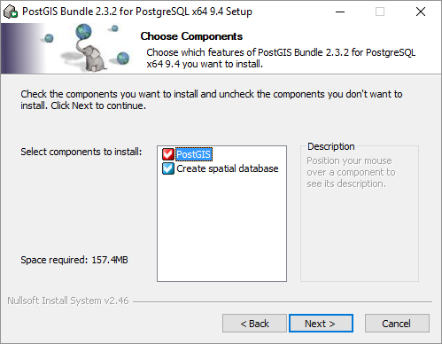

<!-- TITLE: Administratorenhandbuch -->
<!-- SUBTITLE: Administrative Aufgaben im VisionR System -->

Deutsch | [English](/en/system-admin-guide)
*Sie sind hier: [Home](/home) > [Administratorenhandbuch](/de/system-admin-guide) > Installation*

# Installation

## Installation Datenbank

Hier werden die Installationen von PostgreSQL und die Erweiterung PostGIS kurz beschrieben. Für nähere Informationen schaeuen Sie auf der Webseite von PostgreSQL. 

### Installation PostgreSQL 

Die Installationsdatei von PostgreSQL wird mit dem VisionR Server Installation mitgeliefert. Sie können diese ggf. auch von dem Internet herunterladen. Die Empfehlung ist die mitgelieferte Version zu nutzen, da diese mit allen Features durchgetestet ist. 

Führen Sie die mitgelieferte Datei (aktuell mitgelieferte Version: `13.2-0`) aus und folgen Sie die Anweisungen. Wichtig ist das Passwort für den Root-User zu merken. Dieses werden Sie danach brauchen. 
Bei der Installation müssen Sie folgendes beachten:

* Passwort für den Root-User
* Pfad der Installation
* Pfad des *Data* Verzeichnisses

Nach der Installation von PostgreSQL gehen Sie in das Verzeichnis *"D:\Plan-Vision\PostgreSQL\13_2\data\"* und benennen Sie folgende Dateien um:

* pg_hba.conf > pg_hba.conf.ORIGINAL
* postgresql.conf > postgresql.conf.ORIGINAL

Danach kopieren Sie die beiden mitgelieferte Dateien *"pg_hba.conf"* und *"postgresql.conf "* in das Verzeichnis.

> **Hinweis:** Nach Änderungen in *"postgresql.conf"* oder *"pg_hba.conf"* müssen Sie den PostgreSQL-Dienst im Windows Dienstemanager neu starten, damit die neuen Einstellungen wirksam werden.

### Installation PostGIS

Nachdem die PostgreSQL Datenbank installiert ist, können Sie die Erweiterung PostGIS installieren. Diese wird für die geografischen Objekte und Funktionen benötigt. Bitte nutzen Sie die mitgelieferte Installationsdatei. 

Führen Sie die Installationsdatei aus und folgen Sie die Anweisungen. Sie müssen folgendes beachten:

* Pfad der PostgreSQL Installation
* Pfad des PostgreSQL *Data* Verzeichnisses
* Passwort für den Root-Unser für PostgreSQL

Bei der Frage ob auch eine geografische Datenbank mit erstellt wird, aktivieren Sie das Häkchen, wie auf der Abbildung dargestellt:

*Bild: Installation Postgis*

Bei *"Create spatial database"* müssen Sie das Häkchen setzen.

Als Name für die Datenbankvorlage (database template) müssen Sie ***"template_postgis"*** eingeben.

Sie werden nach Benutzer und Passwort gefragt, diese müssen identisch mit den Eingaben sein, die Sie bei der PostgreSQL Installation angegeben haben. Sie werden auch nach dem Installationsverzeichnis von PostgreSQL gefragt. Geben Sie bitte den bestehenden Pfad von PostgreSQL ein.

Anschließend wird Ihnen eine Option für die Benutzung des Stack Builders angeboten, Sie können hier selber entscheiden, ob Sie ihn brauchen. Für das System ist der Stack Builder nicht erforderlich. 

## Erstellung des Datenbank-Benutzers

Rufen Sie in der Windows-Suche "pgAdmin 4" auf. Dabei wird eine Webseite mit der Admin-Konsole von PostgreSQL im Standardbrowser geöffnet.

> **Hinweis:** Die Webseite funktioniert unter *Internet Explorer* nur bedingt. Deswegen sollten Sie den erzeugten Link in einen moderneren Browser aufrufen (Edge, Chrome, Firefox,...)

Folgens Sie die beschriebenen Schritte, um den Benutzer *"VISIONR"* zu erstellen. Dieser ist für die Verbindung mit dem VisionR Applikationsserver zwingend erforderlich.

In der *"pgAdmin4*"-Webkonsole gehen Sie mit der rechten Maustaste auf den Eintrag *"Login/Group Roles (...)"* in der Baumansicht. Hier Wählen Sie die Option *"Create" > "Login/Group Role"*.

*Bild: Erforderlichen Benutzer "VISIONR" in pgAdmin erstellen (1)*

Im Dialog für den neuen User müssen Sie als Namen "VISIONR" eingeben.

*Bild: Erforderlichen Benutzer "VISIONR" in pgAdmin erstellen (2)*

Als Passwort auf der Registerkarte *"Definition"* geben Sie *"plan4vision"* ein.

*Bild: Erforderlichen Benutzer "VISIONR" in pgAdmin erstellen (3)*

Auf der Registerkarte *"Privileges"* müssen Sie dem neuen Benutzer alle verfügbaren Rechte zuteilen (siehe Bild).

*Bild: Erforderlichen Benutzer "VISIONR" in pgAdmin erstellen (4)*

Anschließend gehen Sie auf Speichern. 

> **Hinweis:** Den Benutzernamen und das Passwort für den neu erstellten Benutzer brauchen Sie für die erforderlichen Angaben bei der Ausführung des Befehls *"vrs setup postgre"*.

## Installation VisionR Server ab Version 7.x 

> **Bemerkung**: Die folgende Anleitung bezieht sich auf eine komplett neue Installation von VisionR Server 7x. Falls Sie Upgrade von einer älteren Version auf v. 7x. durchführen möchten, schauen Sie in dem Abschnitt `Upgrade`. 

Stellen Sie sicher, dass Sie administrative Rechte haben, bevor Sie die Installationsdatei ausführen.

*Bild: Installation VisionR - Schritt 1*

Akzeptieren Sie die AGBs und geben Sie den neu erstellten Ordner als Installationspfad ein, falls das System migriert wird. Falls die Installation komplett neu durchgeführt wird, geben Sie den gewünschten Installationspfad ein. 

*Bild: Installation VisionR - Schritt 2*

**Bei Upgrade** ist der Ordner bereits erstellt und Sie müssen den vorhandenen Pfad nochmal bestätigen, da er nicht leer ist. 

*Bild: Installation VisionR - Schritt 3*

Lassen Sie diesen Pfad zu der Umgebungsvariable hinzugefügt werden. 

*Bild: Installation VisionR - Schritt 4*

Anschließend klicken Sie auf `Install`.

*Bild: Installation VisionR - Schritt 5*

Nachdem die Dateien extrahiert wurden, wird die Eingabeaufforderung aufgemacht, um einige Einstellungen durchzuführen. Die erste Eingabe ist den Pfad der Java. Bestätigen Sie diesen, falls er in dem Installationsordner liegt. 

*Bild: Installation VisionR - Schritt 6*

Die nächste Eingabe ist die Größe des Speichers für die JVM. 
Falls die Servermaschine **8 GB** Arbeitsspeicher hat, geben Sie hier **2000 MB**. 
Falls die Servermaschine **16 GB** oder mehr Arbeitsspeicher hat, geben Sie hier **4000 MB**.

*Bild: Installation VisionR - Schritt 7*

Bestätigen Sie die 1000 MB zugewiesene Speichergröße für die JVM Maintenance. Die vorgeschlagenen Werde sind in den `[]` eingegeben. Mit `Enter` bestätigen Sie diese Eingaben.

*Bild: Installation VisionR - Schritt 8*

Bestätigen Sie den Pfad von Libre Office, falls er innerhalb des Installationspfads liegt. In diesem Beispiel `D:\VisionRServer7\.visionr\libreoffice`. Die obere Abbildung zeigt diese Einstellung.

Sie können an dieser Stelle auch die SMTP Einstellungen machen, falls der Maildienst gebraucht wird. Diese Einstellung können Sie auch zu einem späteren Zeitpunkt machen. Deshalb wir bestätigen die `Nein` Option.
Demnächst bestätigen wir den Servicesports **8282** und **8283** HTTPS für den Manager und  

*Bild: Installation VisionR - Schritt 9*

Danach bestätigen wir den Anwendungsordner, wo die Daten gespeichert wurden. Dieser Ordner ist der `Apps` Ordner in dem Installationsverzeichnis. Sie müssen hier aufpassen, dass der Ordner genau so heißt und in dem Installationsordner platziert ist. 

*Bild: Installation VisionR - Schritt 10*

Setzen Sie das Passwort für den Zugriff auf die Weboberfläche des VisionR Server 7 Manager. Notieren Sie dieses Passwort. 

*Bild: Installation VisionR - Schritt 11*

Die Installation wird fortgesetzt, die Neuigkeiten der Version werden angezeigt und Sie müssen auf `Next` klicken, um die Installation abzuschließen.

*Bild: Installation VisionR - Schritt 12*

Nachdem die Installation erfolgreich abgeschlossen ist, soll der neue Dienst `VisionR Server Manager 8` installiert, aktiv und gestartet sein. Sie können das einfach überprüfen. 

## Einstellungen für Instanzen

Öffnen Sie den Browser und geben Sie die Serveradresse mit dem Port ein. Falls Sie immer noch auf der Servermaschine arbeiten, können Sie auch `localhost:8282` in dem Browser eingeben. Melden Sie Sich mit den angegebenen Daten (in der Installation das angegebene Passwort `passwort123`).
Der Manager ist nach dem ersten Login leer. Klicken Sie auf den Button `NEW` oben links. Standardeinstellungen werden vorgeschlagen und Sie können jetzt diese ändern. 

Falls Sie hier nicht sicher sind, was Sie eingeben müssen, kontaktieren Sie uns. 
Sonst machen Sie die folgenden Angaben:

* **"code"** - dieser Code soll mit dem Datenbankname übereinstimmen - z.B. *8_KUNDE*, wenn die der Datenbankname *VISIONR_8_KUNDE* ist
* **"path"** - hier müssen Sie den `Apps` Ordner sauber geben - z.B. *D:\\VisionRServer8\\apps\\KUNDE*
* **"memory"** - geben Sie hier die Speichergröße ein, die Sie bei der Installation angegeben haben - z.B. *2000*
* **"mode"** - geben Sie hier *"production"* ein für Produktionsumgebungen, oder "*"test"* für Testumgebungen
* **"externalAddress"** - hier machen Sie die Eingabe mit Port, falls der Port anders als der Standardport *80* ist - z.B. http://127.0.0.1:8585
* **"Ports"** - hier geben Sie die Ports, über die der Server erreicht wird. Für *http://* Anfragen geben Sie den Port auch bei der externen Adresse ein. 

> **Bemerkung**: Falls Sie ein Upgrade machen, können Sie diese Einstellungen aus der alten Installation kopieren. Gehen Sie dafür in dem `Apps` Ordner und öffnen Sie die Datei `managed.json`. Kopieren Sie den Inhalt und überschreiben Sie die Einstellungen. 

> **WICHTIG**: Sie müssen die ausgewählten Zeilen aus der Abbildung löschen, da diese aus der alten Installation sind. Sonst kann es zu Fehlern kommen. 

Die sauberen Einstellungen sehen beispielweise so aus: 

Speichern Sie die Einstellungen und starten Sie den Server neu über den Button `RESTART`. 

## PostgreSQL für die Nutzung in VisionR konfigurieren

Starten Sie die "cmd"-Konsole in Windows. Tippen Sie `vrs setup postgre` ein.

Wenn die Prüfung der Einstellungen Fehler ergibt, müssen die PostgreSQL-Einstellungen in der Datei *"postgresl.conf"* angepasst werden. Die mitgelieferte *"postgresql.conf"*-Datei erfüllt die Mindestvoraussetzungen. Anschließend muss der PostgreSQL-Dienst neu gestartet werden und das Kommando `vrs setup postgre` erneut ausgeführt werden.

