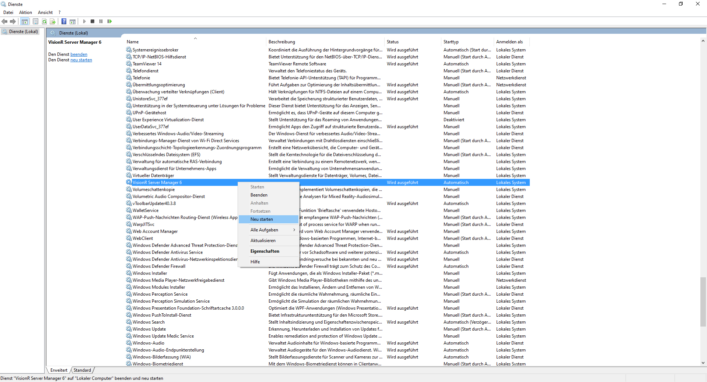
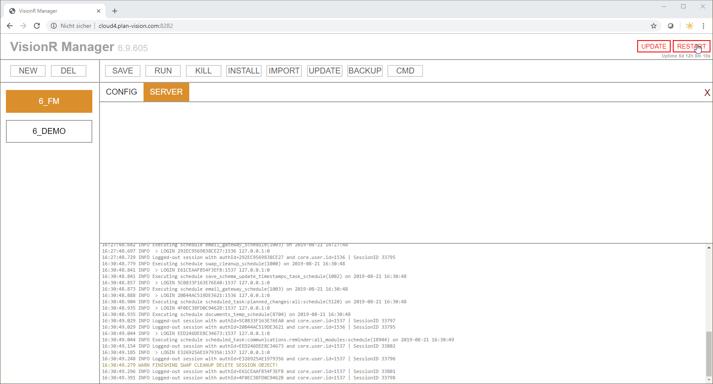

<!-- TITLE: VisionR Manager-->
<!-- SUBTITLE: Verwaltung von mehreren Instanzen im VisionR Manager -->

*Sie sind hier: [Home](/home) > [Administratorenhandbuch](system-admin-guide) > VisionR Manager

# Instancen
Neue Instanz anlegen

## Einstellungen

Die Einstellungen einer Instanz rufen Sie auf, wenn Sie im VisionR Manager die Instanz im linken Bereich markieren und anschließend den Reiter `CONFIG` anklicken.
Die Instanz-Einstellungen werden im `JSON`-Format bearbeitet und gespeichert.

> **Bemerkung:** Die Einstellungen werden am Server im Instanz-Ordner unter `[VisionR-Installation]\apps\[Projektname]\etc\managed.json` gespeichert.

## JSON-Einstellungen

Hier ein Beispiel für Instanz-Einstellungen im `JSON`-Format:

```json
{
	"code": "8_FM",
	"path": "C:\\Plan-Vision\\VisionRServer\\apps\\FM",
	"autostart": true,
	"server": {
		"memory": "2000",
		"mode": "production",
		"externalAddress": "http://127.0.0.1:8585",
		"https": {
			"enabled": false
		},
		"host": "127.0.0.1",
		"ports": {
			"http": 8585,
			"https": 8449
		},
		"registration": {
			"enabled": true
		},
		"webSocketProxyPort": 7778,
		"chromeDebuggerProxyPort": 7777
	},
	"additional": {
		"login.ldap.active": false,
		"core.import.languages": "en-US,de-DE,hr-HR,en-GB",
		"web.registration.allow": false,
		"office.disable_powershell" : false,
        "web.context.public.page.default": "/forms",
        "web.context.public.page.default.redirect": true
	},
	"preload": {
		"disabled": false
	}
}
```

> **Hinweis:** Ab VisionR Version 8 soll grundsätzlich die neue Angular-Benutzeroberfläche mit Responsive Design genutzt werden. Um die automatische Umleitung auf die neuen Oberflächen zu ermöglichen, muss die Einstellung in der JSON-Konfiguration vorhanden sein. Ggf. müssen die Unterstriche in den Konfigurationsnamen *"_web.context.public.page.default"* und *"_web.context.public.page.default.redirect"* herausgenommen werden, danach auf `SAVE` klicken.

# Konsole

Die VisionR Manager Konsole ist rechts in vertikal in zwei Bereichen unterteilt. Der obere Bereich kann für Eingaben genutzt werden. Der untere Bereich zeigt Rückmeldungen des Servers an: Log-Meldungen für Infos, Warnungen und Fehler.

## Eingabe-Bereich

Im Eingabebereich können Sie vorgegebene Kommandos aufrufen. Beispiele:

* **.import contacts** - triggert import des Moduls Kontakte aus XML
* **.import contacts.update -v** - triggert ein Import aus VSC-Skript
* **require("dev/reset")** - führt ein js-Skript aus

## Log-Bereich

Im Log-Bereich können die Rückmeldungen der Serverinstanz beobachtet werden. Die Meldúngen haben folgende Farbcodes:

* **grau** - Info
* **orange** - Warnung
* **rot** - Fehler

# Aktionen ausführen 

Im VisionR Manager können für die Instanzen Befehle ausgeführt werden. Um die Befehle zu nutzen, muss die Instanz links angeklickt sein. Die Button-Leiste über dem Eingabebeich kann für den Aufruf der Kommandos genutzt werden.

## Starten

Durch anklicken des Buttons `START` wird die angeklickte Instanz gestartet. Wenn die Instanz bereits gestartet werde wird Fehlermeldung ausgegeben.

## Stoppen

Um eine Instanz zu stoppen, müssen Sie den Instanznamen im linken Bereich anklicken und auf den Button `STOP` klicken. Alternativ können Sie im Eingabeberich mit der Maus reinklicken und die Tastenkombination `Strg + C` benutzen.

## Import

Wählen Sie eine Instanz im linken Bereich aus. Ansließend klicken Sie auf den Button `IMPORT`. Eine zusätliche Anggabe wird von Ihnen erwartet. Bei eintippen von `full` wird eine komplettee Update der Datenbank mit allen vorhandenen Modulen aus XML durchgeführt. Dieser Befehl wir bei jedem Update des Systems ausgeführt.

## Update

Durch Klicken auf den Button `UPDATE` bei ausgewählter Instanz im linken Bereich wird ein Update der Instanz von der gelieferten Kunden-ZIP-Datei ausgeführt. Dabei werden alle vorhandenen Unterverzeichnisse im Kundenverzeichnis *"[VisionRServer\apps\KUNDE]"* aktualisiert.

## Backup

Um ein Backup auszuführen, muss die Instanz vorher gestoppt werden. Wählen Sie die Instanz im Linken Bereich aus und klicken Sie auf den Button `BACKUP`. Eine Angabe über der Art des Backups wird erwartet. Geben Sie `CLONE` ein, um einen vollständigen Backup, inklusive Datenbank zu erzeugen. Am Ende des BAckup-Prozesses wird eine ZIP-Datei ausgegeben, die für die Wiederherstellung des Kundenprojektes inklusive Datenbank und hochgeladener Dateien genutzt werden kann.

## CMD
Beispiele für Eingaben im CMD-Modus:
* **db create** - Erstellung einer neuen Datenbank aus Template
* **db drop** - Löschen der Datenbank, die für die ausgewählte Instanz genutzt wird

# Restart
Es gibt zwei Methoden den VisionR Server Dienst neu zu starten, falls Sie neue Version eingespielt haben oder der Dienst sich aus irgendeinem Grund (z. B. Windows Update) aufgehängt hat.

## Über den Dienst-Manager in Windows

Bei dieser Methode müssen Sie über Administratorenrechte auf der Servermaschine verfügen. Um den Dienst neu zu starten, müssen Sie den Windows Dienste-Manager öffnen. Den Dienst-Manager können Sie in der Windows-Verwaltung finden oder per CMD Kommando `Services.msc` aufrufen. Im geöffneten Dienst-Manager müssen Sie den Dienst **VisionR Server Manager 8** (Dienstname **visionrservermanager8.exe**) in der Liste finden und diesen mit der rechten Maustaste neu starten.

> Bei Updates von VisionR Server auf neue Version müssen abhängige Prozesse von LibreOffice manchmal manuell im Windows TaskManager gestoppt werden. Die Prozesse finden Sie im TaskManager unter den Namen `soffice.bin` bzw. `soffice.exe`.
> Für ein erfolgreiches Update müssen alle LibreOffice-Prozesse gestoppt werden, befor Sie mit der Ausführung der VisionR Update EXE DAtei fortfahren.



*Bild 1: Restart Manager von Windows Dienst-Manager*

## Mit Web-Zugang über den VisionR Manager

Bei diese Methode müssen Sie den VisionR Manager im Browser aufrufen. Dazu können Sie http oder falls eingerichtet https nutzen. Bitte beachten Sie den Port, der bei der Installation für den Manager eingerichtet wurde (standardmäßig 8282 für http und 8283 für https).
Nachdem Sie sich als *"admin"* eingeloggt haben, können Sie den VisionR Manager Dienst über den roten Button `RESTART` im oberen rechten Bereich neu starten (siehe Bild 2).



*Bild 2: Restart Manager über Web-Zugang*