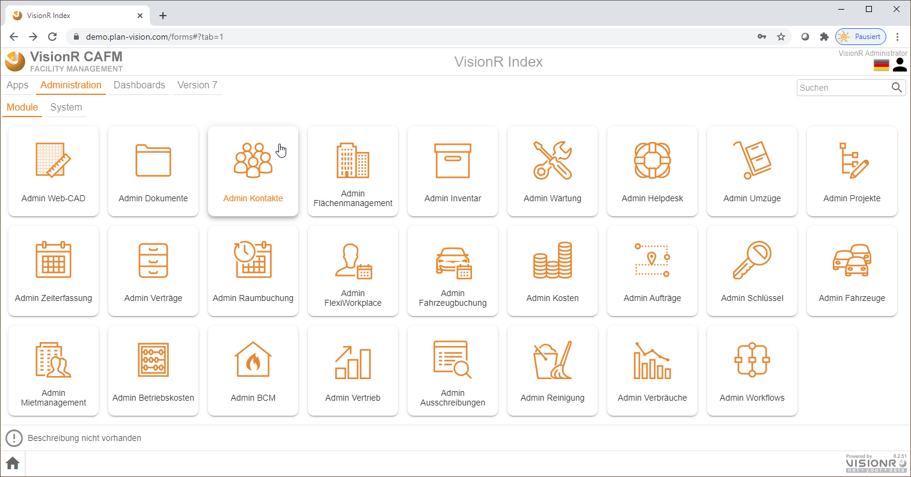

	

    

	
Benutzerhandbuch

	
Kontakte

    
Admin

    

    

    

    
Windows / macOS / Linux / iOS / Android

    
ab Version 8.0

    

    

        
Erstellt von Plan-Vision GmbH

    	
Version 1.2 &bull; Stand 23.02.2022

    	
Plan-Vision GmbH &bull; E-Mail: support@plan-vision.com &bull; Web: https://plan-vision.com

    

# Inhaltsverzeichnis

[toc]

# Version

**Aktuelle  Version:** 1.2

**Stand:** 23.02.2022

**Verfasser:** Plan-Vision GmbH

# Beschreibung
Das Modul wir für die Verwaltung von Kontaktdaten genutzt. Im folgenden können Sie die Schritte bei der Erstellung und Bearbeitung von Personen, Unternehmen, Organisationseinheiten usw. lesen. Die angelegten Kontaktdaten können in allen anderen Modulen genutzt werden, z.B. in Verträgen, Flächenbelegungen usw. 

# Erstellen von Kontakten
## Über das Menü
## Mit rechter Maustaste
# Bearbeiten von Kontakten
# Löschen von Kontakten
# Datenobjekte

| Datenobjekt                                                  | Beschreibung                                 | Verebung von     | Code                                | Tabelle                |
| :----------------------------------------------------------- | :------------------------------------------- | :--------------- | :---------------------------------- | :--------------------- |
| [**Kontakt**](/de/modules/datamodel/contacts/contact)        | Hauptobjekt, enthält alle Kontakte           | -                | contacts.contact                    | VISIONR.pv_cnt_contact |
| [**Person**](/de/modules/datamodel/contacts/person)          | Enthält alle Personentypen                   | Kontakte.Kontakt | contacts.person                     | -                      |
| [Mitarbeiter](/de/modules/datamodel/contacts/employee)       | Enthält interne Mitarbeiter                  | Kontakte.Person  | contacts.person                     | -                      |
| [Extern](/de/modules/datamodel/contacts/employee-external)   | Enthält externe Mitarbeiter                  | Kontakte.Person  | contacts.employee_external          | -                      |
| [Ansprechpartner](/de/modules/datamodel/contacts/contact-person) | Enthält Ansprechpartner                      | Kontakte.Person  | contacts.contact_person             | -                      |
| [Besucher](/de/modules/datamodel/contacts/visitor)           | Enthält Besucher                             | Kontakte.Person  | contacts.visitor                    | -                      |
| [**Unternehmen**](/de/modules/datamodel/contacts/company)    | Enthält alle Unternehmenstypen               | Kontakte.Kontakt | contacts.company                    | -                      |
| [**Gemeinschaft**](/de/modules/datamodel/contacts/community) | Enthält Gementschaften                       | Kontakte.Kontakt | contacts.community                  | -                      |
| [**Team**](/de/modules/datamodel/contacts/team-contact)      | Enthält Teams mit Teammitgliedern und Rollen | Kontakte.Kontakt | contacts.person                     | -                      |
| [**Abteilung**](/de/modules/datamodel/contacts/department)   | Enthält alle Abteilungen                     | -                | contacts.department                 | VISIONR.pv_cnt_dep     |
| [**Synchronisierung Kontakt**](/de/modules/datamodel/contacts/synchronization_contact) | Enthält alle Synchronisationsdaten           | -                | contacts.synchronization_contact    | VISIONR.pv_cnt_synccon |
| [**Synchronisierung Abteilung**](/de/modules/datamodel/contacts/synchronization_department) | Enthält alle Synchronisationsdaten           | -                | contacts.synchronization_department | VISIONR.pv_cnt_syncdep |

Datenobjekte aus anderen Modulen:

| Datenobjekt                                                 | Beschreibung                                                 | Verebung von | Code              | Tabelle                |
| :---------------------------------------------------------- | :----------------------------------------------------------- | :----------- | :---------------- | :--------------------- |
| [**Kostenstelle**](/de/modules/datamodel/costs/cost-center) | Hauptobjekt aus `Modul "Kosten"`, enthält alle Kostenstellen | -            | costs.cost_center | VISIONR.pv_cnt_contact |
| [**Raum**](/de/modules/datamodel/spaces/space)              | Hauptobjekt aus `Modul "Flächenmanagement"`, enthält alle Räume | -            | spaces.space      | VISIONR.pv_spc_spc     |
| [**Arbeitsplatz**](/de/modules/datamodel/spaces/workplace)  | Hauptobjekt aus `Modul "Flächenmanagement"`, enthält alle Arbeitsplätze | -            | spaces.workplace  | VISIONR.pv_spc_wplc    |