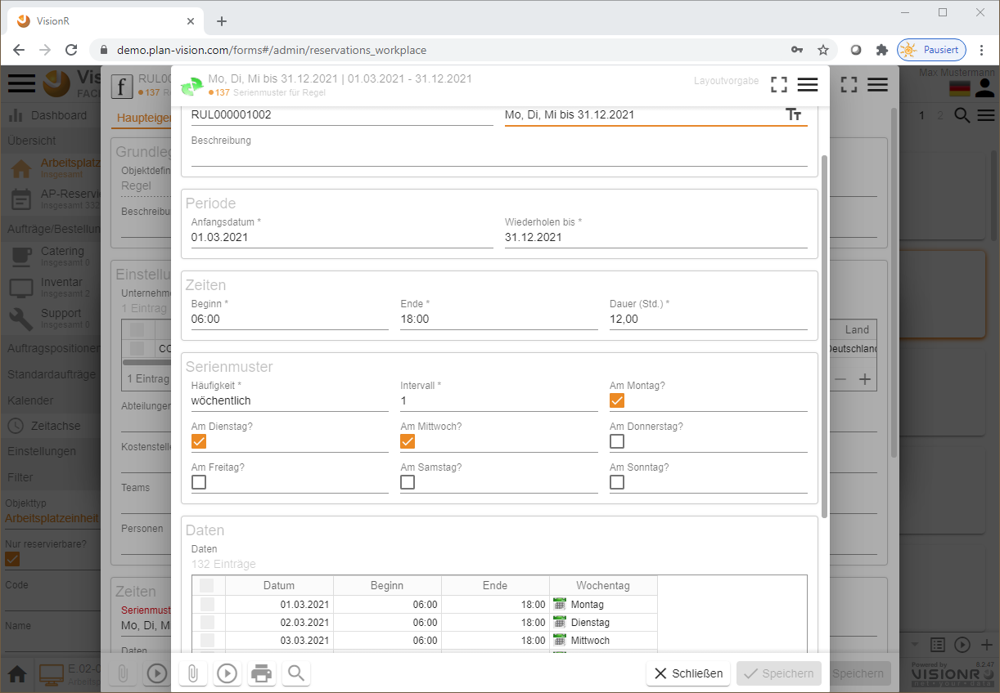

<!-- TITLE: Admin FlexiWorkplace-->
<!-- SUBTITLE: Modul "FlexiWorkplace" für die Verwaltung von Arbeitsplatz-Reservierungseinheiten un Aufträge -->

<!--  -->

# FlexiWorkplace - Admin

## Allgemein

Die vorliegende Dokumentation ist an die Verwalter der Arbeitsplätze bei Arbeitsplatzreservierungen gerichtet. Die tatsächlichen Reservierungen sollen in der App "FlexiWorkplace" getätigt werden. Die Bedienung der Reservierungen aus Benutzersicht ist in den Dokumenten [FlexiWorkplace - Desktop](/de/user-guide/apps/flexi-workplace-desktop) und [FlexiWorkplace - mobil](/de/user-guide/apps/flexi-workplace-mobil) näher beschrieben.

## Beschreibung

Die Reservierung von Arbeitsplätzen hängt mit der allgemeinen Verwaltungsstrategie der Arbeitsplatzflächen in Ihrem Unternehmen zusammen. Themen wie Arbeitsplatzbelegung, Umzüge, Umbau usw. sind mit der Freigabe und Rücknahme von Reservierungsrechten eng verbunden. Die Planung und Durchführung von Umzügen werden vom VisionR-Modul [Umzüge](/de/user-guide/admin/moves) unterstützt. 

Generell ist in der VisionR Datenbank zwischen Arbeitsplätze und Arbeitsplatzreservierungseinheiten zu unterscheiden. Arbeitsplätze werden als Flächen im Raum im Modul [Flächenmanagement](/de/user-guide/admin/spaces) verwaltet. Die Arbeitsplatzeinheiten werden im Modul FlexiWorkplace verwaltet und reserviert. Die Arbeitsplatzeinheiten können mehrere Arbeitsplätze enthalten.

Bei der Verwaltung der Arbeitsplätze, die zur Reservierung gestellt werden werden folgende Funktionalitäten angeboten:

* **Erstellung** von neuen Arbeitsplatzeinheiten
* **Bearbeitung** der Eigenschaften von Arbeitsplatzeinheiten
* **Löschen** oder deaktivieren von Arbeitsplatzeinheiten
* **Reservierbarkeit** der Arbeitsplätze verwalten
* Definition von Erlaubt- und Verbots-**Regeln** für die Reservierbarkeit
* Zuweisung von **Verwaltern** mit speziellen Rechten für bestimmte Arbeitsplätze
* **Zugriffsrechte** für die Arbeitsplatzeinheiten definieren und ändern
* Verknüpfung im **Geschossplan** erstellen oder ändern
* Hochladen und Entfernen von **Bildern**
* Definition von Standardaufträgen für Inventar-, Catering- und Support-**Bestellungen** 
* **Auswertungen** der Arbeitsplatzbelegung durch Reservierungen

# Übersicht

## Einstieg

Bei Nutzung des Browsers auf dem Desktopcomputer können die normalen Benutzer das Modul entweder über die Hauptadresse von VisionR auf der Registerkarten `Administration` > `Module` *(siehe Bild 1)* oder direkt über den Link `https://[VisionR-Adresse]/forms#/admin/reservations_workplace` aufrufen.

*Bild 1: Admin FlexiWorkplace über die Indexseite aufrufen*

## Bedienung allgemein

Der Button mit den drei Strichen  oben links öffnet das Modul-Menü. Das Menü ist auf mobilen Geräten ist aus Platzgründen automatisch versteckt. In der Desktopversion ist das Menü automatisch aufgeklappt. Abwechselndes Klicken auf den`Menü`-Button zeigt oder verbirgt das Menü, je nachdem welcher der aktuelle Status ist. Der `Menü`-Button ist auf allen Masken verfügbar. Dur Klick auf einen Menüeintrag in der Liste öffnen Sie die entsprechende Maske mit den in diesem Dokument beschriebenen Funktionalitäten. Der Name der aktiven Maske wird in orangener Farbe hervorgehoben.

Ein Klick auf die Ikone  neben den drei Strichen oben Links führt zur VisionR-Indexseite. Wenn Sie das Modul FlexiWorkplace verlassen und zur Indexseite springen möchten, müssen Sie auf den Button mit dem Häkchen zur Bestätigen klicken. Bei Abbrechen bleiben Sie auf der aktuellen Maske.

Bei Klick auf den `Home`-Button ganz unten links wird ein Menu mit den vorhandenen Apps angezeigt. Dieser Button ist nur in der Desktop App sichtbar. Mobil muss der Klick auf das Logo oben links verwendet werden. Bei Klick auf einen Menüeintrag werden Sie zur gewünschten App umgeleitet. Vorher muss das Verlassen der aktuellen App bestätigt werden.

Die anfängliche Ansicht für die Arbeitsplatzeinheiten ist eine Liste. Wenn Sie mehrere Datenspalten sehen möchten oder Mehrfachmarkierungen und Sortierungen vornehmen möchten, ist die Tabellensicht dafür geeigneter. Zur Tabellenansicht gelangen Sie wenn Sie das die drei Striche rechts unterhalb der Benutzerikone anklicken. Dabei wird das Menü für die Objektansicht angezeigt. Diese Menü bezieht sich auf die Inhalte des  gerade betrachteten Datenbankobjekts (in diesem Fall Arbeitsplatzeinheit). Bei anderen Datenansichten (Catering, Inventar usw.) ist der Menü-Button oben rechts ebenfalls vorhanden.

*Bild 2: Aufrufen des Kontextmenüs für Datenobjekt* 

*Bild 3: Beispiel Tabellenansicht*

In diesem Beispiel einer Tabellenansicht eines Datenobjekts sind die Hauptbereiche der Applikation zu erkennen:

* **Hauptmenü:** Auf der linken Seite ist das beschriebene Hauptmenü, welches über die drei Striche neben dem Logo ein- und ausschalten lässt. 
* **Baumansicht:** Rechts daneben folgt die Baumansicht. In der Baumansicht können die Daten der Hauptansicht auf der Rechten Seite (Tabelle, Liste, Kacheln,..) hierarchisch angezeigt und schnell gefiltert werden. Die Baumansicht kann mehrere Hierarchien enthalten. Eine Liste der vorhandenen Hierarchien ist bei Klick auf den Textfeld über den Button `Alles` zu sehen. Im unteren Bereich der Baumansicht gibt es drei Buttons die ein- und ausgeschaltet werden können:
  + **`Rekursiv`** - bei `an` werden alle in den Unterordnern enthaltenen Datensätze links in der Tabelle angezeigt
  + **`Filter`** - bei `an` werden die Baumstrukturelemente (Ordner) ausgeblendet, falls keine Daten darin einhalten sind
  + **`Umkehren`** - bei `an` werden 
* **Datenbereich:** Rechts von der Baumansicht befindet sich die Datenansicht, die in Form von Tabelle, Liste, Kacheln, Geometrie usw. dargestellt werden kann. Ein Kontextmenü für die Daten mit allen vorhandenen Optionen (wie z. B. Neu, Bearbeiten, Löschen, Hierarchie, Einfärbung etc.) ist bei Klick auf die drei Striche unter der Benutzerikone oben rechts aufrufbar. Alternativ kann das Kontextmenü für die Daten im Tabellenbereich mit Rechtsklick aufgerufen werden (siehe Bilder unten).
* **Suchfeld:** Über dem Datenbereich befindet sich eine Lupe rechts oben, die bei Klick eine Suchleiste anzeigt. Diese Leiste kann für schnelle Datensuche auf vordefinierte Spalten genutzt werden. Weitere Optionen für die Suche, wie z. B. Suche nach bestimmten Spalte, Datengruppierungen usw., sind in den drei Punkten auf der rechten Seite des Suchfeldes enthalten.
* **Tabellenüberschriften** Die Tabellenüberschriften können für Datensortierung genutzt werden. Bei erstem Klick auf die Überschrift einer Spalte werden die Daten aufsteigend und bei erneutem Klick absteigend sortiert. Zwischen den Spaltennamen können Die Spaltenbreiten dynamisch mit der Maus angepasst werden. Der Rechtsklick auf die Überschriften zeigt ein Menü mit Optionen für die Tabelle und für die angeklickte Spalte. Eine Gruppenfunktion kann an dieser Stelle genutzt werden.

*Bild 4: Kontextmenü für die Daten über die drei Striche - 1. Aufrufmöglichkeit*

*Bild 5: Kontextmenü für die Daten über Rechtsklick im Datenbereich - 2. Aufrufmöglichkeit*

*Bild 6: Suchfeld oberhalb der Tabelle/Liste/Kacheln*

*Bild 7: Suchoptionen auf die drei Punkte `...` am rechten Ende der Suchleiste*

*Bild 8: Rechtsklick auf die Tabellenspalten-Überschriften zeigt Zusatzoptionen*

# Neue Arbeitsplatzeinheit erstellen

## Alphanumerisch

Wenn Sie sich im Modul Admin FlexiWorkplace befinden und den Menüeintrag `Arbeitsplatzeinheiten` vom Hauptmenü ausgewählt haben, können Sie entweder auf die drei Striche oben rechts unter dem Benutzerlogo oder mit rechter Maustaste im Datenbereich das Kontextmenü für die Tabelle oder Liste aufrufen.  Im Kontextmenü müssen Sie den Eintrag `+ Neu` anklicken. Dabei wird ein Dialog für einen neuen Datensatz aufgemacht, wo Sie die Daten für die neu zu erstellende Arbeitsplatzeinheit eingeben können.

*Bild 9: Rechtsklick im Datenbereich zeigt Kontextmenü mit Eintrag `+ Neu`*

> **Hinweis:** Neue Datensätze können entweder durch Rechtsklick im Datenbereich oder bei Klick auf das Datenmenü oben rechts unter der Personenikone und dann auf `+ Neu` erstellt werden. Zusätzlich besteht die Möglichkeit den Pluszeichen unten rechts im Datenbereich anzuklicken.

*Bild 10: Dialog neue Arbeitsplatzeinheit*

Bei der neu erstellten Arbeitsplatzeinheit müssen die Standortdaten eingegeben werden. Dazu muss ein Arbeitsplatz und ein Raum aus dem Flächenmanagement vorhanden sein.

> **Hinweis:** Die Angabe von Arbeitsplatz, Raum, Geschoss, Gebäude und Liegenschaft ist wichtig, da sonst die Arbeitsplatzplatzeinheit nicht üner die Standort-Baumstruktur gefiltert und angezeigt werden kann.

Beim Anlegen einer neuen Arbeitsplatzeinheit ist diese für die normalen Benutzer noch nicht reservierbar. Um die Reservierbarkeit inklusive Regeln zu definieren lesen Sie die Dokumentation im Abschnitt "Reservierbarkeit der Arbeitsplätze verwalten".

# Arbeitsplatzeinheit bearbeiten

Wenn Sie die App "Admin FlexiWorkplace" öffnen müssen Sie im Hauptmenü (immer erreichbar über die drei Striche oben links neben dem Logo) den Eintrag `Arbeitsplatzeinheiten` anklicken. Rechts werden die Arbeitsplätze, die reserviert werden können, in Listen- oder Tabellen-Ansicht angezeigt. Klicken Sie ein ein Arbeitsplatz an, um es auszuwählen. Dann machen Sie einen Rechtsklick mit der Maus, um das Kontextmenü anzeigen zu lassen. Im Kontextmenü gehen Sie auf `Bearbeiten`. Alternativ können Sie die drei Striche unter der Personenikone anklicken, um das Kontextmenü aufzumachen und den Button `Bearbeiten` aufzumachen.

*Bild 11: Rechtsklick bei markiertem Arbeitsplatz*

Doppelklick auf den Arbeitsplatz in der Tabelle oder in der Liste ruft ein Dialog mit Details auf. Auf diesem Dialogfenster ist untern links ein Button `Bearbeiten` vorhanden, falls Sie die Zugriffsrechte für die Bearbeitung des ausgewählten Datensatzes besitzen.

*Bild 12: Dialog mit Details bei Doppelklick*

> **Hinweis:** Den Details-Dialog können Sie bei ausgewähltem Datensatz in der Tabelle mit `Leertaste`, statt mit Doppelklick aufrufen.

Im Bearbeitungsmodus werden nur die wichtigsten Eingabefelder angezeigt. Falls Sie alle Datenbankfelder der Arbeitsplatzeinheit sehen und bearbeiten möchten , müssen Sie den Datensatz in Admin-Modus öffnen. Dazu gehen Sie auf die drei Striche oben rechts und klicken Sie auf den Menüeintrag `Administration`.

*Bild 13: Admin-Modus für die Bearbeitung aufrufen*

# Arbeitsplatzeinheit löschen

Eine Arbeitsplatzeinheit können Sie im Bearbeitungsmodus löschen. Es können nur Arbeitsplatzeinheiten gelöscht werden, die noch keine Reservierungen haben. Eine Datenkonsistenzprüfung verhindert das Löschen, falls abhängige Daten bereits vorhanden sind.

Öffnen Sie den Arbeitsplatz mit rechter Maustaste auf den Button `Bearbeiten`. Im Dialogmenü oben rechts auf die drei Striche klicken. Hier ist der Menüeintrag `Löschen` vorhanden, falls Sie die notwendigen Zugriffsrechte besitzen.

*Bild 14: Löschen im Bearbeitungs- oder Admin-Modus*

# Reservierbarkeit der Arbeitsplätze verwalten

Um einen Arbeitsplatz nach Neuerstellung reservierbar zu machen, müssen Sie die Reservierbarkeit ändern. Standardmäßig sind neue Arbeitsplätze noch nicht reservierbar. Um die Reservierbarkeit zu definieren müssen Sie den Arbeitsplatz im Bearbeitungsmodus öffnen und auf die Registerkarte `Reservierbarkeit` klicken. Sie müssen im Eingabefeld "Reservierbar?" das Häkchen setzen.

*Bild 15: Allgemeine Reservierbarkeit einschalten*

# Definition von Regeln für die Reservierbarkeit

Sie können Regeln für die Reservierbarkeit der Arbeitsplatzeinheiten definieren. Dazu gehen Sie auf die Registerkarte `Regeln`. Die Regeln können Erlaubt- oder Verbots-Regeln sein. Die Regeln basieren auf Angaben über die Nutzergruppen (Unternehmen, Abteilungen, Kostenstellen, Teams, einzelne Personen), kombiniert mit einem Serienmuster (z. B. jeden Montag 8:00 bis 17:00 Uhr).

*Bild 16: Regeln für die Reservierbarkeit definieren*

Die Anwendung der Regeln können Sie ein- und ausschalten, indem Sie die Häkchen für die Felder "Erlaubt-Regeln anwenden?" und "Verbots-Regeln anwenden?" setzen oder herausnehmen.

Sie können bereits definierte Regeln wiederverwenden. Um eine Regel auszuwählen, gehen Sie auf den Plusbutton im Feld "Erlaubt-Regeln" oder "Verbots-Regeln".

*Bild 17: Eine Regel aus Liste hinzufügen*

Fall Sie eine neue Regel brauchen, die noch nicht definiert ist, können Sie diese erstellen, indem Sie auf den `+ Neu`-Button im Kontextmenü auf die drei Striche oben rechts klicken.

*Bild 18: Neue Regel in der Liste erstellen*

In der neuen Regel können Sie betroffene Personengruppe definieren: Unternehmen, Abteilung, Kostenstelle, Team und/oder Einzelpersonen.

*Bild 19: Neue Regel bearbeiten*

Im Feld "Serienmuster" können Sie entweder eine bereits bestehende Regel auswählen oder eine ganz neue definieren. Bei der Definition neuer Serienmuster müssen Sie die Laufzeit der Regel beachten, die durch die Angaben in den Feldern "Anfangsdatum" und "Wiederholen bis" kontrolliert wird.

*Bild 20: Neues Serienmuster für die Regel erstellen*

# Zuweisung von Verwaltern

Die Reservierbarkeit bestimmter Arbeitsplätze können Sie auf eine Personengruppe einschränken, indem Sie Verwalter für diese Arbeitsplätze definieren und gleichzeitig das Häkchen in dem Feld "Reservierbar nur für Verwalter?" auf der Registerkarte `Reservierbarkeit` setzen.

*Bild 21: Reservierbarkeit nur für eingeschränkte Personengruppe (Verwalter)*

# Zugriffsrechte anpassen

Sie können die Zugriffrechte einer Arbeitsplatzeinheit als Admin kontrollieren. Wenn eine bestimmte Benutzerrolle (z. B. Jeder) keine Leserechte für den Datensatz besitzt, wird der Arbeitsplatz bei der Suche oder auf Tabellen- und Listen-Ansichten generell ausgeblendet. Die Bearbeitung der Zugriffsrechte können Sie auf der Registerkarte `Zugriff` aufrufen.

*Bild 22: Bearbeitung der Zugriffsrechte als Admin*

