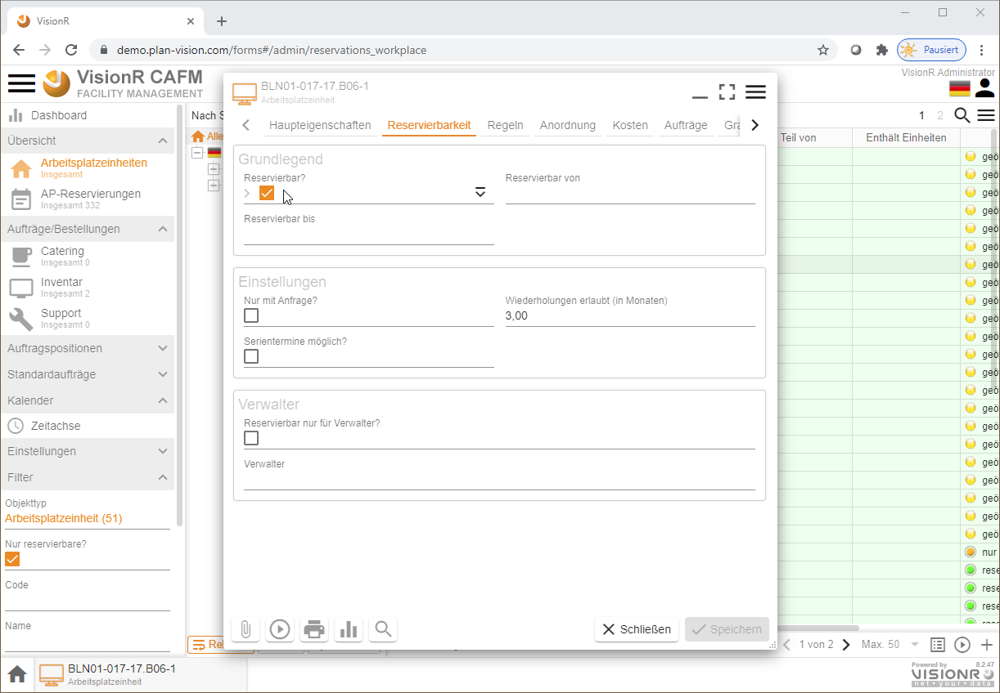

<!-- TITLE: Admin FlexiWorkplace-->
<!-- SUBTITLE: Modul "FlexiWorkplace" für die Verwaltung von Arbeitsplatz-Reservierungseinheiten un Aufträge -->

<!--  -->

# FlexiWorkplace - Admin

## Allgemein

Die vorliegende Dokumentation ist an die Verwalter der Arbeitsplätze bei Arbeitsplatzreservierungen gerichtet. Die tatsächlichen Reservierungen sollen in der App "FlexiWorkplace" getätigt werden. Die Bedienung der Reservierungen aus Benutzersicht ist in den Dokumenten [FlexiWorkplace - Desktop](/de/user-guide/apps/flexi-workplace-desktop) und [FlexiWorkplace - mobil](/de/user-guide/apps/flexi-workplace-mobil) näher beschrieben.

## Beschreibung

Die Reservierung von Arbeitsplätzen hängt mit der allgemeinen Verwaltungsstrategie der Arbeitsplatzflächen in Ihrem Unternehmen zusammen. Themen wie Arbeitsplatzbelegung, Umzüge, Umbau usw. sind mit der Freigabe und Rücknahme von Reservierungsrechten eng verbunden. Die Planung und Durchführung von Umzügen werden vom VisionR-Modul [Umzüge](/de/user-guide/admin/moves) unterstützt. 

Generell ist in der VisionR Datenbank zwischen Arbeitsplätzen und Arbeitsplatzreservierungseinheiten zu unterscheiden. Arbeitsplätze werden als Flächen im Raum im Modul [Flächenmanagement](/de/user-guide/admin/spaces) verwaltet. Die Arbeitsplatzeinheiten werden im Modul FlexiWorkplace verwaltet und reserviert. Die Arbeitsplatzeinheiten können mehrere Arbeitsplätze umfassen. Umgekehrt kann ein Arbeitsplatz in mehreren Einheiten aufgeteilt werden.

Bei der Verwaltung der Arbeitsplätze, die zur Reservierung freigegeben werden, werden folgende Funktionalitäten angeboten:

* **Erstellung** von neuen Arbeitsplatzeinheiten
* **Bearbeitung** der Eigenschaften von Arbeitsplatzeinheiten
* **Löschen** oder deaktivieren von Arbeitsplatzeinheiten
* **Reservierbarkeit** der Arbeitsplatzeinheiten verwalten
* Definition von Erlaubt- und Verbots-**Regeln** für die Reservierbarkeit
* Zuweisung von **Verwaltern** mit speziellen Rechten für bestimmte Arbeitsplätze
* **Zugriffsrechte** für die Arbeitsplatzeinheiten definieren und ändern
* Verknüpfung im **Geschossplan** erstellen oder ändern
* Hochladen und Entfernen von **Bildern**
* Definition von Standardaufträgen für Inventar-, Catering- und Support-**Bestellungen** 
* **Auswertungen** der Arbeitsplatzbelegung durch Reservierungen

# Übersicht

## Einstieg

Bei Nutzung des Browsers auf dem Desktopcomputer können die normalen Benutzer das Modul entweder über die Hauptadresse von VisionR auf der Registerkarten `Administration` > `Module` *(siehe Bild 1)* oder direkt über den Link `https://[VisionR-Adresse]/forms#/admin/reservations_workplace` aufrufen.

*Bild 1: Admin FlexiWorkplace über die Indexseite aufrufen*

## Bedienung allgemein

Der Button mit den drei Strichen  oben links öffnet das Hauptmenü. Das Menü ist auf mobilen Geräten aus Platzgründen automatisch versteckt. In der Desktopversion ist das Menü automatisch aufgeklappt. Abwechselndes Klicken auf den `Menü`-Button zeigt oder verbirgt das Menü, je nachdem welcher der aktuelle Status ist. Der `Menü`-Button ist auf allen Masken verfügbar. Durch Klick auf einen Menüeintrag in der Liste öffnen Sie die entsprechende Maske mit den in diesem Dokument beschriebenen Funktionalitäten. Der Name der aktiven Maske wird in orangener Farbe hervorgehoben.

Ein Klick auf die Ikone  neben den drei Strichen oben Links führt zur VisionR-Indexseite. Wenn Sie das Modul FlexiWorkplace verlassen und zur Indexseite springen möchten, müssen Sie auf den Button mit dem Häkchen zur Bestätigen klicken. Bei Abbrechen bleiben Sie auf der aktuellen Maske.

Bei Klick auf den `Home`-Button ganz unten links wird ein Menü mit den vorhandenen Apps angezeigt. Dieser Button ist nur in der Desktop App sichtbar. Mobil muss der Klick auf das Logo oben links verwendet werden. Bei Klick auf einen Menüeintrag werden Sie zur gewünschten App umgeleitet. Vorher muss das Verlassen der aktuellen App bestätigt werden.

Standardmäßig werden die `Arbeitsplatzeinheiten` in Listen-Ansicht angezeigt. Wenn Sie mehrere Datenspalten sehen möchten oder Mehrfachmarkierungen und Sortierungen vornehmen möchten, ist die Tabellensicht dafür geeigneter. Zur Tabellenansicht gelangen Sie, indem Sie die drei Striche rechts unterhalb der Benutzerikone anklicken. Dabei wird das Menü für die Objektansicht angezeigt. Dieses Menü bezieht sich auf die Inhalte des  gerade betrachteten Datenobjektes (in diesem Fall Arbeitsplatzeinheit). Bei anderen Datenobjektansichten (Catering, Inventar usw.) ist der Objektmenü-Button oben rechts ebenfalls vorhanden.

*Bild 2: Aufrufen des Kontextmenüs für Datenobjekt* 

*Bild 3: Beispiel Tabellenansicht*

Im Beispiel mit der Tabellenansicht sind folgende Hauptbereiche der Applikation zu erkennen:

* **Hauptmenü:** Auf der linken Seite befindet sich das Hauptmenü, das über die drei Striche neben dem Logo ein- und ausschalten werden kann. 
* **Baumansicht:** Rechts vom Hauptmenü befindet sich eine Baumansicht. In der Baumansicht können die Daten der Hauptansicht rechts daneben (Tabelle, Liste, Kacheln usw.) hierarchisch angezeigt und schnell gefiltert werden. Die Baumansicht kann mehrere Hierarchien enthalten. Eine Liste der vorhandenen Hierarchien ist bei Klick auf den Textfeld über den Button `Alles` zu sehen. Im unteren Bereich der Baumansicht gibt es drei Buttons, die ein- und ausgeschaltet werden können:
  + **`Rekursiv`** - bei `an` werden alle in den Unterordnern enthaltenen Datensätze links in der Tabelle angezeigt.
  + **`Filter`** - bei `an` werden die Baumstrukturelemente (Ordner) ausgeblendet, falls keine Daten darin einhalten sind.
  + **`Umkehren`** - bei `an` werden werden alle Datensätze in der Tabelle angezeigt, die nicht dem ausgewählten Ordner zuzuordnen sind.
* **Datenbereich:** Rechts von der Baumansicht befindet sich die Datenansicht, die in Form von Tabelle, Liste, Kacheln, Geometrie usw. dargestellt werden kann. Ein Kontextmenü für die Daten mit allen vorhandenen Optionen (wie z. B. Neu, Bearbeiten, Löschen, Hierarchie, Einfärbung usw.) ist bei Klick auf die drei Striche unter der Benutzerikone oben rechts aufrufbar. Alternativ kann das Kontextmenü für die Daten im Tabellenbereich mit Rechtsklick aufgerufen werden (siehe Bilder unten).
* **Suchfeld:** Über dem Datenbereich befindet sich eine Lupe rechts oben, die bei Klick eine Suchleiste anzeigen lässt. Diese Leiste kann für schnelle Datensuche auf vordefinierte Spalten genutzt werden. Weitere Optionen für die Suche, wie z. B. Suche nach bestimmten Spalten, Datengruppierungen usw., sind in den drei Punkten auf der rechten Seite des Suchfeldes enthalten.
* **Tabellenüberschriften** Die Tabellenüberschriften können für schnelle Datensortierung genutzt werden. Bei erstem Klick auf die Überschrift einer Spalte werden die Daten aufsteigend und bei erneutem Klick absteigend sortiert. Zwischen den Spaltennamen können Die Spaltenbreiten dynamisch mit der Maus nach links oder rechts angepasst werden. Ein Rechtsklick auf die Überschriften zeigt ein Menü mit Optionen für die Tabelle insgesamt und für die gerade angeklickte Spalte. Eine nützliche Gruppierungsfunktion kann an dieser Stelle ein- und ausgeschaltet werden.

*Bild 4: Daten-Kontextmenü über die drei Striche oben rechts - 1. Aufrufmöglichkeit*

*Bild 5: Daten-Kontextmenü mit Rechtsklick im Datenbereich - 2. Aufrufmöglichkeit*

*Bild 6: Suchfeld über der Datenansicht (Tabelle/Liste/Kacheln)*

*Bild 7: Suchoptionen auf die drei Punkte `...` am rechten Ende der Suchleiste*

*Bild 8: Rechtsklick auf die Tabellenspalten-Überschriften zeigt Zusatzoptionen*

# Neue Arbeitsplatzeinheit erstellen

## Alphanumerisch

Wenn Sie sich im Modul *Admin FlexiWorkplace* befinden und den Menüeintrag `Arbeitsplatzeinheiten` vom Hauptmenü ausgewählt haben, können Sie die drei Striche oben rechts unter dem Benutzerlogo anklicken, um das Daten-Kontextmenü aufzurufen. Alternativ können Sie einen Maus-Rechtsklick im Datenbereich mit der Tabelle oder Liste nutzen.  Im Kontextmenü klicken Sie die Menüoption `+ Neu` an. Dabei wird ein Dialog für einen neuen Datensatz geöffnet, in dem Sie die Daten für die neu zu erstellende Arbeitsplatzeinheit eingeben können.

*Bild 9: Rechtsklick im Datenbereich zeigt Kontextmenü mit Eintrag `+ Neu`*

> **Hinweis:** Neue Datensätze können entweder durch Rechtsklick im Datenbereich oder bei Klick auf das Datenmenü oben rechts unter der Personenikone und dann auf `+ Neu` erstellt werden. Zusätzlich besteht die Möglichkeit den Pluszeichen unten rechts im Datenbereich anzuklicken.

*Bild 10: Dialog neue Arbeitsplatzeinheit*

Bei der neu erstellten Arbeitsplatzeinheit müssen die Standortdaten eingegeben werden. Dazu muss ein Arbeitsplatz und ein Raum aus dem Flächenmanagement vorhanden sein.

> **Hinweis:** Die Angaben in den Feldern für Arbeitsplatz, Raum, Geschoss, Gebäude und Liegenschaft sind wichtig für die Suche. Wenn diese Angaben fehlen, kann die Arbeitsplatzplatzeinheit nicht über die Standort-Baumstruktur aufgefunden, gefiltert oder angezeigt werden.

Beim Anlegen einer neuen Arbeitsplatzeinheit ist diese für die normalen Benutzer noch nicht reservierbar. Um die Reservierbarkeit inklusive Regeln zu definieren, lesen Sie die Dokumentation im Abschnitt *"Reservierbarkeit der Arbeitsplatzeinheiten verwalten"*.

# Arbeitsplatzeinheit bearbeiten

Wenn Sie die App "Admin FlexiWorkplace" öffnen, müssen Sie im Hauptmenü (immer erreichbar über die drei Striche oben links neben dem Logo) den Eintrag `Arbeitsplatzeinheiten` anklicken. Rechts werden die Arbeitsplätze, die reserviert werden können, in Listen- oder Tabellen-Ansicht angezeigt. Klicken Sie einen Arbeitsplatz an, um ihn auszuwählen. Danach lassen Sie mit Maus-Rechtsklick das Kontextmenü anzeigen. Alternativ können Sie die drei Striche unter der Personenikone anklicken, um das Kontextmenü aufzumachen. Im Kontextmenü klicken Sie auf den Button `Bearbeiten`.

*Bild 11: Rechtsklick bei markiertem Arbeitsplatz*

Doppelklick auf den Arbeitsplatz in der Tabelle oder in der Liste ruft ein Dialog mit Details auf. Auf diesem Dialogfenster ist untern links der Button `Bearbeiten` vorhanden, falls Sie die Zugriffsrechte für die Bearbeitung des ausgewählten Datensatzes besitzen.

*Bild 12: Dialog mit Details bei Doppelklick*

> **Hinweis:** Den Details-Dialog können Sie bei ausgewähltem Datensatz in der Tabelle mit `Leertaste`, statt mit Doppelklick aufrufen.

Im Bearbeitungsmodus werden nur die wichtigsten Eingabefelder angezeigt. Falls Sie alle Datenbankfelder der Arbeitsplatzeinheit sehen und bearbeiten möchten , müssen Sie den Datensatz in Admin-Modus öffnen. Dazu gehen Sie auf die drei Striche oben rechts und klicken Sie auf den Menüeintrag `Administration`.

*Bild 13: Admin-Modus für die Bearbeitung aufrufen*

# Arbeitsplatzeinheit löschen

Eine Arbeitsplatzeinheit können Sie im Bearbeitungsmodus löschen. Es können nur Arbeitsplatzeinheiten gelöscht werden, die noch keine Reservierungen enthalten. Eine Datenkonsistenzprüfung verhindert das Löschen, falls abhängige Daten bereits vorhanden sind.

Öffnen Sie den Arbeitsplatz mit Maus-Rechtsklick auf den Button `Bearbeiten`. Danach öffnen Sie das Dialogmenü mit Klick auf die drei Striche oben rechts. Hier ist der Menüeintrag `Löschen` vorhanden, allerdings nur wenn Sie die notwendigen Zugriffsrechte besitzen.

*Bild 14: Löschen im Bearbeitungs- oder Admin-Modus*

# Reservierbarkeit verwalten

Um einen Arbeitsplatz nach Neuerstellung reservierbar zu machen, müssen Sie die Reservierbarkeit ändern. Standardmäßig sind neue Arbeitsplätze noch nicht reservierbar. Um die Reservierbarkeit zu definieren müssen Sie den Arbeitsplatz im Bearbeitungsmodus öffnen und auf die Registerkarte `Reservierbarkeit` klicken. Sie müssen im Eingabefeld "Reservierbar?" das Häkchen setzen.

*Bild 15: Allgemeine Reservierbarkeit einschalten*

# Definition von Regeln für die Reservierbarkeit

Sie können Regeln für die Reservierbarkeit der Arbeitsplatzeinheiten definieren. Dazu gehen Sie auf die Registerkarte `Regeln`. Die Regeln können *Erlaubt-* oder *Verbots-*Regeln sein. Die Regeln basieren auf Angaben über die Nutzergruppen (Unternehmen, Abteilungen, Kostenstellen, Teams, einzelne Personen), kombiniert mit einem Serienmuster (z. B. jeden Montag 8:00 bis 17:00 Uhr).

*Bild 16: Regeln für die Reservierbarkeit definieren*

Die Anwendung der Regeln können Sie ein- und ausschalten, indem Sie die Häkchen für die Felder "Erlaubt-Regeln anwenden?" und "Verbots-Regeln anwenden?" setzen oder herausnehmen.

Sie können bereits definierte Regeln wiederverwenden. Um eine Regel auszuwählen, gehen Sie auf den Plusbutton im Feld "Erlaubt-Regeln" oder "Verbots-Regeln".

*Bild 17: Eine Regel aus Liste hinzufügen*

Fall Sie eine neue Regel brauchen, die noch nicht definiert ist, können Sie diese erstellen, indem Sie auf den `+ Neu`-Button im Kontextmenü auf die drei Striche oben rechts im *Auswahl*-Dialog klicken.

*Bild 18: Neue Regel in der Liste erstellen*

In der neu erstellten Regel können Sie betroffene Personengruppen definieren: Unternehmen, Abteilung, Kostenstelle, Teams und/oder Einzelpersonen.

*Bild 19: Neue Regel bearbeiten*

Im Feld "Serienmuster" können Sie entweder ein bereits bestehendes Muster auswählen oder ein neues definieren. Bei der Definition neuer Serienmuster müssen Sie die Laufzeit der Regel beachten, die durch die Angaben in den Feldern "Anfangsdatum" und "Wiederholen bis" kontrolliert wird.

*Bild 20: Neues Serienmuster für die Regel erstellen*

# Zuweisung von Verwaltern

Die Reservierbarkeit bestimmter Arbeitsplätze können Sie auf einen engen Personenkreis einschränken, indem Sie Verwalter für diese Arbeitsplätze definieren und gleichzeitig das Häkchen in dem Feld "Reservierbar nur für Verwalter?" auf der Registerkarte `Reservierbarkeit` setzen.

*Bild 21: Reservierbarkeit nur für eingeschränkte Personengruppe (Verwalter)*

# Zugriffsrechte anpassen

Sie können die Zugriffrechte einer Arbeitsplatzeinheit als Admin kontrollieren. Wenn eine bestimmte Benutzerrolle (z. B. Jeder) keine Leserechte für den Datensatz besitzt, wird der Arbeitsplatz bei der Suche oder auf Tabellen- und Listen-Ansichten generell ausgeblendet. Die Bearbeitung der Zugriffsrechte können Sie auf der Registerkarte `Zugriff` aufrufen.

*Bild 22: Bearbeitung der Zugriffsrechte als Admin*

# Verknüpfung im Geschossplan erstellen oder ändern

## Vorbereitung der Zeichnung

Bereiten Sie Ihre Zeichnung vor. Es müssen geregnete Layer und Layergruppen vorhanden sein, damit die Arbeitsplatzsuche in einer geeigneten Ansicht erfolgen kann.

Folgende **Layer** werden Empfohlen als Teil der VisionR-Musterzeichnung:

* *FM-Reservierungen-Arbeitsplatz*  : für Arbeitsplatzpolygone, meistens der Bürotisch
* *FM-Reservierungen-Arbeitsplatz-Zusatz* : für Stühle und sonstige Zusatzelemente, die bei der Arbeitsplatzsuche nicht selektierbar sein sollen
* *FM-Reservierungen-Arbeitsplatz-Symbol* : für die farbigen Punkte, die den Status der Einheiten zeigen

Folgende **Layergruppen** sind empfohlen, als Teil des Standards:

* *Arbeitsplatz suchen* : weiße Tische und Stühle, Punkte mit Status der Einheit
* *Arbeitsplatzreservierung* : Einfärbung mit Hintergrundfarbe für Abteilungen und Randfarbe für Status

*Bild 23:  Vorbereitung der Layer und Layergruppen im Web-CAD-Plan*

## Arbeitsplatzeinheit zeichnen

Für eine Anzeige der Arbeitsplatzeinheiten mit Status-Punkten sind sowohl Polygone für Tisch und Stuhl, als auch Punkte mit dem Status als separate CAD-Objekte notwendig.

Zeichnen Sie den Tischpolygon auf *FM-Reservierungen-Arbeitsplatz*, den Stuhlpolygon auf *FM-Reservierungen-Arbeitsplatz-Zusatz* und den Punkt auf *FM-Reservierungen-Arbeitsplatz-Symbol*.

*Bild 24:  Zeichnen vom Bürotisch (1)*

*Bild 25:  Zeichnen vom Bürotisch (2)*

Beim Speichern der gezeichneten Objekte wird ein Bestätigungs-Dialog angezeigt. In Diesem Dialog sollen Sie das Häkchen bei `Referenzen hinzufügen` abwählen, falls die Arbeitsplatzeinheit bereits alphanumerisch erstellt wurde. In diesem Fall wird der vorhandene alphanumerisch erstellte Datensatz im Nachhinein durch Bearbeitung des Feldes `Res.-Einheit` in der Geometrie ausgewählt. Wenn das Häkchen auf `Ja` steht, wird ein neuer Datensatz im Modul FlexiWorkplace unter `Arbeitsplatzeinheiten` erzeugt.

> **Hinweis:** Beim Zeichnen werden die Daten vom darunterliegenden Arbeitsplatz, Raum und Geschoss automatisch übernommen.

*Bild 26:  Speichern nach Zeichnen vom Bürotisch*

Für das Symbol mit dem Punkt, der den Arbeitsplatzstatus zeigt, sind eine einfache Platzierung eines Punktes und Klick auf  `Speichern` ausreichend. Die Symbolfarbe wird bei alphanumerischer Arbeitsplatz-Statusänderung im Plan automatisch angepasst.

*Bild 27:  Zeichnen vom Symbol für den Status*

## Arbeitsplatzeinheit bearbeiten

Wählen Sie eine Arbeitsplatzeinheit, entweder durch Anklicken des Tisches oder des farbigen Punkts, und klicken Sie anschließend auf den Button `Bearbeiten`. Alternativ drücken Sie die `Eingabe`-Taste auf der Tastatur.

*Bild 28:  Bearbeiten vom Polygon bzw. Symbol*

## Arbeitsplatzeinheit löschen

Beim Löschen von Tischpolygonen oder Arbeitsplatzeinheiten-Symbole im Plan wird der alphanumerische Datensatz im Modul FlexiWorkplace beeinflusst. Falls abhängige Daten vom Löschen betroffen sind, wie z. B. bereits vorhandene Reservierungen oder Statusänderungen, ist das Häkchen bei `Referenzen entfernen` automatisch inaktiv. Falls keine Abhängigkeiten bestehen, können Sie entscheiden, ob der Datensatz für die Einheit mit gelöscht wird oder bestehen bleiben soll.

*Bild 29:  Löschen vom Polygon bzw. Symbol*

# Hochladen und Entfernen von Bildern

Öffnen Sie eine Arbeitsplatzeinheit entweder in der Detailansicht oder im Bearbeitungsmodus. Gehen Sie auf den Button `Hochladen` . Im Popup können Sie entweder Dateien per Drag&Drop platzieren oder auf den Button `+ Hinzufügen` klicken und anschließend eine der Optionen wählen. Auf mobilen Geräten kann die Kamera für Direktaufnahmen genutzt werden. Nach dem Hochladen eines oder mehrerer Bilder werden diese mit der Arbeitsplatzeinheit automatisch verknüpft und werden immer in der Detailansicht als Bildgalerie neben dem Zeichnungsausschnitt angezeigt.

> **Hinweis:** Wählen Sie einen geeigneten Speicherplatz für die hochgeladenen Dateien durch Eingabe im Feld `Ordner`. Die Ordnerstruktur auf dem Server rufen Sie auf, indem Sie auf das Feld doppelklicken.

*Bild 30:  Hochladen von Bildern oder andere Dateien (z. B. PDF)*

# Auswertungen

Um Berichte aufzurufen, müssen Sie in der Regel die Daten auswählen, die im jeweiligen Bericht ausgewertet werden sollen. Gehen Sie auf den Eintrag `Arbeitsplatzeinheiten` im Hauptmenü. Wählen Sie einen Datenbereich mit den Daten, die Sie benötigen, aus. Das können Sie entweder in der Tabellen- oder in der Listen-Ansicht machen. Anschließend können Sie einen Bericht aufrufen, indem Sie über den Button `Ausführen` anklicken. Hier können Sie den Menüeintrag mit dem gewünschten Bericht auswählen und anklicken: *"Bericht" > "[Berichtname]"*.

*Bild 31:  Bericht aufrufen*

Sie können Daten jederzeit als MS Excel, CSV, XML oder PDF exportieren. Wählen Sie den gewünschten Datenbereich aus und gehen Sie dann über den Button `Ausführen` auf den Menüeintrag *"Export" > "XSLX"*.

*Bild 32:  Daten exportieren (z. B. als XLSX)*

# Standardaufträge für Inventar, Support und Catering

Wenn Sie Standardaufträge für Bestellungen innerhalb der Arbeitsplatzreservierungen definieren, werden Bestellmöglichkeiten für den Reservierer angeboten. Die Bestellungen durch die Benutzer basieren auf die Positionen der Standardaufträge. Bei einer Bestellung werden Aufträge angelegt, die vom Serviceteams separat bearbeitet werden können.

*Bild 33:  Standardaufträge mit Positionen definieren*