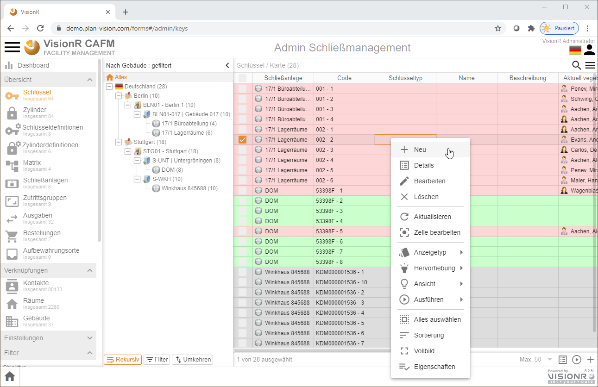
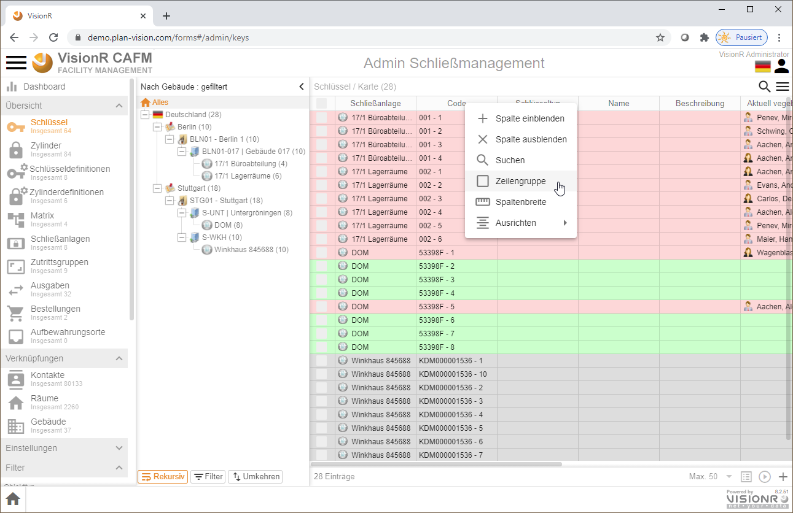

<!-- TITLE: Admin Schließmanagement-->
<!-- SUBTITLE: Benutzerhandbuch für Admins im Modul "Schließmanagement" -->

<!--  -->

# Schließmanagement - Admin

## Allgemein

Das vorliegende Dokument beschreibt die Nutzung vom Modul Schließmanagement  für normale Benutzer auf auf einem Desktop-Computer (PC, Laptop oder Mac). Die Nutzung auf einem mobilen Gerät (Tablet PC, Smartphone)  ist auch möglich. Mobile Geräte können speziell für digitale Unterschriften mit dem Finger oder einem digitalen Stift bei Schlüsselausgaben und -Rücknahmen eingesetzt werden. Die Dokumentation für die App "Schlüssel" ist mit Fokus auf die Verwaltung der Stammdaten  (neue Schließanlagen, neue Aufbewahrungsorte, grafische Verknüpfungen usw.) erstellt worden. Das Handling dynamischer Veränderungen (Schlüsselausgaben oder Rücknahmen, Zylindereinbau und -Ausbau usw.) ist im Abschnitt [Schließmanagement](../apps/keys) beschrieben.

## Beschreibung

Das VisionR-Modul Schließmanagement oder "Schlüssel" wird für die Verwaltung von den Schließungen in Gebäuden oder für Fahrzeuge eigesetzt. Es wird sowohl für die Verwaltung von Stammdaten wie Schließanlagen, Zylinder, Schlüssel, Karten, Schlüsselbunde, Aufbewahrungsorte usw., als auch als Tool für die Unterstützung dynamischer Veränderungen wie Schlüsselausgaben- und -Rücknahmen, Ein- und Ausbau von Zylindern, Bestellungen von neuen Schlüsseln und Zylindern verwendet. In einer Schließmatrix werden die Zuordnungen zwischen Zylindern und Schlüsseln/Karten visualisiert. Digitale Unterschriften an einem mobilen Gerät bei Ausgabe und Rücknahme sind möglich. Eingebaute Zylinder können per Mausklick oder Link im Web-CAD-Plan visualisiert werden. Die Daten im Modul Schließmanagement werden revisionssicher aufbewahrt. Jegliche Veränderungen, die den Status der Schlüssel/Karten und Zylinder betreffen, werden historisiert.

Features im Überblick, die für die Verwaltung der Stammdaten wichtig sind:

* **Schließanlagen** erstellen, bearbeiten und löschen 
* **Zylinderdefinitionen** erstellen, bearbeiten und löschen
* **Schlüsseldefinitionen** erstellen, bearbeiten und löschen
* **Schließmatrix**, d. h. die Zuordnung Zylinder<>Schlüssel definieren
* Einzelne **Zylinder** als Duplikate aus der Zylinderdefinition erstellen
* Einzelne **Schlüssel/Karten** als Duplikate aus der Schlüsseldefinition erstellen
* **Bestellungen** für Zylinder und Schlüssel/Karten
* **Aufbewahrungsorte** verwalten
* **Schlüsselbunde** definieren und Ausgaben/Rücknahmen verwalten
* **Grafische Verknüpfung** von Zylindern Geschossplan

# Übersicht

## Einstieg

Bei Nutzung des Browsers auf dem Desktopcomputer können die normalen Benutzer das Modul entweder über die Hauptadresse von VisionR auf der Registerkarten `Administration` > `Module` *(siehe Bild 1)* oder direkt über den Link `https://[VisionR-Adresse]/forms#/admin/keys` aufrufen.

*Bild 1: Admin Schließmanagement über die Indexseite aufrufen*

## Bedienung allgemein

Der Button mit den drei Strichen  oben links öffnet das Hauptmenü. Das Menü ist auf mobilen Geräten aus Platzgründen automatisch versteckt. In der Desktopversion ist das Menü automatisch aufgeklappt. Abwechselndes Klicken auf den `Menü`-Button zeigt oder verbirgt das Menü, je nachdem welcher der aktuelle Status ist. Der `Menü`-Button ist auf allen Masken verfügbar. Durch Klick auf einen Menüeintrag in der Liste öffnen Sie die entsprechende Maske mit den in diesem Dokument beschriebenen Funktionalitäten. Der Name der aktiven Maske wird in orangener Farbe hervorgehoben.

Ein Klick auf die Ikone  neben den drei Strichen oben Links führt zur VisionR-Indexseite. Wenn Sie das Modul Schließmanagement verlassen und zur Indexseite springen möchten, müssen Sie auf den Button mit dem Häkchen zur Bestätigen klicken. Bei Abbrechen bleiben Sie auf der aktuellen Maske.

Bei Klick auf den `Home`-Button ganz unten links wird ein Menü mit den vorhandenen Apps angezeigt. Dieser Button ist nur in der Desktop App sichtbar. Mobil muss der Klick auf das Logo oben links verwendet werden. Bei Klick auf einen Menüeintrag werden Sie zur gewünschten App umgeleitet. Vorher muss das Verlassen der aktuellen App bestätigt werden.

Standardmäßig werden die `Schlüssel` und die anderen Datenobjekte in Tabellen-Ansicht angezeigt. Wenn Sie mehrere Datenspalten sehen möchten oder Mehrfachmarkierungen und Sortierungen vornehmen möchten, ist die Tabellensicht dafür die geeignetste Ansicht. Zur Listen- oder Kachelnansicht gelangen Sie, indem Sie die drei Striche rechts unterhalb der Benutzerikone anklicken. Dabei wird das Menü für die Objektansicht angezeigt. Dieses Menü bezieht sich auf die Inhalte des gerade betrachteten Datenobjektes (in diesem Fall Schlüssel). Bei anderen Datenobjektansichten (Zylinder, Schließanlagen usw.) ist der Objektmenü-Button oben rechts ebenfalls vorhanden.

*Bild 2: Aufrufen des Kontextmenüs für Datenobjekt* 

*Bild 3: Beispiel Tabellenansicht*

Im Beispiel mit der Tabellenansicht sind folgende Hauptbereiche der Applikation zu erkennen:

* **Hauptmenü:** Auf der linken Seite befindet sich das Hauptmenü, das über die drei Striche neben dem Logo ein- und ausschalten werden kann. 
* **Baumansicht:** Rechts vom Hauptmenü befindet sich eine Baumansicht. In der Baumansicht können die Daten der Hauptansicht rechts daneben (Tabelle, Liste, Kacheln usw.) hierarchisch angezeigt und schnell gefiltert werden. Die Baumansicht kann mehrere Hierarchien enthalten. Eine Liste der vorhandenen Hierarchien ist bei Klick auf den Textfeld über den Button `Alles` zu sehen. Im unteren Bereich der Baumansicht gibt es drei Buttons, die ein- und ausgeschaltet werden können:
  + **`Rekursiv`** - bei `an` werden alle in den Unterordnern enthaltenen Datensätze links in der Tabelle angezeigt.
  + **`Filter`** - bei `an` werden die Baumstrukturelemente (Ordner) ausgeblendet, falls keine Daten darin einhalten sind.
  + **`Umkehren`** - bei `an` werden alle Datensätze in der Tabelle angezeigt, die nicht dem ausgewählten Ordner zuzuordnen sind.
* **Datenbereich:** Rechts von der Baumansicht befindet sich die Datenansicht, die in Form von Tabelle, Liste, Kacheln, Geometrie usw. dargestellt werden kann. Ein Kontextmenü für die Daten mit allen vorhandenen Optionen (wie z. B. Neu, Bearbeiten, Löschen, Hierarchie, Einfärbung usw.) ist bei Klick auf die drei Striche unter der Benutzerikone oben rechts aufrufbar. Alternativ kann das Kontextmenü für die Daten im Tabellenbereich mit Rechtsklick aufgerufen werden (siehe Bilder unten).
* **Suchfeld:** Über dem Datenbereich befindet sich eine Lupe rechts oben, die bei Klick eine Suchleiste anzeigen lässt. Diese Leiste kann für schnelle Datensuche auf vordefinierte Spalten genutzt werden. Weitere Optionen für die Suche, wie z. B. Suche nach bestimmten Spalten, Datengruppierungen usw., sind in den drei Punkten auf der rechten Seite des Suchfeldes enthalten.
* **Tabellenüberschriften** Die Tabellenüberschriften können für schnelle Datensortierung genutzt werden. Bei erstem Klick auf die Überschrift einer Spalte werden die Daten aufsteigend und bei erneutem Klick absteigend sortiert. Zwischen den Spaltennamen können Die Spaltenbreiten dynamisch mit der Maus nach links oder rechts angepasst werden. Ein Rechtsklick auf die Überschriften zeigt ein Menü mit Optionen für die Tabelle insgesamt und für die gerade angeklickte Spalte. Eine nützliche Gruppierungsfunktion kann an dieser Stelle ein- und ausgeschaltet werden.

*Bild 4: Daten-Kontextmenü über die drei Striche oben rechts - 1. Aufrufmöglichkeit*

*Bild 5: Daten-Kontextmenü mit Rechtsklick im Datenbereich - 2. Aufrufmöglichkeit*

*Bild 6: Suchfeld über der Datenansicht (Tabelle/Liste/Kacheln)*

*Bild 7: Suchoptionen auf die drei Punkte `...` am rechten Ende der Suchleiste*

*Bild 8: Rechtsklick auf die Tabellenspalten-Überschriften zeigt Zusatzoptionen*

# Reihenfolge Stammdaten

bei der Bearbeitung der Stammdaten, insbesondere bei Neuanlegen von Gebäuden und Schließanlagen ist folgende Reihenfolge zu beachten:

* **Schließanlage** dieses Datenobjekt muss zuerst angelegt werden. Die Erstellung neuer Schließanlagen während der Bearbeitung einer Schlüssel- oder Zylinderdefinition ist auch möglich, allerdings kann in diesem Fall die neue Anlage im Schlüssel/Zylinder erst gespeichert werden, wenn der Schlüssel gespeichert wird. Grund fürs letztere Verhalten sind Transaktionen, die erst beim Speichern des zuerst bearbeiteten Objekts gestartet werden. Die Schließanlage muss mit Gebäude(n) verknüpft werden. Die Gebäude können bereits vorhanden, aber noch nicht im Baum sichtbar sein. In der Baumstruktur erscheinen nur Gebäude, die bereits eine Schließanlage haben, obwohl Sie in der Standortstruktur im Flächenmanagement bestehen können.
* **Zylinderdefinition** einzelne Zylinder können zwar mit `+ Neu` erstellt werden, allerdings ist davon abzuraten, da Zylinderkopien (Zylinderduplikate) eine fortlaufende Nummer, die im System automatisch generiert wird, bekommen. Deswegen ist es besser, wenn nur Zylinderdefinitionen neu angelegt und danach einzelne Zylinder als Duplikate der Zylinderdefinitionen vom System generiert werden. Der Vorgang `Duplikate erstellen` ist in den folgenden Abschnitten näher beschrieben.
* **Schlüsseldefinitionen** einzelne Schlüssel können zwar mit `+ Neu` erstellt werden, allerdings ist davon abzuraten, da Schlüsselkopien (Schlüsselduplikate) eine fortlaufende Nummer, die im System automatisch generiert wird, bekommen. Deswegen ist es besser, wenn nur Schlüsseldefinitionen neu angelegt und danach einzelne Schlüssel als Duplikate der Schlüsseldefinitionen vom System generiert werden. Der Vorgang `Duplikate erstellen` ist in den folgenden Abschnitten näher beschrieben.
* **Schließmatrix** eine Zuordnung zwischen Zylinder und Schlüssel kann entweder in der Zylinder- oder in der Schlüsseldefinition erfolgen. Die Matrix gibt an welche Schlüssel in welche Zylinder passen.
* **Zutrittsgruppen (Schließkreise)** Schließkreise können für eine hierarchische Darstellung der Schlüssel (HGS, GS, Feuerwehr, Reinigung etc.) verwendet werden. Die Hierarchie wird über das Eingabefeld *"Gehört zu"* im jeweiligen Schließkreis aufgebaut.
* **Zylinderduplikate generieren** einzelne Zylinder können von der Zylinderdefinition generiert werden. Zylinderduplikate (Zylinderkopien) haben immer eine fortlaufende Nummer, um die physisch vorhandenen Zylinder unterscheiden zu können, obwohl Sie vom Hersteller meistens die gleiche Zylindernummer aufgedruckt bekommen. Einzelne Zylinder können bei Einbau einem Raum, einem Inventargegenstand oder einer Öffnung (Tür/Fenster) zugeordnet werden.
* **Schlüsselduplikate generieren** einzelne Schlüssel können von der Schlüsseldefinition generiert werden. Schlüsselduplikate (Schlüsselkopien) haben immer eine fortlaufende Nummer, um die physisch vorhandenen Schlüssel unterscheiden zu können, obwohl Sie vom Hersteller meistens die gleiche Schlüsselnummer aufgedruckt bekommen. Einzelne Schlüssel können ausgegeben oder zurückgenommen werden.
* **ggf. Schlüsselbunde** definieren
* **Aufbewahrungsorte** diese können auch während der Bearbeitung einzelner Schlüssel oder Zylinder neu angelegt werden, wenn die Transaktionsregeln bei der Bearbeitung beachtet werden.
* **Ausgaben/Rücknahmen** Ausgaben und Rücknahmen von Schlüsseln, sowie Ein- und Ausbau von Zylindern können auch in der normalen App Schließmanagement erledigt werden.
* **Bestellungen** wenn neue Zylinder oder Schlüssel benötigt werden, können diese als Bestellung angelegt werden. Wenn Bestellformulare oder E-Mail-Vorlagen eingerichtet sind, kann die Kommunikation mit dem Hersteller/Lieferanten durch dieses Feature digital unterstützt werden.

# Schließanlagen verwalten

## Neu anlegen

Wenn Sie sich im Modul *Admin Schlüssel* befinden und den Menüeintrag `Schließanlagen` vom Hauptmenü ausgewählt haben, können Sie die drei Striche oben rechts unter dem Benutzerlogo anklicken, um das Daten-Kontextmenü aufzurufen. Alternativ können Sie einen Maus-Rechtsklick im Datenbereich mit der Tabelle oder Liste nutzen.  Im Kontextmenü klicken Sie die Menüoption `+ Neu` an. Dabei wird ein Dialog für einen neuen Datensatz geöffnet, in dem Sie die Daten für die neu zu erstellende Schließanlage eingeben können.

*Bild 9: Rechtsklick im Datenbereich zeigt Kontextmenü mit Eintrag `+ Neu`*

> **Hinweis:** Neue Datensätze können entweder durch Rechtsklick im Datenbereich oder bei Klick auf das Datenmenü oben rechts unter der Personenikone und dann auf `+ Neu` erstellt werden. Zusätzlich besteht die Möglichkeit den Pluszeichen unten rechts im Datenbereich anzuklicken.

*Bild 10: Neue Schließanlage*

Bei der neu erstellten Schließanlage müssen die Standortdaten eingegeben werden. Dazu muss ein Gebäude aus dem Flächenmanagement vorhanden sein. Das Gebäude ist im ersten Moment in der Baumansicht nicht unbedingt sichtbar, da dort nur Gebäude mit bereits zugeordneten Schließanlagen angezeigt werden.

> **Hinweis:** Die Angaben in den Feldern für Arbeitsplatz, Raum, Geschoss, Gebäude und Liegenschaft sind wichtig für die Suche. Wenn diese Angaben fehlen, kann die Arbeitsplatzplatzeinheit nicht über die Standort-Baumstruktur aufgefunden, gefiltert oder angezeigt werden.

## Bearbeiten

Wenn Sie die App "Admin Schlüssel" öffnen, müssen Sie im Hauptmenü (immer erreichbar über die drei Striche oben links neben dem Logo) den Eintrag `Schließanlagen` anklicken. Rechts werden die vorhandenen Schließanlagen in Listen- oder Tabellen-Ansicht angezeigt. Klicken Sie eine Schließanlage an, um sie auszuwählen. Danach lassen Sie mit Maus-Rechtsklick das Kontextmenü anzeigen. Alternativ können Sie die drei Striche unter der Personenikone anklicken, um das Kontextmenü aufzumachen. Im Kontextmenü klicken Sie auf den Button `Bearbeiten`.

*Bild 11: Rechtsklick bei markiertem Arbeitsplatz*

Doppelklick auf die Schließanlage in der Tabelle oder in der Liste ruft ein Dialog mit Details auf. Auf diesem Dialogfenster ist untern links der Button `Bearbeiten` vorhanden, falls Sie die Zugriffsrechte für die Bearbeitung des ausgewählten Datensatzes besitzen.

*Bild 12: Dialog mit Details bei Doppelklick*

> **Hinweis:** Den Details-Dialog können Sie bei ausgewähltem Datensatz in der Tabelle mit `Leertaste`, statt mit Doppelklick aufrufen.

Im Bearbeitungsmodus werden nur die wichtigsten Eingabefelder angezeigt. Falls Sie alle Datenbankfelder der Schließanlage sehen und bearbeiten möchten , müssen Sie den Datensatz in Admin-Modus öffnen. Dazu gehen Sie auf die drei Striche oben rechts und klicken Sie auf den Menüeintrag `Administration`.

*Bild 13: Admin-Modus für die Bearbeitung aufrufen*

## Löschen

Eine Schließanlage können Sie im Bearbeitungsmodus löschen. Es können nur Schließanlagen gelöscht werden, die noch keine Verknüpfungen mit anderen Daten haben. Eine Datenkonsistenzprüfung verhindert das Löschen, falls abhängige Daten bereits vorhanden sind.

Öffnen Sie die Schließanlage mit Maus-Rechtsklick auf den Button `Bearbeiten`. Danach öffnen Sie das Dialogmenü mit Klick auf die drei Striche oben rechts. Hier ist der Menüeintrag `Löschen` vorhanden, allerdings nur wenn Sie die notwendigen Zugriffsrechte besitzen.

*Bild 14: Löschen im Bearbeitungs- oder Admin-Modus*

# Zylinderdefinitionen verwalten

Bei der Verwaltung der Zylinderdefinitionen (Neu anlegen, Bearbeiten oder Löschen) wird identisch wie bei der Verwaltung der Schließanlagen vorgegangen. Sehen Sie die vorangegangenen Detailbeschreibungen im Abschnitt "Schließanlagen verwalten".

Zylinderdefinitionen müssen Schließanlagen zugeordnet werden (Pflichtfeld).

# Schlüsseldefinitionen verwalten

Bei der Verwaltung der Schlüsseldefinitionen (Neu anlegen, Bearbeiten oder Löschen) wird identisch wie bei der Verwaltung der Schließanlagen vorgegangen. Sehen Sie die vorangegangenen Detailbeschreibungen im Abschnitt "Schließanlagen verwalten".

Schlüsseldefinitionen müssen Schließanlagen zugeordnet werden (Pflichtfeld).

# Schließmatrix

Die Schließmatrix gibt an welche Schlüssel welche Zylindern öffnen und schließen. Die Schließmatrix wird entweder in der Schlüssel- oder in der Zylinderdefinition eingegeben und gilt für alle Duplikate des betroffenen Schlüssels und des Zylinders.

*Bild 15: Matrix in der Schlüsseldefinition bearbeiten*

Die Schließmatrix können Sie als Excel-Bericht aufrufen. Dazu markieren Sie eine oder mehrere Schlüssel- oder Zylinderdefinitionen. Anschließend klicken Sie auf die drei Striche oben rechts unter der Personenikone und klicken Sie auf den Bericht im Menü: *Ausführen > Bericht > Schließmatrix*.

*Bild 16: Bericht "Schließmatrix" aufrufen*

Der aufgerufene Bericht wertet die ausgewählten  Zylinder und Schlüssel in der Schließanlage aus. Die Zylinder mit Einbauort werden als Zeilen, die Schlüssel mit Anzahl verfügbar und ausgegeben als Spalten dargestellt. 

*Bild 17: Beispiel Bericht "Schließmatrix" *

# Schlüsselduplikate generieren

Einzelne Schlüssel müssen stets aus bereits angelegten Schlüsseldefinitionen generieren werden, da eine fortlaufende Nummer für jede Schlüsselkopie vom System generiert wird. Der Code eines einzelnen Schlüssels (synonym für Schlüsselduplikat oder Schlüsselkopie) muss innerhalb der Schließanlage identisch sein. Meistens besteht der Code aus folgenden Teilen: *[Code der Schlüsseldefinition] - [fortlaufende Nummer]* (z.B. *"SCH0012 -1"*, *"SCH0012 -2"*, ...).

Öffnen Sie eine Schlüsseldefinition mit Doppelklick. Gehen Sie auf den Button `Bearbeiten`. Unten links im Bearbeitungsfenster klicken Sie auf den Menübutton `Ausführen` (eigekreister Rechts-Pfeil). Wählen Sie die Option `Duplikate erstellen!`. Falls diese Option nicht vorhanden ist, haben Sie keine ausreichenden Zugriffsrechte an dieser Stelle.

*Bild 18: Schlüsselduplikate in der Schlüsseldefinition generieren*

> **Hinweis:** Vermeiden Sie die Erstellung neuer einzelner Schlüssel, obwohl diese Möglichkeit besteht. Der beschriebene Vorgang für `Duplikate erstellen!` soll die bevorzugte Variante sein.

# Ausgaben/Rücknahmen von Schlüsseln/Karten

Schlüssel-Ausgaben und -Rücknahmen sind im Dokument für die App [Schließmanagement](../apps/keys) ausführlich beschrieben. An dieser Stelle wird nur allgemeiner Überblick über die Funktionalität verschafft. Ausgaben und Rücknahmen sind dynamische Daten, die eine intensivere Datenbearbeitung erfordern. Im Admin-Bereich sollen eher die Stammdaten gepflegt und strukturelle Veränderungen dokumentiert werden.

## Ausgabe

Sie können eine Schlüssel ausgeben, nur wenn dieser den passenden Status hat. Bei aktuell vergebenen oder verlorenen/vernichteten Schlüsseln ist der Button für die Ausgabe nicht vorhanden.

Öffnen Sie auf einen Schlüssel mit dem Status *"im Depot"* (erkennbar an der grünen Einfärbung in der Tabelle oder Liste) mit Doppelkick. In der Details-Ansicht ist der Button `Ausgabe` sichtbar, falls Sie die notwendigen Zugriffsrechte für Schlüsselausgaben besitzen.

> **Hinweis:** Der Button `Ausgabe` ist auch im Bearbeitungsmodus verfügbar.

*Bild 19: Schlüssel in der Details-Ansicht ausgeben*

## Rücknahme

Sie können eine Schlüssel ausgeben, nur wenn dieser den passenden Status hat. Bei aktuell nicht vergebenen Schlüsseln ist der Button für die Rücknahme nicht vorhanden.

Öffnen Sie auf einen Schlüssel mit dem Status *"ausgegeben"* (erkennbar an der roten Einfärbung in der Tabelle oder Liste) mit Doppelkick. In der Details-Ansicht ist der Button `Rücknahme` sichtbar, falls Sie die notwendigen Zugriffsrechte für Schlüsselrücknahmen besitzen.

*Bild 20: Schlüssel in der Details-Ansicht zurücknehmen*