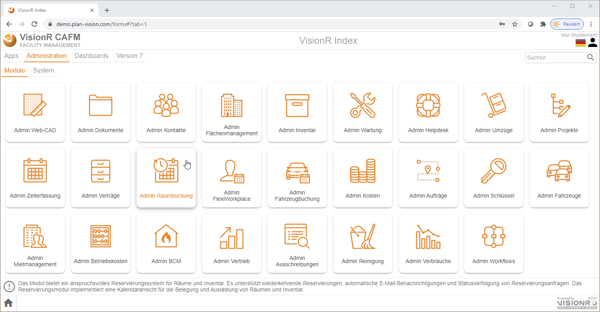
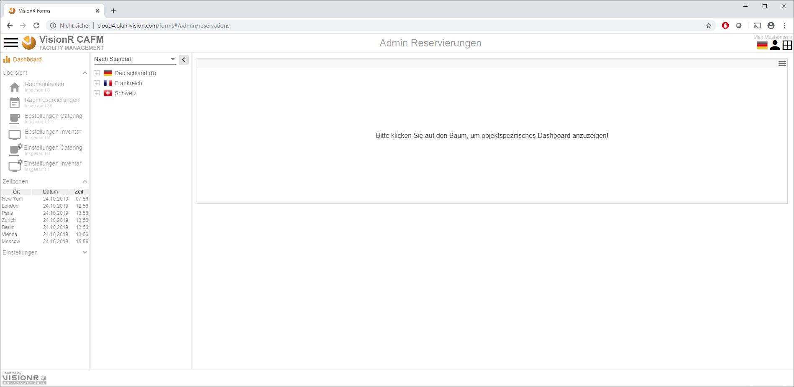
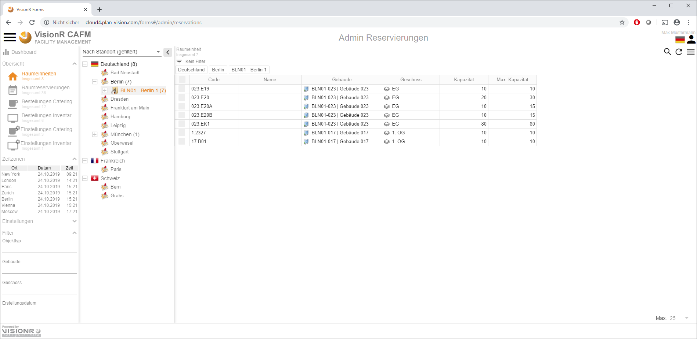
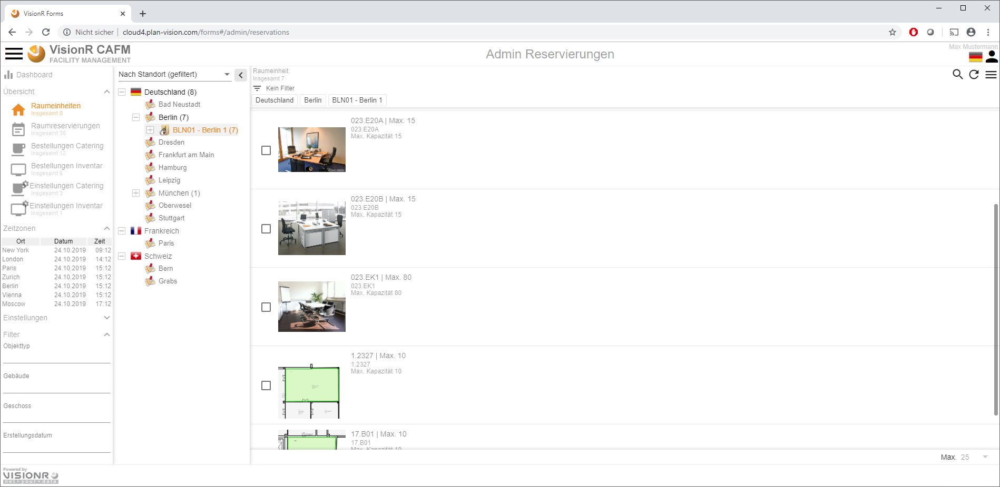

<!-- TITLE: Modul "Raumbuchung" für Admin Benutzer -->
<!-- SUBTITLE: Modul für die Online-Reservierungen von Räumen  -->

Deutsch | [English](../../../en/user-guide/reservations-space) | *Sie sind hier: [Home](../../../home) > [Benutzerhandbuch](../user-guide) > Admin Raumbuchung*

# Raumbuchung - Admin

## Beschreibung

Die Admin Benutzer haben deutlich mehrere Rechte und Aufgaben, aber die Benutzeroberfläche ist identisch. Dafür öffnen Sie die Applikationsmaske auf dem Reiter `Administration`> `Module` - *Admin Raumbuchung*.

Sie können das Modul öffnen indem Sie auf der Index-Maske den Reiter `Seiten` auswählen und den Button `Reservierungen` anklicken (siehe Bild 1). Alternativ können Sie die direkte Moduladresse in Ihrem Browser eingeben: `https://[Visionr-Adresse]/forms#/main/reservations`.

*Bild 1: Admin Applikationsmaske Reservierungen öffnen*

Die Admin-Maske wird geöffnet. Auf der linken Seite ist das Hauptmenü, rechts daneben befindet sich eine Baumansicht mit Hierarchien, die zur Datenfilterung genutzt werden kann. Weiter rechts werden die Daten im Datenbereich als Tabelle oder Liste angezeigt. 

*Bild 2: Admin Applikationsmaske*

Im Hauptmenü können Sie die im Datenbereich dargestellten Datenobjekte ändern, indem Sie die Menüeinträge anklicken.

Folgende Datenobjekte stehen Ihnen zur Verfügung:

* **Raumeinheit** - hier werden die Raumeinheiten definiert, die eigentlich gemietet werden können. Diese werden über den Raum gezeichnet und sind anders als Räume und haben andere Eigenschaften wie Sitzanordnung, Catering / Inventar Bestellungen
* **Raumreservierungen** - hier werden die erstellen Reservierungen in tabellarischer Form angezeigt. Sie können diese hier bearbeiten
* **Bestellungen Catering** - hier verwalten Sie die Bestellungen für Catering / Bewirtungen
* **Bestellungen Inventar** - hier verwalten Sie die Inventarbestellungen
* **Einstellungen Catering** - hier werden Standardaufträge mit Positionen für Catering definiert
* **Einstellungen Inventar** - hier werden Standardaufträge mit Positionen für Inventarbestellungen definiert

# Raumeinheiten bearbeiten

Die Raumeinheiten stellen die Räume dar, die reserviert werden können. Sie beinhalten alle notwendigen Eingabefelder für die Reservierung und sind mit den darunterliegenden auf dem Plan (falls gezeichnet) Räumen verknüpft. Die eigentlichen Eingaben werden in dieser Objektdefinition gemacht. Eine Raumeinheit kann für eine bestimmte Zeit reserviert werden. Der Raum dagegen nicht und bleibt als Grundlage mit der Einheit verknüpft. Aus dem Raum werden die Zugehörigkeiten (Raum -> Geschoss -> Gebäude - Liegenschaft) herausgezogen.  

Mit Klick auf den Button `Raumeinheiten` werden diese in dem Arbeitsbereich angezeigt. Sie können die Baumstruktur nutzen, um die Daten zu filtern. Sie können hier neue Raumeinheiten erstellen, vorhandene bearbeiten, löschen usw. 

 

*Bild 3: Raumeinheiten in tabellarischer Ansicht*

 

*Bild 4: Raumeinheiten in Listenansicht mir Bildzeichen / Ausschnitt aus der Grafik*

