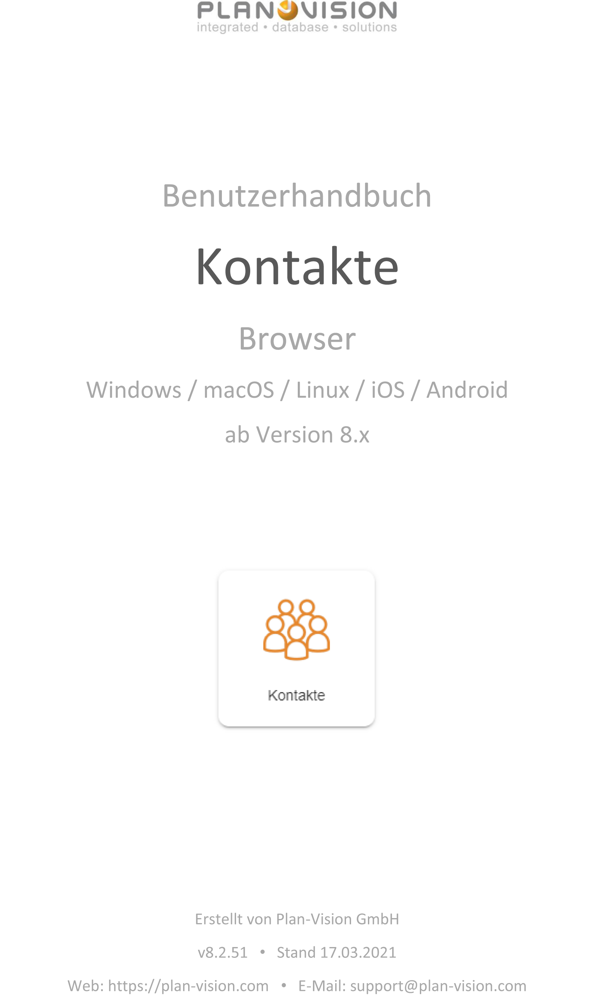
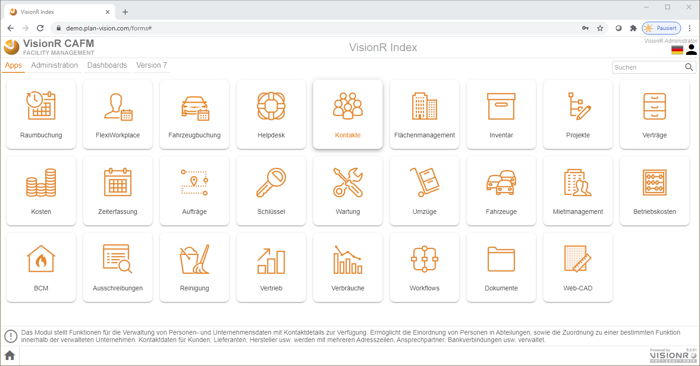
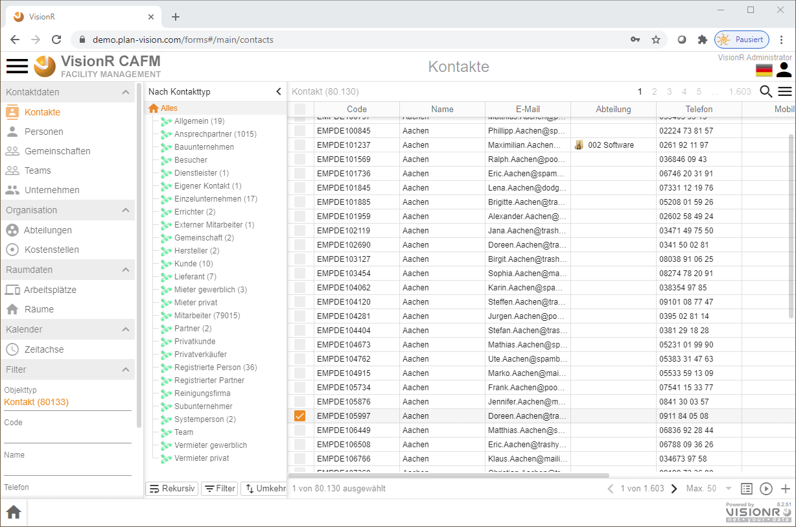

<!-- TITLE: Modul Kontakte-->
<!-- SUBTITLE: Modul für die Verwaltung von Personen, Unternehmen, Gemenschaften, Organisationsstrukturen usw.-->

<!--  -->

Deutsch | [English](../../../en/user-guide/apps/contacts) | *Sie sind hier: [Home](../../../home) > [Benutzerhandbuch](../user-guide) > Kontakte*

# Beschreibung
Das Modul wird für die Verwaltung von Kontaktdaten genutzt. Im folgenden können Sie die Schritte bei der Erstellung und Bearbeitung von Personen, Unternehmen, Organisationseinheiten usw. lesen. Die angelegten Kontaktdaten können in allen anderen Modulen genutzt werden, z.B. in Verträgen, Flächenbelegungen usw. 

Sie können das Modul öffnen indem Sie auf der Index-Maske den Reiter `Seiten` auswählen und den Button `Kontakte` anklicken (siehe Bild 1). Alternativ können Sie auch die direkte Moduladresse in Ihrem Browser eingeben: `http://[VisionR-Adresse]/forms#/main/contacts`

*Bild 1: Modul Kontakte über die Index-Seite aufrufen*

# Übersicht

*Bild 2: Übersicht im Modul Kontakte*

# Bedienung der Oberfläche
## Ansicht ändern
## Suchen/Filtern
## Hierarchien nutzen
# Bearbeiten von Kontakten
## In Formularansicht
### Erstellen von Kontakten
### Ändern von Kontakten
### Löschen von Kontakten
## In Tabellenansicht
### Erstellen von Kontakten
### Ändern von Kontakten
### Löschen von Kontakten
## Grafische Bearbeitung
# Bearbeitung von Organisationsstrukturen
## Abteilungen
### Erstellen
### Ändern
### Löschen
## Kostenstellen
### Erstellen
### Ändern
### Löschen
# Bearbeitung von Raumdaten
## Räume zuordnen
### In Datenansicht
### In Grafik (Web-CAD)
## Arbeitsplätze zuordnen
### In Datenansicht
### In Grafik (Web-CAD)
# Massenänderungen
# Zugriffsberechtigungen

