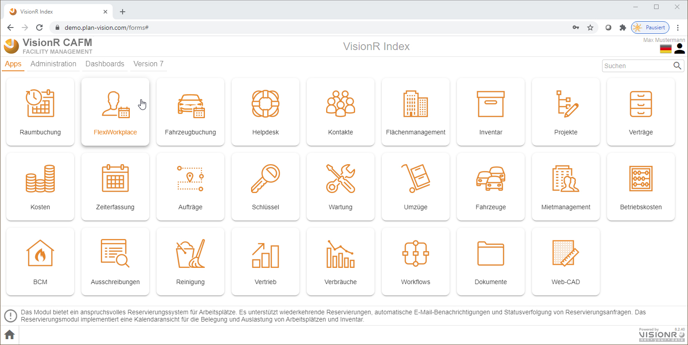

<!-- TITLE: FlexiWorkplace-->
<!-- SUBTITLE: FlexiWorkplace ist ein modul für flexible Arbeitsplatzreservierung -->

# FlexiWorkplace

## Allgemein

Das vorliegende Dokument beschreibt die Nutzung vom Modul FlexiWorkplace für normale Benutzer im Browser auf einem Desktop-Computer (PC, Laptop oder Mac). Die mobile Nutzung auf Tablet-PC oder Smartphone ist im Abschnitt [FlexiWorkplace - mobil](flexi-workplace-mobile) beschrieben.

## Beschreibung

Das VisionR-Modul FlexiWorkplace kann für die mobile Arbeitsplatzreservierung genutzt werden. Eine grafische  Oberfläche und Kalenderansicht erleichtern die Suche an einem oder  mehreren Standorten. Die Zubuchung von Assets und Services ist möglich. FlexiWorkplace kann im Browser oder auf einem mobilen Gerät wie Tablet-PC oder Smartphone genutzt werden.

Features im Überblick:

* **Suchen nach freien Arbeitsplätzen:** Sie können freie Arbeitsplätze in Geschossplänen grafisch aussuchen. Nachdem Sie Ihre Suchkriterien (Anfang, Ende, Gebäude, Etage) eingegeben haben, sehen Sie die freien Arbeitsplätze im Plan und können diese reservieren.
* **Reservieren mit QR-Code / Barcode:** Wenn Sie sich bereits vor Ort an einem freien Arbeitsplatz befinden, können Sie diesen per QR-Code gleich reservieren oder eine laufende Reservierung beenden.
* **Einzelplatz reservieren:** Hier können Sie sich einen einzelnen Arbeitsplatz grafisch aussuchen und reservieren.
* **Mehrere Arbeitsplätze reservieren:** Hier können Sie sich mehrere Arbeitsplatze grafisch aussuchen und zur gleichen Zeit reservieren, z.B. für Gruppenarbeit in einem gemeinsamen Projekt.
* **Tabellenansicht mit Reservierungen:** Hier können Sie Reservierungen anzeigen, durchsuchen und filtern in einer Tabellenansicht. Die Daten können nach MS Excel exportiert werden.
* **Kalender mit Reservierungen:** Hier können Sie alle verfügbaren Arbeitsplätze in einer Zeitachse sehen. Die bereits getätigten Reservierungen werden angezeigt. Sie können neue Reservierungen in der Zeitachse erstellen.

## Einstieg

Die normalen Benutzer können das Modul entweder über die Hauptadresse von VisionR auf der Registerkarte ***Apps*** *(siehe Bild 1)* oder direkt über den Link `https://[VisionR-Adresse]/forms#/main/reservations_workplace`

*Bild 1: Einstieg über die VisionR-Indexseite (Browser auf dem Desktop-Computer)*

## Administration

Administrative Aufgaben, wie z. B. Anlegen neuer Arbeitsplätze, Änderungen der Reservierbarkeit oder Definition von zeitlichen Regeln für die Einheiten sind im Abschnitt [Admin FlexiWorkplace](/de/user-guide/admin/flexi-workplace) beschrieben.

