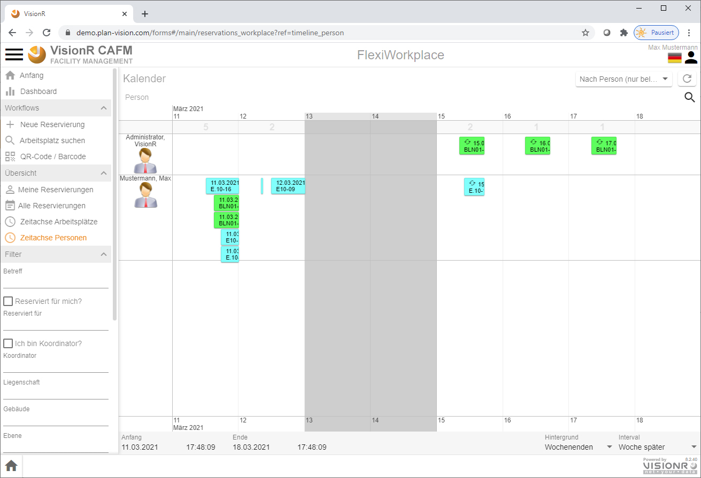
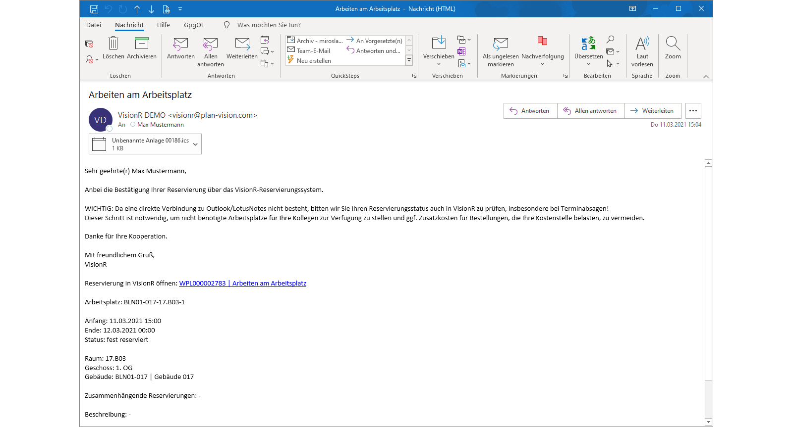
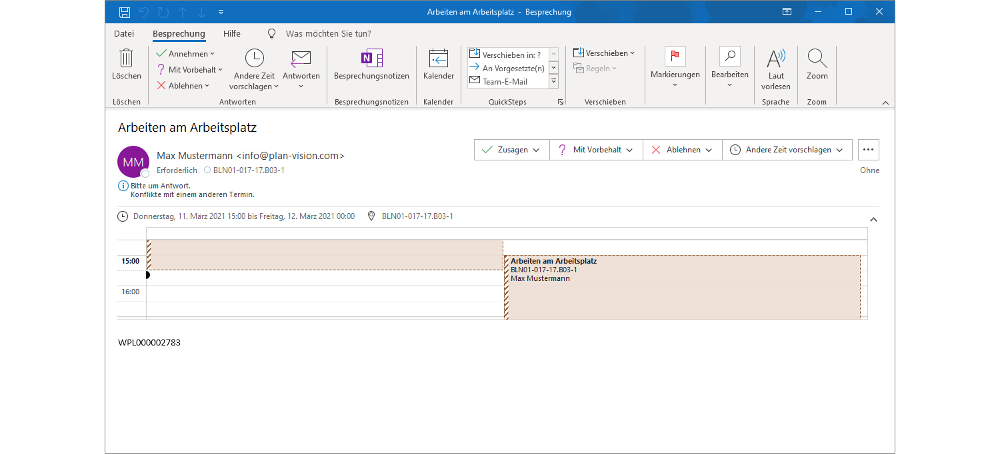

<!-- TITLE: FlexiWorkplace Desktop -->
<!-- SUBTITLE: FlexiWorkplace ist ein Modul für flexible Arbeitsplatzreservierung -->

<!--  -->

# FlexiWorkplace - Desktop

## Allgemein

Das vorliegende Dokument beschreibt die Nutzung vom Modul FlexiWorkplace für normale Benutzer auf auf einem Desktop-Computer (PC, Laptop oder Mac). Die Nutzung auf einem mobilen Gerät (Tablet PC, Smartphone)  ist im Abschnitt [FlexiWorkplace - mobil](flexi-workplace-mobile) beschrieben.

## Beschreibung

Das VisionR-Modul FlexiWorkplace dient der flexiblen und mobilen Arbeitsplatzreservierung für Einzel- und Gruppenarbeitsplätze. Eine grafische  Oberfläche und Kalenderansicht erleichtern die Suche an einem oder  mehreren Standorten. Die Zubuchung von Assets und Services ist möglich. FlexiWorkplace kann im Browser oder auf einem mobilen Gerät wie Tablet-PC oder Smartphone genutzt werden.

Features im Überblick:

* **Suchen nach freien Arbeitsplätzen:** Sie können freie Arbeitsplätze in Geschossplänen grafisch aussuchen. Nachdem Sie Ihre Suchkriterien (Anfang, Ende, Gebäude, Etage) eingegeben haben, sehen Sie die freien Arbeitsplätze im Plan und können diese reservieren.
* **Reservieren mit QR-Code / Barcode:** Wenn Sie sich bereits vor Ort an einem freien Arbeitsplatz befinden, können Sie diesen per QR-Code gleich reservieren oder eine laufende Reservierung beenden.
* **Einzelplatz reservieren:** Hier können Sie sich einen einzelnen Arbeitsplatz grafisch aussuchen und reservieren.
* **Mehrere Arbeitsplätze reservieren:** Hier können Sie sich mehrere Arbeitsplatze grafisch aussuchen und zur gleichen Zeit reservieren, z. B. für Teamarbeit in einem gemeinsamen Projekt.
* **Tabellenansicht mit Reservierungen:** Hier können Sie Reservierungen in einer Tabellenansicht anzeigen, durchsuchen und filtern. Die Daten können nach MS Excel exportiert werden.
* **Kalender mit Reservierungen:** Hier können Sie alle verfügbaren Arbeitsplätze in einer Zeitachse sehen. Die bereits getätigten Reservierungen werden angezeigt. Sie können neue Reservierungen in der Zeitachse erstellen.

## Einstieg

Wenn Sie mobile VisionR App nutzen, werden Sie nach der Anmeldung automatisch auf die VisionR-Indexseite umgeleitet. Bei Nutzung des Browsers auf dem Desktopcomputer können die normalen Benutzer das Modul entweder über die Hauptadresse von VisionR auf der Registerkarte `Apps` *(siehe Bild 1)* oder direkt über den Link `https://[VisionR-Adresse]/forms#/main/reservations_workplace` aufrufen.

*Bild 1: Einstieg über die VisionR-Indexseite*

## Administration

Administrative Aufgaben, wie z. B. Anlegen neuer Arbeitsplätze, Änderungen der Reservierbarkeit oder Definition von zeitlichen Regeln für die Einheiten sind im Abschnitt [Admin FlexiWorkplace](/de/user-guide/admin/flexi-workplace) beschrieben.

# Übersicht

## Anfang

Bei Aufruf der App FlexiWorkplace wird automatisch die Anfangsmaske geöffnet (siehe Bild 2).

*Bild 2: Maske "Anfang"*

Im oberen Bereich der Anfangsmaske wird eine Liste mit den nächsten persönlichen Arbeitsplatzbuchungen angezeigt. Falls Sie keine anstehenden Termine haben, bleibt die Liste leer.

> **Hinweis:** Mit Klick auf die Überschrift "Meine Reservierungen" oder auf den Button "Mehr zeigen..." wird eine vollständige Liste der eigenen Reservierungen in einer Listenansicht angezeigt. 

Mit Klick auf die Termine können Sie Detailinformationen inklusive Standort im Plan anzeigen lassen. Die Buttons unter der Terminübersicht führen zu den Modulfunktionen, die in FlexiWorkplace für die normalen User zur Verfügung stehen.

## Bedienung allgemein

Der Button mit den drei Strichen oben links öffnet das Hauptmenü. Das Menü ist auf mobilen Geräten aus Platzgründen automatisch versteckt. In der Desktopversion wird das Hauptmenü automatisch angezeigt. Abwechselndes Klicken auf den`Menü`-Button zeigt oder verbirgt das Menü, je nachdem welcher der aktuelle Status ist. Der `Menü`-Button ist auf allen Masken verfügbar. Durch Klick auf einen Menüeintrag in der Liste öffnen Sie die entsprechende Maske mit den in diesem Dokument beschriebenen Funktionalitäten. Der Name der aktiven Maske wird in orangener Farbe hervorgehoben.

*Bild 3: Hauptmenü über die drei Striche neben dem Logo ein/aus* 

Ein Klick auf die Ikone  neben den drei Strichen oben links führt zur VisionR-Indexseite. Wenn Sie das Modul FlexiWorkplace verlassen und zur Indexseite springen möchten, müssen Sie auf den Button mit dem Häkchen zur Bestätigung klicken (siehe Bild 3). Bei Abbrechen bleiben Sie auf der aktuellen Maske.

*Bild 4: Zur Indexseite zurückkehren* 

Bei Klick auf den `Home`-Button ganz unten links wird ein Menu mit den vorhandenen Apps angezeigt. Dieser Button ist nur in der Desktop App sichtbar. Mobil muss der Klick auf das Logo oben links verwendet werden. Bei Klick auf einen Menüeintrag werden Sie zur gewünschten App umgeleitet. Vorher muss das Verlassen der aktuellen App bestätigt werden (siehe Bild oben).

*Bild 5: Eine andere App direkt aufrufen*

# Suchen nach freien Arbeitsplätzen

## Suchen

Der erste Button auf der Anfangsseite `Suchen nach freien Arbeitsplätzen` öffnet die Maske für die Arbeitsplatzsuche (siehe Bild 6).

*Bild 6: Arbeitsplatzsuche öffnen*

Auf der Maske für die Arbeitsplatzsuche können Sie die Suchfelder mit den gewünschten Suchkriterien ausfüllen und anschließend auf den Button `Suchen` klicken, um freie Arbeitsplätze entweder in der Plan- oder in einer Listen-Ansicht anzeigen zu lassen.

Der Wechsel zwischen Plan- und Listen-Ansicht geschieht, indem Sie abwechselnd den zweiten Button links vom `Suchen`-Button anklicken. Der Button  stellt die Suche auf Listenansicht ein. Der Button  stellt die Suche auf Planansicht ein.

> **Hinweis:** der Wechsel zwischen Plan- und Listen-Ansicht kann vor oder auch nach Klick auf den `Suchen`-Button erfolgen.

Ein Klick auf den Button mit dem Pfeil  neben dem `Suchen`-Button setzt die eingegebenen Werte für die Suchkriterien zurück.

In der Standartversion von FlexiWorkplace sind folgende Suchfelder vorhanden:

* **Liegenschaft** hier können Sie im Dropdown eine Liegenschaft auswählen
* **Gebäude** hier können Sie ein Gebäude auswählen
* **Geschoss** hier können Sie das gewünschte Geschoss auswählen
* **Anfang** Datum und Uhrzeit als Anfangszeit für die Suche nach freien Arbeitsplätzen
* **Ende** Datum und Uhrzeit als Endzeit für die Suche nach freien Arbeitsplätzen
* **Verfügbarkeit prüfen?** hier stellen Sie ein, ob die angegebenen Zeiten für die Arbeitsplatzsuche verwendet werden. Falls das Häkchen auf `Nein` gesetzt ist, werden alle gefundenen Arbeitsplätze angezeigt. Bei bereits belegten Arbeitsplätzen sind keine Doppelbuchungen erlaubt. Eine entsprechende Fehlermeldung wird im Reservierungsvorgang angezeigt.

> **Bemerkung: ** Während der Eingabe Ihrer Suchkriterien wird die Anzahl gefundener Arbeitsplätze im `Suchen`-Button in Klammern angezeigt, noch bevor Sie die Anzeige der Ergebnisse in Plan- oder Listen-Ansicht sehen.

> **Hinweis:** Zusätzliche spezifische Suchfelder wie z. B. "Gebäudeteil" o. ä. können nach Kundenwunsch jederzeit integriert werden. 

Nachdem Sie Ihre Suchkriterien eingegeben haben und auf den Button `Suchen` geklickt haben, werden die Suchergebnisse angezeigt. Der Filter-Bereich mit den Suchkriterien wird in der mobilen Version automatisch minimiert, um mehr Platz für die Suchergebnisse zu verschaffen. Den Filter mit den Suchkriterien können Sie jederzeit aufklappen oder zuklappen, indem Sie mit dem Finger oder mit der Maus auf die Leiste `Filter : aktiv` klicken.

Als Vorgabe werden die Suchergebnisse im Plan angezeigt:

*Bild 7: Suchergebnisse im Plan anzeigen*

In der Plan-Ansicht können Sie eine Legende mit Übersicht der Arbeitsplätze nach Status und Bedeutung der Farben im Plan durch Klick auf den Button anzeigen lassen:

*Bild 8: Legende bei der Suche im Plan anzeigen*

> **Hinweis:** In der Plan-Ansicht können Sie mit den Fingern ähnlich wie bei einem Kartendienst (Google Maps, Bing o.ä.) hinein- und heraus-zoomen.

Die Details von Arbeitsplätzen, die für Sie interessant sind, können Sie mit Klick auf die Arbeitsplatzfläche aufrufen.

*Bild 9: Arbeitsplatz-Details im Plan anzeigen*

Bei dem kleinen Pop-up mit den Detailinformationen können Sie auf das Bildzeichen im oberen Bereich klicken. Dadurch öffnet sich eine separate Maske mit Arbeitsplatz-Detailinformationen, die Sie mit Klick auf das Kreuzchen unten rechts wieder schließen können.

*Bild 10: Arbeitsplatz-Details separat anzeigen*

Wenn Sie die Listen-Ansicht ausgewählt haben, werden die gefundenen Arbeitsplätze untereinander angezeigt.

*Bild 11: Suchergebnisse als Liste anzeigen*

## Einzelplatz reservieren

Wenn Sie einen Arbeitsplatz ausgewählt haben (wie auf den Bildern oben), wird der Button `Reservieren` unten rechts aktiviert. Durch Klick auf diesen Button rufen Sie ein Dialog zum Reservieren auf:

*Bild 12: Dialog für die Reservierung*

Bei der Reservierung können Sie verschiedene Eingabefelder mit Details zu Ihrer Reservierung ausfüllen. Standardmäßig sind Inventar-,  Catering- und Support-Bestellmöglichkeiten vorhanden. Die Bestellungen lösen separate Aufträge aus, die an die zuständige Servicemitarbeiter weitergeleitet werden.

>  **Hinweis:** Die Reservierungsmaske und Eingaben sind nach Kundenwunsch anpassbar.

Fehler oder Warnungen werden im unteren Bereich angezeigt. Fehler, die in rot angezeigt werden, verhindern den Abschluss der Reservierung. Warnungen werden mit orangenem Hintergrund angezeigt und können geschlossen werden, um das Speichern zu ermöglichen.

*Bild 13: Fehler oder Warnungen im Dialog für die Reservierung*

Um die Reservierung abzuschließen, müssen Sie zur Bestätigung auf den Button mit dem Häkchen unten rechts klicken. In der Standardversion wird ein Pop-up zur Bestätigung des Versands einer E-Mail mit angehängtem Outlook-Termin angezeigt. 

*Bild 14: Bestätigung der Outlook-Termin-E-Mail*

> **Hinweis:** Die E-Mail-Termin-Funktion kann auf Wunsch automatisiert werden, um den zusätzlichen Schritt der E-Mail-Bestätigung zu überspringen.

Nachdem Sie Ihre neue Reservierung gespeichert und geschlossen haben, wird der Plan mit der Arbeitsplatzsuche erneut angezeigt. Es ist an der grauen Farbe zu erkennen, das der reservierte Arbeitsplatz für die gesuchte Zeit nicht mehr verfügbar ist.

*Bild 15: Nach Ihrer Reservierung ist der Arbeitsplatz sofort belegt (grau hinterlegt)*

>**Hinweis:** Um den belegten Arbeitsplatz für einen anderen Mitarbeiter freizugeben, können Sie das Feld "Reserviert für" bei Bearbeiten der Reservierung ändern oder die Reservierung stornieren.

## Mehrere Arbeitsplätze gleichzeitig reservieren

In der Plan-Ansicht können Sie mit Long-Klick (auf den Desktop rechte Maustaste) ein Kontextmenü öffnen, um grafische Mehrfachauswahl tätigen zu können.

*Bild 16: Long-Klick ruft Kontextmenü auf*

Wählen Sie `Auswahlrechteck` und zeichnen Sie zwei Punkte diagonal im Plan, um die darin enthaltenen Arbeitsplätze gleichzeitig auszuwählen.

*Bild 17: Mehrfachauswahl mit Auswahlrechteck (zwei diagonale Klicks)*

Um mehrere Arbeitsplätze gleichzeitig auszuwählen, können Sie auch den Button  unten in der Mitte aktivieren, nachdem Sie den ersten Arbeitsplatz in der Zeichnung angeklickt haben. Bei Aktivierten `Mehr`-Button werden die weiteren angeklickten Arbeitsplätze zur Auswahl addiert. Abwechselndes Klicken auf dem gleichen Arbeitsplatz wählt diesen aus oder ab.

Sie können mehrere Arbeitsplätze für eine gleichzeitige Reservierung auch in der Listen-Ansicht auswählen, indem Sie die Häkchen vor den Bildern in der Liste aktivieren.

*Bild 18: Mehrfachauswahl in der Listen-Ansicht*

Nachdem Sie mehrere Arbeitsplätze ausgewählt haben, können Sie eine Gruppenreservierung tätigen, indem Sie auf den Button `Reservieren` unten rechts klicken. Dabei wird ein Dialog für die Mehrfachreservierung aufgemacht. In diesem Dialog können Sie die Eingabefelder ausfüllen und anschließen auf `Speichern` klicken. Alle ausgewählten Arbeitsplätze werden separat innerhalb der Gruppenreservierung belegt. Im ersten Schritt sind alle Arbeitsplätze für Sie als Bearbeiter reserviert. Sie können an dieser Stelle die Plätze an verschiedenen Personen vergeben. oder später durch Bearbeitung des Eingabefeldes "Reserviert für" die Platzvergabe für die Teilnehmer regeln.

*Bild 19: Mehrfachreservierung (Gruppenreservierung)*

# Reservierung mit QR-Code / Barcode

Gehen Sie in der Maske *"Anfang"* auf den Button `Reservieren mit QR-Code / Barcode` oder alternativ im App-Menü links (auf die drei Striche neben dem Logo) auf den Button `QR-Code / Barcode`. Dadurch öffnen Sie die Maske für ad-hoc Reservierung, wenn Sie vor dem Arbeitsplatz stehen oder ein QR-Code-Bild hochladen.  Einscannen von Codes mit der Kamera ist nur auf mobilen Geräten möglich. In der Desktopversion können Sie die Optionen zur Auswahl eines Arbeitsplatzes nutzen.

*Bild 20: QR-/Barcode Maske - Dropdown-Auswahl*

Der Arbeitsplatz muss mit einem QR- oder Barcode ausgestattet sein, um diese Funktion mobil nutzen zu können. Falls keine Sticker mit Code vorhanden sein sollten, können Sie den Arbeitsplatz im Dropdown über die Arbeitsplatznummer oder im Plan aussuchen. Den gesuchten Arbeitsplatz können Sie in einer Auswahltabelle oder Liste mit verschiedenen Suchoptionen (Suchfeld, Baumansicht nach Standort etc.) finden. Zwischen Tabellen- und Listenansicht können Sie umschalten, indem Sie über den Menübutton oben rechts die Option *"Anzeigetyp"* > *"Tabelle"* auswählen. Die Suchtabelle wird geöffnet, wenn Sie auf das Feld Arbeitsplatzeinheit doppelklicken.

*Bild 21: Arbeitsplatz in Pop-up auswählen*

Die Suche im Plan können Sie im Feld "Arbeitsplatzeinheit" durch Anklicken des Menübuttons mit den drei Strichen am Ende des Eingabefeldes Aufrufen. Dort klicken Sie auf den Menüeintrag `Aus Zeichnung`. Dadurch öffnen Sie den Plan im Auswahlmodus.

*Bild 22: Menüeintrag im Eingabefeld*

*Bild 23: Arbeitsplatz in der Zeichnung auswählen*

Nachdem die Arbeitsplatznummer ausgewählt wurde, erscheinen die Arbeitsplatz-Details im unteren Bereich. Neben den allgemeinen Arbeitsplatzinformationen inklusive Zeichnungsausschnitt und Bilder ist eine kleine Kalenderansicht vorhanden, die Sie durch Zoomen verkleinern und vergrößern können. Dort sind bereits vorhandene Reservierungen sichtbar. Noch weiter unten sehen Sie eine Liste mit den Reservierungen, die für die gesuchte Zeit gefunden worden sind. Dies geschieht nur bei Überschneidungen mit Ihrer gewünschten Zeit. Falls die Liste leer ist und keine Fehlermeldungen ersichtlich sind, ist der Button `Reservieren` im oberen Bereich aktiv und Sie können den Dialog für neue Reservierung durch einen Klick darauf aufrufen.

*Bild 24: Arbeitsplatz-Details nach Eintragung der AR-Nummer (1)*

*Bild 25: Arbeitsplatz-Details nach Eintragung der AR-Nummer (2)*

# Meine Reservierungen

Eine Liste der eigenen Reservierungen können Sie auf der Maske *"Anfang"* oder durch Klick auf den Button  `Meine Reservierungen` im App-Menü aufrufen.

*Bild 26: Liste eigener Reservierungen*

Die Liste mit den eigenen Reservierungen können Sie zusätzlich filtern, indem Sie das Hauptmenü (Klick auf die drei Striche neben dem Logo oben links) aufrufen und nach unten scrollen. Ihre Eingaben in den vorhandenen Feldern werden als Filter für die Liste angewendet.

*Bild 27: Filter der Liste eigener Reservierungen*

Die Einträge in der Liste eigener Reservierungen können Sie durch Doppelklick auf den Eintrag oder durch klicken des Buttons  bearbeiten. Durch klicken des Buttons  wird die Reservierung auf den Status *"storniert"* gesetzt und aus der Liste entfernt. Dadurch wird der Arbeitsplatz für andere für die angegebene Zeit wieder reservierbar.

# Liste aller Reservierungen

Eine Liste aller Reservierungen, die Sie mit Ihren Berechtigungen sehen dürfen, können Sie auf der Maske *"Anfang"* oder durch Klick auf den Button  `Alle Reservierungen` im App-Menü aufrufen.

*Bild 28: Liste aller Reservierungen*

Die Liste aller Reservierungen können Sie zusätzlich filtern, indem Sie das Hauptmenü (Klick auf die drei Striche neben dem Logo oben links) aufrufen und nach unten scrollen. Ihre Eingaben in den vorhandenen Feldern werden als Filter für die Liste angewendet.

*Bild 29: Filter der Liste aller Reservierungen*

# Kalender-Ansicht

Sie können zwei zur Verfügung stehenden Kalender Ansichten nutzen. Beide werden in Form einer zoombaren Zeitachse dargestellt. Zoomen können Sie bei mobilen Geräten mit den Fingern oder auf dem Desktop mit der Maus-Scroll-Taste. Die Reservierungen werden in Blöcken untereinander dargestellt. Die Zeitachse verläuft von links nach rechts. Die erste Kalender-Übersicht gruppiert die Termine nach Arbeitsplatz, die zweite nach Person. In beiden Ansichten können Sie für einen Arbeitsplatz oder für eine Person neue Reservierung erstellen, indem Sie mit der Maus die gewünschte Uhrzeit am gewünschten Tag anklicken und anschließend auf den Button `Reservieren` im kleinen Pop-up gehen.

## Zeitachse nach Arbeitsplatz

*Bild 30: Zeitachse nach Arbeitsplatz*

In der Zeitachse können Sie die Termine filtern, indem Sie auf den Menübutton mit den drei Strichen neben dem Logo oben links gehen und nach unten scrollen. Ihre Eingaben in den Feldern werden als Filter für die angezeigten Termine verwendet.

*Bild 31: Filter in der Zeitachse nach Arbeitsplatz*

Durch Klick auf die  gewünschte Uhrzeit am gewünschten und anschließendem Klick auf den Button `Reservieren` können Sie den Dialog für nee Reservierung für den ausgewählten Arbeitsplatz aufrufen.

*Bild 32: Reservieren direkt in der Zeitachse nach Arbeitsplatz*

## Zeitachse nach Person

*Bild 33: Zeitachse nach Person*

In der Zeitachse können Sie die Termine filtern, indem Sie auf den Menübutton mit den drei Strichen neben dem Logo oben links gehen und nach unten scrollen. Ihre Eingaben in den Feldern werden als Filter für die angezeigten Termine verwendet.

Durch Klick auf die  gewünschte Uhrzeit am gewünschten und anschließendem Klick auf den Button `Reservieren` können Sie den Dialog für nee Reservierung für die ausgewählte Person  aufrufen.

*Bild 34: Reservieren direkt in der Zeitachse nach Person*

# Outlook-Termin mit ICS

Bei der Erstellung neuer Reservierungen oder bei Änderungen vorhandener Reservierungen werden E-Mails an den Reservierer verschickt. Die Bestätigungs-E-Mail hat eine *".ics"*-Anlage, die nach öffnen und zusagen den Termin für die Reservierung ins Outlook-Kalender eintragen lässt. Die E-Mail enthält auch einen Link zur Reservierung. Bei Verwendung des Links wird die Reservierung im Browser mit allen Details (Arbeitsplatzanzeige im Plan, Bilder, Zeiten usw.) angezeigt und kann bearbeitet oder storniert werden. Beim Öffnen des Links muss eine Anmeldung mit gültigem Account erfolgen. Zugriffsberechtigungen werden berücksichtigt.

*Bild 35: Bestätigung-E-Mail mit ICS-Anlage und Link*

Bei Anklicken der ICS-Anlage in der E-Mail können Sie den Termin Bestätigen. dadurch wird der Termin in Ihrem Kalender eingetragen.

*Bild 36: Klick auf ICS-Datei im Anhang erstellt Outlook-Termin*