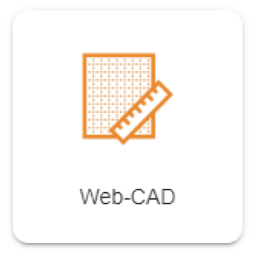

	

    

	
Benutzerhandbuch

	
Web-CAD

    
Browser / App

    

    

    

    
Windows / macOS / Linux / iOS / Android

    
ab Version 8.0

    

    

        
Erstellt von Plan-Vision GmbH

    	
Version 1.3 &bull; Stand 04.07.2022

    	
Plan-Vision GmbH &bull; E-Mail: support@plan-vision.com &bull; Web: https://plan-vision.com

    

Deutsch | [English](../../../en/modules/graphics) | *Sie sind hier: [Home](../../../home) > [Benutzerhandbuch](../user-guide) > Web-CAD (Grafik)*

# Inhaltsverzeichnis

[toc]

# Version

**Aktuelle  Version:** 1.3

**Stand:** 04.07.2022

**Verfasser:** Plan-Vision GmbH

# Übersicht
Öffnen Sie die das Web-CAD (Grafik) Modul.

Aus dem Baum wählen Sie den Standort / Gebäude aus und aus der Übersicht wählen Sie die gewünschte Zeichnung aus. Mit Doppelklick machen Sie die Zeichnung auf. 

Mit Klick auf die Übersicht wird der Plan im **Lesemodus** aufgemacht. Mit Klick auf Bearbeiten wird der Plan im **Bearbeitungsmodus** aufgemacht.

## **Zeichnung in Lesemodus**

Im Lesemodus können Sie den Plan ansehen, die Referenzobjekte bearbeiten, Plan Drucken oder Exportieren und Informationen aus der Zeichnung anzeigen lassen.  Sie können in diesem Modus die Objekte auswählen und ihre Eigenschaften bearbeiten. Jedoch können Sie die Zeichnung nicht bearbeiten, d. h. die zeichnerischen Operationen sind deaktiviert.  Dieser Modus ist für die schnelle Übersicht, Auswertung und Druck gedacht. 

Die Ansichten wechseln Sie in dem Menü links oben. 

Auf der rechten Seite sind die Druck- und Export-Funktionen.

Diese Funktionen stehen auch in dem Bearbeitungsmodus zur Verfügung und werden dann separat in Details beschrieben. 

## **Zeichnungen in Bearbeitungsmodus**

In diesem Modus sind alle zeichnerische Funktionen vorhanden, wie auch alle Optionen, Funktionen und Bearbeitungsmöglichkeiten der referenzierten Objekte. Dafür öffnen Sie die Zeichnung in Lesemodus und dann klicken Sie auf den Button 'Bearbeiten'  - siehe Abbildung oben.

### Funktionsleiste

Die **Funktionsleiste** ist über dem Plan platziert und beinhaltet alle zeichnerischen Operationen, sowohl Auswahloptionen wie Einzelauswahl oder Auswahlrechteck, intelligente Auswahl nach bestimmten Kriterien etc.. Hier sind alle Tools für Bearbeitung der Grafik positioniert. Funktionen wie Export, mehrfache Bearbeitung der ausgewählten Geometrien, Druck mit Plankopf und Legenden etc. sind mit rechtem Mausklick aufrufbar. 

Die Leiste hat die folgende Kategorien:

### Shortcuts

Die meistbenutzen Funktionen und Operationen haben auch Shortcuts, die rechts neben dem Name stehen - wie auf dem Screenshot oben **Auswahlrechteck : B**. Mit Klick auf 'B' wird die Option aktiviert.

**Beispiel: **Die Shortcuts für Verschieben M, Kopieren C, Drehen R, Skalieren S, Spiegeln O.

> **Bemerkung: ** Kopieren und Einfügen geht auch über STRG+C und STRG+V

Dazu gibt es weitere Shortcuts von 0 - 10, die für die letzten 10 am meistgemachten Klicks. Mehr dazu in Abschnitt **Letzte**.

#### Auswahltool

Hier kann der Benutzer zwischen unterschiedliche Auswahloptionen wählen

* Einzelauswahl (Standardtool) - mit einem Klick wird das Objekt ausgewählt. Der Layer muss auswählbar sein. 
* Auswahlrechteck - alle Objekte unter dem gezogenen Rechteck werden ausgewählt. Dieser Tool aktivieren Sie mit Klick auf dem Button rechts.

Falls die Option aktiv ist, werden mehrere Auswahlmöglichkeiten angezeigt, wie z.B. Auswahl nach Typ. Standardmäßig ist *Auswahl aller Geometrien* aktiv.

> **Bemerkung:** Texte sind in dem System als Punkte auswählbar.

Mit dem ersten Klick setzen Sie den Anfangspunkt und mit dem zweiten Klick den Endpunkt. 

Die Auswahl sieht folgendermaßen aus und der Benutzer kann z.B. die Objekte in einem Schritt bearbeiten, exportieren, löschen, transformieren etc. Dazu stehen die Optionen die Bearbeitung in einer Tabelle oder in dem Formular durchzuführen. Hier können elegant mehrfache Änderungen in einem Schritt gemacht werden.

#### Zeichnen

Die zeichnerische Funktionen sind in diesem Menüpunkt aufgelistet und je nach vorhandenem Modul werden die Objekte ergänzt, damit der Benutzer direkt grafische Objekte erstellt, die direkt mit Referenzobjekten verknüpft werden. 

Ganz oben ist die letzte Aktion vorgeschlagen. 

> **Bemerkung: ** Für rein grafische Objekt wie Linie, Polygon, Text, Punkt, Bild ohne Datensatzobjekt (Referenzobjekt)  muss der Benutzer direkt in dem ersten Hauptmenü auf Polygon, Linie etc. klicken. Sonst findet der Benutzer das passende Objekt in den Untermenüs. 
>
> **Bemerkung 2: ** Die ausgewählte Ansicht ist wichtig für die richtige Erstellung der Objekte. Die neue Objekte müssen auf dem richtigen Layer gespeichert werden. Dafür sind die vordefinierten Ansichten da. Z.B. *BGF* für Geschosspolygon, *Raum* oder *Raumnutzung nach DIN 277* für Räume. 

Das Zeichnen ist abhängig von dem ausgewählten Objekttyp und Untertyp - zum Beispiel ob ein Polygon als freies Polygon (jedem Klick fügt neuen Punkt hinzu) oder als Rechteckt oder als Kreis etc. gezeichnet wird. 

Die Auswahl des Typs steht unten mittig und mit Klick kann der Benutzer die Form ändern oder direkt eine aus der Bibliothek eine gespeicherte Geometrie zeichnen. 

**Beispiel: ** Ein freies Polygon

**Beispiel: ** Ein Rechteck

Nachdem das Objekt platziert ist, muss der Benutzer das Objekt bestätigen. 

> **TIPP: ** Vor dem Bestätigen kann der Benutzer die Maßen, mit einfachem Klick auf die Maße, ändern oder das Objekt anpassen, z.B. zusätzlichen Punkt hinzufügen mit einfachem Klick und Ziehen der Linie - nur Objekte, die aus Polylinie bestehen. Zum Rechteck kann keinen Zusatzpunkt hinzugefügt werden.

Am Ende muss der Benutzer das Objekt bestätigen und danach auch **Speichern**. Vor dem Speichern kann der Benutzer noch weitere Objekte zeichnen. 

> **Bemerkung: **Beim Speichern wird das Erstellen eines Referenzobjektes angeboten, falls der Benutzer so ein Objekt aus dem Menü zum Zeichnen ausgewählt hat. 

Zum Beispiel bei Erstellung eines Raumes. Falls der Raum schon im System vorhanden ist, kann der Benutzer das Häkchen deaktivieren und den Raum dann verknüpfen. Für solche Beispiele schauen Sie bitte in dem Abschnitt **Anwendungsfälle**.

#### Transformieren

In diesem Menü sind die Funktionen zum Transformieren grafischer Objekte vorhanden. Die Referenzobjekte werden in Formular- oder Tabellenansicht wie alle anderen VisionR Objekte bearbeitet. 

> **TIPP: ** Beim ausgewählten Objekt kann der Benutzer mit LEERTASTE direkt das Referenzobjekt öffnen. Mit ENTER kann der Benutzter das grafische Objekt öffnen.

Die Funktionen, die hier vorhanden sind, sind nur auf ausgewählte Objekte anwendbar. Der Benutzer soll zuerst mindestens ein Objekt auswählen und dann die Funktion klicken. 

**Anpassen und Textposition setzen** sind Funktionen, die nur auf ein Objekt anwendbar sind, da die Änderung mehrerer Objekte nicht möglich ist. Jedes Objekt soll einzeln dann angepasst werden. 

Die restlichen Funktionen sind auch mehrfach anwendbar. 

**Beispiel Anpassen**. Die Punkte werden angezeigt und mit Ziehen kann der Benutzter die Punkte ändern oder neue Punkte hinzufügen. 

**Beispiel Verschieben**

 Mit dem ersten Klick wählen Sie den Startpunkt der Verschiebung und mit dem zweiten Klick setzen Sie das Objekt auf die gewünschte Position.

**Kombinieren** - falls mehrere Objekte gleiches Typs ausgewählt sind, kann der Benutzer diese kombinieren. Die Option wird erst dann angezeigt, sobald mindestens 2 Objekte ausgewählt sind.

**Beispiel Subtraktion zweier Polygone ** 

Von dem großen wird das kleine Polygon subtrahiert und das Ergebnis wird ein Polygon mit Ausschnitt sein.

#### Messung

Der Benutzer kann schnell Länge / Fläche oder Umfang abmessen. Dazu sind die folgenden Funktionen zur Verfügung.

Mit dem ersten Klick wird der Startpunkt gesetzt und mit jedem weiteren Klick noch einen Zusatzpunkt bis der Benutzer nicht mit Enter die Messung beendet hat. 

#### Letzte

In dem letzten Menü sind die letzten 10 am meistgenutzten Operationen gepackt. Das System sammelt diese und nummeriert die automatisch von 0 bis 10 und der Benutzer kann mit den Zahltasten direkt die Operation aufrufen. 

#### Fangoptionen

Die Fangoptionen werden angezeigt, sobald der Benutzer ein Objekt zeichnet oder transformiert.  Um diese Option zu nutzen, müssen die richtige Layer diese Option aktiviert haben. 

Diese werden oben mittig angezeigt und sind wie folgt definiert:

* Punktfang
* Linienfang
* Längenfang - die Länge ist in den Einstellungen einzugeben.
* Winkelfang - der Winkel ist in den Einstellungen einzugeben.
* Einstellungen - Anpassen der Länge und Winkel

Diese Option ist sehr hilfreich für die saubere Bearbeitung und Erstellung von grafischen Objekten. 

## Zusatzfunktionen

Die **Zusatzfunktionen** sind mit rechtem Mausklick aufrufbar und sind von der Auswahl abhängig. Falls Sie keine Objekte selektiert haben, sind dann einige Optionen wie *mehrfache Bearbeitung* nicht angeboten. 

 

Falls Sie Objekte ausgewählt sind:

> **Bemerkung:** Funktionen, die häufig benutzt sind werden auch in diesem Menu angeboten, wie Zeichnen oder Transformieren.  

### Mehrfache Bearbeitung in der Tabelle

Sobald mehrere Objekte ausgewählt sind, können diese in einer Tabelle zur Bearbeitung geöffnet werden. Die Bearbeitung erfolgt ganz wie in allen anderen VisionR Tabellen - über Bearbeiten kann der Benutzer das einzelne Objekt aufmachen oder mit ENTER die Zelle in der Tabelle bearbeiten. 

Diese Ansicht in Tabelle ist sehr hilfreich, falls nur bestimmte Objekte aus der Auswahl bearbeitet werden oder für die schnelle Bearbeitung der Objekte. 

**Beispiel: ** Mehrere Räume (Referenzobjekte) in Tabelle bearbeiten.

### Mehrfache Bearbeitung im Formular

Die ausgewählte Objekte können auch in Formular zur Bearbeitung geöffnet werden. Dann kann der Benutzer mit einer Änderung alle Objekte ändern. 

Vor dem Speichern wird der Benutzer ausdrücklich danach gefragt. 

### Zwischenablage

Hier kann der Benutzer ausgewählte Objekte Kopieren und Ausschneiden. Es gibt die Shortcuts *STRG+C* und *STRG+X*.

### Generieren

Hier kann der Benutzer z.B. eine neue Referenz zu einem grafischen Objekt erstellen, oder aus geschlossenen Linien ein Polygon erstellen lassen, bestimmte Aktionen ausführen, die für die vorhandenen Module wichtig sind etc..

### Speichern

In diesem Menü sind Optionen wie Kopieren, Verschieben nach anderem Plan, Layer oder Speichern der Geometrie für spätere Wiedernutzung. 

Beim Speichern der Geometrie muss der Benutzer auch einen Namen vergeben. Beim Kopieren / Verschieben muss die Zeichnung und den Layer eingegeben werden. 

**Beispiel: ** Speichern einer Geometrie in der Bibliothek. 

Die gespeicherte Geometrien stehen zur Auswahl beim Zeichnen in dem Auswahlmenü des Typs. 

### Ausführen

In diesem Untermenü sind Druck und Export Funktionen vorhanden. Diese sind auch in dem Hauptmenü oben rechts vorhanden. 

## Layergruppen

Die Layergruppe beinhaltet die Einstellungen der eingeschalteten Layer. Die Layer sind standardmäßig versteckt, können nach Bedarf sichtbar gemacht werden und ggf. bearbeitet. 
Die vordefinierten Layergruppen sind nach Themen unterteilt, können aber immer wieder erweitert. 

Auf die Abbildung ist die aktive Layergruppe *Raumnutzung nach DIN 277 (Vorgabe)* und die Räume sind nach den eingegebenen Nutzungen eingefärbt. Diese Layergruppe ist als Vorgabe gesetzt. 
In dieser Layergruppe sind die **Räume** auswählbare Objekte, weil die Raumnutzungen in dem Raum festgelegt werden. 

Eine Layergruppe hat folgende Eigenschaften:

* Welche Layer sind *sichtbar*
* Welche Layer sind *auswählbar* - nur Objekte aus diesen Layer werden beim Auswahl selektiert. 
* Welche Layer sind in *Fangmodus* - der Fangmodus ist ein wichtiges Tool für präzises Zeichnen. Objekte, die Fangmodus aktiv haben, werden beim Zeichnen gefangen. 
* Welche Layer sind *editierbar* - nur Objekte aus diesen Layer können editiert werden. 
* Welcher Layer ist *aktiv* - wenn neue Objekte gezeichnet werden, unabhängig von dem Typ, werden diese auf dem aktiven Layer gespeichert. Hat man keinen aktiven Layer in der Layergruppe, werden die neu gezeichneten Objekte nicht gespeichert.
* Was für *Stil* hat der aktive Layer (für Admins) - der aktive Layer kann einen benutzerdefinierten Stil haben, sodass die Objekte unterschiedlich oder nach bestimmten Kriterien angezeigt werden.

Die Einstellungen sind ganz oben in der Layerliste als Button angezeigt. 

Mit Klick drauf werden die Layer und die Einstellungen angezeigt..

Pro Layer kann der Benutzer die Eigenschaften mit einfachen Klicks ändern. 

Mehrfache Einstellung - wie z.B. mehrere Layer auswählbar machen - ist erst nach der Markierung der Layer möglich. 

So kann in einem Schritt mehrfache Aktivierung / Deaktivierung der Eigenschaft gemacht werden. 

Mit Klick auf das Häkchen oben links werden alle Layer ausgewählt. 

**Layerposition ändern** - Der Benutzer kann ausgewählte Layer nach oben oder nach unten verschieben. Das hat Auswirkung auf die Transparenz der Objekte. Der erste Layer oben ist ganz unten, der letzte ist ganz oben. 

**Fangoption** - Die Fangoption gibt an ob die Objekte aus diesem Layer beim aktivieren Fang (beim Zeichnen / Transformieren) berücksichtigt werden. 

**Aktiver Layer** - Es kann nur ein Layer aktiv sein. Beim Zeichnen werden die neuen Objekte auf diesem Layer gespeichert. 

### Beispiele vordefinierter Layergruppen

> **CAD:** Hier werden nur die Objekte aus der importieren Zeichnung angezeigt. Die reine CAD Zeichnung ist ein bisschen bereinigt, um bessere Ansicht für ein CAFM System zu erzielen. Auf der Abbildung sind Bemaßungen, Achsen etc. ausgeblendet. Dies können jederzeit wieder eingeschaltet werden. Auf der linken Seite sind die Layer angezeigt. Alle *A-..* Layer sind in dieser Layergruppe sichtbar, auswählbar und editierbar. Das heißt, dass mit dem Auswahltool alle sichtbare Objekte ausgewählt und bearbeitet werden können. 

> **BGF:** *Voraussetzung: Modul "Flächenmanagement"* 
> Hier wird nur das Geschoss auswählbar und editierbar sein, das über die CAD Zeichnung gezeichnet sind. Das Geschosspolygon gibt uns die gesamte Geschossfläche und deshalb ist diese Layergruppe dafür vordefiniert. BGF - Brutto Geschoss Fläche. Das Geschosspolygon wird zuerst auf die Zeichnung gezeichnet, weil er den kompletten Plan umfasst. Die Räume, die auf das Geschosspolygon gezeichnet sind, werden automatisch zu dem Geschoss durch die Überlappung zugeordnet. 

Auf der linken Seite sind wieder die Layer angezeigt. Die Layer-Konfiguration ist wie folgt:
* **sichbar** - alle Wände, Möbel, Anlagen wie Aufzüge, Rolltreppen, Türe, Fenster, Sanitär etc. - die Zeichnung soll ziemlich sauber für das Zeichnen von dem BGF Polygon aussehen.
* **auswählbar** - nur das Geschosspolygon, das auf dem Layer *FM-Polygon-BGF* gezeichnet ist. Dieser Layer ist standardmäßig für die FM (Facility Management) BGF vorgesehen. 
* **editierbar** - nur das Geschosspolygon, das auf dem Layer *FM-Polygon-BGF* gezeichnet ist. Theoretisch kann man mehrere Geschosspolygone haben, aber es macht keinen Sinn.
* **Fangmodus** - Alle Wände sind mit aktivem Fangmodus, weil nur diese spielen eine Rolle beim Zeichnen eines Geschoss-Polygones
* **Layer aktiv** -  *FM-Polygon-BGF* ist als aktiv gesetzt. Neu gezeichnete Objekte werden auf diesem Layer gespeichert. Deshalb ist diese Layergruppe die passende, wenn Sie BGF Polygon zeichnen.

> **Raumnutzung nach DIN 277:** *Voraussetzung: Modul "Flächenmanagement"* 
> Hier werden nur die Räume auswählbar und editierbar sein, die über die CAD Zeichnung gezeichnet sind. Diese Räume sind mit einem Raumdatensatz verknüpft. Die Räume werden hier "nach der Nutzungsfarbe des Raums" gefärbt, damit der Benutzer besseren Überblick hat, wo was für Räume sind. 

> **Arbeitsplatz:** *Voraussetzung: Modul "Flächenmanagement"* 
> Hier werden nur die Arbeitsplätze auswählbar und editierbar sein, die über die CAD Zeichnung gezeichnet sind. Dazu sind die Personen, die auf diese Arbeitsplätze sitzen angezeigt. Diese Arbeitsplätze sind mit einem Arbeitsplatz-Datensatz verknüpft. Die APs liegen innerhalb bestimmten Räume. Deshalb ist es wichtig, dass der Raum gezeichnet ist, dann der Arbeitsplatz, damit diese Zuordnung gewährleistet ist. Die Arbeitsplätze werden standardmäßig in dieser Layergruppe "lila" gezeigt. Sie sind als Polygone über die Möbel (Tisch und Stuhl) gezeichnet und sind ein bisschen durchsichtlich. 

Auf der linken Seite sind wieder die Layer angezeigt. Die Layer-Konfiguration ist wie folgt:
* **sichtbar** - alle Wände, Möbel, Anlagen wie Aufzüge, Rolltreppen, Türe, Fenster, Sanitär etc. - die Zeichnung soll ziemlich sauber für das Zeichnen von Arbeitsplätze aussehen.
* **auswählbar** - nur die Arbeitsplätze, die auf dem Layer *FM-Arbeitsplatz* gezeichnet sind. Dieser Layer ist standardmäßig für die FM (Facility Management) Arbeitsplätze vorgesehen. Deshalb werden nur Objekte aus diesem Layer ausgewählt.
* **editierbar** - nur die Arbeitsplätze, die auf dem Layer *FM-Arbeitsplatz* gezeichnet sind. Vorgesehen ist, dass nur diese Objekte in dieser Layergruppe zu bearbeiten sind. 
* **Fangmodus** - Alle Möbel sind mit aktivem Fangmodus, weil nur diese spielen eine Rolle beim Zeichnen eines Arbeitsplatzes
* **Layer aktiv** -  *FM-Arbeitsplatz* ist als aktiv gesetzt. Neu gezeichnete Objekte werden auf diesem Layer gespeichert. Deshalb ist diese Layergruppe die passende, wenn Sie Arbeitsplätze zeichnen.

# Drucken / Export

## Drucken als PDF

Der Benutzer kann den Plan in Lese- und in Bearbeitungsmodus drucken. Es wird tatsächlich das ausgegeben, was in dieser Layergruppe / Ansicht sichtbar ist.

Beim Drucken wird ein Fenster mit Optionen zum Druck angezeigt. 

Die wichtigste Einstellung ist der Modus. Ob alles, Ausschnitt, Sichtfeld oder Auswahl (nur selektierte Objekte) kann der Benutzer vor dem Drucken entscheiden. 

### Alles 

### Sichtfeld

Alles was sichtbar ist - abhängig vom Zoomfaktor. 

### Ausschnitt 

Ein Druckpolygon kann über einen Bereich gezogen und gespeichert werden. Dann kann beim Drucken wieder als Ausschnitt benutzt werden, um einen ganz präzisen Bereich des Plans auszugeben.

**Step 1** - Druckpolygon zeichnen

**Step 2** - Druckpolygon speichern und benennen. 

**Step 3** - in dem Feld Modus muss das Polygon ausgewählt werden und beim Ausdruck kommt nur diesen Ausschnitt aus. 

> **TIPP: * Falls das Druckpolygon vor dem Druckfenster ausgewählt ist, wird es direkt beim Auswahl von *Ausschnitt* eingetragen.

Die Optionen **DPI**, **Skalieren**, **Ausrichtung**, **Drehung** sind ziemlich eindeutig. 

Zusatzfunktion wie **Übernehmen von** ist für Übernahme eines gespeicherten Druckes einer anderer Zeichnung. Hier kann der Benutzer die Zeichnung als Vorlage nutzen. 

## Export

Die Exportfunktion ist wie Druck als PDF mit der freien Eingabe der Dateierweiterung. 

## Export mit Vorlage

Diese Funktion bietet die Möglichkeit eine Vorlage für Rahmen / Plankopf zu nutzen. Diese Vorlagen sind vordefiniert und können dynamisch angepasst oder sogar kundenspezifisch von dem Kundenadministrator angepasst werden. 

Die Vorlagen sind für die unterschiedlichen Papiergrößen und Ausrichtung unterschiedlich und dieser Unterschied ist nach hinter der Vorlage gegeben - wie z.B. Bodenbeläge PDF/A3/L - Ausgabeformat PDF, Papiergröße A3, Ausrichtung - Querformat (aus dem Englischen Landspace).

> **Bemerkung: ** Wichtig ist es bei der Auswahl, dass die passende Vorlage für die aktive Ansicht ausgewählt wird - zum Beispiel Bodenbeläge nur wenn die Ansicht "Bodenbeläge" ist, Raumnutzungen nur wenn die Ansicht Raumnutzung nach DIN 277 ist etc..

**Beispiel Raumnutzungen DIN 277 - PDF / A3 / Querformat**

Hier wäre A2 besser passend gewesen damit die Tabelle nicht den Plan bedeckt. 

# Anwendungsfälle

## Wand hinzufügen / verschieben
Sehr oft muss eine Wand wegen einer Umbau hinzugefügt oder verschiben werden. Die Wände sind als Linien gezeichnet und diese kann der Benutzer in der passenden Ansicht bearbeiten. Die neue Wände sollen wieder in einer passenden Ansicht erstellt werden, damit diese auf dem richtigen Layer gespeichert werden. 

**Beispiel passender Ansicht**

Die wände hier sind grün angezeigt und diese können ausgewählt werden. Dazu ist der aktive Layer "Wand-nicht-definiert".

Eine neue Wand zeichnet man als 2 Linien. 

 

**Beispiel**

Nach dem Zeichnen müssen die Linien bestätigt und gespeichert werden. Diese werden auch grün angezeigt, da diese auf dem Layer "Wand-nicht-definiert" sind und dieser mit diesem Still verknüpft ist (Objekte werden einfach grün angezeigt für bessere Übersicht).

Dann muss das Raumpolygon angepasst werden, damit zwei neue Räume entstehen. Dazu muss ein zweiter Raum erstellt werden.

## Raum anpassen / teilen / mit anderem Raum vereinigen

Eine richtige Ansicht wäre *Raum* oder *Raumnutzung nach DIN 277*.

Mit rechter Maustaste kann der Benutzer Endpunkte entfernen oder neue hinzufügen. 

Danach die Anpassung bestätigen und den neuen Raum zeichnen.

Anschließend müssen die Änderungen gespeichert werden. 

Umgekehrt von zwei Räumen einen Raum zu erstellen gibt es mehrere Möglichkeiten, wie z.B. den einen Raum löschen / beenden und das Polygon löschen. Dann den anderen Raum anpassen. 

## Arbeitsplatzmöbel zeichnen / verschieben / kopieren / anpassen

Die Arbeitsplatzmöbel sind in den meisten Fällen aus Linien. Die Bearbeitung erfolgt analog zu der Raumanpassung bei einer Wandverschiebung oder bei neuer Wand. 

Zuerst müssen die Linien angepasst werden, die die Möbel darstellen, danach das Arbeitslatzpolygon, falls die Form und Größe des Arbeitsplatzmöbels sich geändert haben.

## Arbeitsplatzpolygon anpassen

In einer passenden Ansicht wählen Sie den Arbeitsplatz und klicken Sie dann auf Transformieren -> Anpassen.

Anschließend die Änderungen speichern.

