

	

    

	
Benutzerhandbuch

	
Helpdesk

    
Browser / App

    

    
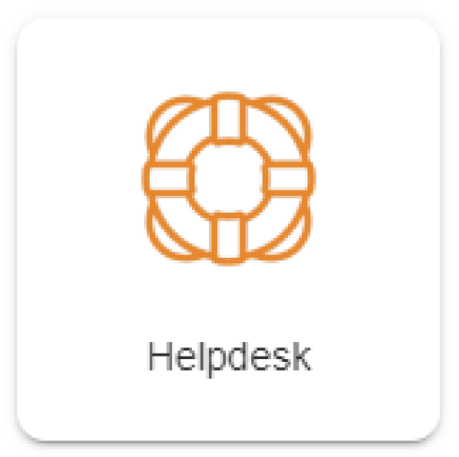

    

    
Windows / macOS / Linux / iOS / Android

    
ab Version 8.0

    

    

        
Erstellt von Plan-Vision GmbH

    	
Version 1.2 &bull; Stand 23.02.2022

    	
Plan-Vision GmbH &bull; E-Mail: support@plan-vision.com &bull; Web: https://plan-vision.com

    

# Inhaltsverzeichnis

[toc]

# Version

**Aktuelle  Version:** 1.2

**Stand:** 23.02.2022

**Verfasser:** Plan-Vision GmbH

# Helpdesk - Browser

## Allgemein

Das vorliegende Dokument beschreibt die Nutzung vom Modul Helpdesk für normale Benutzer auf einem Desktop-Computer (PC, Laptop oder Mac). Die Nutzung auf einem mobilen Gerät (Tablet PC, Smartphone)  ist im Dokument [Helpdesk - mobil](helpdesk-mobile) beschrieben. Mobile Geräte können speziell für die Aufnahme von Bildern bei Störmeldungen oder digitale Unterschriften mit dem Finger oder einem digitalen Stift genutzt werden. Die Dokumentation für die App "Helpdesk" ist mit Fokus auf die dynamischen Veränderungen bei Erstellung und Verfolgung von Meldungen erstellt worden. Die Verwaltung der Stammdaten und Workflows (Übersichten von Meldungsgruppen pro Gebäude, Standort, TGA usw.) ist im Abschnitt [Admin Helpdesk](../admin/helpdesk) beschrieben.

## Beschreibung

Das VisionR-Modul Helpdesk wird für die Verwaltung von Meldungen unterschiedlicher Art und die damit verbundenen Workflows benutzt. Es wird sowohl für die Verwaltung von Stammdaten wie meldungstypen, Standardmeldungen, Workflows usw., als auch als Tool für die Unterstützung dynamischer Veränderungen wie Eingabe von Störmeldungen mit oder ohne Bilder, Statusverfolgung abgegebener Meldungen, Dokumentieren von Tätigkeiten zur Behebung der Störung usw. Kameraaufnahmen der Störung und digitale Unterschriften an einem mobilen Gerät sind möglich.  Meldungen können für andere Personen erstellt werden. Eine Prüfung bereits vorhandener Meldungen warnt vor mehrfacher Eingabe der gleichen Störung.

Features im Überblick:

* Meldung **erstellen**
* **Detailinformationen** einer Meldung aufrufen
* Meldung **bearbeiten**
* Raum und/oder Anlage **im Plan** auswählen
* Übersicht **eigener** Tätigkeiten
* Übersicht **aller** Tätigkeiten
* **Tätigkeiten** zu einer Meldung erstellen und bearbeiten
* **Durchsuchen** von Meldungen, abhängig von den Zugriffsberechtigungen
* **Grafische Visualisierung** von Meldungen im Geschossplan
* **Kalenderansicht** der Meldungen nach Gebäude, Anlage oder Person

## Einstieg

Wenn Sie mobile VisionR App nutzen, werden Sie nach der Anmeldung automatisch auf die VisionR-Indexseite umgeleitet. Bei Nutzung des Browsers auf dem Desktopcomputer können die normalen Benutzer das Modul entweder über die Hauptadresse von VisionR auf der Registerkarte `Apps` *(siehe Bild 1)* oder direkt über den Link `https://[VisionR-Adresse]/forms#/main/helpdesk` aufrufen.

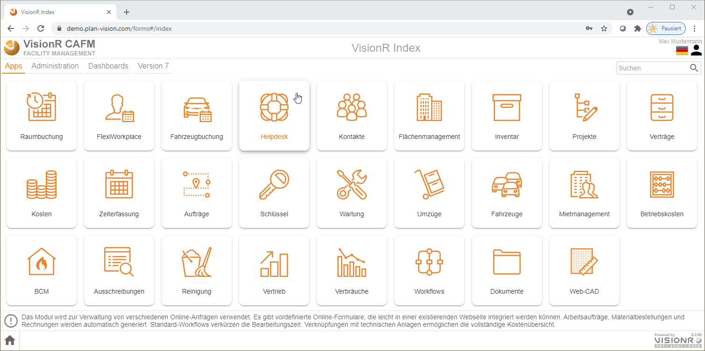

*Bild 1: Einstieg über die VisionR-Indexseite*

## Administration

Administrative Aufgaben, wie z. B. Bearbeitung von Workflows, Erstellung von Standardmeldungen, Problemklassen, Gewerke usw. sind im Abschnitt [Admin Helpdesk](../admin/helpdesk) beschrieben.

# Übersicht

## Anfang

Bei Aufruf der App Helpdesk wird automatisch die Liste mit Meldungen aufgemacht (siehe Bild 2). Die Zugriffsberechtigungen für die Meldungen werden von Workflows gesteuert, sodass nur die eigenen Meldungen und Meldungen mit Teilnahme des Users angezeigt werden.

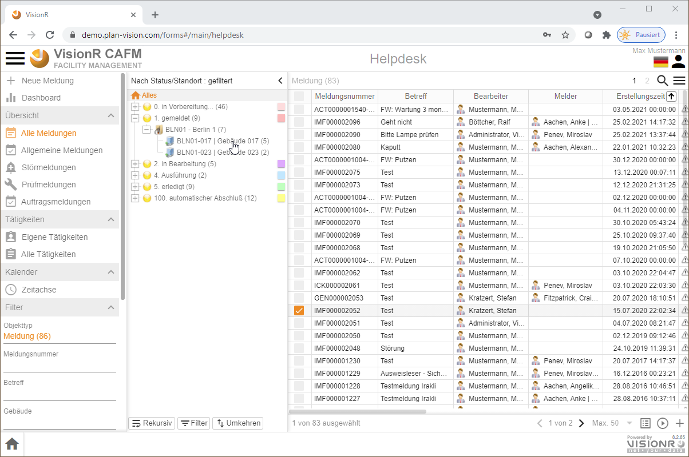

*Bild 2: Maske "Anfang"*

Im Datenbereich werden die Meldungen, auf die der User zugriff hat, angezeigt. Die aktuelle Hierarchie in der Baumansicht ist *Nach Status/Standort*. In der mobilen Ansicht wird standardmäßig eine Liste , in der Desktopversion eine Tabellenansicht angezeigt.

> **Hinweis:** Bei Klick auf einen Status, eine Liegenschaft oder ein Gebäude in der Baumansicht werden die Daten in der Tabelle automatisch gefiltert.

Nutzen Sie die Einträge im Hauptmenü, um andere Daten in der Tabelle anzeigen zu lassen.

Sie können die Zeilen in der Tabelle oder in der Liste nach Status oder nach anderen Kriterien einfärben lassen. Dazu gehen Sie auf die drei Striche oben rechts unter dem Benutzerlogo oder öffnen Sie das Kontextmenü mit Rechtklick im Datenbereich und gehen Sie anschließend auf den Menüeintrag *Hervorhebung > `Nach Status`*

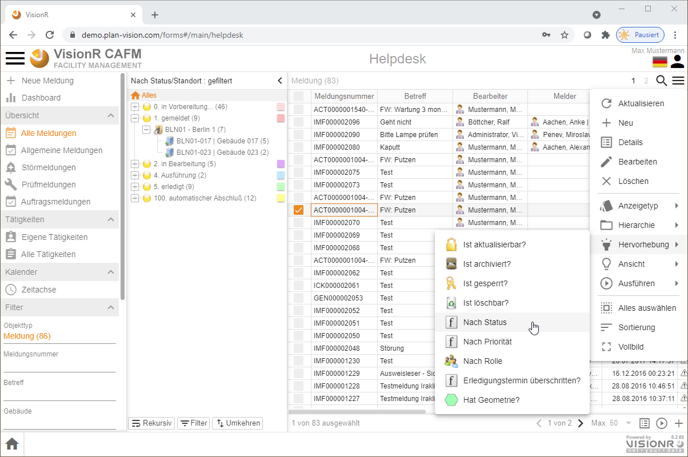

*Bild 3: Daten über Kontextmenü einfärben lassen z. B. nach Status*

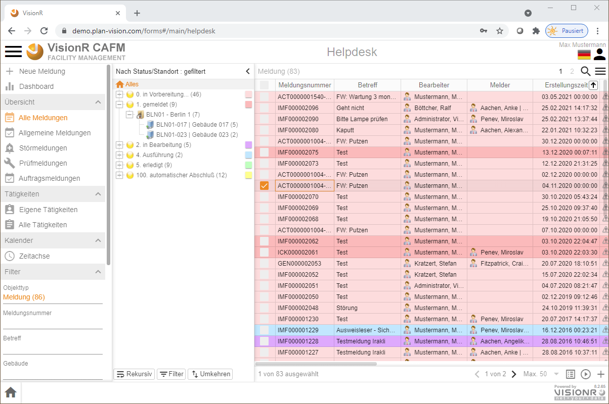

*Bild 4: Daten nach Status eingefärbt*

## Bedienung allgemein

Der Button mit den drei Strichen oben links öffnet das Hauptmenü. Das Menü ist auf mobilen Geräten aus Platzgründen automatisch versteckt. In der Desktopversion wird das Hauptmenü automatisch angezeigt. Abwechselndes Klicken auf den`Menü`-Button zeigt oder verbirgt das Menü, je nachdem welcher der aktuelle Status ist. Der `Menü`-Button ist auf allen Masken verfügbar. Durch Klick auf einen Menüeintrag in der Liste öffnen Sie die entsprechende Maske mit den in diesem Dokument beschriebenen Funktionalitäten. Der Name der aktiven Maske wird in orangener Farbe hervorgehoben.

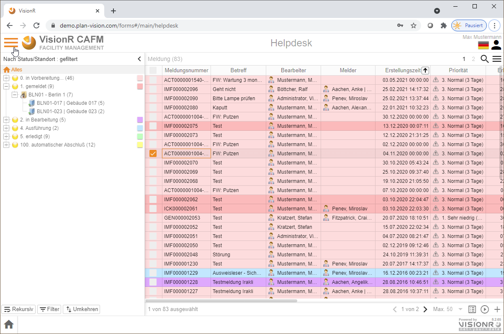

*Bild 5: Hauptmenü über die drei Striche neben dem Logo ein/aus* 

Ein Klick auf die Ikone  neben den drei Strichen oben links führt zur VisionR-Indexseite. Wenn Sie das Modul FlexiWorkplace verlassen und zur Indexseite springen möchten, müssen Sie auf den Button mit dem Häkchen zur Bestätigung klicken (siehe Bild 3). Bei Abbrechen bleiben Sie auf der aktuellen Maske.

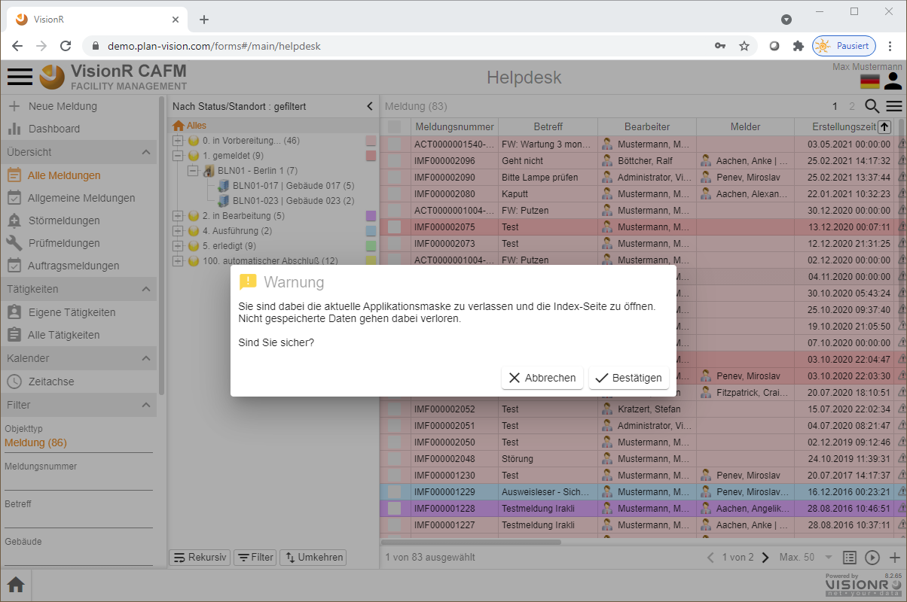

*Bild 6: Zur Indexseite zurückkehren* 

Bei Klick auf den `Home`-Button ganz unten links wird ein Menu mit den vorhandenen Apps angezeigt. Dieser Button ist nur in der Desktop App sichtbar. Mobil muss der Klick auf das Logo oben links verwendet werden. Bei Klick auf einen Menüeintrag werden Sie zur gewünschten App umgeleitet. Vorher muss das Verlassen der aktuellen App bestätigt werden (siehe Bild oben).

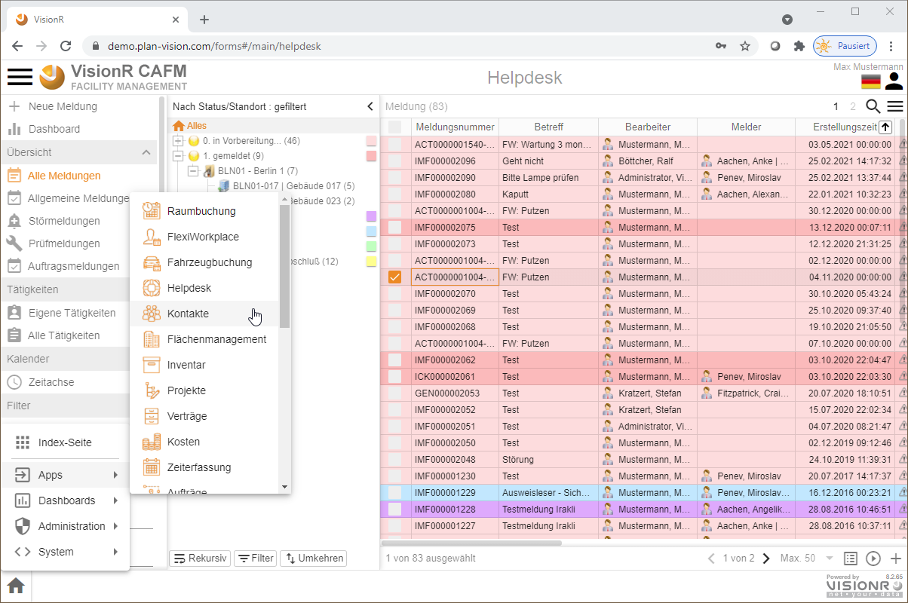

*Bild 7: Eine andere App direkt aufrufen*

# Meldung erstellen

Sie können mit der Erstellung einer neuem Meldung beginnen, indem Sie im Hauptmenü links den Eintrag `+ Neue Meldung` anklicken. Alternativ können Sie im Datenbereich mit der rechten Maustaste das Kontextmenü aufrufen und auf `+ Neu` gehen. Das Kontextmenü können Sie auch durch Klick auf die drei Striche unter dem Benutzerlogo oben rechts aufrufen. Eine weitere Möglichkeit für Neuerstellung bietet der Button `+` unten rechts in der Tabelle.

*Bild 8: Neue Meldung mit Klick auf `+ Neue Meldung` im Hauptmenü links*

Für die neue Meldung können Sie den Typ in einer Liste auswählen.

> **Hinweis:** Die Liste mit den Meldungstypen ist durch Customizing erweiterbar. Die unterschiedlichen Meldungstypen können unterschiedliche Eingabefelder mit Zusatzinformationen und Verknüpfungen enthalten.

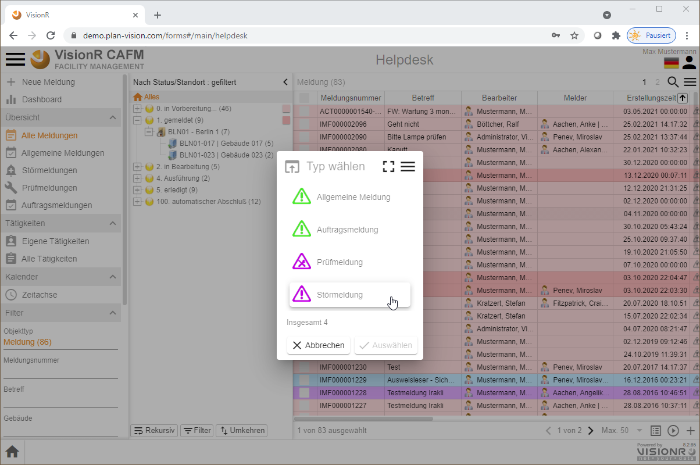

*Bild 9: Meldungstyp für die neue Meldung auswählen*

Nach Eingabe des Meldungstyps wird ein Formular für die Meldung angezeigt. Im unteren Bereich des Formulars werden Warnungen (orange) und Fehler (rot) angezeigt. Bei Klick auf die Warnung oder auf den Fehler wird das jeweilige Datenfeld fokussiert. Die Pflichtfelder müssen ausgefüllt werden.

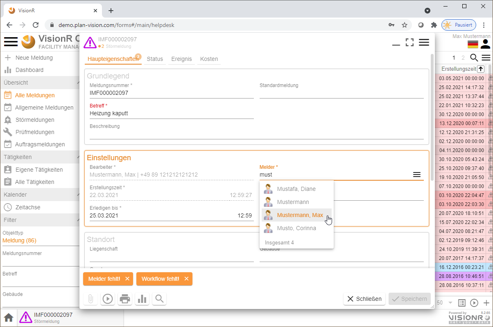

*Bild 10: Eingaben im Formular für die neue Meldung*

Bei der Eingabe von "Meldung für" oder "Raum" wird eine Systemprüfung im Hintergrund ausgeführt, die mögliche Doppelmeldungen vermeiden lässt. Eine Warnmeldung wird ausgegeben, die bereits vorhandene offene Meldungen anzeigt. Die Warnung kann geschlossen werden, um mir den Eingaben fortfahren zu können.

> **Hinweis:** Bei Eingabe im Feld "Meldung für" wird eine Meldung für eine andere Person erzeugt. Diese Person wird je nach Workfloweinstellungen benachrichtigt und bekommt die Meldung in der eigenen Meldungsliste angezeigt. Die Raumnummer der Person, falls in den Stammdaten vorhanden, wird automatisch in der Meldung eingetragen.

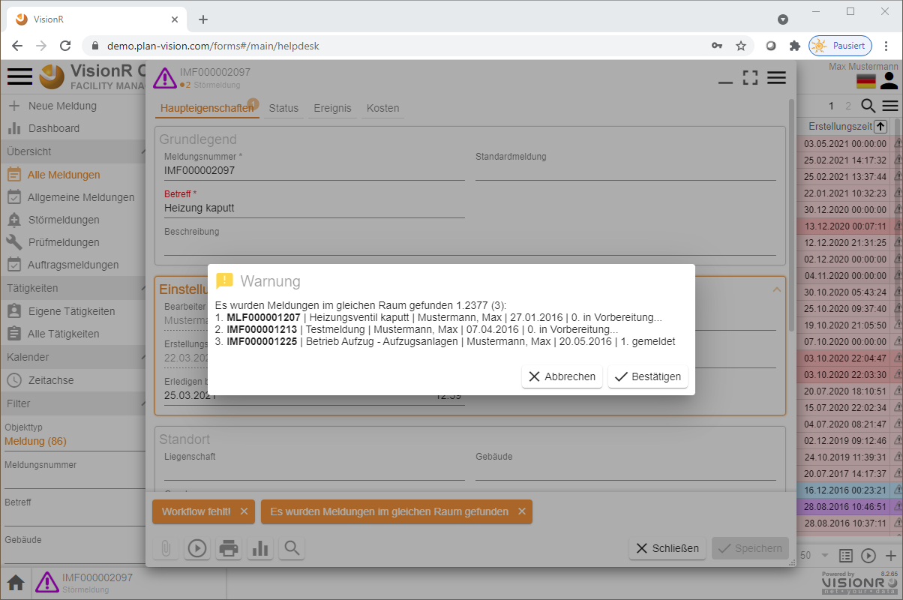

*Bild 11: Warnung bei existierenden Meldungen für Raum/Person*

Nach Eingabe der Meldungsdaten können Sie die neue Meldung speichern. Dadurch wird ggf. E-Mail an Sie an die Person im Feld "Meldung für" oder an Bearbeiter aus dem vordefinierten Workflow gesendet.

> **Hinweis:** Automatische E-Mail-Benachrichtigung werden von Helpdesk-Admins für Statusübergänge in den Helpdesk-Workflows definiert.

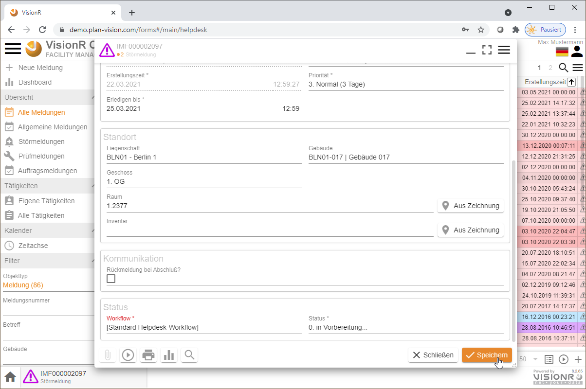

*Bild 12: Speichern der neuen Meldung*

# Raum oder Anlage im Plan auswählen

Bei der Erstellung einer neuen Meldung oder auch bei einer nachträglichen Bearbeitung der Meldung können Sie den Raum nicht nur alphanumerisch aussuchen, sondern auch die vorhanden Pläne nutzen, um den Raum oder die Anlage grafisch im Plan zu finden.

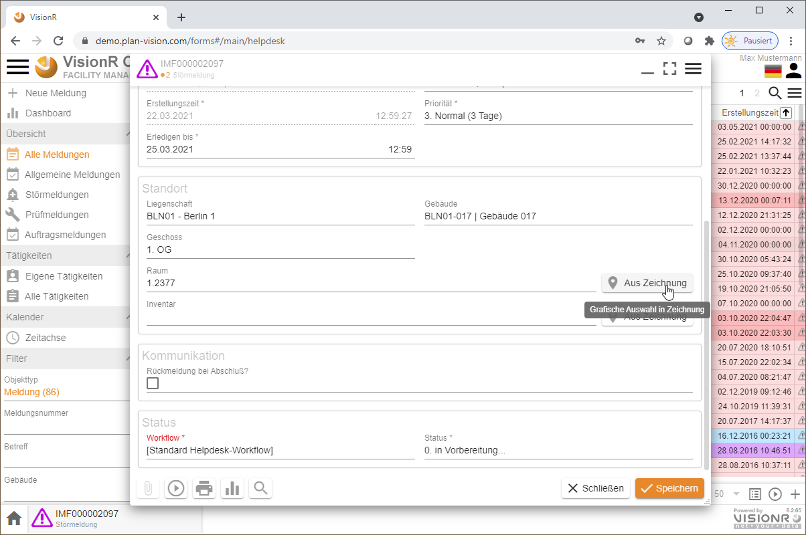

*Bild 13: Raum im Plan finden durch Klick auf `Aus Zeichnung`*

Bei Klick auf den Button `Aus Zeichnung` im Meldungsformular wir eine eine Auswahlmaske mit Plänen geöffnet. In der Maske können auf dem gewünschten Geschossplan den Raum durch zoomen finden und anklicken. Den ausgewählten Raum lassen Sie in das Feld "Raum" des Meldungsformulars eintragen, indem Sie auf den Button `Auswählen` unten rechts anklicken.

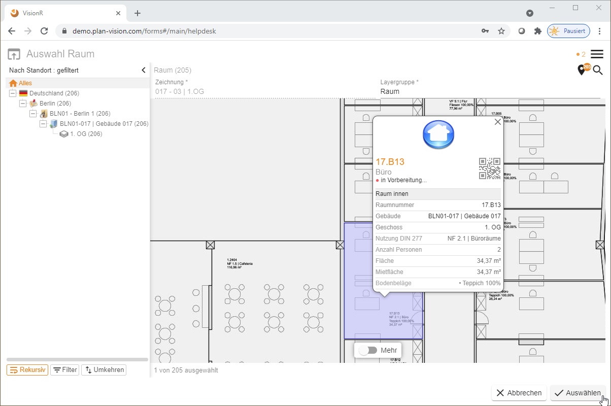

*Bild 14: Raum im Plan anklicken und dann auf `Auswählen` unten rechts*

Ähnlich wie die grafische Suche nach Räumen funktioniert die Auswahl von Inventar oder einer technischen Anlage im Plan. Dazu gehen Sie auf den Button `Aus Zeichnung` rechts vom Eingabefeld "Inventar". 

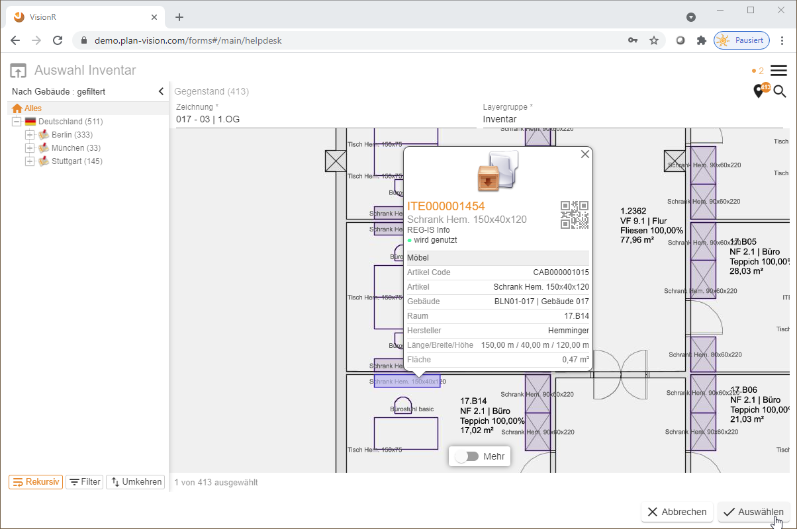

*Bild 15: Inventar/Anlage im Plan anklicken und dann auf `Auswählen` unten rechts*

In der Popup-Maske für die Auswahl im Plan können Sie die Zeichnung wechseln, falls die Meldung eine Anlage auf einem anderen Geschoss betrifft.

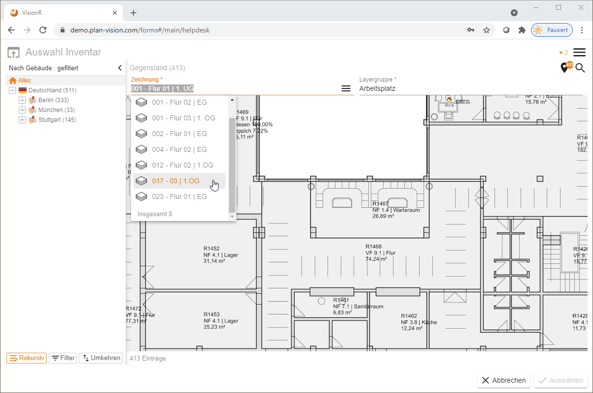

*Bild 16: Zeichnung bei der grafischen Auswahl von Raum/Inventar wechseln*

In der Auswahlmaske mit dem Plan können Sie die Ansicht (z. B. die Einfärbung oder die Beschriftungen und Text-Stempel) ändern, indem Sie auf den Dropdown "Layergruppe" gehen und dort eine andere Layergruppe anklicken. Die Dropdown-Liste enthält nur Layergruppen, die Inventar oder Räume zeigen.

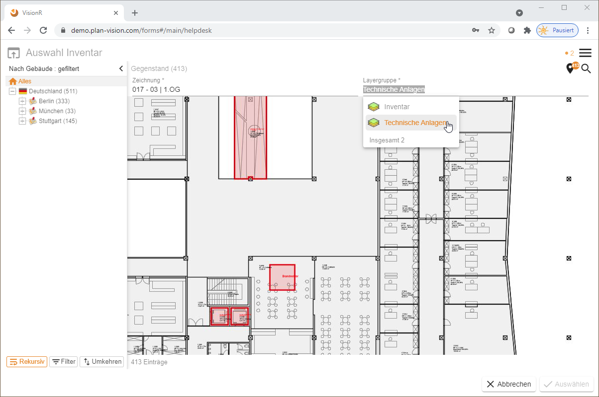

*Bild 17: Layergruppe bei der grafischen Auswahl wechseln*

# Detailinformationen aufrufen

## Detailansicht

In der Tabelle können Sie mit Doppelklick auf eine Zeile die Detailinformationen zum angeklickten Datensatz in einem Popup anzeigen lassen. Alternativ können Sie einen Datensatz in der Tabelle oder Liste auswählen und auf die `Leertaste` auf der Tastatur drücken.

Sie Können auch mehrere Datensätze gleichzeitig markieren: entweder durch Rechteckauswahl in der Tabelle oder durch setzen der Häkchen am Beginn der jeder Zeile oder durch die Tastenkombination `Strg + A` (alles auswählen). Bei der Mehrfachauswahl können Sie die `Leertaste` zum Aufruf der Detailansicht nutzen. Alternativ gehen Sie auf den Button `Details`  in der unteren rechten Ecke der Tabelle. Eine dritte Möglichkeit ist die Nutzung der Option `Details` im Datenkontextmenü, welches entweder mit Maus-Rechtsklick oder auf die drei Striche oben rechts unter der Personenikone geöffnet wird.

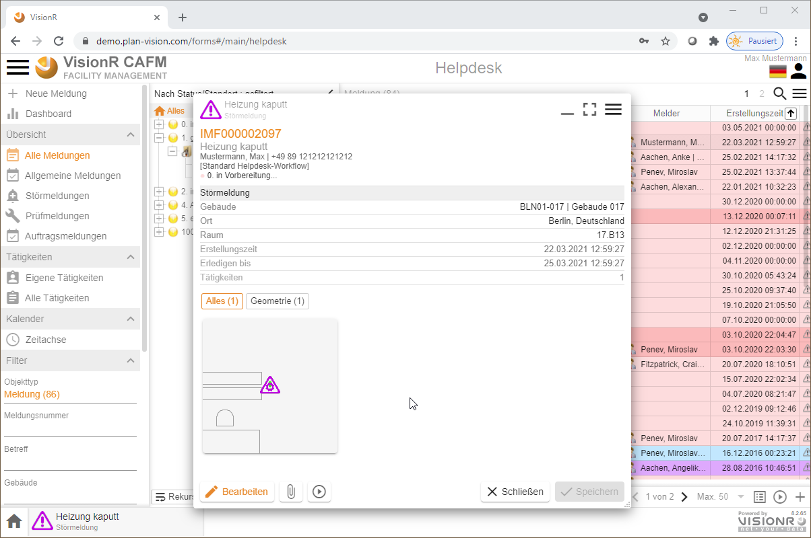

*Bild 18: Details-Ansicht einer Meldung mit Doppelklick auf die Zeile*

## Bearbeiten

Wenn Sie ein Datensatz mit Doppelklick oder über das Kontextmenü in der Details-Ansicht geöffnet haben, steht der Button `Bearbeiten`  zur Verfügung. Um den Datensatz im Bearbeitungsmodus zu öffnen können Sie entweder diesen Button nutzen oder in der Tabelle durch Aufruf des Kontextmenüs bei markiertem Datensatz auf den Eintrag `Bearbeiten` gehen. Das Kontextmenü ist immer entweder mit Rechtsklick oder auf die drei Striche unter der Personenikone erreichbar.

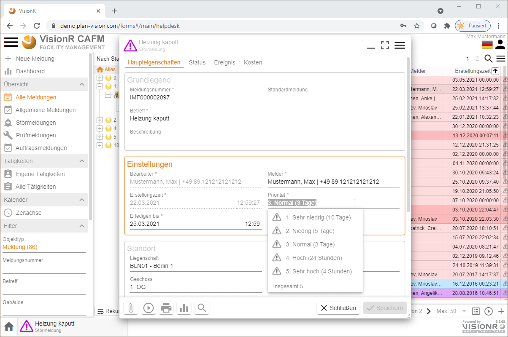

*Bild 19: Bearbeitungsmodus einer Meldung*

## Admin-Modus

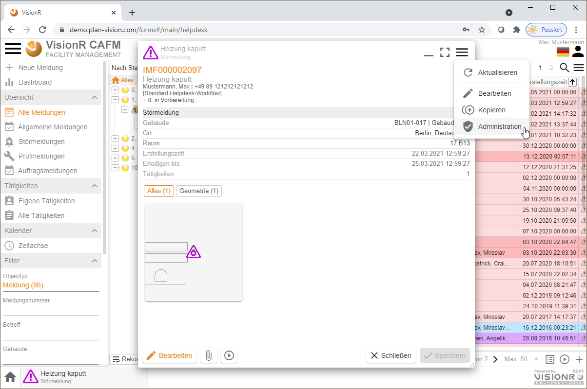

*Bild 20: Admin-Modus über Kontextmenü in "Details" oder "Bearbeiten" öffnen*

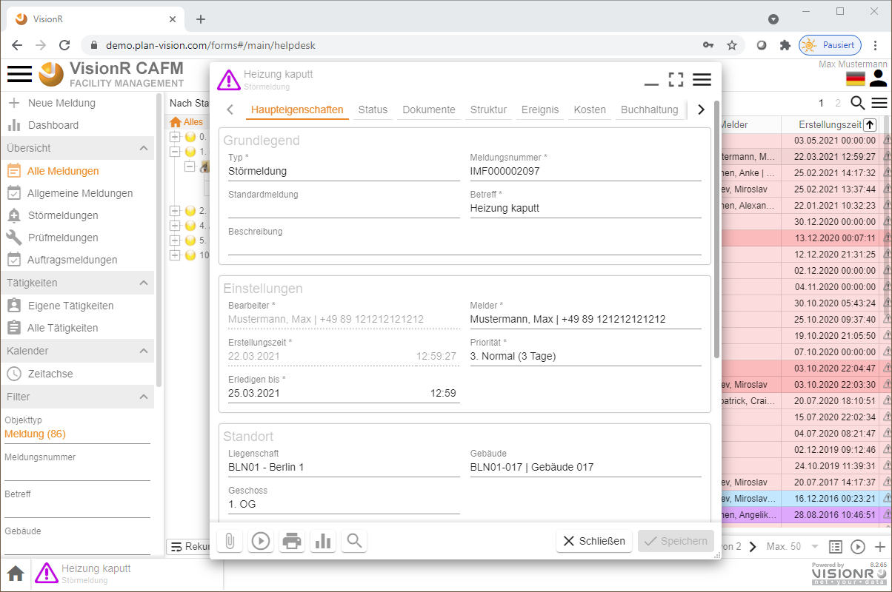

*Bild 21: Admin-Modus einer Meldung*

# Tätigkeiten für Meldungen

Im Modul Helpdesk können für die Meldungen mehrfach Tätigkeiten hinterlegt werden. Bei Prüfmeldungen werden die im Modul "Instandhaltung" definierte Leistungen verwendet, um die Art und Anzahl der an der Meldung angehängten Tätigkeiten zu definieren. Beim Erstellen von Störmeldungen wird standardmäßig eine Tätigkeit mit erstellt, die als Platzhalter für die Arbeiten rund um die Behebung der Störung zur Verfügung steht. Weitere Tätigkeiten durch verschiede Bearbeiter können jederzeit hinzugefügt werden, um die Störungsbehebung genau dokumentieren zu können.

## Übersicht eigener Meldungen

Um eine Liste der eignen mit Meldungen verbundenen Tätigkeiten aufzurufen, gehen Sie im Hauptmenü auf den Eintrag `Meine Tätigkeiten`.

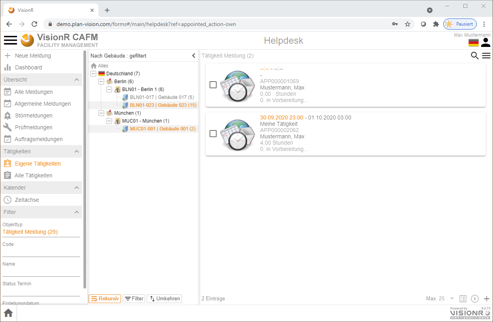

*Bild 22: Eigene Tätigkeiten*

## Übersicht aller Tätigkeiten

Um eine Liste der eignen mit Meldungen verbundenen Tätigkeiten aufzurufen, gehen Sie im Hauptmenü auf den Eintrag `Alle Tätigkeiten`.

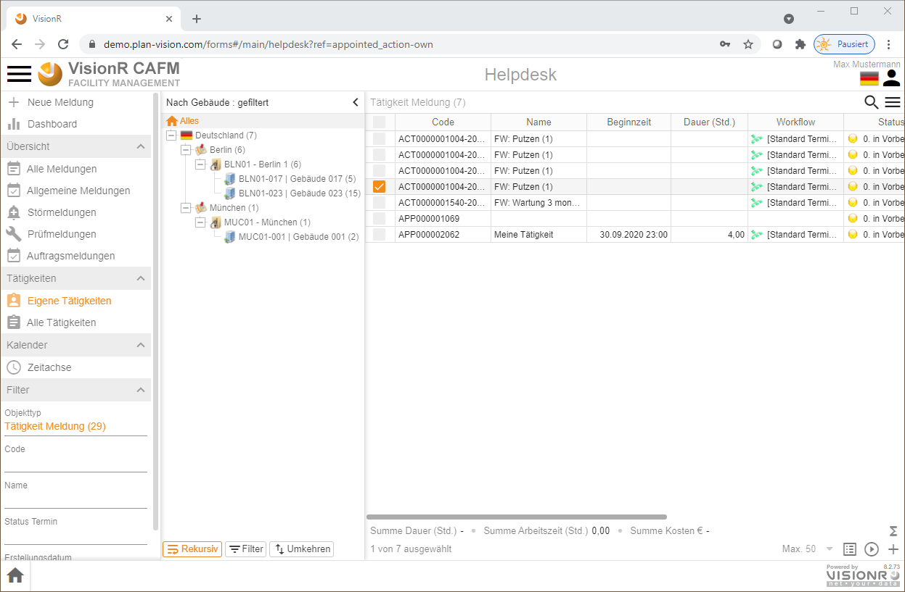

*Bild 23: Alle Tätigkeiten*

## Neue Tätigkeit erstellen

Öffnen Sie die Meldung, die bearbeitet werden soll. Gehen Sie auf den Reiten *Status > Tätigkeiten*. Klicken Sie auf die Tabelle mit der Maus. Gehen Sie auf den Button mit dem eigekreisten Plus. Bei Klick wir eine neue Tätigkeit zur geöffneten Meldung generiert. Im Popup können Sie die Details der Tätigkeit eingeben: Begin, Dauer, Tätigkeitsname usw.

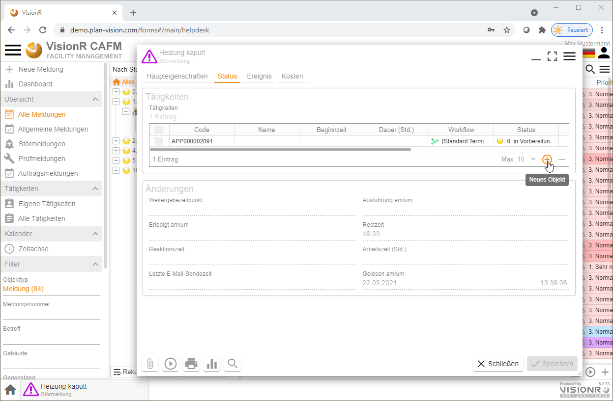

*Bild 24: Erstellen einer Tätigkeit in der Meldung*

## Tätigkeiten bearbeiten

Sie können eine Tätigkeit direkt in der Liste eigener oder aller Tätigkeiten mit Doppelklick öffnen. Alternativ können Sie eine Meldung öffnen und auf den Reiter *Status > Tätigkeiten* gehen und dort die gewünschte Tätigkeit doppelklicken. Alternativ nutzen Sie für die markierte Tätigkeit den Rechtsklick und danach `Bearbeiten` vom Kontextmenü. In der angezeigten Formularmaske müssen Sie die Pflichtfelder ausfüllen, bevor Sie auf `Speichern` gehen können. Fehlermeldungen sind im unteren Bereich des Popups in rot ersichtlich. Warnungen werden mit orangenem Hintergrund dargestellt und können auf das weiße Kreuzchen am rechten Ende ausgeblendet werden.

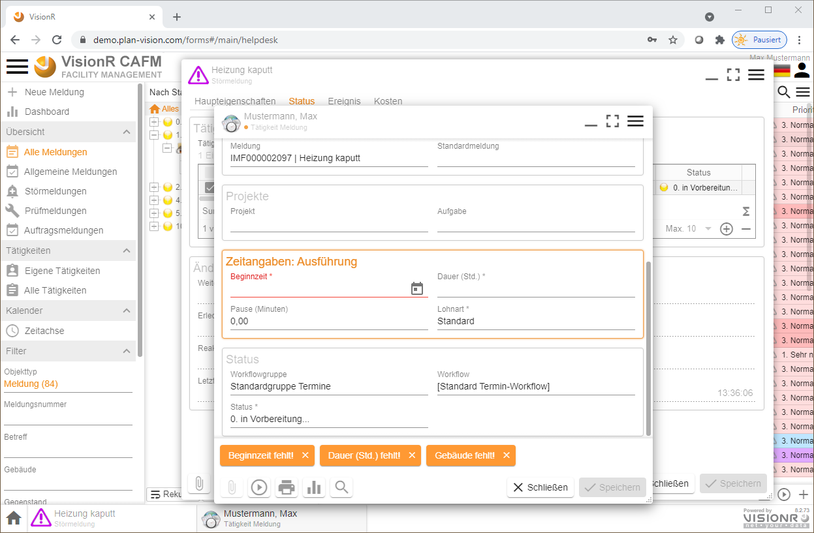

*Bild 25: Bearbeitung einer Tätigkeit in der Meldung*