

	

    

	
Benutzerhandbuch

	
Inventar

    
Browser / App

    

    
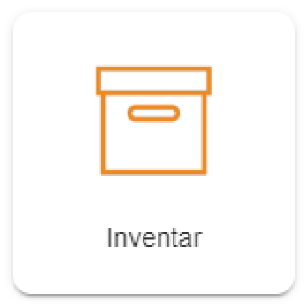

    

    
Windows / macOS / Linux / iOS / Android

    
ab Version 8.0

    

    

        
Erstellt von Plan-Vision GmbH

    	
Version 1.2 &bull; Stand 23.02.2022

    	
Plan-Vision GmbH &bull; E-Mail: support@plan-vision.com &bull; Web: https://plan-vision.com

    

# Inhaltsverzeichnis

[toc]

# Version

**Aktuelle  Version:** 1.2

**Stand:** 23.02.2022

**Verfasser:** Plan-Vision GmbH

# Inventar - App

## Allgemein

Das vorliegende Dokument beschreibt die Nutzung vom Modul Inventar für normale Benutzer auf einem Desktop-Computer (PC, Laptop oder Mac). Die Nutzung auf einem mobilen Gerät (Tablet PC, Smartphone)  ist auch möglich. Mobile Geräte können speziell für die Datenerfassung vor Ort genutzt werden (Gegenstände können direkt über QR / Barcode eingescannt werden, Raumnummern, Bodenbeläge usw.) oder bei Vorhandensein des Moduls Web-CAD für mobiles Zeichnen (z.B. Aufnahme von Gegenständen vor Ort). Die Dokumentation für die App "Inventar" ist mit Fokus auf die dynamischen Veränderungen erstellt worden. Die Verwaltung der Stammdaten (Auswertungen der Inventuren, Definition von Inventurvorgängen, diverse Einstellungen usw.) ist im Abschnitt [Admin Inventar](../admin/inventory) beschrieben. 

## Beschreibung
Das Modul **Inventar** wird für die Aufnahme, die regelmäßige Invetur und die Verwaltung (Sortierung / Gruppieren / etc.) der Inventargegenstände  verwendet. Bei der Verwaltung von Gebäuden ist die Inventur oder die Inventaraufnahme und Inventurdurchführung oft ein unmittelbarer Teil des Gebäudelebenszyklus.

## Einstieg
In diesem Modul werden die Inventargegenstände erstellt / eingegeben / bearbeitet / ausgewertet / protokolliert und ggf. zur weiteren Bearbeitung / Nutzung zur Verfügung gestellt. Zu den Vorteilen der Eingabe und Pflege von Daten innerhalb von VisionR zählt, dass alle Daten aller Module zusammenhängen. Das ermöglicht umfangreiche Auswertungen, die zur wesentlichen Verbesserung der Gebäudeverwaltung führen. 
Das Modul Inventar bietet Ihnen dafür vielfältige Möglichkeiten, zum Beispiel: die Merkmale der Gegenstände in Artikeln zu erfassen; Aufnahme von Gegenständen mit Einscannen von QR / Barcode; Planung und Durchführung von Inventuren nur mit Smartphone / Tablet / Scanner etc. ; die zentrale Datenpflege und Verwaltung und die Zuordnung der Gegenstände an VisionR- Objekten, wie Personen, Verträge, technische Anlagen, Räume und andere.

## Administration

Administrative Aufgaben sind im Abschnitt [Admin Flächenmanagement](../admin/invetoriy) beschrieben.

# Übersicht

## Anfang

Bei Aufruf der App Inventar  wird automatisch die Liste mit Gegenständen geöffnet (siehe Bild 2).

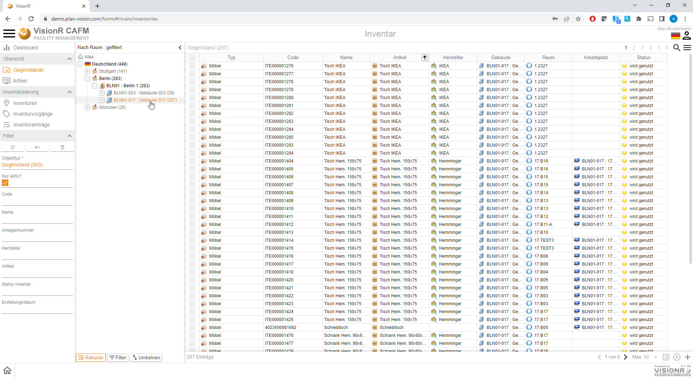

*Bild 1: Maske "Anfang" gefiltert nach Standort Berlin -> Gebäude 017*

Im Datenbereich werden die Gegenständen standardmäßig ohne Einfärbung angezeigt. Die aktuelle Hierarchie in der Baumansicht ist *Nach Standort*. Es werden alle Typen von Gegenständen angezeit.  In der mobilen Ansicht wird standardmäßig eine Liste, in der Desktopversion eine Tabellenansicht angezeigt.

> **Hinweis:** Bei Klick auf eine Liegenschaft oder ein Gebäude in der Baumansicht werden die Daten in der Tabelle automatisch gefiltert.

Nutzen Sie die Einträge im Hauptmenü, um andere Daten in der Tabelle anzeigen zu lassen, wie z.B. Artikel und ihren Attribute, Inventuren etc. 

## Bedienung allgemein

Der Button mit den drei Strichen oben links öffnet das Hauptmenü. Das Menü ist auf mobilen Geräten aus Platzgründen automatisch versteckt. In der Desktopversion wird das Hauptmenü automatisch angezeigt. Abwechselndes Klicken auf den`Menü`-Button zeigt oder verbirgt das Menü, je nachdem welcher der aktuelle Status ist. Der `Menü`-Button ist auf allen Masken verfügbar. Durch Klick auf einen Menüeintrag in der Liste öffnen Sie die entsprechende Maske mit den in diesem Dokument beschriebenen Funktionalitäten. Der Name der aktiven Maske wird in orangener Farbe hervorgehoben.

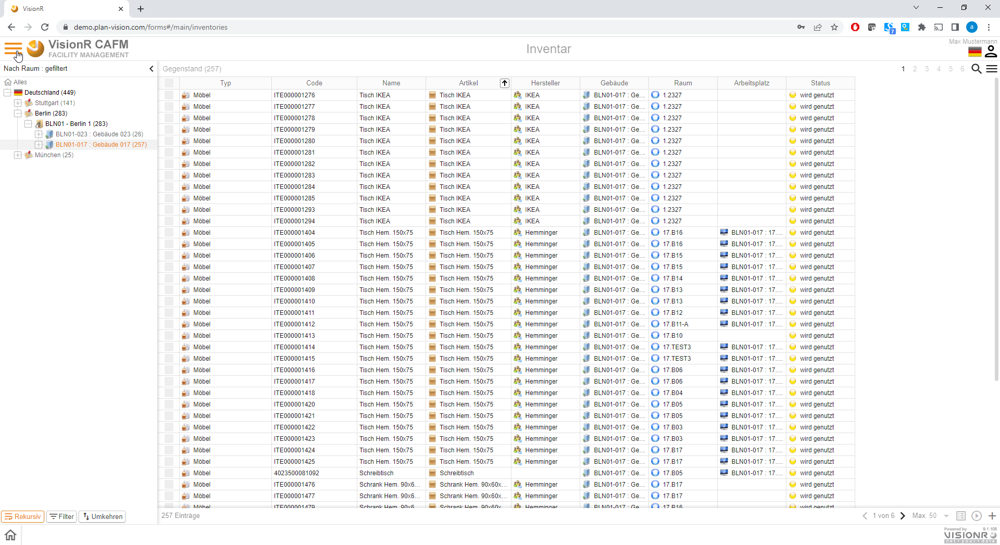

*Bild 2: Hauptmenü über die drei Striche neben dem Logo ein/aus* 

Ein Klick auf die Ikone  neben den drei Strichen oben links führt zur VisionR-Indexseite. Wenn Sie das Modul Inventar verlassen und zur Indexseite springen möchten, müssen Sie auf den Button mit dem Häkchen zur Bestätigung klicken. Bei Abbrechen bleiben Sie auf der aktuellen Maske.

Bei Klick auf den `Home`-Button ganz unten links wird ein Menu mit den vorhandenen Apps angezeigt. Dieser Button ist nur in der Desktop App sichtbar. Mobil muss der Klick auf das Logo oben links verwendet werden. Bei Klick auf einen Menüeintrag werden Sie zur gewünschten App umgeleitet. Vorher muss das Verlassen der aktuellen App bestätigt werden (siehe Bild oben).

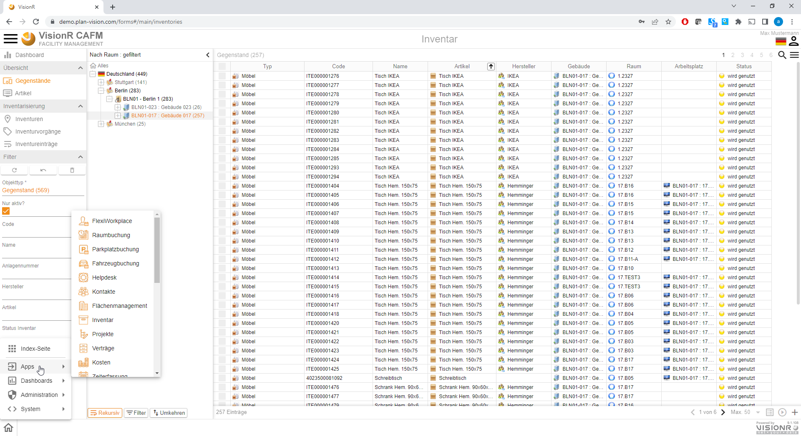

*Bild 3: Eine andere App direkt aufrufen*

# Detailinformationen aufrufen

## Detailansicht

In der Tabelle können Sie mit Doppelklick auf eine Zeile die Detailinformationen zum angeklickten Datensatz in einem Popup anzeigen lassen. Alternativ können Sie einen Datensatz in der Tabelle oder Liste auswählen und auf die `Leertaste` auf der Tastatur drücken.

Sie Können auch mehrere Datensätze gleichzeitig markieren: entweder durch Rechteckauswahl in der Tabelle oder durch setzen der Häkchen am Beginn der jeder Zeile oder durch die Tastenkombination `Strg + A` (alles auswählen). Bei der Mehrfachauswahl können Sie die `Leertaste` zum Aufruf der Detailansicht nutzen. Alternativ gehen Sie auf den Button `Details`  in der unteren rechten Ecke der Tabelle. Eine dritte Möglichkeit ist die Nutzung der Option `Details` im Datenkontextmenü, welches entweder mit Maus-Rechtsklick oder auf die drei Striche oben rechts unter der Personenikone geöffnet wird.

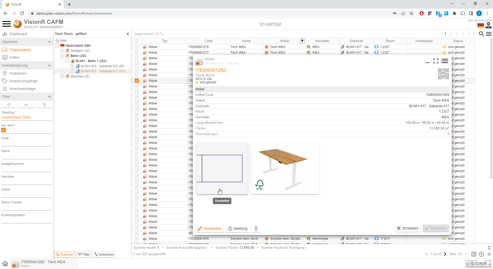

*Bild 4: Details-Ansicht eines Gegenstandes mit Doppelklick auf die Zeile*

Dieser IKEA Tisch ist auch auf dem Plan zu finden - das sagt uns der Ausschnitt aus der Grafik. Mit Klick drauf können Sie sehen, wo dieser Tisch sich befindet. 

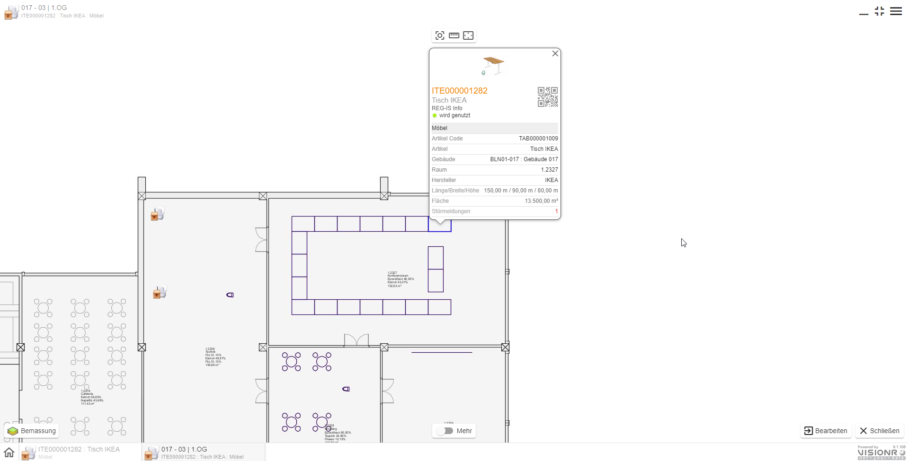

*Bild 5: Lokation auf dem Plan*

## Bearbeiten

Wenn Sie ein Datensatz mit Doppelklick oder über das Kontextmenü in der Details-Ansicht geöffnet haben, steht der Button `Bearbeiten`  zur Verfügung. Um den Datensatz im Bearbeitungsmodus zu öffnen können Sie entweder diesen Button nutzen oder in der Tabelle durch Aufruf des Kontextmenüs bei markiertem Datensatz auf den Eintrag `Bearbeiten` gehen. Das Kontextmenü ist immer entweder mit Rechtsklick oder auf die drei Striche unter der Personenikone erreichbar.

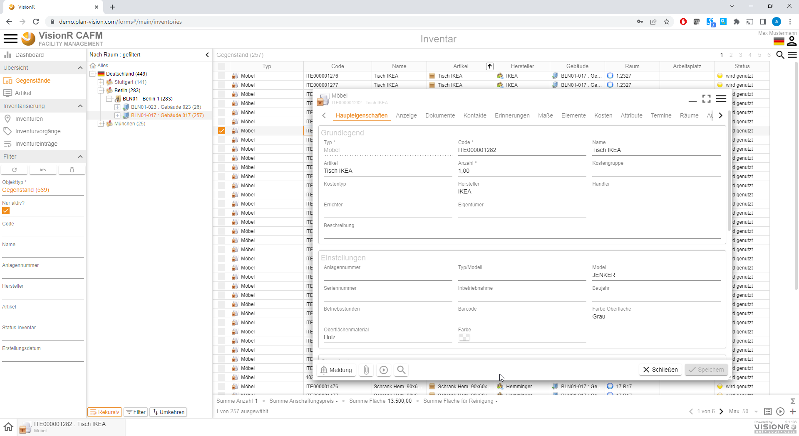

*Bild 6: Bearbeitungsmodus eines Gegenstandes*

## Admin-Modus

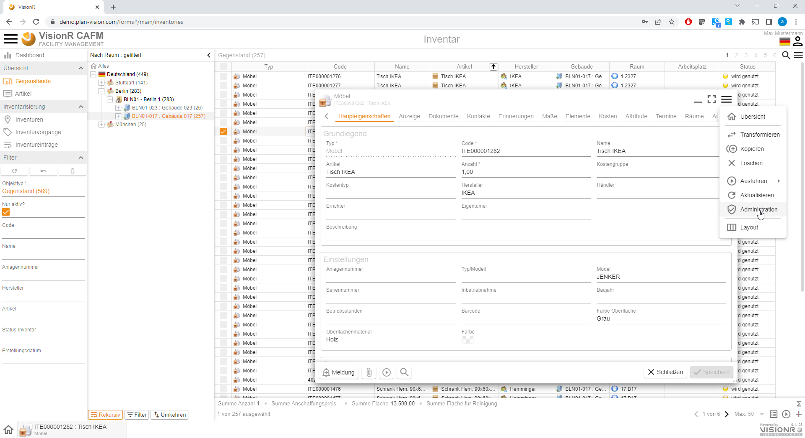

*Bild 7: Admin-Modus über Kontextmenü in "Details" oder "Bearbeiten" öffnen*

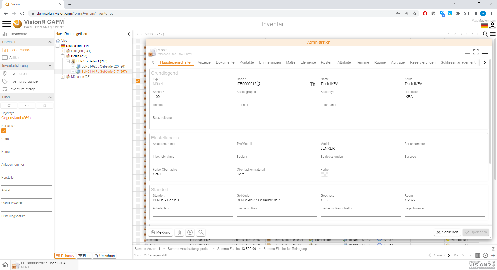

*Bild 8: Admin-Modus eines Gegenstandes*

# Tabelle anzeigen und auswerten

Bei öffnen der App des Moduls Inventar wir automatisch die Tabelle mit den Inventargegenständen angezeigt. Links im Hauptmenü ist der entsprechende Eintrag *Gegenstände* orange eingefärbt. Auf einem Mobilen Gerät wird eine Listen- und am Desktop eine Tabellenansicht angezeigt.

> **Hinweis:** Um die Ansicht der Daten zu ändern, gehen Sie im Kontextmenü auf die drei Striche oben rechts (unter der Benutzerikone), danach auf den Menüeintrag `Anzeigetyp`  und anschließend auf die gewünschte Ansicht.

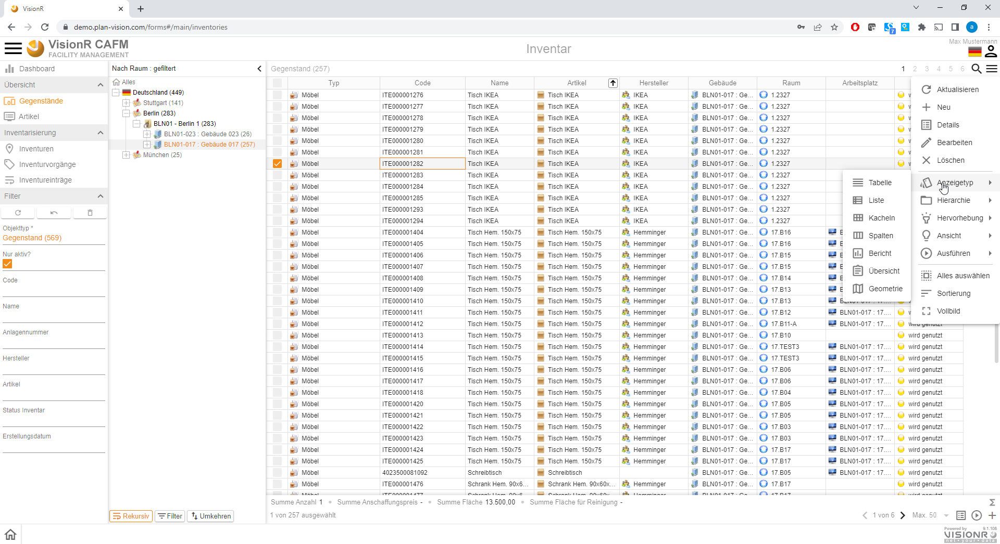

*Bild 9: Änderung der Gegenstände-Ansicht*

**Beispiel:** Kacheln mit Vorschau

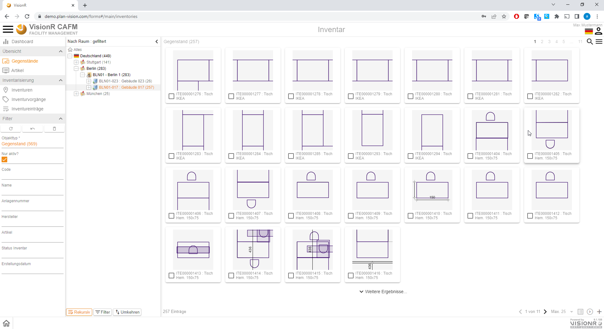

*Bild 10: Gegenstände-Ansicht Kacheln*

In der aktuellen Ansicht können Sie die Gegenstände nach der gewünschten Spalten sortieren, indem Sie auf die Spaltenüberschrift klicken. Abwechselnde Klicks ändern die Sortierreihenfolge. Sie können die Datensätze filtern, indem Sie die Baumansicht nutzen, oder den Button mit der Lupe oben rechts anklicken und einen Suchbegriff eingeben.

Wenn Sie einen oder mehrere Datensätze auswählen können Sie diese in einem Schritt bearbeiten, indem Sie auf `Bearbeiten` in dem Funktionsmenü klicken. Die ausgewählte Datensätze werden zur Bearbeitung angezeigt und Sie können direkt alle gemeinsam bearbeiten - sobald Sie etwas in einem Feld ändern, werden Sie beim Speichern gefragt, ob diese Änderung für das aktuelle Objekt oder für alle Objekte gültig ist. Dazu wird es im unteren Bereich Summenfelder angezeigt, die nach Modul und Objektdefinition unterschiedlich sind. Nach Wunsch kann jede Auswertung implementiert werden.

*Bild 11: Mehrfache Auswahl*

Ansicht mehrfache Bearbeitung.

*Bild 12: Mehrfache Bearbeitung*

**Beispiel** Summen aus dem Modul *Flächenmanagement:* Standardmäßig werden die wichtigsten Kennzahlen im Summenbereich angezeigt. Nach Kundenwunsch können zusätzliche Summenfelder eingebaut werden. Beispiel ist aus dem Modul Flächenmanagement, damit die Summen verständlicher sind. 

*Bild 13: Beispiel Summen aus Flächenmanagement - mehrere Zeilen auswählen und automatische Summen unten ansehen*

In der aktuellen Ansicht können Sie die Datensätze einfärben lassen indem Sie vorgegebene farbige Hervorhebungen nutzen. Dazu öffnen Sie das Kontextmenü (oben rechts) oder klicken Sie mit rechter Maustaste im Tabellenbereich.

*Bild 14: Kontextmenü mit rechter Maustaste, danach auf `Hervorhebung` - z.B. nach Artikelfarbe (falls gesetzt - wie siehe unten bei Artikeln)*

Als Ergebnis werden die Zeilen in der Tabelle per Datenbankabfrage dynamisch eingefärbt.

*Bild 15: Einfärbung der Daten nach Artikelfarbe*

# Neuen Gegenstand erstellen

## Gegenstand zeichnen und erstellen

Wenn Sie die Zugriffsrechte für das Modul Web-CAD besitzen, können Sie im Geschossplan einen neuen Gegenstand zeichnen. Bei Speichern wir der neue Gegenstand auch als alphanumerischer Datensatz im Modul Inventar angelegt. Es ist wichtig, dass vorher ein BGF-Polygon und ein Raum mit verknüpftem Geschossdatensatz vorhanden ist. Achten Sie auf die Bezeichnung der aktiven Layergruppe unten links in der Zeichnung. Diese muss "Inventar" / "Möbel" / Gegenstand heißen ggf. müssen Sie  eine der genannten Layergruppen oder eine andere geeignete Ansicht durch Klick auf den Layergruppen-Button auswählen. Öffnen Sie den gewünschten Plan im Web-CAD und klicken Sie auf den Button `Bearbeiten` unten links.

*Bild 16: Öffnen Sie den Geschossplan und gehen Sie auf `Bearbeiten` unten rechts*

Gehen Sie dann auf den Button mit dem Plus Zeichen im Zeichnungsmenü im mittleren oberen Bereich der Zeichnung und wählen Sie den Typ für den Gegenstand. In unserem Fall zeichnen wir einen Tisch aus Linien. Sie können zwischen Polygon / Linie / Punkt / Text / Bild etc. auswählen. Am besten eignen sich Linien für Möbelgegenstände und Polygone für Technische Anlagen / Geräte. Falls zum Beispiel die Tische bereinigt werden müssen, können Sie statt Linien Polygone benutzen, dann wird die Fläche der Tische auch automatisch in den Summen berechnet. So haben Sie immer die aktuelle Fläche zum Reinigen.

**Beispiel:** Wir zeichnen einen Tisch mit Länge 2 Meter und Breite 1 Meter in dem Raum darunter.  Fangoptionen *Längenfang* ist 0.5m und *Winkelfang* ist 15 Grad, damit wir 90 Grad einfacher erreichen. 

*Bild 17: Wählen Sie `Linie->Linie Gegenstand->Linie Inventar->Linie Möbel` im Menü oben in der Mitte*

**Bemerkung:** Hier wird mit dem geometrischen Objekt auch einen Gegenstand Datensatz erstellt. Falls Sie das Modul "Inventar" nicht haben, werden Sie diese Optionen nicht zur Auswahl haben. Dann können Möbel (zum Beispiel) als grafische Objekte aus einfachen Linien gezeichnet werden. Jedoch werden keine Auswertungen möglich sein. Inventargegenstand muss auch mit Daten befüllt werden. Diese sind dann auch über QR / Barcode Scan aufrufbar - mobil und mit paar Klicks. 

Sie können mit dem Zeichnen des Gegenstandes beginnen. Fangpunkte werden  an Ecken und Schnittpunkte oder entlang von Linien automatisch genutzt. Sie können zusätzlich Längen- oder Winkelfang im Menü oben mittig aktivieren. Sie beenden das Zeichnen entweder durch drücken der Eingabetaste oder durch Klick auf den Button mit dem Häkchen neben `Fertigstellen` unten mittig in der Zeichnung.

Fangoptionen *Längenfang* ist 0.5m und *Winkelfang* ist 15 Grad, damit wir 90 Grad einfacher erreichen. 

*Bild 18: Zeichnen eines Tisches mit Maus oder Finger - erste Linie setzen*

*Bild 19: Zeichnen eines Tisches mit Maus oder Finger - zweite Linie setzen*

Danach schließen wir den Rechteck zu.

Nach Fertigstellung haben Sie die Möglichkeit zusätzlich den gezeichneten Tisch zu korrigieren, indem Sie mit einfachen Mausklick neue Punkte erstellen und bewergen oder nicht gewünschte Punkte entfernen. Mausrechtsklick auf einen Punkt bietet die Möglichkeit "Eckpunkt entfernen" an.

*Bild 20: Tisch durch Zusatzpunkte korrigieren*

*Bild 21: Einen Punkt aus dem Tisch durch Entfernen von Punkten korrigieren (Mausrechtsklick auf Punkt)*

Nachdem Sie das Objekt (in diesem Fall den Tisch) gezeichnet und ggf. korrigiert haben können Sie auf das Häkchen neben `Bestätigen` unten in der Mitte gehen. Ein Klick auf das Kreuzchen bricht die Operation ab.

Alle gezeichnete Elemente sind nur temporär vorhanden. Die gezeichnete gegenstände und die dazugehörigen Einträge in dem Modul Inventar werden erst durch Klick auf den Button `Speichern` unten rechts in der Datenbank angelegt.

*Bild 22: Erst durch Klick auf `Speichern` werden die Daten erstellt*

Beim Speichern werden Sie danach gefragt, ob Sie den Datensatz Gegenstand zu dem grafischen Objekt mit erstellen möchten. 

*Bild 23: Referenz hinzufügen*

Fügen Sie kein Referenzobjekt hinzu, wird auch kein Gegenstand in der Tabelle angezeigt. 

Wird das Objekt gewünscht ohne Referenzobjekt erstellt, z.B. weil die Gegenstände importiert werden, kann das grafische Objekt auch später mit dem Datensatz verknüpft werden - siehe Abschnitt *Gegenstand mit Grafik verknüpfen*.

## Gegenstand aus der Bibliothek zeichnen

Sobald ein grafisches Objekt gespeichert ist, kann es auch in die Bibliothek aufgenommen werden. So kann es später direkt benutzt werden. Z.B. ein Tisch muss nicht jedes Mal gezeichnet werden, besonders um alles maßstabgerecht zu halten.

Führen Sie die Schritte von oben und bei der Auswahl der Linie Möbel vor dem Setzen des ersten Punktes klicken Sie unten auf das Menü mit den Formen des ausgewählten Typ (Linie).

*Bild 24: Gespeicherte Geometrie nutzen*

Mit Doppelklick auf *Gespeicherte Geometrie* öffnen Sie die Bibliothek mit den gespeicherten Geometrien (diese müssen zuerst gespeichert werden) und wählen Sie aus Ihrer Bibliothek ein Objekt aus. Z.B. 1er Arbeitsplatz.

*Bild 25: Gespeicherte Geometrie wählen*

*Bild 26: Gespeicherte Geometrie wählen*

Platzieren Sie die Geometrie und speichern Sie diese wie oben beschrieben. Fügen Sie eine Referenz hinzu, falls gewünscht.

**Bemerkung:** Bei nächster Auswahl gleicher Geometrie wird immer das letzte benutzte Objekt vorgeschlagen. Ändern Sie das, falls eine andere Form zeichnen möchten. 

## Gegenstand alphanumerisch erstellen

In manchen Fällen ist es sinnvoll einen Gegenstand ohne grafische Repräsentation in der Datenbank anzulegen. Diese Gegenstände können später mit grafischen Objekten verknüpft werden. Manchmal sind die grafischen Darstellungen von Gegenständen nicht wichtig, sondern ihre Anzahl, Lokation, Zustand etc.. Sie können die Verwaltung auch rein alphanummerisch machen. 

Öffnen Sie die Gegenstände Tabelle wie auf dem Bild 1 gezeigt ist. 

Dazu gehen Sie in der aktuellen Ansicht (Tabelle, Liste, Kacheln,...) auf den Menüeintrag `+ Neu`.

*Bild 27: Button `+ Neu` im Kontextmenü anklicken*

Wählen Sie anschließend den Inventartyp. 

*Bild 28: Inventartype auswählen*

Es wird ein Dialog für die Erstellung eines neuen Gegenstands angezeigt. Falls Sie in der Baumansicht ein gewünschtes Gebäude, Geschoss und Raum ausgewählt haben, werden diese im Formular automatisch eingetragen. Im unteren Bereich der Eingabemaske werden Warnungen in orangener und Fehler in roter Farbe angezeigt. Warnungen werden für nicht ausgefüllte  Pflichtfelder ausgegeben. 

*Bild 29: Tischdaten in den Formularfeldern eingeben - siehe Beispiel von oben*

Wenn Sie alle gewünschte Informationen eingegeben haben müssen Sie auf den Button `Speichern` unten rechts im Formular klicken, um den neuen Gegenstand in der Datenbank anlegen zu lassen. Bis dahin sind alle eingegebene Daten temporär. Alternativ können Sie mit Klick auf `Abbrechen` die Erstellung unterbrechen.

*Bild 30: Inventargegenstand speichern*

## Gegenstand mit Grafik verknüpfen

Sie können Gegenstände im Nachhinein mit einem grafischen Objekt verknüpfen. Das ist besonders nutzvoll, wenn die Stammdaten importiert werden und dann mit den grafischen Objekten verknüpft werden. 

Um ein grafisches Objekt mit einem Gegenstand zu verknüpfen, muss das grafische Objekt vorhanden oder gezeichnet werden. 
Öffnen Sie den Plan und navigieren Sie zu dem Raum wo der Gegenstand verknüpft werden soll. Wählen Sie den Gegenstand aus. 

*Bild 31: Grafisches Objekt auswählen und mit Referenzobjekt verknüpfen*

Mit Klick auf die Ikone in der Blase wird **das grafische Objekt** aufgemacht. Klicken Sie auf *Bearbeiten*  und in dem Feld *Inventar* wählen Sie den Inventargegenstand - z.B. den Tisch aus dem Beispiel davor "Tisch 200x100cm ABC123"

*Bild 32: Inventargegenstand verknüpfen - der Gegenstand muss im System vorhanden sein*

**Tipp:** Oft ist dieses Verknüpfen sinnvoll, besonders wenn die Gegenstände davor importiert sind und hier nur verknüpft werden müssen. Sobald ein Inventar mit einem Objekt verknüpft ist, wird er in der Liste hier nicht mehr angezeigt. Somit wird mit jeder Verknüpfung die Liste kürzer bis der letzte Gegenstand verknüpft ist. 

### Gegenstand mit Artikel verknüpfen

Sie können Gegenstände im Nachhinein mit einem Artikel verknüpfen. Jedoch überlegen Sie wann für Sie am besten diese Verknüpfung zu tun ist. 

Die Verknüpfung in Nachhinein wird die vorhandenen Angaben des Gegenstandes nicht anfassen. So bleiben auch Abweichungen nicht überschrieben, sogar bei Fehlauswahl anderes Artikels. 

Beim Auswahl des Artikels bei der Erstellung des Gegenstandes werden die Eigenschaften des Artikels übernommen. 

# Artikel erstellen

Sie können Artikel erstellen, um gemeinsame Eigenschaften einmalig zu pflegen. Zum Beispiel ein Tisch von einem Typ kann als Artikel erfasst werden und sobald ein neuer Tisch erstellt ist, kann dieser Artikel die Daten übetragen. 

Die Artikel sind kein Pflichtfeld bei der Erstellung / Verwaltung von Gegenständen, können aber sehr hilfreich sein. In den Artikeln können gemeinsame Eigenschaften erfasst werden. 
Dazu gibt es die Möglichkeit ganz unterschiedliche Attribute zu erstellen, die dann mit den Artikeln verknüpft werden. So wird bei der Übernahme von einem Artikel die ganze Struktur und Eigenschaften dieses Artikels übernommen. Danach können manche Eigenschaften von einzelnen Gegenständen abweichend angepasst werden. 

## Artikel mit dem Gegenstand mit erstellen. 

Sie können direkt an der Stelle erstellen wo Sie einen Artikel brauchen. Zum Beispiel beim Anlegen eines Gegenstandes, für den noch keinen Artikel vorhanden ist. 
Sobald der Gegenstand in Bearbeitungsmodus ist, klicken Sie auf die drei Striche neben dem Feld **Artikel** und dann auf *Neues Objekt*, falls Sie den Artikel nicht in der LIste haben (also nicht im System aufgenommen).

*Bild 32: Gegenstand ohne Artikel auswählen*

In der Bearbeitungsansicht auf die drei Stiche im Feld "Artikel" klicken. Dann auch *Neues Objekt*, um an dieser Stelle direkt einen neuen Artikel zu erstellen und verknüpfen. Stellen Sie zuerst sicher, dass Sie den Artikel nicht schon im System haben, indem Sie einfach in dem Feld tippen. 

*Bild 32: Neuen Artikel für diesen Gegenstand erstelle*

Geben Sie die Artikelgruppe ein, falls vorhanden. Sonst können Sie diese an der Stelle erstellen. Beispiel Artikelgruppe *Bürogeräte*.

*Bild 33: Neue Artikelgruppe für diesen Artikel*

Geben Sie den Namen, speichern Sie und dann zurück zu dem Artikel. Hier geben Sie Farbe wenn gewünscht - siehe Hervorhebung. 

Geben Sie die Informationen ein, die Sie für diesen Artikel benötigen. Anschließend speichern Sie den Artikel. 

*Bild 34: Speichern des Artikels*

Sie können zu jedem Artikel Attribute hinzufügen, um besondere und gemeinsame Merkmale einmalig zu pflegen. Die Attribute können Sie separat in der Attributen Tabelle erstellen oder direkt in dem Artikel, wie gerade gezeigt. 

## Artikel in der Tabelle erstellen

Ähnlich zu den Gegenständen erstellen Sie auch Artikel. Öffnen Sie die Tabelle mit den Artikeln - hier haben Sie Übersicht aller Artikel im System.

*Bild 35: Artikel Tabelle*

*Bild 36: Neuen Artikel in der Tabelle*

*Bild 37: Artikel Typ wählen*

Hier müssen Sie den Typ zuerst wählen. Beim Erstellen direkt in dem Gegenstand ist der Typ schon von dem Gegenstandstyp vorgegeben.

Machen Sie die Eingaben in dem Artikel und Speichern Sie ihn. 

*Bild 38: Artikel Formular - identisch mit Bild 32*

## Attribute erstellen

Sie können Attribute direkt in dem Artikel erstellen oder Attribute in der Tabelle erstellen und diese mit Artikeln verknüpfen. Die Vorgehensweise ist Geschmacksache.

### In dem Artikel direkt

In dem aufgemachten Artikel gehen Sie zu der Registerkarte *Attribute* und fügen Sie neue/n hinzu.

*Bild 39: Attribut zum Artikel hinzufügen*

Das eingefügte Attribut kann mit mehreren Gegenständen verknüpft werden, deshalb zu jedem Attribut gibt es eine Attributdefinition, die uns sagt, was für ein Attribut das sein soll. 

*Bild 40: Attributdefinition eingeben oder erstellen falls nicht vorhanden*

Die Attributdefinition erstellen Sie einmalig und nutzen Sie für die Attribute. In unserem Demoprojekt haben wir nur bedingt Daten, deshalb ist die Auswahl auch gering. Sie können an dieser Stelle neue Definitionen erstellen, wie z.B. Stromverbrauch / Farbe etc. 

**Beispiel:** Gewicht ist 10kg. 

*Bild 41: Attributdefinition Gewicht 10kg eintragen*

Dann wird das Attribut zu dem Gegenstand hinzugefügt. 

*Bild 42: Artikel mit Attribut 10kg Gewicht*

So können Sie viele Attribute hinzufügen und sobald Sie diesen Artikel für einen Gegenstand setzen, werden die Daten und Attribute an den / die Gegenstand / e übertragen.

## Verknüpfungen

### Artikel - Attribut

Diese Verknüpfung ist beiden Richtungen möglich - Sie können vorhandene Artikel mit schon erstellten Attribute verknüpfen und umgekehrt. Ein Attribut können Sie zu beliebigen Artikeln zuweisen. Dieser Vorgang ist im Abschnitt [Admin Inventar](../admin/inventory) beschrieben. 

