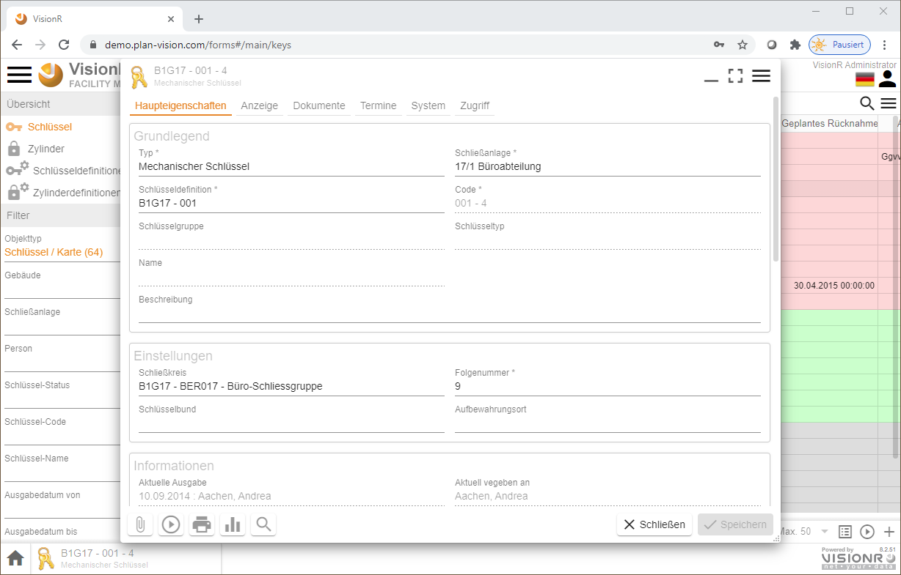
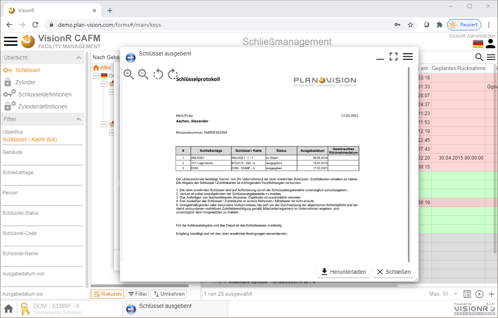

	

    

	
Benutzerhandbuch

	
Schließmanagement

    
Browser / App

    

    

    

    
Windows / macOS / Linux / iOS / Android

    
ab Version 8.0

    

    

        
Erstellt von Plan-Vision GmbH

    	
Version 1.2 &bull; Stand 23.02.2022

    	
Plan-Vision GmbH &bull; E-Mail: support@plan-vision.com &bull; Web: https://plan-vision.com

    

# Inhaltsverzeichnis

[toc]

# Version

**Aktuelle  Version:** 1.2

**Stand:** 23.02.2022

**Verfasser:** Plan-Vision GmbH

# Schließmanagement - App

## Allgemein

Das vorliegende Dokument beschreibt die Nutzung vom Modul Schließmanagement  für normale Benutzer auf einem Desktop-Computer (PC, Laptop oder Mac). Die Nutzung auf einem mobilen Gerät (Tablet PC, Smartphone)  ist auch möglich. Mobile Geräte können speziell für digitale Unterschriften mit dem Finger oder einem digitalen Stift bei Schlüsselausgaben und -Rücknahmen eingesetzt werden. Die Dokumentation für die App "Schlüssel" ist mit Fokus auf die dynamischen Veränderungen erstellt worden. Die Verwaltung der Stammdaten (neue Schließanlagen, neue Aufbewahrungsorte, grafische Verknüpfungen usw.) ist im Abschnitt [Admin Schließmanagement](../admin/keys) beschrieben.

## Beschreibung

Das VisionR-Modul Schließmanagement oder "Schlüssel" wird für die Verwaltung von den Schließungen in Gebäuden oder für Fahrzeuge eigesetzt. Es wird sowohl für die Verwaltung von Stammdaten wie Schließanlagen, Zylinder, Schlüssel, Karten, Schlüsselbunde, Aufbewahrungsorte usw., als auch als Tool für die Unterstützung dynamischer Veränderungen wie Schlüsselausgaben- und -Rücknahmen, Ein- und Ausbau von Zylindern, Bestellungen von neuen Schlüsseln und Zylindern. In einer Schließmatrix werden die Zuordnungen zwischen Zylinder und Schlüssel/Karten visualisiert. Digitale Unterschriften an einem mobilen Gerät sind möglich. Eingebaute Zylinder können per Mausklick oder Link im Web-CAD-Plan visualisiert werden. Die Daten im Modul Schließmanagement werden revisionssicher aufbewahrt. Jegliche Veränderungen, die den Status der Schlüssel/Karten und Zylinder betreffen, werden historisiert.

Features im Überblick:

* Schlüssel-, Karten- und Zylinder-**Detailinformationen** aufrufen
* Schlüssel oder Karten **ausgeben** und **zurücknehmen**
* **Zylinder-Einbau** und **-Ausbau** dokumentieren
* **Schlüsselprotokoll** mit Ausgaben und Rücknahmen aufrufen
* **Daten durchsuchen**, z. B. welche Schlüssel hat aktuell eine bestimmte Person
* **Datenauswertungen**, z. B. monatlicher Schlüsselbestand pro Gebäude
* **Grafische Visualisierung** von Schließkreisen oder verbauter Zylinder mit Matrix im Geschossplan

## Einstieg

Wenn Sie mobile VisionR App nutzen, werden Sie nach der Anmeldung automatisch auf die VisionR-Indexseite umgeleitet. Bei Nutzung des Browsers auf dem Desktopcomputer können die normalen Benutzer das Modul entweder über die Hauptadresse von VisionR auf der Registerkarte `Apps` *(siehe Bild 1)* oder direkt über den Link `https://[VisionR-Adresse]/forms#/main/keys` aufrufen.

*Bild 1: Einstieg über die VisionR-Indexseite*

## Administration

Administrative Aufgaben, wie z. B. Erstellen neuer Schließanlagen, Schlüssel- und Zylinderdefinitionen, Schließmatrix usw. sind im Abschnitt [Admin Schließmanagemen](../admin/keys) beschrieben.

# Übersicht

## Anfang

Bei Aufruf der App Schließmanagement wird automatisch die Liste mit Schlüsseln aufgemacht (siehe Bild 2).

*Bild 2: Maske "Anfang"*

Im Datenbereich werden die Schlüssel standardmäßig eingefärbt nach Status angezeigt. Die aktuelle Hierarchie in der Baumansicht ist *Nach Gebäude*. Es werden sowohl Schlüssel als auch Karten angezeigt. In der mobilen Ansicht wird standardmäßig eine Liste , in der Desktopversion eine Tabellenansicht angezeigt.

> **Hinweis:** Bei Klick auf eine Liegenschaft oder ein Gebäude in der Baumansicht werden die Daten in der Tabelle automatisch gefiltert.

Nutzen Sie die Einträge im Hauptmenü, um andere Daten in der Tabelle anzeigen zu lassen.

## Bedienung allgemein

Der Button mit den drei Strichen oben links öffnet das Hauptmenü. Das Menü ist auf mobilen Geräten aus Platzgründen automatisch versteckt. In der Desktopversion wird das Hauptmenü automatisch angezeigt. Abwechselndes Klicken auf den`Menü`-Button zeigt oder verbirgt das Menü, je nachdem welcher der aktuelle Status ist. Der `Menü`-Button ist auf allen Masken verfügbar. Durch Klick auf einen Menüeintrag in der Liste öffnen Sie die entsprechende Maske mit den in diesem Dokument beschriebenen Funktionalitäten. Der Name der aktiven Maske wird in orangener Farbe hervorgehoben.

*Bild 3: Hauptmenü über die drei Striche neben dem Logo ein/aus* 

Ein Klick auf die Ikone  neben den drei Strichen oben links führt zur VisionR-Indexseite. Wenn Sie das Modul Schließmanagement verlassen und zur Indexseite springen möchten, müssen Sie auf den Button mit dem Häkchen zur Bestätigung klicken (siehe Bild 3). Bei Abbrechen bleiben Sie auf der aktuellen Maske.

*Bild 4: Zur Indexseite zurückkehren* 

Bei Klick auf den `Home`-Button ganz unten links wird ein Menu mit den vorhandenen Apps angezeigt. Dieser Button ist nur in der Desktop App sichtbar. Mobil muss der Klick auf das Logo oben links verwendet werden. Bei Klick auf einen Menüeintrag werden Sie zur gewünschten App umgeleitet. Vorher muss das Verlassen der aktuellen App bestätigt werden (siehe Bild oben).

*Bild 5: Eine andere App direkt aufrufen*

# Detailinformationen aufrufen

## Detailansicht

In der Tabelle können Sie mit Doppelklick auf eine Zeile die Detailinformationen zum angeklickten Datensatz in einem Popup anzeigen lassen. Alternativ können Sie einen Datensatz in der Tabelle oder Liste auswählen und auf die `Leertaste` auf der Tastatur drücken.

Sie Können auch mehrere Datensätze gleichzeitig markieren: entweder durch Rechteckauswahl in der Tabelle oder durch setzen der Häkchen am Beginn der jeder Zeile oder durch die Tastenkombination `Strg + A` (alles auswählen). Bei der Mehrfachauswahl können Sie die `Leertaste` zum Aufruf der Detailansicht nutzen. Alternativ gehen Sie auf den Button `Details`  in der unteren rechten Ecke der Tabelle. Eine dritte Möglichkeit ist die Nutzung der Option `Details` im Datenkontextmenü, welches entweder mit Maus-Rechtsklick oder auf die drei Striche oben rechts unter der Personenikone geöffnet wird.

*Bild 6: Details-Ansicht eines Schlüssels mit Doppelklick auf die Zeile*

## Bearbeiten

Wenn Sie ein Datensatz mit Doppelklick oder über das Kontextmenü in der Details-Ansicht geöffnet haben, steht der Button `Bearbeiten`  zur Verfügung. Um den Datensatz im Bearbeitungsmodus zu öffnen können Sie entweder diesen Button nutzen oder in der Tabelle durch Aufruf des Kontextmenüs bei markiertem Datensatz auf den Eintrag `Bearbeiten` gehen. Das Kontextmenü ist immer entweder mit Rechtsklick oder auf die drei Striche unter der Personenikone erreichbar.

*Bild 7: Bearbeitungsmodus eines Schlüssels*

## Admin-Modus

*Bild 8: Admin-Modus über Kontextmenü in "Details" oder "Bearbeiten" öffnen*

*Bild 9: Admin-Modus eines Schlüssels*

# Schlüssel/Karte ausgeben und zurücknehmen

## Ausgabe

Sie können eine Schlüssel ausgeben, nur wenn dieser den passenden Status hat. Bei aktuell vergebenen oder verlorenen/vernichteten Schlüsseln ist der Button für die Ausgabe nicht vorhanden.

Öffnen Sie auf einen Schlüssel mit dem Status *"im Depot"* (erkennbar an der grünen Einfärbung in der Tabelle oder Liste) mit Doppelkick. In der Details-Ansicht ist der Button `Ausgabe` sichtbar, falls Sie die notwendigen Zugriffsrechte für Schlüsselausgaben besitzen.

> **Hinweis:** Der Button `Ausgabe` ist auch im Bearbeitungsmodus verfügbar.

*Bild 10: Schlüssel in der Details-Ansicht ausgeben*

Bei Klick auf den Button `Asgabe` wird ein Popup-Dialog mit Angaben zu beabsichtigten Schlüsselausgabe zu sehen. Foilgende Eingabefelder stehen zur Verfügung:

* **Person** (Pflichtfeld) Sie müssen die Person entweder durch Suchen im Dropdown-Feld oder durch Doppelklick in der erweiterten Auswahltabelle finden und auswählen.
* **Ausgabedatum** (Pflichtfeld) Hier wird automatisch das aktuelle Datum und die aktuelle Uhrzeit eingetragen. Die Eingabe können Sie bei Bedarf ändern.
* **Bemerkung Ausgabe** Das Feld kann für Notizen bei der Ausgabe genutzt werden.
* **Gewünschtes Rücknahmedatum** Dieses Feld müssen Sie mit Datum/Uhrzeit füllen, falls der Schlüssel nur temporär ausgegeben und zu einem fest definierten Zeitpunkt wieder zurückgenommen werden muss. Das Feld wird in wöchentlichen E-Mail-Benachrichtigungen für anstehende Schlüsselrücknahmen genutzt.
* **Unterschrift** Bei der Ausgabe können Sie den Schlüsselempfänger unterschreiben lassen, falls ein Tablet PC, Smartphone (oder ggf. Unterschriften-Pad) genutzt werden kann. Dazu gehen Sie auf den Pluszeichen mit dem Kreis und wählen Sie im Popup die Option `Unterschrift`, wenn Sie dort den Button `+ Hinzufügen` anklicken.
* **Sprache des Protokolls** und **Druckformat** werden für die Erstellung des Ausgabeprotokolls genutzt, welches am Ende des Vorgang automatisch generiert wird.

*Bild 11: Person und ggf. Datum/Uhrzeit oder Notizen eingeben*

*Bild 12: Hochladen einer Unterschrift (1)*

*Bild 13: Hochladen einer Unterschrift (2)*

Nach Ausfüllen aller Eingabefelder und ggf. Hochladen der Unterschrift gehen Sie auf den Button `Ausführen` rechts unten im Popup-Dialog. Ein Ausgabeprotokoll wir automatisch generiert und kann heruntergeladen und bei Bedarf ausgedruckt und auf Papier unterschrieben werden.

*Bild 14: Protocol zum `Herunterladen` nach Klick auf `Ausführen`*

## Rücknahme

Die Rücknahme eines Schlüssels erfolgt ähnlich wie die bereits beschriebene *Ausgabe*.

Sie können eine Schlüssel ausgeben, nur wenn dieser den passenden Status hat. Bei aktuell nicht vergebenen Schlüsseln ist der Button für die Rücknahme nicht vorhanden.

Öffnen Sie auf einen Schlüssel mit dem Status *"ausgegeben"* (erkennbar an der roten Einfärbung in der Tabelle oder Liste) mit Doppelkick. In der Details-Ansicht ist der Button `Rücknahme` sichtbar, falls Sie die notwendigen Zugriffsrechte für Schlüsselrücknahmen besitzen.

*Bild 15: Schlüssel in der Details-Ansicht zurücknehmen*