<!-- TITLE: Mietmanagement für normale Benutzer -->
<!-- SUBTITLE: VisionR Modul Mietmanagement für Mietverträge, Mieteinheiten etc. -->

<!--  -->

Deutsch | [English](../../../en/user-guide/apps/rentals) | *Sie sind hier: [Home](/home) > [Benutzerhandbuch](../user-guide) > App Mietmanagement*

# Beschreibung

Das Modul **Mietmanagement** wird für die Verwaltung der Mietobjekte, Mietverträge und Konditionen, Mietflächen und Kosten, Dokumente, Zahlungen, Umsätze, Erstellen von Exposés etc. benutzt. 

Das Modul machen Sie auf, indem Sie über die Indexseite oder über den *Home-Button > Apps > Mietmanagement* auf, falls Sie bereits im System angemeldet sind. 

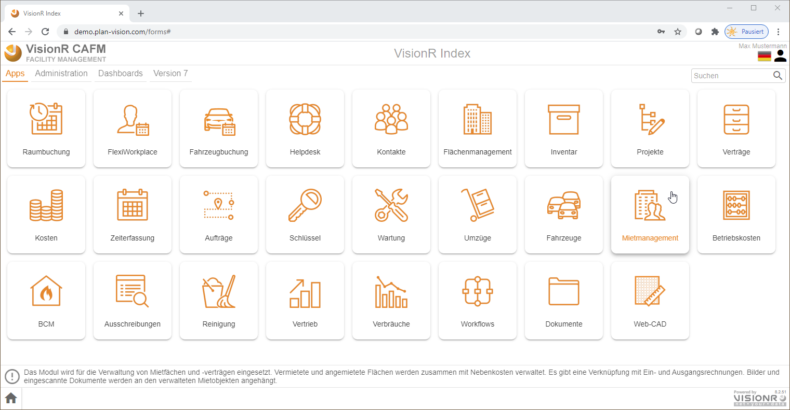 

*Bild 1: Eingang in die App "Mietmanagement" über die Indexseite*

# 	Übersicht

Die **Mieteinheit** wird benötigt, um die Räumlichkeiten mit dem **Vertrag** und den Vertragspositionen zu verknüpfen. Eine Mieteinheit kann mehrere Räumlichkeiten beinhalten, kann mehrere Mieteinheiten beinhalten und kann auch einen Teil einer Mieteinheit sein. 
Eine Mieteinheit kann auch **Mietflächen** oder **Belegungen (von Mietflächen)** beinhalten, wenn z.B. die Mietfläche nur teilweise der Raumfläche entspricht. 

Die **Mieteinheit** wird mit einem Vertrag verknüpft und in dem Vertrag kann der Benutzer die Positionen, die Kosten, die Konditionen, die Dokumenten etc. verknüpfen. 
Zu den Mieteinheiten kann der Benutzer Mietkonditionen anhängen und so Preisänderungen planen – ab wann bis wann diese gültig sind, wie ändert sich der Preis etc.

Der **Vertrag** beinhaltet **Positionen**, aus den die Kosten zusammengestellt sind. Sobald Positionen im Vertrag existieren, werden die Kosten aus den Positionen genommen. Falls der Vertrag keine Positionen beinhalten soll, kann der Benutzer die Kosten direkt in dem Feld **Kosten** eingeben. Diese werden pauschal eingetragen. 

Die **Positionen** können beispielsweise die Kaltmiete und die Nebenkosten darstellen. 
Wenn die Positionen, der Vertrag und die Mieteinheiten verknüpft und mit Daten befüllt sind, können die monatlichen Werte Monat / Fläche (die Fläche für den jeweiligen Monat) generiert werden. So können diese anderen Systemen übermittelt werden und bleiben in VisionR protokolliert. 

# Bearbeitung von Mieteinheiten

Die Mieteinheiten können alphanummerisch erstellt werden. Die Mietflächen können auch grafisch erstellt werden. 

In der Tabelle mit den Mieteinheiten klicken Sie auf  **Neu** in dem Funktionsmenü über die Tabelle rechts oder mit rechter Maustaste wieder auf **Neu**. 

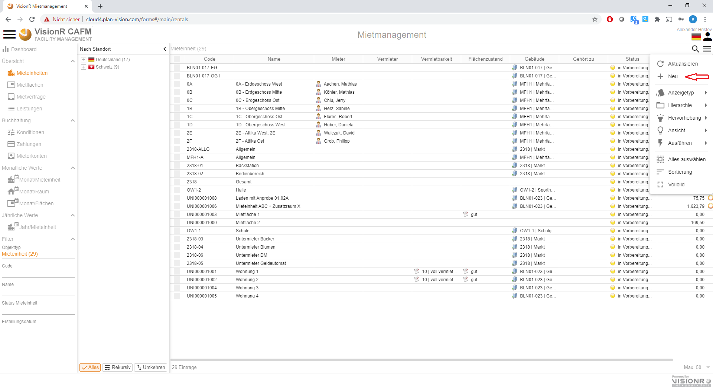 

*Bild 2: Hauptmenüeintrag "Mieteinheiten"*

In dem Formular geben Sie die wichtigsten Daten ein, wie:
* **Code ändern** – Ändern Sie den Code nach Ihrem Muster
* Name (optional)
* Mieter und Vermieter (optional) – diese werden im Prinzip im Vertrag festgelegt. 

*Bild 3: Bearbeitung einer Mieteinheit (1)*

* Gebäude (optional, aber empfohlen) – geben Sie das Gebäude, damit die Mieteinheit auch in der Baumstruktur angezeigt wird. Ohne Gebäude kann der Benutzer die Einheit in der Tabelle mit allen Mieteinheiten finden. 
* Falls die Mieteinheit anderen Mieteinheiten beinhaltet oder Teil einer übergeordneten Mieteinheit ist, geben Sie die Zugehörigkeit in dem Feld **Gehört zu** und **Enthält Mieteinheiten**.

*Bild 4: Bearbeitung einer Mieteinheit (2)*

* **Mietfläche im Vertrag** - hier geben Sie bitte die Fläche der Mieteinheit, die in dem Vertrag definiert ist. Hier muss der Benutzer die Fläche manuell eingeben!
Die Fläche, die aus den verknüpften Räume oder Mietflächen zusammen gerechnet ist, wird in den Feldern **Flächensummer Räume** und **Mietflächensumme Räume** angezeigt. 

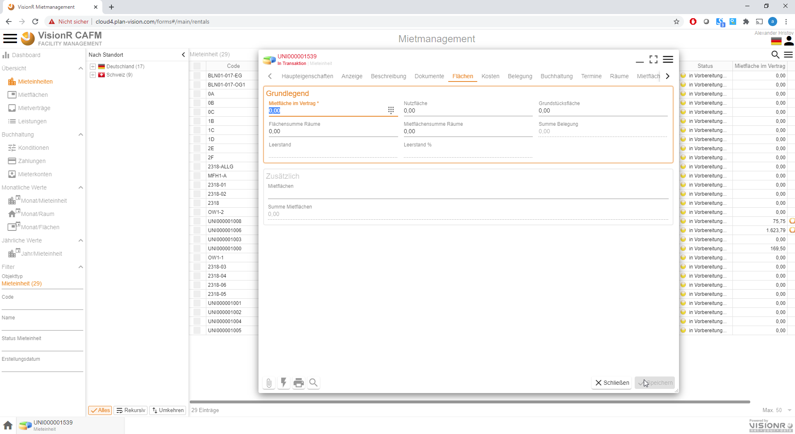

*Bild 5: Bearbeitung einer Mieteinheit (3)*

* Räume (optional, aber empfohlen) – geben Sie die Räume, die zu dieser Einheit gehören. So wird die richtige Fläche ermittelt und die Räume mit der Miteinheit verknüpft. So kann der Benutzer die eingetragene Fläche im Vertrag mit der tatsächlich genutzten Fläche vergleichen.

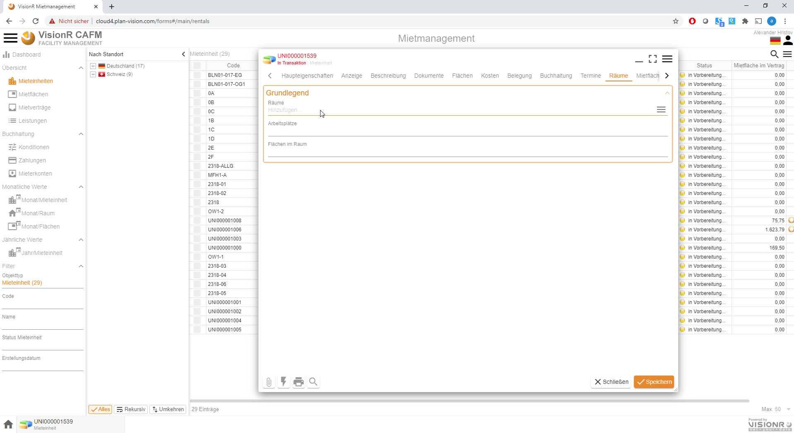

*Bild 6: Bearbeitung einer Mieteinheit (4)*

Einstellungen – auf der  Registerkarte *"Haupteigenschaften"* sind folgende Einstellungen standardmäßig vorhanden:
* Vermietbarkeit
* Flächenzustand
* Nutzung
* Farbe – frei wählbar – für die grafische Einfärbung
* Anfangs- und Enddatum 

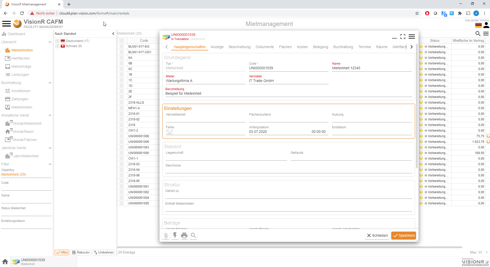

*Bild 7: Bearbeitung einer Mieteinheit (5)*

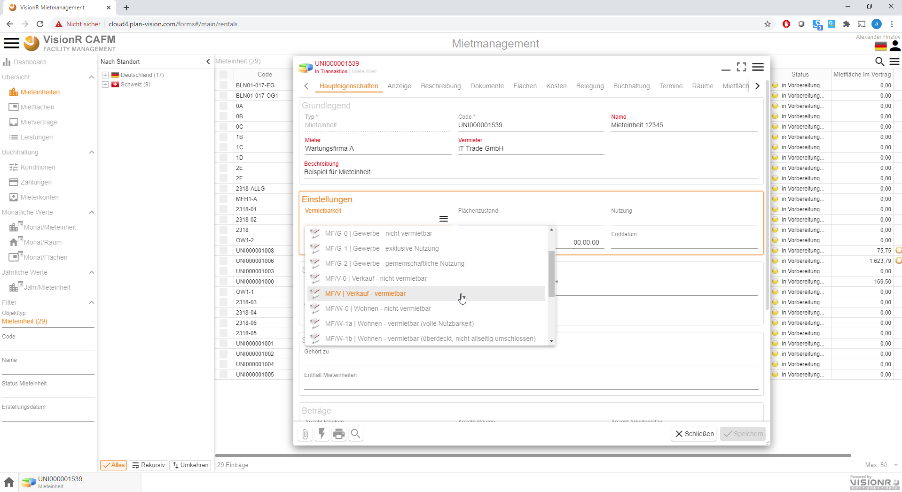

*Bild 8: Bearbeitung einer Mieteinheit (6)*

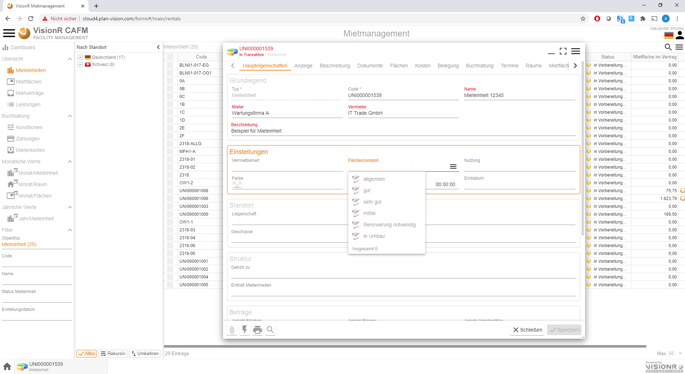

*Bild 9: Bearbeitung einer Mieteinheit (7)*

Anschließend gehen Sie auf `Speichern`, um den Vorgang abzuschießen. 

# Bearbeitung von Mietverträgen und Mietpositionen

## Mietverträge

Die Mietverträge beinhalten die Vereinbarungen, die Mietflächen, die Konditionen, die Parteien etc. Der Mietvertrag wird mit Mieteinheiten über die Vertragspositionen verknüpft.  Die **Vertragspositionen** können Daten aus dem Vertrag übernehmen, können aber auch abweichende Angaben haben. Deshalb ist in jeder Vertragsposition auch die Mieteinheit einzutragen.

Klicken Sie auf `+ Neu`, um einen neuen Vertrag zu erstellen. Geben Sie die wichtigsten Daten ein:
* **Vertrags-ID**
* **Mieter**
* **Vermieter**
* **Name des Vertrags**
* Mieteinheit (optional, aber empfohlen). 
* Vertragsnummer
* In Gebäuden (optional, aber empfohlen, damit der Vertrag auch in der Baumstruktur mit Filter **nach Standort** angezeigt wird.

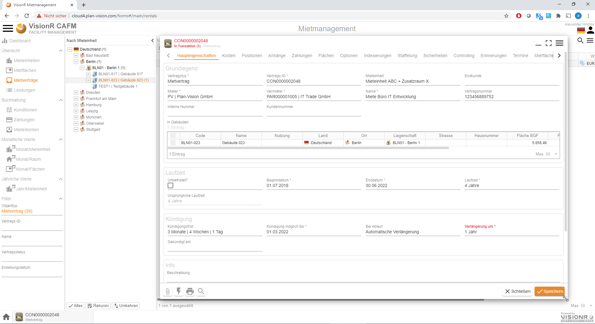

*Bild 10: Neuen Mietvertrag erstellen*

* Laufzeiten - Geben Sie hier die Laufzeiten (Beginn- und Enddatum, die Laufzeit wird berechnet), falls der Vertrag befristet ist, falls nicht, klicken Sie auf **Unbefristet JA**.
* Kündigungsoptionen – darunter sind die Kündigungsoptionen. Geben Sie diese auch ein. 
* Status (optional, aber empfohlen).

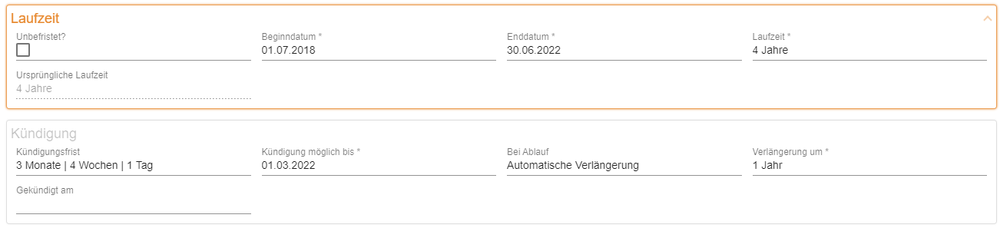

*Bild 11: Laufzeiten und Kündigung im neuen Mietvertrag*

* Dokumente (optional) – falls Sie den Vertrag eingescannt haben, können Sie das Original einfach hinzufügen. So haben Sie immer eine verknüpfte digitale Kopie des Vertrags zu dem Vertrag im System.
* **Kosten, Zahlungsintervalle, Zahlungsoptionen, Umsatzsteuerpflichtig, Währung**
In dem zweiten Reiter **Kosten** können Sie die Kosten und die Zahlungsoptionen eingeben. 

> **Bemerkung:** Die Kosten können Sie manuell eingeben, aber sobald Positionen in dem Vertrag existieren, werden die Kosten im Vertrag aus den Positionskosten zusammengerechnet. 

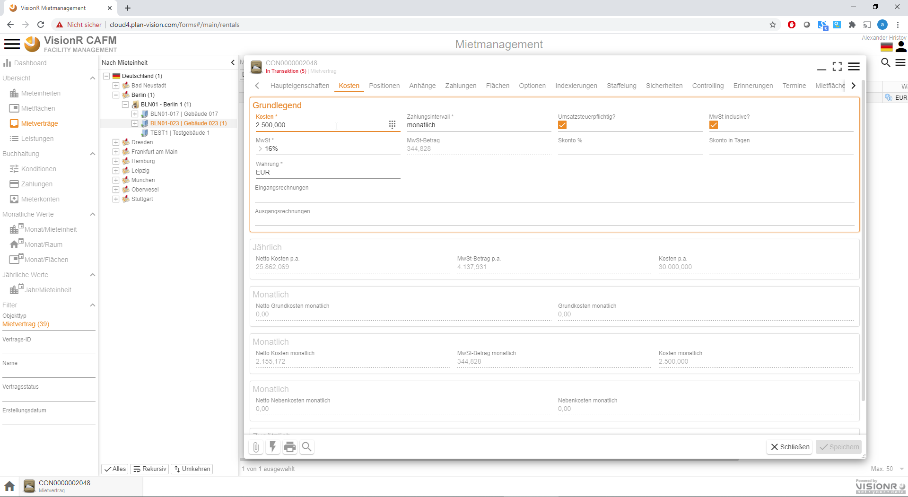

*Bild 12: Kosten und Zahlungsintervall im neuen Mietvertrag*

Ändern Sie die Optionen, die für Sie wichtig sind. Eine Änderung hier ist gültig auch für alle Positionen, die mit dem Vertrag verknüpft sind. Sobald die Positionen manuell geändert werden, werden die Änderungen aus dem Vertrag die Positionen nicht überschreiben und der Benutzer soll die Positionen manuell anpassen. So kann der Benutzer viele mögliche Varianten abdecken.

* **Zahlungen (Kundenspezifisch)** - die Zahlungen kann der Benutzer auf der Registerkarte *"Zahlungen"* anpassen. 

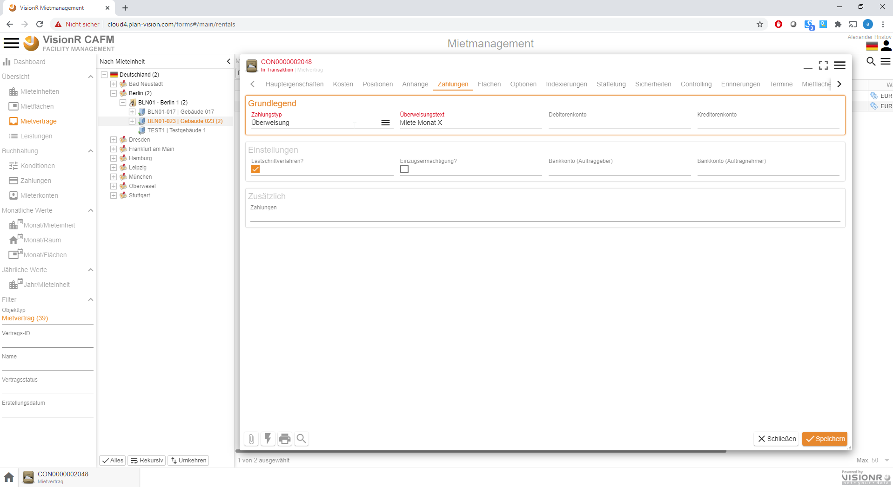

*Bild 13: Vertragliche Zahlungen*

* Anhänge (optional) – hier können Sie Anhänge hochladen und mit dem Vertrag verknüpfen. Dazu können Sie auch die Beginn- und Endzeit für die Anhänge festlegen. 
* Indexierung (optional) – die Indizes geben Sie in dem Reiter *"Indexierung"*.
* Staffelung (optional) – die Staffelung geben Sie in dem Reiter *"Staffelung"*

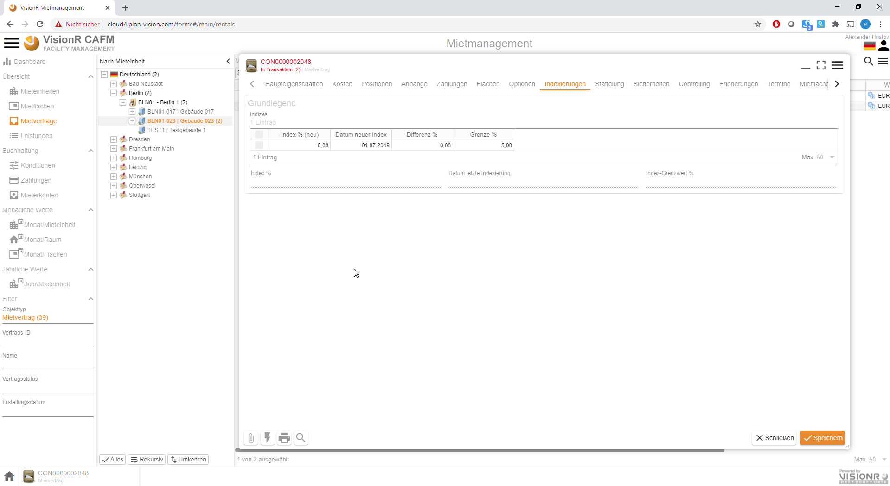

*Bild 14: Indexierungen*

Sie können alle relevanten Felder ausfüllen. Anschließend speichern Sie den Vertrag mit Klick auf den Button `Speichern` unten rechts.

## Mietpositionen

Zu jedem Mietvertrag können Mietpositionen zwei unterschiedlicher Typen eingegeben werden: Grundmiete oder Nebenkosten. Öffnen Sie den gewünschten Vertrag und fügen Sie Vertragspositionen auf dem Reiter "*Positionen"* > *"Mietpositionen"*. 

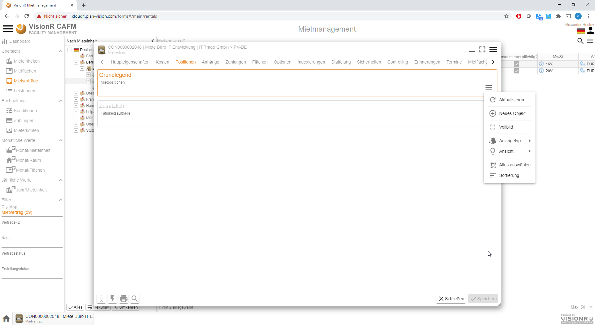

*Bild 16: Vertragspositionen*

Der Screenshot zeigt einen Vertag mit 2 schon erstellten Positionen für die Nettomiete und für die Nebenkosten. Mit Klick auf **Neu** wird eine neue Position erstellt. Wählen Sie den Typ zuerst. 

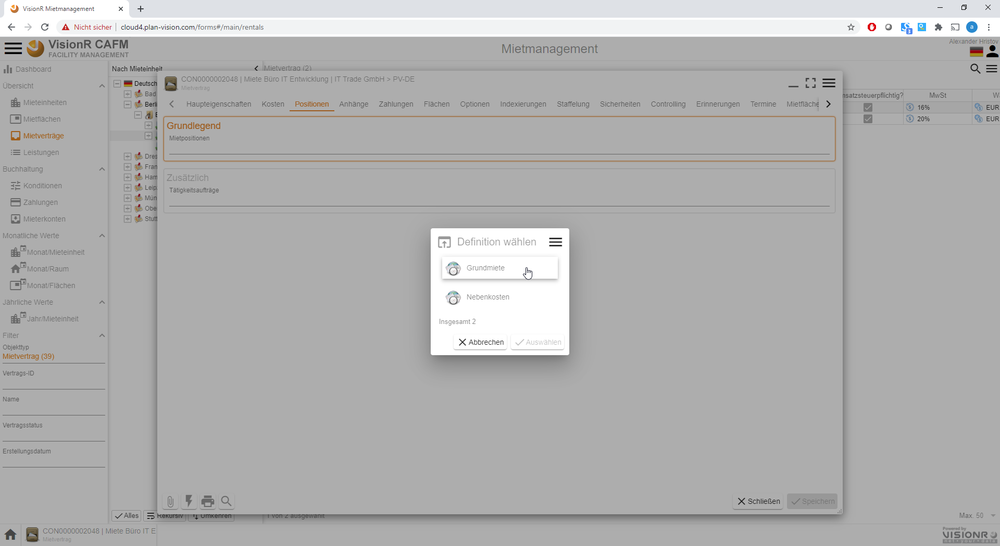

*Bild 17: Typ der Mietposition auswählen*

Dann geben Sie in der Position die Daten aus dem Vertrag, die sich zu diesem Typ bezieht. Zum Beispiel die Position vom Typ **Grundmiete**:

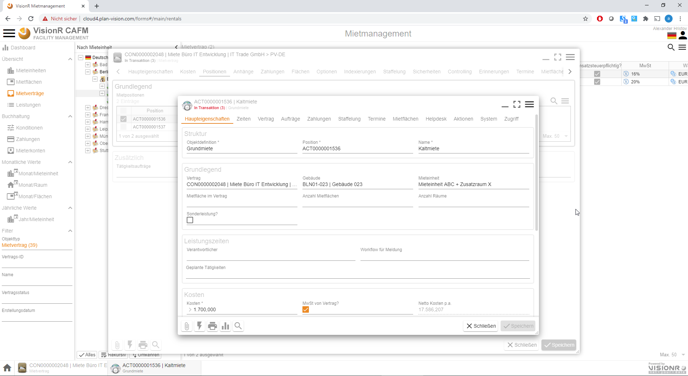

*Bild 18: Beispiel Grundmiete*

Wichtige Angaben:
* **Typ (Objektdefinition)** – Grundmiete / Nebenkosten
* **Position** – Ändern Sie die Position Code
* **Name** – geben Sie den Positionsname
* **Mieteinheit** Eingabe empfohlen
* **Sonderleistung ?** 
* **Kosten** – die wichtigste Eingabe sind die Kosten. Diese sind in dem Reiter *"Haupteigenschaften"* in dem Bereich *"Kosten"* zu finden. Geben Sie die Kosten aus dem Vertrag und deaktivieren Sie die Option `MwSt. von Vertrag?`, falls die MwSt. aus der Position genommen wird und nicht von Vertrag. So kann der Benutzer Positionen mit unterschiedlichen MwSt. mischen und zu einem Vertrag hinzufügen.

Erstellen Sie analog auch die Position(en) für die Nebenkosten. Die bereits erstellte Position für die Nebenkosten sieht folgendermaßen aus:

*Bild 19: Beispiel Nebenkosten*

Sobald Sie die Kosten in einer Vertragsposition eingeben, werden die Kosten im Vertrag mit der Summer der Positionskosten überschrieben.

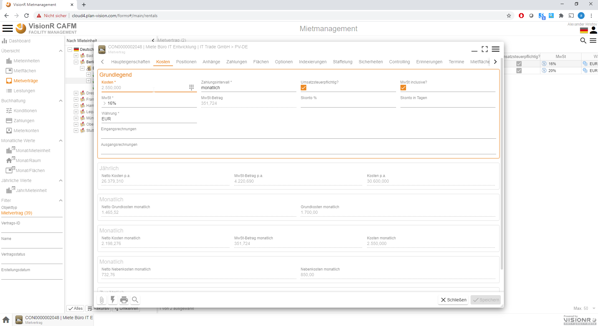

*Bild 20: Kosten im Vertrag aus Positionen*

Das Feld ist schon ausgegraut und kann nicht mehr manuell geändert werden. Damit der Benutzer einen Betrag im Vertrag pauschal eintragen kann, soll der Vertrag keine Positionen beinhalten. 

# Bearbeitung von Mietkonditionen

Sie können Mietkonditionen für die Mieteinheiten definieren. Sie beinhalten die zukünftigen Preisänderungen. Die Mietkonditionen sind in dem Reiter *"Kosten"* in der Mieteinheit zu finden.

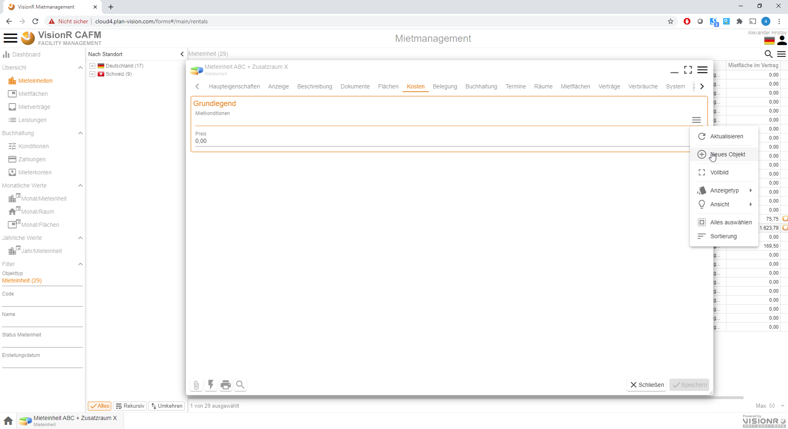

*Bild 21: Mietkonditionen*

Mit Klick auf `Neu` fügen Sie eine neue Mietkondition ein. Geben Sie den **Namen**, ggf. eine Beschreibung und **Anfangs-** und **Enddatum** ein. 

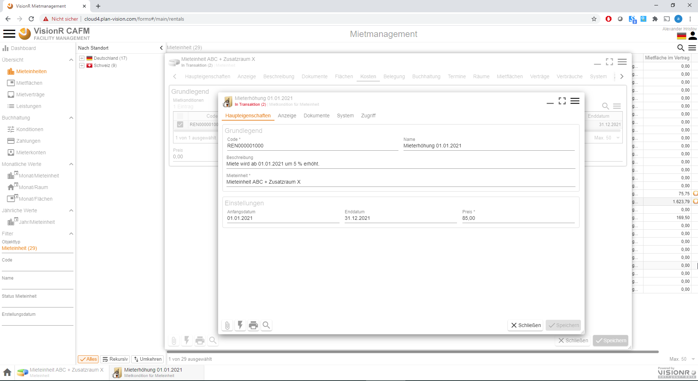

*Bild 22: Einstellungen für Mietkonditionen*

Sie können hier auch Dokumente hochladen. Zum Beginndatum wird der neue Preis übernommen.

# Geplante Änderungen

In diesem Modul gibt es auch eine Menge Felder, die von dem Benutzer geplant geändert werden können. Datenfelder, die Planwerte mit Angaben für Datum und Uhrzeit unterstützen, sind mit einem rechtsgerichteten Pfeil am Feldanfang gekennzeichnet. Geplante als auch tatsächliche Änderungen mit Zeitstempel sind bei Klick auf die Feldmenüoption *"Änderungen"* ersichtlich. 

Ein **Beispiel:**
Wir möchten die Mehrwehrsteuer für einige Monate ändern. Wir können manuell den Prozentsatz ändern, indem wir alle Positionen (oder Verträge) auswählen und den MwSt.-Satz ändern. Sobald dieser Satz wieder genändert werden muss, muss der Benutzer ihn wieder manuell anpassen. Hier soll der Benutzer auch auf die monatlichen Werte aufpassen, damit diese richtzeitig und mit den richtigen Werten ausgegeben werden. Deswegen ist eine geplante Änderung an dieser Stelle sinnvoll. Ein Beispiel ist die MwSt. im Vertrag. 

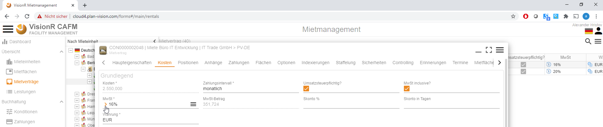

*Bild 23: Geplante Änderung der MwSt. (1)*

Klicken Sie zuerst auf `Aufklappen`, um die Tabelle aufzumachen und in dem angezeigtem Fenster können Sie die geplanten und die schon vergangenen Änderungen sehen. Für eine geplante Änderung bleiben Sie in dem linken Fenster und klicken Sie auf **Neu** über das Menü und in dem angezeigten Fenster geben Sie den gewünschten Wert und das Datum.

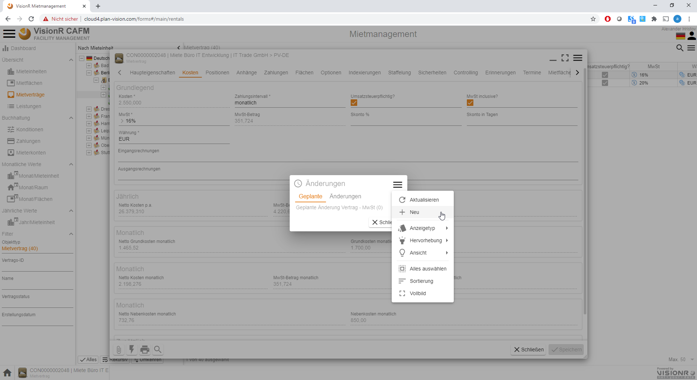

*Bild 24: Geplante Änderung der MwSt. (2)*

*Bild 25: Geplante Änderung der MwSt. (3)*

Anschließend geben Sie den neuen Wert ein. Am Ende speichern Sie den Vorgang. Zum angegebenen Datum und Uhrzeit wird die Änderung vom System automatisch durchgeführt. Optional kann eine E-Mail mit der automatischen Änderung an den Admin versendet werden.

>**Hinweis:** Eine geplante Änderung kann man  in den einzelnen Positionen eingeben, falls  die Kaltmiete einen abweichenden MwSt.-Satz im Vergleich mit den Nebenkosten hat. Wenn Sie das Symbol für geplante Änderungen links im Feld sehen, können grundsätzlich Planwerte eingegeben werden.. 

*Bild 26: Geplante Änderung der Kaltmiete*

> **Hinweis:** Sobald es eine oder mehr geplante Änderungen für ein Feld existiert, kann der Benutzer dieses Feld nicht mehr direkt bearbeiten. Eine neue geplante Änderung zum aktuellen Datum muss erstellt werden, um den angezeigten Wert zu verändern. Eine geplante Änderung kann auch für die Vergangenheit erstellt werden. 

Ein **Beispiel:**
Das Feld Kosten für die folgende Position lässt sich nicht ändern, weil geplante Änderungen für dieses Feld existieren. Änderungen können in diesem Fall nur über **geplante Änderung** realisiert werden. Sie können auch ein Datum in der Vergangenheit setzen, falls die Änderung bereits stattgefunden hat. Das Feld ist hier grau hinterlegt. 

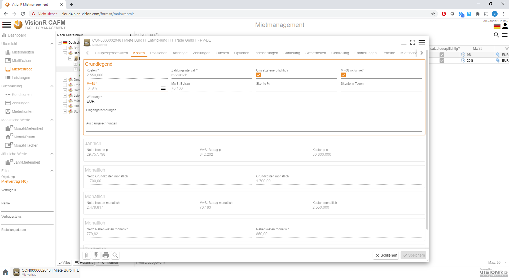

*Bild 27: Feld gesperrt, wenn Planwerte vorhanden*

# Monat / Flächen generieren

Eine Zuordnung Monat / Flächen wird vom System an jedem 15. (das Datum kann eingestellt werden) des Monats generiert. Dafür werden die Mieteinheiten mit Status „inaktiv“ ignoriert. Sie können auch eine Zuordnung selber erstellen, dann wird der Monat auch in der Baumstruktur erscheinen, falls er noch nicht vom Scheduler erstellt ist (jeweils am 15. des Vormonats). Dafür gehen Sie in der Mieteinheiten- Tabelle und wählen Sie die gewünschten Mieteinheiten. Die Mieteinheiten mit Status „inaktiv“ sollen aus der Auswahl weg gelassen. 

Wenn Sie die Einheiten selektiert haben, klicken Sie auf den Button `Monat / Fläche anlegen`.

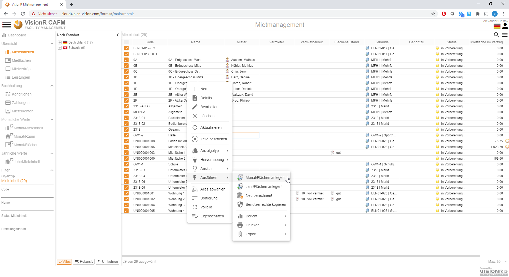

*Bild 28: Monat / Fläche generieren*

Wählen Sie in dem neuen Fenster das Jahr und den Monat aus und schauen Sie die Einstellungen an und falls nötig ändern Sie diese ab. Standardmäßig wird die Option „aus aktuellem Stand“ gesetzt. Sie können diese aber ändern. 

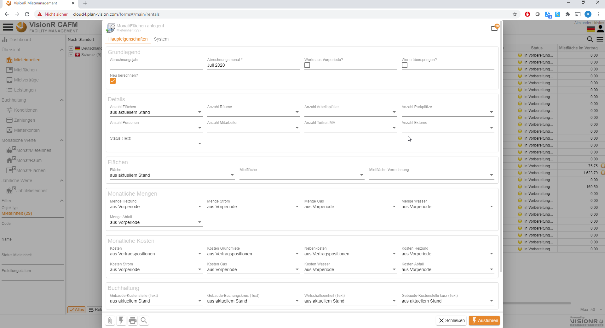

*Bild 29: Monat / Fläche generieren - Einstellungen*

In diesem Beispiel werden die Daten für den Monat Juli 2020 generiert. Anschließend klicken Sie auf `Ausführen`. Die Objekte werden generiert: dieser Vorgang kann einige Zeit in Anspruch nehmen. Die Anzahl generierter Objekte wird angezeigt. 

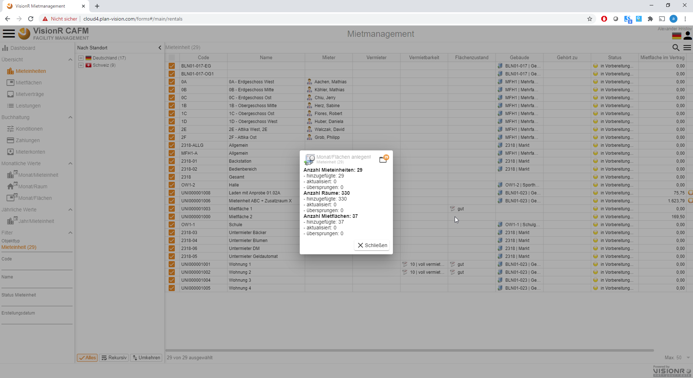

*Bild 30: Monat / Fläche Daten generiert*

Die monatliche Werte – Zuordnung Monat / Mieteinheit; **Monat / Mietfläche** (auf der Abbildung) und Monat / Raum sind jetzt auch für den angegebenen Monat in der Tabelle unter dem Monat zu finden. 

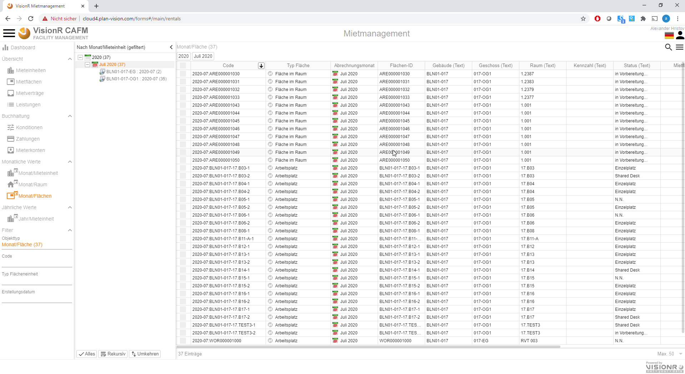

*Bild 31: Tabelle monatliche Werte*

> **Hinweis:** Hier sind die Werte „Monat / Flächen “ aufgelistet. Mit Klick auf die Objektdefinitionen links können Sie den Typ ändern. 

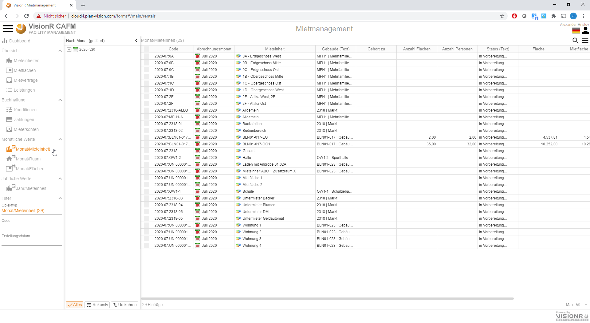

*Bild 32: Filter für monatliche Werte*
