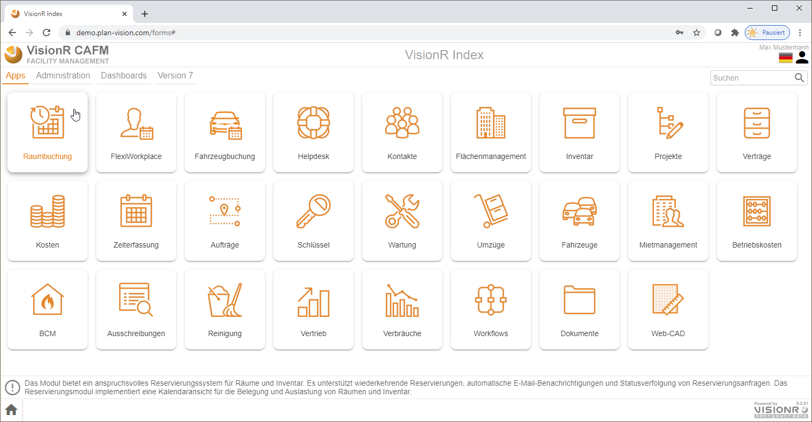

<!-- TITLE: Modul Raumbuchung -->
<!-- SUBTITLE: Modul für die Online-Buchung von Räumen inkl. Catering-, Inventar- und Support-Bestellungen-->

Deutsch | [English](../../../en/user-guide/apps/reservations) | *Sie sind hier: [Home](../../../home) > [Benutzerhandbuch](../user-guide) > Raumbuchung*

# Raumbuchung - App

## Beschreibung

Das Modul  ist ein leistungsfähiges Werkzeug für Online-Reservierungen von Räumen und Inventar. Es unterstützt wiederkehrende Reservierungen, automatisches Versenden von Bestätigungs-E-Mails und Statusverfolgung von Reservierungsanfragen. Eine Kalenderansicht zeigt die Belegung von Räumen und Inventar.

Sie können das Modul öffnen indem Sie auf der Index-Seite den Reiter `Apps` auswählen und den Button `Raumbuchung` anklicken (siehe Bild). Alternativ können Sie auch den direkten Link in Ihrem Browser eingeben: `http://[VisionR-Adresse]/forms#/main/reservations`

*Bild 1: Modul Reservierungen über die Index-Seite aufrufen*

## Übersicht

*Bild 2: Übersicht im Modul Reservierungen*

# Bedienung der Oberfläche

### Ansicht ändern

Die Standardansicht ist die Kalenderansicht, die auf dem Bild 2 gezeigt ist. Die Ansichten sind links in der Kategorie `Übersicht` aufgelistet. Mit Klick darauf können Sie die Ansicht ändern.

### Kalender Woche

Hier werden die Reservierungen in dem Kalender für eine Woche gezeigt (siehe Bild 2). Sie können die Navigationspfeilen oben rechts nutzen, um die angezeigte Woche zu verschieben. Mögliche Schritte sind *Tag* und "*Woche*. 
Mit Klick auf eine Reservierung wird sie aufgemacht und die wichtigste Daten werden angezeigt. 

*Bild 3: Übersicht einer Reservierung*

Mit Klick auf den Button `Bearbeiten` können Sie die Reservierung bearbeiten. 

> **Info** Mit Klick auf den `+` Button unter allen Reservierungen für den Tag erstellen Sie eine neue Reservierung mit diesem Datum. Das Datum können Sie in dem angezeigten Formular ändern. 

### Kalender Räume

Diese Ansicht zeigt die Reservierungen nach Räumen. Statt der Tage werden die Räume gezeigt und Sie können für den jeweiligen Raum die Reservierungen sehen. 

*Bild 4: Kalender-Ansicht nach Raum*

Oben links können Sie das Datum ändern und links stehen wieder die Navigationspfeile. 

### Zeitachse

Diese Ansicht ist eine Zeitachse, die Sie mit der Maus bedienen. Der Pfeil nach unten zeigt, dass mehrere Räume noch darunter sind und Sie können mit Halten der rechter Maustaste die Zeitachse bewegen - links und rechts für die Tage, nach oben und nach unten für die Räume. Mit der Maus-Scroll-Taste können Sie die Zeitachse hinein- und herauszoomen. 

*Bild 5: Zeitachse*

### Reservierungen

Diese Ansicht zeigt die Reservierungen in tabellarischer Form. Sie können die Reservierungen, für die Sie Zugriffsrechte haben, bearbeiten. Die Bearbeitung ist im Abschnitt [Allgemein](../general/general) näher beschrieben. 

*Bild 6: Tabellarische Ansicht*

# Suchen / Filtern
Im Hauptmenü auf der linken Seite können Filter für die Datenselektion genutzt werden. Die Filter haben direkten Einfluss auf die Kalenderansicht. Sie können die Reservierungen filtern, um eine bessere Übersicht zu bekommen. Einige Beispiele:

> **Beispiel:**  Filtern nach Betreff *"Meeting"* - nur die Reservierungen, die diese Zeichenkette in dem Betreff enthalten, werden angezeigt. Alle anderen werden ausgeblendet.

> **Beispiel:**  Filtern nach Veranstalter / Koordinator - nur die Reservierungen für den ausgewählten Veranstalter und / oder Koordinator werden angezeigt. Alle anderen werden Ausgeblendet. Der Einfachheit halber sind die *Ich*-Optionen als Häkchen dargestellt. Mit Aktivieren dieser Option wird Ihr eigener Personenname als Filter eingesetzt. 

> ... oder wenn Sie der Veranstalter sind

> **Beispiel:**  nach einem Gebäude - nur die Reservierungen, die zum ausgewählten Gebäude gehören, werden angezeigt. Alle anderen werden ausgeblendet. Die Filter nach Geschoss und Raumeinheit funktionieren ähnlich.

### Filter leeren / zurücksetzen

Sie können die Filter entweder mit den Tasten `Backspace` oder `Entfernen` leeren oder mit der Option`Zurücksetzen` rechts im Feld-Menü.

> **Beispiel:**  Betreff *Meeting* leeren. Das Feld *Raumnamen (kommagetrennt)* wird identisch zurückgesetzt.

> **Beispiel:**  Gebäude leeren. Geschoss / Raumeinheit / Raum-Typ werden identisch zurückgesetzt.

# Neue Einzelraum-Reservierung 

Klicken Sie auf den Button oben links `+ Neue Reservierung` und dann wählen Sie aus dem Menü  `Einzelraum-Reservierung`. 

> **Alternativ:** : Navigieren Sie zum dem Datum, an dem Sie die Reservierung erstellen möchten und mit Klick auf den `+` erstellen Sie eine neue Reservierung. Das Datum in der Überschrift wird übernommen. 

*Bild 7: Neue Einzelraum-Reservierung*

*Bild 8: Einzelraum-Reservierung Formularansicht*

Unten in roter Farbe werden die fehlenden Eingaben hervorgehoben. Geben Sie unbedingt diese ein.
Die **Pflichtfelder** sind mit * gekennzeichnet. Zuerst geben Sie die Zeiten. Dann geben Sie die Anzahl Teilnehmer. 
Die Räume werden gefiltert – also nur die Räume, die tatsächlich frei für diese Anzahl Teilnehmer und für diese Zeiten sind, werden aufgelistet. Wählen Sie einen Raum aus der Liste oder aus der Zeichnung direkt, falls das Modul ***Grafik*** vorhanden ist und die Reservierungseinheit gezeichnet ist. 
Machen Sie die folgenden Eingaben, damit Sie den verfügbaren Raum für Ihre Veranstaltung schneller finden. 

* Geben Sie zuerst die Zeiten und die Anzahl Teilnehmer ein.
* Geben Sie den Betreff ein.
* Geben Sie die Beschreibung, falls nötig. Dieses Feld ist mehrzeiliges Feld. Sie können mit der *Enter-Taste* eine Neue Zeile erstellen und weiter schreiben. 
* Gebäude auswählen
* Die Räume werden gefiltert. Nur die freien Räume für diese Zeit und für diese Anzahl Teilnehmer werden in der Liste angezeigt. Wählen Sie einen Raum aus der Liste / oder aus dem Plan. 
* Setzen Sie die Sitzanordnung an. Dieses Feld erscheint, nachdem der Raum ausgewählt wurde. 
* Fügen Sie Bewirtung oder Inventarbestellung hinzu. 
* Speichern Sie den Vorgang. Die Reservierung wird in der ausgewählten Ansicht erscheinen.

*Bild 9: Einzelraum-Reservierung Formularansicht*

*Bild 10: Einzelraum-Reservierung Raum und Sitzanordnung wählen*

Nachdem Sie Pflichteingaben gemacht haben, können Sie den Cateringauftrag (Bewirtung) / Inventarauftrag erstellen.

## Bewirtung / Catering

In der Formularansicht klicken Sie auf Feld „Catering“ und die vorhandenen Cateringoptionen werden angezeigt. Diese Optionen werden gefiltert. Zuerst müssen Sie die Zeiten und die Teilnehmer eingeben, danach den Raum und hinsichtlich dieser Einstellungen werden die Cateringoptionen angezeigt. Wählen Sie eine und passen Sie die Uhrzeit an, wann diese Bewirtung geliefert werden soll. Dann klicken Sie auf den Button `Hinzufügen` und geben Sie die gewünschte Anzahl ein. Die Summe wird rechts gezeigt. 

> **Beispiel:**  wir bestellen einige Getränke für unsere Veranstaltung

> Mit Klick auf das Bild können Sie es vergrößern.

> Anzahl *Cola / Wasser* eingeben.

> **Hinweis:** Sie können mehrere Cateringaufträge für eine Veranstaltung bestellen. Dafür wählen Sie wieder aus der Cateringliste darunter einen Auftrag und fügen Sie diesen hinzu (wie oben). Passen Sie die Bestellzeiten und die Anzahl Artikel an. Speichern Sie anschließend den Auftrag. 

## Zusatzinventar

Die Zusatzinventar können Sie wie die Bewirtung bestellen. Sie können wieder mehrere Bestellungen für unterschiedliche Zeiten machen. 

> **Bemerkung** Jede Reservierungseinheit kann standardmäßig Technik / Inventar wie Beamer, WiFi etc. beinhalten. Diese werden mit der Raumauswahl gezeigt oder Sie können diese als Filter nutzen, wenn Sie die Reservierung erstellen. Die Räume werden danach gefiltert. 

*Bild 11: Standardinventar für den ausgewählten Raum*

Falls Sie Zusatzinventar hinzufügen möchten, klicken Sie auf das Feld *Zusatzinventar* und wählen Sie aus der Liste eine Option aus. Dann geben Sie die gewünschte Zeit an und klicken Sie auf `Hinzufügen`. Geben Sie die Anzahl an und speichern Sie diese Bestellung. 

*Bild 12: Zusatzinventar hinzufügen (1)*

*Bild 13: Zusatzinventar hinzufügen (2)*

## Teilnehmer hinzufügen
Damit Sie Teilnehmer hinzufügen, wählen Sie die Person aus der Dropdown-Liste und klicken Sie auf das `+` Zeichen, damit Sie die Person hinzufügen. 
Sie können die Personen einzeln hinzufügen oder Sie haben die Option für mehrfache Auswahl.

*Bild 14: Teilnehmer hinzufügen*

*Bilder 15: Mehrere Teilnehmer in einem Schritt hinzufügen (1)*

*Bilder 16: Mehrere Teilnehmer in einem Schritt hinzufügen (2)*

Speichern Sie anschließend die Reservierung. Diese wird danach in der Kalenderansicht angezeigt. 

*Bild 17: Die neu erstelle Reservierung in der Kalenderansicht*

# Neue Reservierung mehrerer Räume
Die Reservierung mehrerer Räume ist ähnlich wie die Einzelraum-Reservierung, mit weniger initialen Angaben bis die beiden Räume konsequent nicht reserviert werden. Sie müssen zuerst den ersten Raum auswählen und dann fügen Sie zusätzliche Räume hinzu. 
Klicken Sie auf den Button oben links „+ Neue Reservierung“ und wählen Sie „Neue Reservierung mehrerer Räume“.

*Bild 18: Neue Reservierung mehrerer Räume*

Geben Sie die Zeiten ein (Begin- und Endzeit), Betreff, Anzahl Teilnehmer und die Räume. Die Abteilung und die Kostenstelle werden von der Person genommen, aber können geändert werden. Sie müssen auch die Anzahl Teilnehmer eingegeben werden. Dann wählen Sie das Gebäude aus, damit die Räume nach den gewünschten Kriterien (Datum, Uhrzeit, Teilnehmer) gefiltert werden, und wählen Sie den ersten Raum aus. 

*Bild 19: Neue Reservierung mehrerer Räume - erster Raum wurde reserviert*

Aus der Raumliste wählen Sie einen der freien Räume und klicken Sie auf „Hinzufügen“. Falls die Liste leer ist, können Sie das Gebäude ändern. Der erste Raum ist reserviert. Darunter können Sie zusätzlichen Raum hinzufügen. 

*Bild 20: Neue Reservierung mehrerer Räume - zweiter Raum wurde reserviert*

> **Bemerkung** Sie können mehrere Räume hinzufügen. Die Vorgehensweise ist immer identisch. Die Reservierung erfolgt, wenn Sie die Hauptreservierung speichern. 

Am Ende erscheinen zwei Termine/Veranstaltungen in dem Kalender, die aber zusammengehören. Das Sysmbol für Videokonferenz ist in der linken Ecke angezeigt. 

*Bild 21: Neue Reservierung mehrerer Räume - in dem Kalender*

## Bewirtung / Catering Mehrerer Räume

Hier bestellen Sie die Bewirtung / Catering pro reserviertem Raum. Nachdem die Reservierung gespeichert ist, d. h. dass die Räume schon für die Zeiten reserviert sind, können Sie die Reservierung aufmachen und pro reservierten Raum Bewirtung bestellen. 
Die Bestellung ist identisch mit der Bestellung für die Einzelraum-Reservierung. Der Unterschied ist, dass es hier pro Raum eine oder mehrere Bewirtung/en möglich sind.

Öffnen Sie die Reservierung mit einfachen Klick (egal welchen Teil davon), dann klicken Sie auf `Bearbeiten`, um die Reservierung aufzumachen. Wählen Sie einen der verknüpften Räume und klicken Sie dann auf `Bearbeiten`. Die Reservierung für diesen einzelnen Raum wird aufgemacht. 

*Bild 22: Reservierung mehrerer Räume bearbeiten*

*Bild 23: Reservierung mehrerer Räume - Raum für Bewirtung aufmachen*

Sie können wie oben beschrieben Bewirtung / Catering  bestellen. Die Bestellungen sind pro Raum zu machen, weil die Videokonferenzen sich auf unterschiedliche Standorte beziehen können und die Bewirtungen sich unterscheiden können.

*Bild 24: Bewirtung für einen Raum bestellen*

## Zusatzinventar Mehrerer Räume

# Bürolieferung

Klicken Sie auf den Button oben links `+ Neue Reservierung` und aus dem Auswahlmenü wählen Sie `Bürolieferung`.

Füllen Sie die Felder aus - die Zeiten, den Betreff, Beschreibung und Raum. Danach können Sie entweder Bewirtung oder Inventar für diesen Raum bestellen. Die Räume werden nach Nutzung "Büro" etc. gefiltert. 

Als Beispiel haben wir hier Inventar für ein Büroraum bestellt. 
> **Beispiel:**  wir bestellen einen Beamer und einen Fernseher

>Am Ende speichern wir die Bestellung und sie wird in dem Kalender erscheinen. 

# Benachrichtigung verschicken
Beim Speichern der Reservierung werden Sie danach gefragt, ob Sie eine E-Mail Benachrichtigung an den Veranstalter und an die Teilnehmer verschicken möchten. Standardmäßig ist diese Option aktiviert. Falls Sie das nicht wünschen, nehmen Sie das Häkchen raus. 

# Reservierung bearbeiten
Sie können bis innerhalb einer gewissen Zeit vor der Startzeit die Reservierung bearbeiten. Dafür klicken Sie auf die gewünschte Reservierung und in der Übersicht auf den Button „Bearbeiten“.

*Bild 25: Die neu erstelle Reservierung in der Kalenderansicht*

