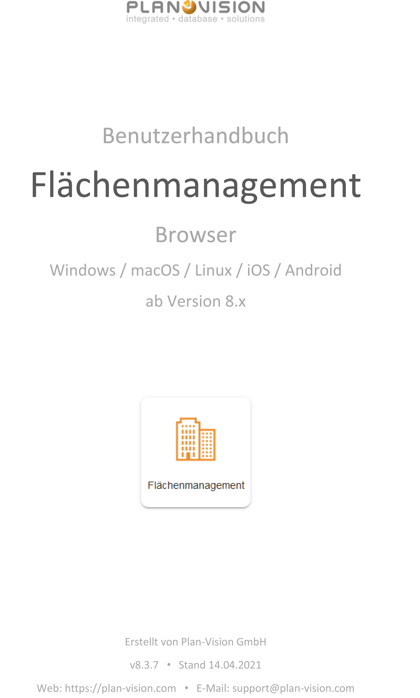

<!-- TITLE: Flächenmanagement -->
<!-- SUBTITLE: Benutzerhandbuch für die App für Modul "Flächenmanagement" -->

<!--  -->

# Flächenmanagement - App

## Allgemein

Das vorliegende Dokument beschreibt die Nutzung vom Modul Flächenmanagement für normale Benutzer auf einem Desktop-Computer (PC, Laptop oder Mac). Die Nutzung auf einem mobilen Gerät (Tablet PC, Smartphone)  ist auch möglich. Mobile Geräte können speziell für die Datenerfassung vor Ort genutzt werden (Raumnummern, Bodenbeläge usw.) oder bei Vorhandensein des Moduls Web-CAD für mobiles Zeichnen. Die Dokumentation für die App "Flächenmanagement" ist mit Fokus auf die dynamischen Veränderungen erstellt worden. Die Verwaltung der Stammdaten (neue Liegenschaften, neue Geschosse, diverse Einstellungen usw.) ist im Abschnitt [Admin Flächenmanagement](../admin/spaces) beschrieben.

## Beschreibung

Das VisionR-Modul Flächenmanagement wird für die Erfassung der vorhandenen Standortstrukturen genutzt. Flächendaten (Gebäude, Räume, Arbeitsplätze, Flächen im Raum) werden in allen anderen Modulen als Stammdaten verwendet. Es sind weitreichende Flächenauswertungen möglich. Die Flächen können durch Personen, Unternehmen oder Kostenstellen belegt werden. Im Raumbuch können Bauteile und diverse Raumeigenschaften erfasst werden. Zusätzliche Raumeigenschaften können durch Anlegen von Attributen abgebildet werden. Für Umbau- und Umzugsplanung ist das Modul Umzüge vorgesehen. Die Sichtbarkeit der Flächendaten auf allen Strukturebenen wird durch die Zugriffsrechte der Benutzerrollen vorgegeben. Standartmäßig werden die Zugriffrechte eines Gebäudes auf alle Unterebenen übertragen (Geschosse, Räume, Arbeitsplätze). Separate Zugriffseinstellungen sind für jeden einzelnen Datensatz möglich.

Die Liegenschaftsstruktur wird hierarchisch aufgebaut:

* Liegenschaften
* Gebäude
* Gebäudeteile
* Geschosse
* Geschossteile
* Räume
* Arbeitsplätze / Flächen im Raum

Features im Überblick:

* **Detailinformationen** aufrufen
* **Raumbuch** anzeigen und auswerten
* **Arbeitsplätze** anzeigen und auswerten
* **Liegenschafts-**, **Gebäude-** und **Geschossliste** anzeigen und auswerten
* Neue Liegenschaft, neues Gebäude, neues Geschoss **erstellen**
* Neuen Raum **grafisch oder alphanumerisch erstellen**
* Neuen Arbeitsplatz oder neue Fläche im Raum **grafisch oder alphanumerisch erstellen**
* Liegenschaft, Gebäude, Geschoss, Raum oder Arbeitsplatz **beenden**
* **Bodenbeläge** mehrfach verknüpfen
* **Belegungen** (Kostenstellen, Mieter, Personen) erstellen und bearbeiten
* **Bauteile** erstellen, bearbeiten und löschen
* **Grafische Visualisierung** von Räumen, Arbeitsplätzen und Flächen im Raum
* **Zugriffsrechte** definieren

## Einstieg

Wenn Sie mobile VisionR App nutzen, werden Sie nach der Anmeldung automatisch auf die VisionR-Indexseite umgeleitet. Bei Nutzung des Browsers auf dem Desktopcomputer können die normalen Benutzer das Modul entweder über die Hauptadresse von VisionR auf der Registerkarte `Apps` *(siehe Bild 1)* oder direkt über den Link `https://[VisionR-Adresse]/forms#/main/spaces` aufrufen.

*Bild 1: Einstieg über die VisionR-Indexseite*

## Administration

Administrative Aufgaben sind im Abschnitt [Admin Flächenmanagement](../admin/spaces) beschrieben.

# Übersicht

## Anfang

Bei Aufruf der App Flächenmanagement wird automatisch die Liste mit Räumen geöffnet (siehe Bild 2).

*Bild 2: Maske "Anfang"*

Im Datenbereich werden die Räume standardmäßig ohne Einfärbung angezeigt. Die aktuelle Hierarchie in der Baumansicht ist *Nach Standort*. Es werden sowohl Innen- als auch Außenräume angezeigt. In der mobilen Ansicht wird standardmäßig eine Liste, in der Desktopversion eine Tabellenansicht angezeigt.

> **Hinweis:** Bei Klick auf eine Liegenschaft oder ein Gebäude in der Baumansicht werden die Daten in der Tabelle automatisch gefiltert.

Nutzen Sie die Einträge im Hauptmenü, um andere Daten in der Tabelle anzeigen zu lassen.

## Bedienung allgemein

Der Button mit den drei Strichen oben links öffnet das Hauptmenü. Das Menü ist auf mobilen Geräten aus Platzgründen automatisch versteckt. In der Desktopversion wird das Hauptmenü automatisch angezeigt. Abwechselndes Klicken auf den`Menü`-Button zeigt oder verbirgt das Menü, je nachdem welcher der aktuelle Status ist. Der `Menü`-Button ist auf allen Masken verfügbar. Durch Klick auf einen Menüeintrag in der Liste öffnen Sie die entsprechende Maske mit den in diesem Dokument beschriebenen Funktionalitäten. Der Name der aktiven Maske wird in orangener Farbe hervorgehoben.

*Bild 3: Hauptmenü über die drei Striche neben dem Logo ein/aus* 

Ein Klick auf die Ikone  neben den drei Strichen oben links führt zur VisionR-Indexseite. Wenn Sie das Modul Flächenmanagement verlassen und zur Indexseite springen möchten, müssen Sie auf den Button mit dem Häkchen zur Bestätigung klicken (siehe Bild 3). Bei Abbrechen bleiben Sie auf der aktuellen Maske.

*Bild 4: Zur Indexseite zurückkehren* 

Bei Klick auf den `Home`-Button ganz unten links wird ein Menu mit den vorhandenen Apps angezeigt. Dieser Button ist nur in der Desktop App sichtbar. Mobil muss der Klick auf das Logo oben links verwendet werden. Bei Klick auf einen Menüeintrag werden Sie zur gewünschten App umgeleitet. Vorher muss das Verlassen der aktuellen App bestätigt werden (siehe Bild oben).

*Bild 5: Eine andere App direkt aufrufen*

# Detailinformationen aufrufen

## Detailansicht

In der Tabelle können Sie mit Doppelklick auf eine Zeile die Detailinformationen zum angeklickten Datensatz in einem Popup anzeigen lassen. Alternativ können Sie einen Datensatz in der Tabelle oder Liste auswählen und auf die `Leertaste` auf der Tastatur drücken.

Sie Können auch mehrere Datensätze gleichzeitig markieren: entweder durch Rechteckauswahl in der Tabelle oder durch setzen der Häkchen am Beginn der jeder Zeile oder durch die Tastenkombination `Strg + A` (alles auswählen). Bei der Mehrfachauswahl können Sie die `Leertaste` zum Aufruf der Detailansicht nutzen. Alternativ gehen Sie auf den Button `Details`  in der unteren rechten Ecke der Tabelle. Eine dritte Möglichkeit ist die Nutzung der Option `Details` im Datenkontextmenü, welches entweder mit Maus-Rechtsklick oder auf die drei Striche oben rechts unter der Personenikone geöffnet wird.

*Bild 6: Details-Ansicht eines Raums mit Doppelklick auf die Zeile*

## Bearbeiten

Wenn Sie ein Datensatz mit Doppelklick oder über das Kontextmenü in der Details-Ansicht geöffnet haben, steht der Button `Bearbeiten`  zur Verfügung. Um den Datensatz im Bearbeitungsmodus zu öffnen können Sie entweder diesen Button nutzen oder in der Tabelle durch Aufruf des Kontextmenüs bei markiertem Datensatz auf den Eintrag `Bearbeiten` gehen. Das Kontextmenü ist immer entweder mit Rechtsklick oder auf die drei Striche unter der Personenikone erreichbar.

*Bild 7: Bearbeitungsmodus eines Schlüssels*

## Admin-Modus

*Bild 8: Admin-Modus über Kontextmenü in "Details" oder "Bearbeiten" öffnen*

*Bild 9: Admin-Modus eines Raums*