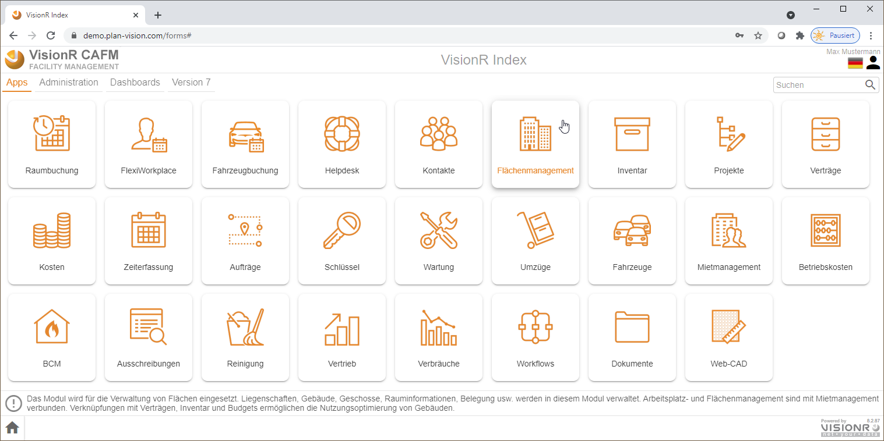
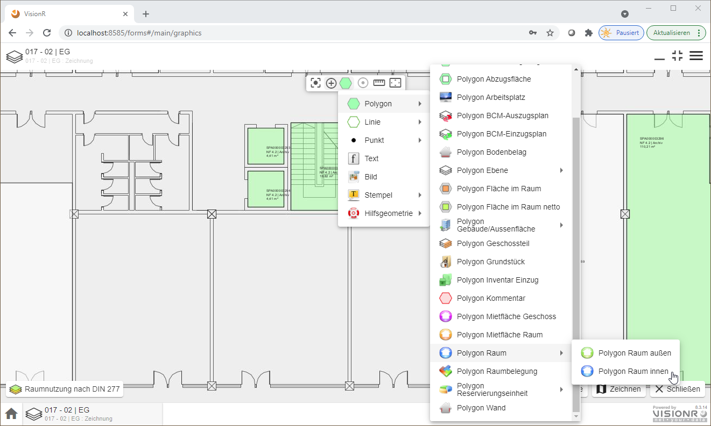

	

    

	
Benutzerhandbuch

	
Flächenmanagement

    
Browser / App

    

    

    

    
Windows / macOS / Linux / iOS / Android

    
ab Version 8.0

    

    

        
Erstellt von Plan-Vision GmbH

    	
Version 1.2 &bull; Stand 23.02.2022

    	
Plan-Vision GmbH &bull; E-Mail: support@plan-vision.com &bull; Web: https://plan-vision.com

    

# Inhaltsverzeichnis

[toc]

# Version

**Aktuelle  Version:** 1.2

**Stand:** 23.02.2022

**Verfasser:** Plan-Vision GmbH

# Flächenmanagement - App

## Allgemein

Das vorliegende Dokument beschreibt die Nutzung vom Modul Flächenmanagement für normale Benutzer auf einem Desktop-Computer (PC, Laptop oder Mac). Die Nutzung auf einem mobilen Gerät (Tablet PC, Smartphone)  ist auch möglich. Mobile Geräte können speziell für die Datenerfassung vor Ort genutzt werden (Raumnummern, Bodenbeläge usw.) oder bei Vorhandensein des Moduls Web-CAD für mobiles Zeichnen. Die Dokumentation für die App "Flächenmanagement" ist mit Fokus auf die dynamischen Veränderungen erstellt worden. Die Verwaltung der Stammdaten (neue Liegenschaften, neue Geschosse, diverse Einstellungen usw.) ist im Abschnitt [Admin Flächenmanagement](../admin/spaces) beschrieben.

## Beschreibung

Das VisionR-Modul Flächenmanagement wird für die Erfassung der vorhandenen Standortstrukturen genutzt. Flächendaten (Gebäude, Räume, Arbeitsplätze, Flächen im Raum) werden in allen anderen Modulen als Stammdaten verwendet. Es sind weitreichende Flächenauswertungen möglich. Die Flächen können durch Personen, Unternehmen oder Kostenstellen belegt werden. Im Raumbuch können Bauteile und diverse Raumeigenschaften erfasst werden. Zusätzliche Raumeigenschaften können durch Anlegen von Attributen abgebildet werden. Für Umbau- und Umzugsplanung ist das Modul Umzüge vorgesehen. Die Sichtbarkeit der Flächendaten auf allen Strukturebenen wird durch die Zugriffsrechte der Benutzerrollen vorgegeben. Standartmäßig werden die Zugriffrechte eines Gebäudes auf alle Unterebenen übertragen (Geschosse, Räume, Arbeitsplätze). Separate Zugriffseinstellungen sind für jeden einzelnen Datensatz möglich.

Die Liegenschaftsstruktur wird hierarchisch aufgebaut:

* Liegenschaften
* Gebäude
* Gebäudeteile
* Geschosse
* Geschossteile
* Räume
* Arbeitsplätze / Flächen im Raum

Features im Überblick:

* **Detailinformationen** aufrufen
* **Raumbuch** anzeigen und auswerten
* **Arbeitsplätze** anzeigen und auswerten
* **Liegenschafts-**, **Gebäude-** und **Geschossliste** anzeigen und auswerten
* Neue **Liegenschaft, neues Gebäude, neues Geschoss erstellen**
* Neuen **Raum grafisch oder alphanumerisch erstellen**
* Neuen **Arbeitsplatz** oder neue **Fläche im Raum grafisch oder alphanumerisch erstellen**
* Liegenschaft, Gebäude, Geschoss, Raum oder Arbeitsplatz **beenden**
* **Bodenbeläge** mehrfach verknüpfen
* **Belegungen** (Kostenstellen, Mieter, Personen) erstellen und bearbeiten
* **Bauteile** erstellen, bearbeiten und löschen
* **Grafische Visualisierung** von Räumen, Arbeitsplätzen und Flächen im Raum
* **Zugriffsrechte** definieren

## Einstieg

Wenn Sie mobile VisionR App nutzen, werden Sie nach der Anmeldung automatisch auf die VisionR-Indexseite umgeleitet. Bei Nutzung des Browsers auf dem Desktopcomputer können die normalen Benutzer das Modul entweder über die Hauptadresse von VisionR auf der Registerkarte `Apps` *(siehe Bild 1)* oder direkt über den Link `https://[VisionR-Adresse]/forms#/main/spaces` aufrufen.

*Bild 1: Einstieg über die VisionR-Indexseite*

## Administration

Administrative Aufgaben sind im Abschnitt [Admin Flächenmanagement](../admin/spaces) beschrieben.

# Übersicht

## Anfang

Bei Aufruf der App Flächenmanagement wird automatisch die Liste mit Räumen geöffnet (siehe Bild 2).

*Bild 2: Maske "Anfang"*

Im Datenbereich werden die Räume standardmäßig ohne Einfärbung angezeigt. Die aktuelle Hierarchie in der Baumansicht ist *Nach Standort*. Es werden sowohl Innen- als auch Außenräume angezeigt. In der mobilen Ansicht wird standardmäßig eine Liste, in der Desktopversion eine Tabellenansicht angezeigt.

> **Hinweis:** Bei Klick auf eine Liegenschaft oder ein Gebäude in der Baumansicht werden die Daten in der Tabelle automatisch gefiltert.

Nutzen Sie die Einträge im Hauptmenü, um andere Daten in der Tabelle anzeigen zu lassen.

## Bedienung allgemein

Der Button mit den drei Strichen oben links öffnet das Hauptmenü. Das Menü ist auf mobilen Geräten aus Platzgründen automatisch versteckt. In der Desktopversion wird das Hauptmenü automatisch angezeigt. Abwechselndes Klicken auf den`Menü`-Button zeigt oder verbirgt das Menü, je nachdem welcher der aktuelle Status ist. Der `Menü`-Button ist auf allen Masken verfügbar. Durch Klick auf einen Menüeintrag in der Liste öffnen Sie die entsprechende Maske mit den in diesem Dokument beschriebenen Funktionalitäten. Der Name der aktiven Maske wird in orangener Farbe hervorgehoben.

*Bild 3: Hauptmenü über die drei Striche neben dem Logo ein/aus* 

Ein Klick auf die Ikone  neben den drei Strichen oben links führt zur VisionR-Indexseite. Wenn Sie das Modul Flächenmanagement verlassen und zur Indexseite springen möchten, müssen Sie auf den Button mit dem Häkchen zur Bestätigung klicken (siehe Bild 3). Bei Abbrechen bleiben Sie auf der aktuellen Maske.

*Bild 4: Zur Indexseite zurückkehren* 

Bei Klick auf den `Home`-Button ganz unten links wird ein Menu mit den vorhandenen Apps angezeigt. Dieser Button ist nur in der Desktop App sichtbar. Mobil muss der Klick auf das Logo oben links verwendet werden. Bei Klick auf einen Menüeintrag werden Sie zur gewünschten App umgeleitet. Vorher muss das Verlassen der aktuellen App bestätigt werden (siehe Bild oben).

*Bild 5: Eine andere App direkt aufrufen*

# Detailinformationen aufrufen

## Detailansicht

In der Tabelle können Sie mit Doppelklick auf eine Zeile die Detailinformationen zum angeklickten Datensatz in einem Popup anzeigen lassen. Alternativ können Sie einen Datensatz in der Tabelle oder Liste auswählen und auf die `Leertaste` auf der Tastatur drücken.

Sie Können auch mehrere Datensätze gleichzeitig markieren: entweder durch Rechteckauswahl in der Tabelle oder durch setzen der Häkchen am Beginn der jeder Zeile oder durch die Tastenkombination `Strg + A` (alles auswählen). Bei der Mehrfachauswahl können Sie die `Leertaste` zum Aufruf der Detailansicht nutzen. Alternativ gehen Sie auf den Button `Details`  in der unteren rechten Ecke der Tabelle. Eine dritte Möglichkeit ist die Nutzung der Option `Details` im Datenkontextmenü, welches entweder mit Maus-Rechtsklick oder auf die drei Striche oben rechts unter der Personenikone geöffnet wird.

*Bild 6: Details-Ansicht eines Raums mit Doppelklick auf die Zeile*

## Bearbeiten

Wenn Sie ein Datensatz mit Doppelklick oder über das Kontextmenü in der Details-Ansicht geöffnet haben, steht der Button `Bearbeiten`  zur Verfügung. Um den Datensatz im Bearbeitungsmodus zu öffnen können Sie entweder diesen Button nutzen oder in der Tabelle durch Aufruf des Kontextmenüs bei markiertem Datensatz auf den Eintrag `Bearbeiten` gehen. Das Kontextmenü ist immer entweder mit Rechtsklick oder auf die drei Striche unter der Personenikone erreichbar.

*Bild 7: Bearbeitungsmodus eines Schlüssels*

## Admin-Modus

*Bild 8: Admin-Modus über Kontextmenü in "Details" oder "Bearbeiten" öffnen*

*Bild 9: Admin-Modus eines Raums*

# Raumbuch anzeigen und auswerten

Bei öffnen der App des Moduls Flächenmanagement wir automatisch das Raumbuch angezeigt. Links im Hauptmenü ist der entsprechende Eintrag *Raum* orange eingefärbt. Auf einem Mobilen Gerät wird eine Listen- und am Desktop eine Tabellenansicht angezeigt.

> **Hinweis:** Um die Ansicht der Daten zu ändern, gehen Sie im Kontextmenü auf die drei Striche oben rechts (unter der Benutzerikone), danach auf den Menüeintrag `Anzeigetyp`  und anschließend auf die gewünschte Ansicht.

*Bild 10: Änderung der Raumbuch-Ansicht*

In der aktuellen Ansicht können Sie die Räume nach der gewünschten Spalten sortieren, indem Sie auf die Spaltenüberschrift klicken. Abwechselnde Klicks ändern die Sortierreihenfolge. Sie können die Datensätze filtern, indem Sie die Baumansicht nutzen, oder den Button mit der Lupe oben rechts anklicken und einen Suchbegriff eingeben.

Wenn Sie einen oder mehrere Datensätze auswählen wird im unteren Bereich Summenfelder angezeigt.

> **Hinweis:** Standardmäßig werden die wichtigsten Kennzahlen im Summenbereich angezeigt. Nach Kundenwunsch können zusätzliche Summenfelder eingebaut werden.

*Bild 11: Mehrere Zeilen auswählen und automatische Summen unten ansehen*

In der aktuellen Ansicht können Sie die Datensätze einfärben lassen indem Sie vorgegebene farbige Hervorhebungen nutzen. Dazu öffnen Sie das Kontextmenü (oben rechts) oder klicken Sie mit rechter Maustaste im Tabellenbereich.

*Bild 12: Kontextmenü mit rechter Maustaste, danach auf `Hervorhebung`*

Als Ergebnis werden die Zeilen in der Tabelle per Datenbankabfrage dynamisch eingefärbt.

*Bild 13: Kontextmenü mit rechter Maustaste, danach auf `Hervorhebung`*

# Neuen Raum erstellen

## Raumpolygon zeichnen

Wenn Sie die Zugriffsrechte für das Modul Web-CAD besitzen, können Sie im Geschossplan einen neuen Raum zeichnen. Bei Speichern wir der neue Raum auch als alphanumerischer Datensatz im Raumbuch angelegt. Es ist wichtig, dass vorher ein BGF-Polygon mit verknüpftem Geschossdatensatz vorhanden ist. Achten Sie auf die Bezeichnung der aktiven Layergruppe unten links in der Zeichnung. Diese muss "Raum" oder "Raumnutzung nach DIN 277" heißen. Ggf. müssen Sie  eine der genannten Layergruppen oder eine andere geeignete Ansicht durch Klick auf den Layergruppen-Button auswählen. Öffnen Sie den gewünschten Plan im Web-CAD und klicken Sie auf den Button `Bearbeiten` unten links.

*Bild 14: Öffnen Sie den Geschossplan und gehen Sie auf `Bearbeiten` unten rechts*

Gehen Sie dann auf den Button mit dem Polygon im Zeichnungsmenü im mittleren oberen Bereich der Zeichnung.

*Bild 15: Wählen Sie `Polygon Raum innen` im Menü oben in der Mitte*

Sie können mit dem Zeichnen des Polygon beginnen. Fangpunkte werden  an Ecken und Schnittpunkte oder entlang von Linien automatisch genutzt. Sie können zusätzlich Längen- oder Winkelfang im Menü oben mittig aktivieren. Sie beenden das Zeichnen entweder durch drücken der Eingabetaste oder durch Klick auf den Button mit dem Häkchen neben `Fertigstellen` unten mittig in der Zeichnung.

*Bild 16: Zeichnen eines Raumpolygons mit Maus oder Finger*

Nach Fertigstellung haben Sie die Möglichkeit zusätzlich das gezeichnete Polygon zu korrigieren, indem Sie mit einfachen Mauskick neue Punkte erstellen und bewergen oder nicht gewünschte Punkte entfernen. Mausrechtsklick auf einen Punkt bietet die Möglichkeit "Eckpunkt entfernen" an.

*Bild 17: Polygon durch Zusatzpunkte korrigieren*

*Bild 18: Polygon durch Entfernen von Punkten korrigieren (Mausrechtsklick auf Punkt)*

Nachdem Sie das Polygon gezeichnet und ggf. korrigiert haben können Sie auf das Häkchen neben `Bestätigen` unten in der Mitte gehen. Ein Klick auf das Kreuzchen bricht die Operation ab.

Alle gezeichnete Elemente sind nur temporär vorhanden. Die gezeichnete Polygone und die dazigehörigen Einträge im Raumbuch werden erst durch Klick auf den Button `Speichern` unten rechts in der Datenbank angelegt.

*Bild 19: Erst durch Klick auf `Speichern` werden die Daten erstellt*

## Raum alphanumerisch erstellen

In manchen Fällen ist es sinnvoll einen Raum ohne grafische Repräsentation durch ein Raumpolygon in der Datenbank anzulegen. Dazu gehen Sie in der aktuellen Ansicht (Tabelle, Liste, Kacheln,...) auf den Menüeintrag `+ Neu`.

*Bild 20: Button `+ Neu` im Kontextmenü anklicken*

Wählen Sie anschließend den Raumtyp: entweder Innen- oder Außenraum. Für alle Räume innerhalb eines BGFs ist der Typ "Raum innen" auszuwählen, auch wenn es sich um offene Flächen wie Terrassen handelt.

*Bild 21: Raumtyp für den neuen Raum auswählen*

Es wird ein Dialog für die Erstellung eines neuen Raums angezeigt. Falls Sie in der Baumansicht ein gewünschtes Gebäude und Geschoss ausgewählt haben, werden diese im Formular automatisch eingetragen. Im unteren Bereich der Eingabemaske werden Warnungen in orangener und Fehler in roter Farbe angezeigt. Warnungen werden für nicht ausgefüllte  Pflichtfelder ausgegeben. Innerhalb eines Gebäudes müssen Raumnummern eindeutig sein. Falls Sie versuchen eine bereits vorhandene Raumnummer im ausgewählten Gebäude einzugeben, wird eine Fehlermeldung ausgegeben.

*Bild 22: Raumdaten in den Formularfeldern eingeben*

Wenn Sie alle gewünschte Rauminformationen eingegeben Haben müssen Sie auf den Button `Speichern` unten rechts im Formular klicken, um den neuen Raum in der Datenbank anlegen zu lassen. Bis dahin sind alle eingegebene Daten temporär. Alternativ können Sie mit Klick auf `Abbrechen` die Erstellung unterbrechen.

*Bild 23: Raumtyp für den neuen Raum auswählen*