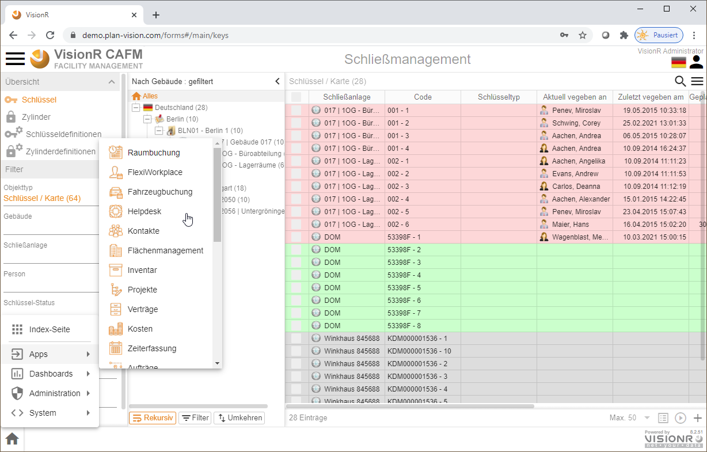
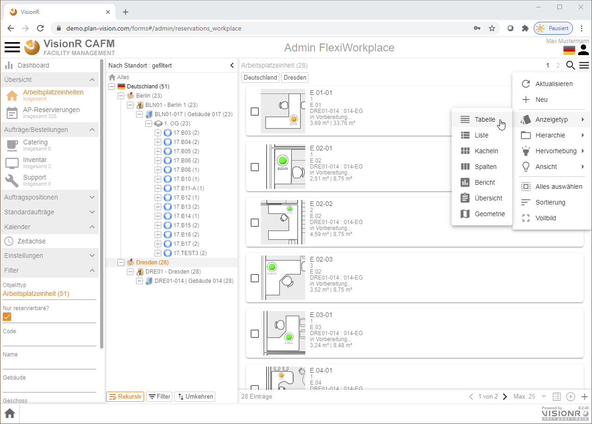
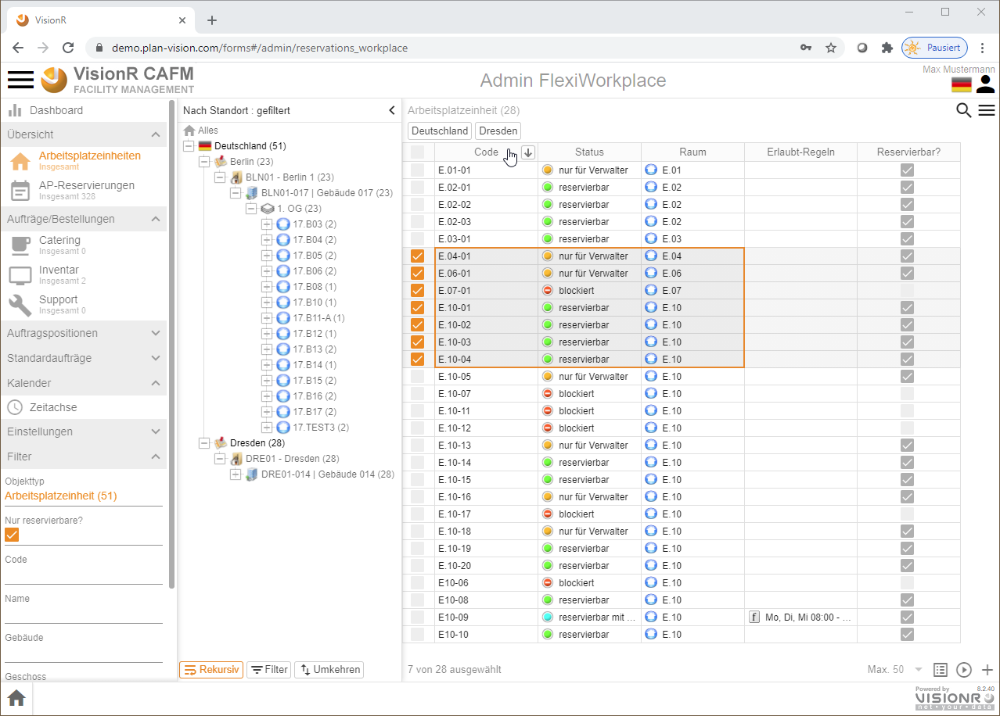
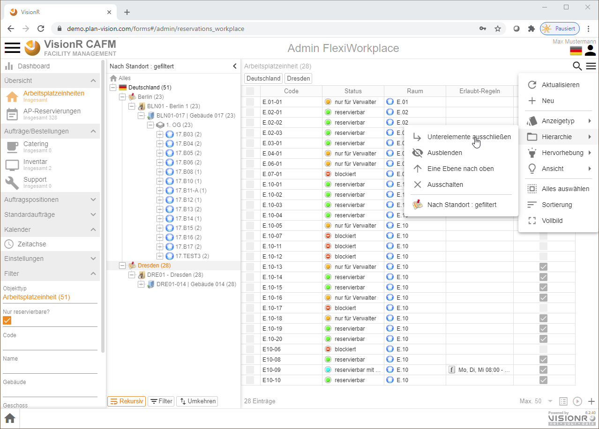
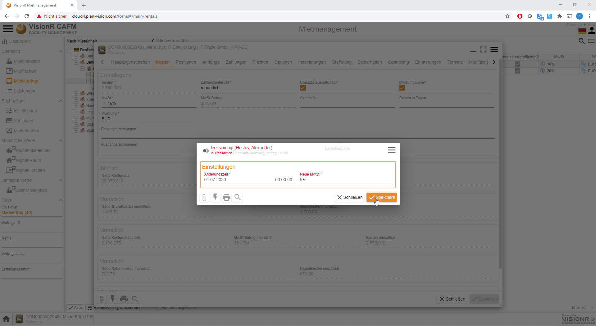

<!-- TITLE: Neue Oberflächen mit Forms (ab Version 7) -->
<!-- SUBTITLE: allgemeines Benutzerhandbuch für Qooxdoo Oberflächen - Neue Oberflächen mit Forms (ab Version 7) -->

<!--  --> 

Deutsch | [English](../../../en/modules/general) | *Sie sind hier: [Home](../../../home) > [Benutzerhandbuch](../user-guide) > Neue Oberflächen mit Forms (ab Version 7)* 

# Bedienung allgemein

## Beschreibung

Im vorliegenden Dokument sind die allgemeinen Funktionalitäten der Benutzeroberfläche in VisionR, wie z. B. Datensätze bearbeiten, Suchen, Filtern, Ansichten, Sortierungen usw., beschrieben. 

## Übersicht Applikationsmaske
Rufen Sie die Indexseite auf, indem Sie die folgende Adresse in dem Browser eingeben:

`https://[VisionR-Adresse]/forms`

Nachdem Sie Sich eingeloggt haben, wird die Indexseite geladen. Die Indexseite sieht ab dem Version 8.0 folgendermaßen aus:

*Bild 1: VisionR-Login*

Die Index-Seite wird geladen. Auf der Indexseite sind Registerkarten vorhanden, die die Hauptbereiche der VisionR-Applikation darstellen:
* **Apps** hier sind die Modul-Masken erreichbar, die für normale Benutzer zur Verfügung stehen
* **Administration** diese Registerkarte enthält zwei Unterregister:
+ **Module** hier sind die Modul-Masken erreichbar, die für die Bearbeitung der Stammdaten und allgemeine administrative Aufgaben für Power User zur Verfügung stehen 
+ **System** hier sind Systemmodule, wie Berichte, Benutzerverwaltung, geplante Tasks usw. erreichbar
* **Dashboards** hier sind modulweise Dashboards zum jeweiligen Unterprozess verfügbar
* **Version 7** hier sind die alten Benutzeroberflächen aus Kompatibilitätsgründen bei Bestandskunden noch erreichbar. In der Regel brauchen Sie die hier angebotenen Funktionalitäten ab Version 8.0 nicht mehr

*Bild 2: Indexseite > Registerkarte `Apps`*

*Bild 3: Indexseite > Registerkarte `Administration` > Unterregister `Module`*

*Bild 4: Indexseite > Registerkarte `Administration` > Unterregister `System`*

## Bedienung allgemein

Der Button mit den drei Strichen oben links öffnet das Hauptmenü. Das Menü ist auf mobilen Geräten aus Platzgründen automatisch versteckt. In der Desktopversion wird das Hauptmenü automatisch angezeigt. Abwechselndes Klicken auf den`Menü`-Button zeigt oder verbirgt das Menü, je nachdem welcher der aktuelle Status ist. Der `Menü`-Button ist auf allen Masken verfügbar. Durch Klick auf einen Menüeintrag in der Liste öffnen Sie die entsprechende Maske mit den in diesem Dokument beschriebenen Funktionalitäten. Der Name der aktiven Maske wird in orangener Farbe hervorgehoben.

*Bild 5: Hauptmenü über die drei Striche neben dem Logo ein/aus* 

Ein Klick auf die Ikone  neben den drei Strichen oben links führt zur VisionR-Indexseite. Wenn Sie das Modul FlexiWorkplace verlassen und zur Indexseite springen möchten, müssen Sie auf den Button mit dem Häkchen zur Bestätigung klicken (siehe Bild 3). Bei Abbrechen bleiben Sie auf der aktuellen Maske.

*Bild 6: Zur Indexseite zurückkehren* 

Bei Klick auf den `Home`-Button ganz unten links wird ein Menu mit den vorhandenen Apps angezeigt. Dieser Button ist nur in der Desktop App sichtbar. Mobil muss der Klick auf das Logo oben links verwendet werden. Bei Klick auf einen Menüeintrag werden Sie zur gewünschten App umgeleitet. Vorher muss das Verlassen der aktuellen App bestätigt werden (siehe Bild oben).

*Bild 7: Eine andere App direkt aufrufen*

Standardmäßig werden die Datenobjekte in Tabellen-Ansicht angezeigt. Wenn Sie mehrere Datenspalten sehen möchten oder Mehrfachmarkierungen und Sortierungen vornehmen möchten, ist die Tabellensicht dafür geeigneter. Zur Tabellenansicht gelangen Sie, indem Sie die drei Striche rechts unterhalb der Benutzerikone anklicken. Dabei wird das Menü für die Objektansicht angezeigt. Dieses Menü bezieht sich auf die Inhalte des  gerade betrachteten Datenobjektes (in diesem Fall Arbeitsplatzeinheit). Bei anderen Datenobjektansichten (Catering, Inventar usw.) ist der Objektmenü-Button oben rechts ebenfalls vorhanden.

*Bild 8: Aufrufen des Kontextmenüs für Datenobjekt* 

# Bereiche der Benutzeroberfläche

In den alphanumerischen Modulen sind die Ansichten ähnlich aufgebaut. Links im Hauptmenü sind immer die Datenobjekte aus dem Modul, daneben ist die hierarchische Baumstruktur, mit der die Daten besser und effizienter gefiltert und dargestellt werden. Rechts daneben befindet sich die Objektdatenansicht, in der die Daten als Tabelle, Liste, Kacheln, Geometrie, Hierarchie o.ä. dargestellt sind. 

*Bild 9: Beispiel Tabellenansicht*

Im Beispiel mit der Tabellenansicht sind folgende Hauptbereiche der Applikation zu erkennen:

* **Hauptmenü:** Auf der linken Seite befindet sich das Hauptmenü, das über die drei Striche neben dem Logo ein- und ausschalten werden kann. 
* **Baumansicht:** Rechts vom Hauptmenü befindet sich eine Baumansicht. In der Baumansicht können die Daten der Hauptansicht rechts daneben (Tabelle, Liste, Kacheln usw.) hierarchisch angezeigt und schnell gefiltert werden. Die Baumansicht kann mehrere Hierarchien enthalten. Eine Liste der vorhandenen Hierarchien ist bei Klick auf den Textfeld über den Button `Alles` zu sehen. Im unteren Bereich der Baumansicht gibt es drei Buttons, die ein- und ausgeschaltet werden können:
  + **`Rekursiv`** - bei `an` werden alle in den Unterordnern enthaltenen Datensätze links in der Tabelle angezeigt.
  + **`Filter`** - bei `an` werden die Baumstrukturelemente (Ordner) ausgeblendet, falls keine Daten darin einhalten sind.
  + **`Umkehren`** - bei `an` werden alle Datensätze in der Tabelle angezeigt, die nicht dem ausgewählten Ordner zuzuordnen sind.
* **Datenbereich:** Rechts von der Baumansicht befindet sich die Datenansicht, die in Form von Tabelle, Liste, Kacheln, Geometrie usw. dargestellt werden kann. Ein Kontextmenü für die Daten mit allen vorhandenen Optionen (wie z. B. Neu, Bearbeiten, Löschen, Hierarchie, Einfärbung usw.) ist bei Klick auf die drei Striche unter der Benutzerikone oben rechts aufrufbar. Alternativ kann das Kontextmenü für die Daten im Tabellenbereich mit Rechtsklick aufgerufen werden (siehe Bilder unten).
* **Suchfeld:** Über dem Datenbereich befindet sich eine Lupe rechts oben, die bei Klick eine Suchleiste anzeigen lässt. Diese Leiste kann für schnelle Datensuche auf vordefinierte Spalten genutzt werden. Weitere Optionen für die Suche, wie z. B. Suche nach bestimmten Spalten, Datengruppierungen usw., sind in den drei Punkten auf der rechten Seite des Suchfeldes enthalten.
* **Tabellenüberschriften** Die Tabellenüberschriften können für schnelle Datensortierung genutzt werden. Bei erstem Klick auf die Überschrift einer Spalte werden die Daten aufsteigend und bei erneutem Klick absteigend sortiert. Zwischen den Spaltennamen können Die Spaltenbreiten dynamisch mit der Maus nach links oder rechts angepasst werden. Ein Rechtsklick auf die Überschriften zeigt ein Menü mit Optionen für die Tabelle insgesamt und für die gerade angeklickte Spalte. Eine nützliche Gruppierungsfunktion kann an dieser Stelle ein- und ausgeschaltet werden.

*Bild 10: Daten-Kontextmenü über die drei Striche oben rechts - 1. Aufrufmöglichkeit*

*Bild 11: Daten-Kontextmenü mit Rechtsklick im Datenbereich - 2. Aufrufmöglichkeit*

*Bild 12: Suchfeld über der Datenansicht (Tabelle/Liste/Kacheln)*

*Bild 13: Suchoptionen auf die drei Punkte `...` am rechten Ende der Suchleiste*

*Bild 14: Rechtsklick auf die Tabellenspalten-Überschriften zeigt Zusatzoptionen*

# Datenbereich
Das System hat mehrere vordefinierten Anzeigen. Die Standardanzeige ist die Tabelle. Da werden die Daten bezüglich der ausgewählten Filter in einer Tabelle angezeigt. Die mögliche Ansichten sind: 

* **Tabelle**
* **Liste**
* **Kacheln**
* **Spalten**
* **Geometrie** falls das Modul Web-CAD verfügbar ist und das Datenobjekt Verknüpfungen in Plänen hat
* **Hierarchie** spezielle Ansicht bei bestimmten Datenobjekten, die nicht allgemein verfügbar ist

Die Ansichten sind aus dem Menü oben rechts aufrufbar, wie auf die folgende Abbildung gezeigt ist. 

*Bild 15: Tabellen-Ansicht*

In dieser Ansicht können Sie die Datensätze direkt in der Tabelle bearbeiten oder in der Formularansicht aufmachen und bearbeiten. Die Bearbeitung wird separat beschrieben. 

*Bild 16: Listen-Ansicht*

*Bild 17: Kacheln-Ansicht*

*Bild 18: Spalten-Ansicht*

## Anzeige anpassen

In der Standardansicht (die Tabelle) entspricht eine Zeile einem Datensatz. Die Spalten stellen die sichtbaren Eigenschaften dieser Objektgruppe dar. Sie können diese Ansicht anpassen, indem Sie selber bestimmen können, welche Spalten (Eigenschaften) sichtbar sind. 
Die Standardspalten sind vordefiniert und werden angezeigt. Sie haben aber die Möglichkeit diese Ansicht anzupassen und bestimmte Spalten ausschalten ggf. hinzufügen. Die Ansicht bleibt dann für diese Objektdefinition und Benutzer gespeichert. 

### Spalte hinzufügen

Damit Sie eine Spalte hinzufügen können, klicken Sie mit der rechten Maustaste auf die Überschrift der Tabelle und wählen Sie die Option `Spalte einblenden`. 

 hinzufügen")

*Bild 19: Spalte einblenden*

Wählen Sie die Eigenschaft, die Sie hinzufügen möchten. Falls diese Eigenschaft nicht eingeschaltet ist, wird sie als Spalte angezeigt. Klicken Sie anschließend auf 'Bestätigen'. Die Spalte wird in der Tabelle angezeigt.

*Bild 20: Eigenschaft zum Einblenden auswählen*

Sie können Die Spalte links oder recht ziehen und an der gewünschten Position verschieben. 

*Bild 21: Spaltenbreite einstellen*

### Spalte ausblenden

Mit rechter Mausklick auf die Überschrift der Tabelle klicken und dann auf `Ausblenden` klicken.

*Bild 22: Spalte ausblenden*

# Hierarchie

Die Hierachie hilft Ihnen die Daten besser darzustellen und die Daten nach bestimmten (vordefinierten) Krieterien zusammenzufassen. 
Die Hierachie wählen Sie aus dem Menü über die Hierarchie selbst. 

*Bild 23: Hierarchie wechseln*

Deaktivieren, Ein- und Ausschalten der Hierarchie führen Sie über das *Funktionsmenü > Hierarchie* durch. 

*Bild 24: Hierarchie ein- und ausblenden*

> **Hinweis:** Auf dem Screenshot sind die Personen nach Abteilung sortiert. Die folgende Abbildung zeigt die selben Daten nach *Standort* sortiert.

*Bild 25: Beispiel Hierarchie nach Standort*

> **Bemerkung:** Die Hierarchien sind in zwei Typen unterteilt - *ungefiltert* und *gefiltert*. *Gefilterte* Hierarchien zeigen nur die Ebenen, die tatsächlich mit Daten verknüpft sind. Sonst werden sie nicht gezeigt. Bei den *ungefilterten* (alle anderen) werden die Ebenen dargestellt, unabhängig davon, ob sie Daten beinhalten.

## Hierarchie wechseln

Die Hierarchie wechseln Sie mit Auswahl einer anderen Hierarchie aus dem Menü darüber. Alle vordefinierten Hierararchien für die ausgewählte Objektgruppe werden gezeigt. Die Abbildungen darüber zeigen einie Beispiele dafür. 

## Hierarchie ein- und ausblenden, ein- und ausschalten

Sie können die Hierarchie *ausblenden* und *einblenden* oder komplett *aus-* und wieder *einschalten*. 

> **Ausblenden**

*Bild 26: Hierarchie ausblenden*

> **Hinweis:** Die ausgeblendete Hierarchie ist weiterhin aktiv. Die aktiven Kriterien sind über die Tabelle gezeigt und Sie können diese direkt auswählen und die Daten filtern.

> **Einblenden**

*Bild 27: Hierarchie einblenden*

> **Ausschalten**

In dem selben Menü haben Sie die Option, die Hierarchie auszuschalten. Klicken Sie auf die Option und die Hierarchie wird komplett ausgeblendet und die Daten werden nicht mehr nach diesen Kriterien gefiltert sein.

> **Einschalten**

Um die Hierarchie wieder aktiv und sichtbar machen, wählen Sie aus dem Menü eine Hierarchie, die aktiviert werden muss. Die Struktur wird geladen. 

*Bild 28: Hierarchie einschalten*

*Bild 29: Hierarchie auswählen*

Die Hierarchie wird angezeigt und sieht beispielsweise so aus:

*Bild 30: Hierarchie nach den einschalten*

# Filter

Auf der linken Seite sind auch Filters eingebaut. Sie können die Filter nutzen, um die Daten in der Tabelle schnell filtern zu können. Die Filter sind unterschiedlich für die unterschiedlichen Objekte. Auf den nächsten Screenshot sind die Kontakte ausgewählt und die Filter darunter beziehen sich auf diese Objektdefinition.

*Bild 31: Beispiel "Kontakte"*

Die Daten werden nach den angegebenen Kriterien gefilter und angezeigt. 

**Beispiel:** *Personen*

*Bild 32: Beispiel "Personen"*

Bei den Personen sind mehrere Filter vordefiniert, wie: 
* Objekttyp
* Personal-ID
* Name
* Vorname
* Telefon
* Abteilung
* Kostenstelle
* Gebäude / Raum
* Status
* Erstellungsdatum

*Bild 33: Personen mit aktiven Filter 'Objektdefinition = Mitarbeiter'*

# Suchen / Gruppieren
Sie haben neben den Filtern auch die Suchfunktion. Sie können von einfachen bis sehr komplexen Suchen in die Tiefe durchführen. 
Die Suchfunktion rufen Sie mit Klick auf dem Button 'Suchen' oben rechts über den Arbeitsbereich (Tabelle / Liste / Kacheln / Spalten). 

*Bild 34: Suchen*

## Einfache Suche

*Bild 35: Einfache Suche*

In dem Feld geben Sie die Zeichenkette, nach der gesucht wird. 

>**Beispiel:** wir suchen nach einer oder mehreren Person/en mit Nachname 'Mustermann'. 

*Bild 36: Einfache Suche nach 'Mustermann'*

> **Hinweis:** Jede Suche wird über die Tabelle in 'oranger' Farbe angezeigt. Falls Sie eine zusätzliche Suche danach durchlaufen lassen, wird diese Suche oben hinzugefügt. Sie können so mehrere Suchkriterien nacheinander anwenden oder unterschiedliche Kriterien kombinieren. 

> **Bemerkung UND / ODER:** Wenn Sie mehrere Suchkriterien kombinieren möchten, müssen Sie den Operator richtig wählen. Vordefiniert ist der Operator 'UND'. Also jede Zeichenkette, die Sie eingeben wird hinzugefügt. Falls Sie den Operator 'ODER' nutzen möchten, müssen Sie ihn bei den Kriterien ändern. 

### Und 

Das nächste Beispiel zeigt den Operator 'UND'. Wir möchten alle Personen finden, die 'Daniel' heißen. 

>**Beispiel:** wir suchen nach einer oder mehreren Person/en mit Vorname 'Daniel'. 

*Bild 37: Suchleiste: Schritt 1*

Die Suche liefert zwei Ergebnisse. Jetzt fügen wir einfach neue Suche für den Nachname des Herren, damit wir den richtigen finden.

Wir suchen nach der Zeichenkette 'Wil', um das Ergebnis zu verfeinern. 

*Bild 38: Suchleiste: Schritt 2*

So können Sie weitere Suchkriterien hinzufügen.

> **Hinweis:** Wenn Sie die erste Suche durchführen, wird das Suchkriterium oben 'orange' markiert. D.h. dieses Kriterium wird bei nächster Suche ersetzt. Damit dieser nicht aktiv ist, klicken Sie einfach daneben. Mit Klick darauf wird er aktiv und Sie können es ersetzen, indem Sie neue Suchkette eingeben. Falls es nicht aktiv ist, wird die Suche mit 'UND' hinzugefügt.

Wenn Sie nach Personen oder Kontakten suchen, können Sie direkt nach den folgenden Mustern suchen:
* 'Vorname Name'
* 'Name Vorname'
* 'Name, Vorname'

>**Beispiel:** Das gleiche Ergebnis wie oben in einem Schritt. Mögliche Suche wäre: 'williams dan' / 'williams, dan' / 'daniel wil'

*Bild 39: Suchleiste: Suche nach Vor- und Nachnamen*

### Oder

Sie können den Operator 'UND' an jeder Stelle mit 'ODER' ersetzen und so Ihre Suche noch verfeinern. Standardmäßig ist 'UND' gesetzt. Damit Sie ihn ersetzen, wählen Sie die Suchkriterien mit Halten der STRG-Taste und dann klicken Sie auf Button '<...>' auf der rechten Seite. Dieser Klick wird den Operator auf 'ODER' umstellen. 
Falls der Operator 'ODER' ist, können Sie auf dieser Weise ihn wieder auf 'UND' umstellen. 

Das nächste Beispiel zeigt den Vorgang.

>**Beispiel:** wir suchen nach Personen mit Nachname 'Daniel' und nach Personen mit Vorname 'Angelika'. Wir möchten alle Personen, die Angelika oder Daniel heißen, auflisten.  
Diese Suche wird keine Ergebnisse liefern, da der Operator noch 'UND' ist. 

*Bild 40: Einfache Suche mit 'ODER' (1)*

Wir ändern den Operator. Das Ergebnis sieht so aus:

*Bild 41: Einfache Suche mit 'ODER' (2)*

> **Hinweis:** Die Suchkriterien können Sie frei kombinieren. Sie können ein Kriterium löschen oder mit anderem Operator verknüpfen. 

## Erweiterte Suche

Die erweiterte Suche bietet Ihnen die Möglichkeit, selber zu bestimmen, welches Feld durchgesucht wird. Sie haben die Möglichkeit verknüpfte Objekte und deren Felder durchzusuchen - die so genannte 'Suche in die Tiefe'.

Zum **Beispiel** möchten wir nach Personen suchen, die eine bestimmte Abteilung haben. Dieser Vorgang kann auch mit 'Gruppieren' nach Abteilung erledigt werden.

Klicken Sie auf das Suchsymbol und dann auf die drei Punkte > `Suchen nach`, um ein Suchfenster aufzumachen. 

*Bild 42: Erweiterte Suche*

In dem angezeigten Fenster geben Sie die Eigenschaft, die Sie durchsuchen möchten.

*Bild 43: Erweiterte Suche. Eigenschaft auswählen (1)*

Dann entscheiden Sie, ob Sie die gesamte Eigenschaft durchsuchen möchten oder nur bestimmten Spalten / Eigenschaften.

*Bild 44: Erweiterte Suche. Eigenschaft auswählen (2)*

Falls die Suche einer bestimmten Spalte erwünscht ist, klicken Sie auf das '+' Symbol und wählen Sie aus der Eigenschaftsliste der darüberliegenden Eigenschaft.

*Bild 45: Erweiterte Suche. Eigenschafts-Pfade nutzen*

Geben Sie eine Zeichenkette ein, die für die Suche genutzt werden soll.

*Bild 46: Erweiterte Suche: Operator und Zeichenkette eingeben*

Das Ergebniss sieht so aus.

*Bild 47: Erweiterte Suche: Suchergebnis*

>**Hinweis:** Die mögliche Operationen, die zur Verfügung stehen. 

*Bild 48: Erweiterte Suche: Operationen*

## Suche zurücksetzen / leeren

Damit Sie die Suche zurücksetzen oder leeren, müssen Sie die Suchkriterien schliessen - mit Klick auf 'x'. Die Suche wird zurcükgesetzt.

## Suche anpassen

Sie haben die Möglichkeit die Suche anzupassen. Standardmäßig sind die wichtigsten Eigenschaften wie 'Code' , 'Name' etc. in der Suche einbezogen, aber Sie können die Suchfelder auch selber anpassen. Dafür steht die Option 'Anpassen'.

*Bild 49: Suche anpassen*

In dem angezeigten Fenster geben Sie die gewünschte Eigenschaft ein und fügen Sie diese ein. Sie können mehrere Eigenschaften hinzufügen, damit Sie die Felder explizit bestimmen, die durchgesucht werden. Diese Anpassung wird gespeichert und die Zeichenkette, die Sie in dem Feld eingeben, wird in den von Ihnen festgelegten Feldern gesucht.

*Bild 50: Sucheinstellungen*

> **Hinweis:** Falls eine Eigenschaft ein verknüpftes Objekt ist, können Sie auch Eigenschaften dieses Objektes einbeziehen. Dafür wählen Sie die gewünschte Eigenschaft aus oder falls diese Eigenschaft wiederum ein verknüpftes Objekt ist, können Sie nach Bedarf auch tiefer suchen. 

Wählen Sie die Eigenschaft zuerst:

*Bild 51: Eigenschaft auswählen*

Wählen Sie welche Folgeeigenschaft der ausgewälten Eigenschaft durchsucht werden soll:

*Bild 52: Eigenschaftspfad auswählen*

So wird in die Tiefe gesucht, zum Beispiel wir suchen alle Personen, die in irgendeinem Gebäude sitzen, das sich in Deutschland befindet. Theoretisch können wir es so formulieren - "Wir suchen alle Personen durch und geben diese aus, die eine Gebäudezuordnung haben, wobei Gebäude.Land.Name = Deutschland ist."

*[Screenshots werden nachgeladen...]*

## Gruppieren

Die Funktion gruppiert die Daten nach einem dem ausgewählten Kriterium. Sie können die schon gruppierten Daten leicht in einer Tabelle aufrufen und bearbeiten oder weiter gruppieren oder durchsuchen.

>**Beispiel:** Gruppierung der Kontakte nach 'Name' und Auswahl einen Teil dieser Gruppierung. 

*Bild 53: Auswahl der Eigenschaft*

*Bild 54: Ergebniss der Gruppierung zum Auswählen*

*Bild 55: Auswahl der Gruppen*

*Bild 56: Suchergebnis*

# Neues Objekt erstellen
Ein neues Objekt erstellen Sie mit der Option `Neu` in dem Menü oben rechts über die Tabelle oder in dem Menü, das Sie mit der rechten Maustaste über die angezeigte Tabelle aufrufen können. 

*Bild 57: Neues Datenobjekt erstellen*

Die mögliche Objekttypen werden angezeigt (nur falls mehrere Typen zur Verfügung stehen). 

>**Beispiel:** Erstellen eine neue Person. Mit Klick auf `Neu` werden die folgenden Objekttypen zur Auswahl angeboten. 

*Bild 58: Objekttyp für neues Datenobjekt auswählen*

Nachdem Sie den Type ausgewählt haben, können Sie mit der Dateneingabe fortfahren. Nachdem Sie die Eingaben gemacht haben, können Sie den Datensatz speichern.

*Bild 59: Daten bei neuem Datenobjekt eingeben*

# Bearbeiten

Die Bearbeitung erfolgt in der Formularansicht oder direkt in der Zelle in der Tabelle, falls Sie die Daten in der Tabelle anzeigen lassen. Die Ansichten sind in dem Abschnitt 'Anzeigen' beschrieben. Standardmäßig ist die Ansicht 'Tabelle' aktiv und die Datensätze werden als Zeilen angezeigt. Die Spalten sind die Eigenschaften und diese können Sie bearbeiten. 

Damit Sie einen Datensatz zur Bearbeitung aufmachen, klicken Sie auf der Tabellenzeile und dann mit Doppelklick (alternativ wählen Sie den Datensatz und mir rechter Maustaste rufen Sie das Menü auf und dann wählen Sie die Option`Bearbeiten`) öffnen Sie den Überblick der Datensatz. Die wichtigsten Informationen werden angezeigt.

*Bild 60: Datensatz bearbeiten*

*Bild 61: Datensatz bearbeiten: Variante 2*

Sie können hier direkt ein Dokument / eine Datei oder einen Unterschfirt hochladen und mit dem Objekt verknüpfen. Dafür steht die Option 'Hochladen'.  In dem Angezeigtem Fenster können Sie per Drag & Drop die Datei hochladen. Der Button `Hinzufügen` bietet Ihnen die unterschiedlichen Optionen. 

Unabhängig ob Sie die Bearbeitung in der Tabelle oder in der Formularansicht machen, gibt es einige Feldertypen, die wir hier kurz beschreiben.

## Feldertypen

Jedes Feld ist mit einem Symbol gekennzeichnet, damit Sie den Typ erkennen. Die verknüpften Auswahlfelder sind mit dem Menüsymbol gekennzeichnet. 

### Textfelder

Die Textfelder sind einfache Eingabefelder. 

*Bild 62: Bearbeitung Textfeld*

Hier können Sie einfache Zeichenketten eingeben. 

### Datumsfelder

Das Datum können Sie über das Kalendarsymbol eingeben (alternativ mit Doppelklick auf dem Feld) oder direkt in dem Feld in der richtigen Format. Das Format hängt auch von der aktiven Sprache - z.B. wenn das System auf Deutsch bedient wird, wird das Datumformat TTMMJJJJ sein. Wenn das System auf US Englisch bedient wird, ist das Format MMTTJJJ etc. 

*Bild 63: Bearbeitung Datumsfeld*

### Verknüpfte Auswahlfelder

In diesem Feld können Sie ein VisionR Objekt verknüpfen. Das Obejkt muss zuerst vorhanden sein und Sie können dieses in dem Feld auswählen. Falls das Objekt noch nicht erstellt ist, können Sie dieses direkt an der Stelle erstellen. 

>**Beispiel:** In dem Objekt `Person` ist das Feld `Gebäude` ein Auswahlfeld. Falls wir auf das Feld klicken, werden alle Gebäude aufgelistet, die zu der ausgewählten Liegenschaft gehören. Falls die Liegenschaft nicht ausgewählt ist, werden alle angezeigt. 

*Bild 64: Bearbeitung Datenreferenz (1)*

> **Hinweis:** Die Auswahlfelder sind sehr oft gefiltert angezeit. Z.B. falls ein Gebäude ausgewählt ist, dann werden nur die Räume zur Auswahl zur Verfügung gestellt, die zu diesem Gebäude gehören. Falls die Etage des Gebäude vor dem Raum gewählt wird, werden nur Räume aus diesem Geschoss angezeigt.

Falls das Objekt nicht vorhanden ist, können Sie es direkt über das `Menü -> Neues Objekt` erstellen. Die Option `Auswählen` werden die Objekte, die hier verknüpft werden können,  in einer separaten Tabelle aufgemacht und Sie können das gewünschte Objekt aus der Tabelle wählen. 

*Bild 65: Bearbeitung Datenreferenz (2)*

> **hinweis:** Die angezeigte Tabelle ist identisch mit der Tabelle `Gebäude`, die in dem Modul `Flächenmanagement` verfügbar ist.  

### Tabellen

Es gibt eine spezielle Eingabe in dem System. Es gibt Felder, die eine mehrfache Eingabe erlauben. Dann werden die verknüpften Datensätze als kleine *Tabelle* gezeigt. 

>**Beispiel:** In dem Objekt `Raum` ist das Feld `Personen` ein mehrfaches Auswahlfeld, also eine Tabelle - in einem Raum können mehrere Personen sitzen. Hier werden mehrere Objekte verknüpft. Hier ist der Raumdatensatz aufgemacht und in der Registerkarte *Belegung* ist die Tabelle mit den Personen. 

*Bild 66: Datensatz finden*

Mit Klick auf das Feld werden die Personen aufgelistet. Sie können direkt die gewünschte Person auswählen und danach mit dem Button `+` den Auswahl hinzufügen. Die Person erscheint in der Tabelle. So können Sie weitere Personen hinzufügen. Falls die Person nicht vorhanden ist, können Sie sie direkt über das Menü -> `Neues Objekt` erstellen. 

*Bild 67: Datensatz hinzufügen*

*Bild 68: Zweiten Datensatz hinzufügen*

> **Hinweis:** Wenn eine Person mit einem Raum veknüpft wird, wird diese Person in der Tabelle `Personen` in dem Objekt `Raum` auch erscheinen. Falls ich die Person zu dem Raum hinzufüge, wird die Person- Raum zuordnung in dem Datensatz `Person` automatisch erstellt.

## Bearbeitung in Formularansicht

Mit Klick auf den Button `Bearbeiten` wird der Datensatz in Formularansicht aufgemacht. Sie können die Felder bearbeiten. 

*Bild 69: Zweiten Datensatz hinzufügen*

Die Formularansicht ist in **Registerkarten** und Bereiche innerhalb dieser Registerkarten unterteilt. Diese Gruppierung ist nach den Eigenschaften der verknüpften Felder. Die wichtigste sind immer in der Registerkarte `Haupteigenschaften`.  Falls Sie ein Feld (Eigenschaft) nicht finden, können Sie den Such-Button unten nutzen. Dieser ist für Suchen von Eigenschaften innerhalb des Objektes. Das System wird Sie zu dem Feld weitergeleitet. 

Die Bearbeitung erfolgt direkt in den Felder, falls Sie ein Pflichtfeld nicht ausgefüllt haben, wird das System Ihnen benachrichtigen und Sie können das Objekt nicht speichern, bis Sie die erforderlichen Angaben nicht gemacht haben. Die Pflichfelder kann man anpassen. 

Machen Sie die gewünschten Angaben hinsichtlich des Feldtyps. Anschließend speichern Sie den Datensatz.  Die Feldertypen sind oben beschrieben. 

>**Bemerkung:** Wenn Sie ein Objekt bearbeiten bzw. erstellen, können Sie jedes verknüpftes Objekt mit Doppelklick zur Bearbeitung aufmachen. Die Vorgehensweise ist komplett identisch mit der hier beschriebenen. 

## Mehrfachbearbeitung

Sie können mehrere Objekte gleichzeitig in der Formularansicht bearbeiten. Dafür wählen Sie die gewünschen Objekte aus und dann klicken Sie auf `Bearbeiten`. Die Objekte werden alle gleichzeitig aufgemacht und Sie können Änderungen für ein Objekt oder für alle durchführen. 

Wählen Sie die gewünschten Objekte aus - Sie können mit dem Mauszeiger über die Zellen ziehen und alle darunterliegenden Zeilen werden ausgewählt. Alternativ, können Sie die Zeilen mit Halten der `Strg` Taste einzeln zu der Auswahl hinzufügen oder mit der Umschaltetaste protionsweise.

*Bild 70: Datensätze auswählen*

Dann klicken Sie auf `Bearbeiten` und die ausgewählten Datensätze werden in der Formularansicht angezeigt. Oben in der Mitte steht die Anzahl Objekte und Sie können diese einzeln aufrufen und bearbeiten. Sie können einen Datensatz bearbeiten und die Änderungen auf allen Datensätze übertragen. Somit können Sie eine Änderung für alle Datensätze in einem Schritt durchführen. 

*Bild 71: Datensatz in Formularansicht öffnen*

>**Beispiel:** Wir ordnen die Personen eine Kostenstelle zu. Damit wir nicht jeder Person einzeln aufmachen und mit der gleichen Kostenstelle verknüpfen, machen wir die Zuordnung in einem Schritt. 

*Bild 72: Mehrfachbearbeitung: Eigenschaft ändern*

Anschließend speichern wir den Vorgang. Das System fragt, ob die Änderungen nur für die geänderten Datensätze sind oder die Änderung soll für alle Datensätze durchgeführt werden. 

*Bild 73: Mehrfachbearbeitung: Änderung übertragen*

## Bearbeitung in der Tabelle

Die andere Variante Datensetze / Datenfelder zu bearbeiten ist direkt in der Tabelle. Wählen Sie die gewünschte Zelle und dann mit `Eingabetaste` machen Sie genau diese Zelle = Objekteigenschat = Feld in der Formularansicht auf. Abhängig von dem Typ der Eigenschaft können Sie Ihre Eingaben direkt in der Zelle machen.

 in der Tabelle bearbeiten")

*Bild 74: Textfeld in der Tabelle bearbeiten*

 in der Tabelle bearbeiten")

*Bild 75: Auswahlfeld in der Tabelle bearbeiten*

 in der Tabelle bearbeiten")

*Bild 76: Zelle in der Tabelle bearbeiten*

# Datei / Dokument hochladen
Sie können Dateien unabhängig von der Format hochladen. Viele gängige Formate werden unterstützt und werden von System erkannt und angezeigt, wie z.B. PDF, MS Word und Excel, Bilder, Texte etc.. Sonst können auch Dateien hinzugefügt werden, die danach auf dem Server zentral gespeichert bleiben. 

Die einfachere Variante eine Datei hochzuladen ist mit 'Drag & Drop', wenn der gewünschte Datensatz in Lesemodus (Übersicht) aufgemacht ist. 
Finden Sie den gewünschten Datensatz und mit Doppelklick auf die Zeile in der Tabelle wird die Übersicht angezeigt. 

*Bild 77: Bearbeitungsmodus*

Klicken Sie danach auf 'Hochladen' und ziehen Sie die Datei in das angezeigten 'Drag & Drop' - Fenster oder Benutzen Sie die Optionen in dem Menü 'Hinzufügen'. 

*Bild 78: Datei(en) hochladen*

Falls Sie mit 'Hinzufügen' Dateien hochladen und verknüpfen möchten, wird ein Explorer Fenster aufgemacht und Sie können die gewünschten Datei/en auswählen und hochladen. 

*Bild 79: Datei(en) auswählen*

> **Hinweis:** Sie können hier mehrere Dateien in einem Rutsch hochladen. 

Dann müssen Sie den Vorgang bestätigen. Eine Übersicht der Dateien wird angezeigt und Sie können nur bestimmte oder alle bestätigen. 

*Bild 80: Hochladen bestätigen*

Dann erscheinen die Datein in der Vorschau und mit Klick auf eine Datei / Bild wird die Datei aufgemacht und zum Herunterladen zur Verfügung gestellt. 

*Bild 81: Vorschau hochgeladener Datei*

# Unterschift verknüpfen

Das System unterstützt auch Unterschrifte. Sie können Sich digital unterschreiben und direkt diesen Unterschied mit einem Datensatz verknüpfen - zum Beispiel bei einer Schlüsselausgabe oder Rückgabe, Verträge, Leistungen etc.
Die Option ist für jeden Datensatz vorhanden und wird bei der 'Datei hochladen' Option platziert. 
Öffnen Sie den gewünschten Datensatz und klicken Sie auf 'Hochladen'. Aus dem Menü 'Hinzufügen' wählen Sie die Option 'Unterschrift'.

*Bild 82: Datei hochladen*

*Bild 83: Mit Finger, Stift oder Maus unterschreiben*

Unterschreiben Sie mit dem Maus / Finger je nach benutztem Gerät (PC, Tablet, Smartphone, Unterschriftenpad) und bestätigen Sie die Unterschrift. Dann müssen Sie nochmal die Auswahl bestätigen und die Unterschrift wird in der Vorschau angezeigt. Mit Klick auf die verknüpften Dokumenten / Dateien werden diese in einer Vorschaugalerie gezeigt. 

*Bild 84: Ergebnis Unterschrift*

# Historisierung der Daten

# Geplante Änderungen

Zu den Historisierungen der Daten gibt es auch die Möglichkeit Änderungen zu planen und diese von System ausführen lassen. Die Felder, deren Änderungen geplant werden können, sind mit dem Symbol  links gekennzeichnet.  Mit Klick auf diesem Symbol können Sie Änderungen mit Eingabe der Uhrzeit und Datum planen. Alle Änderungen werden protokolliert. 

Die geplanten Änderungen, sowie die Änderungen, die schon in der Vergangenheit liegen (also sie haben stattgefunden), sind alle unter der Menüoption **Änderungen** aufgelistet. 

 ansehen")

> **Beispiel:** wir möchten die Mehrwehrsteuer für einige Monate ändern. Wir können manuell den Prozentsatz ändern, indem wir alle Positionen (oder Verträge) auswählen und den MwSt.-Satz ändern. Sobald dieser Satz wieder genändert werden muss, muss der Benutzer ihn wieder manuell anpassen. Hier soll der Benutzer auch auf die monatlichen Werte aufpassen, damit diese richtzeitig und mit den richtigen Werten ausgegeben werden. Deshalb ist eine geplante Änderung hier sinnvoll. Als Beispiel wird die MwSt. in dem Vertrag. 

*Bild 85: Geplante Änderung (1)*

> Klicken Sie zuerst auf `Aufklappen`, um die Tabelle aufzumachen und in dem angezeigtem Fenster können Sie die geplanten und die schon vergangenen Änderungen sehen. Für eine geplante Änderung bleiben Sie in dem linken Fenster und klicken Sie auf `Neu` über das Menü und in dem angezeigten Fenster geben Sie den gewünschten Wert und das Datum.

*Bild 86: Geplante Änderung (2)*

*Bild 87: Geplante Änderung (3)*

Anschließend den neuen Wert eingeben. Am Ende speichern Sie den Vorgang. Wenn das Datum und die Uhrzeit gekommen ist, wird die Änderung vom System durchgeführt. 

> **Hinweis:** Geplante Änderungen können für unterschiedlichen Objekte erstellt werden. Zum Beispiel so eine Änderung kann man auch in den einzelnen Positionen planen, falls zum Beispiel die Kaltmiete mit anderem MwSt.-Satz als die Nebenkosten ist. Wenn Sie das Symbol für geplanten Änderungen links in dem Feld sehen, können Sie Änderungen planen. 

*Bild 88: Geplante Änderung (4)*

> **Hinweis:** Sobald es eine oder mehr geplante Änderungen für ein Feld existiert, kann der Benutzer dieses Feld nicht bearbeiten. Dafür muss der Benutzer neue geplante Änderung erstellen, damit die Änderung übernommen wird. Eine Änderung kann auch in der Vergangenheit erstellt werden. 

> **Beispiel:** Das Feld Kosten für die folgende Position lässt sich nicht ändern, weil geplante Änderungen für dieses Feld existieren. Änderungen können in diesem Fall nur über **geplante Änderung** realisiert werden. Sie können auch ein Datum in der Vergangenheit setzen, falls die Änderung schon stattgefunden hat. Das Feld ist hier grau hinterlegt. 

*Bild 89: Geplante Änderung (5)*