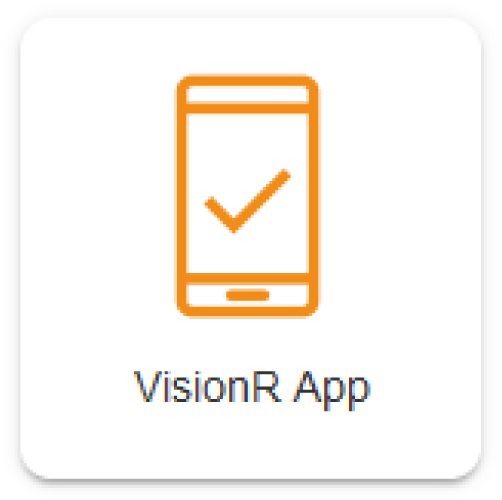

	

    

	
Benutzerhandbuch

	
Mobile App

    
Browser / App

    

    

    

    
Windows / macOS / Linux / iOS / Android

    
ab Version 8.0

    

    

        
Erstellt von Plan-Vision GmbH

    	
Version 1.2 &bull; Stand 23.02.2022

    	
Plan-Vision GmbH &bull; E-Mail: support@plan-vision.com &bull; Web: https://plan-vision.com

    

Deutsch | [English](../de/VisionR9-mobile-app-EN.pdf) | *Sie sind hier: [Home](../../../home) > [System](../system) > VisionR mobile App*

# Inhaltsverzeichnis

[toc]

# Version

**Aktuelle  Version:** 1.2

**Stand:** 23.02.2022

**Verfasser:** Plan-Vision GmbH

# Beschreibung

Dieses Dokument beschreibt wie Sie das System VisionR auf Ihrem mobilen Gerät bedienen. Die Schritte sind fast identisch: 

1. Den Browser auf dem mobilen Gerät aufmachen.
2. Die VisionR Serveradresse eingeben und sich anmelden. 

3. Das gewünschte Modul / alle Module als Applikation speichern.

4. Starten Sie die App

 Sie können das System auch direkt im vorhandenen Browser (Safari, Chrome, Edge etc.) bedienen. 

# App auf iOS-Gerät (iPhone/iPad)

##  Browser auf dem mobilen Gerät starten

In diesem Beispiel nutzen wir Safari. 

*Bild 1: Browser starten*

## Serveradresse eingeben und anmelden 

In der Adressleiste steht unser Demoserver. Hier bitte **die eigene Serveradresse** eintragen (z.B. `https://visionr.ihr-unternehmen.com`).

Bei Erscheinen der Login-Seite müssen Sie sich anmelden.

## Bestimmtes Modul oder Indexseite als App speichern

Sobald die Indexseite geladen ist, können Sie diese als Startseite der Applikation speichern. Alternativ können Sie ein bestimmtes Modul als Applikation speichern, wenn Sie beim nächsten Login direkt auf die gewünschte Seite landen wollen. So können Sie zum Beispiel für jedes Modul eine separate App auf dem Homescreen Ihres Geräts speichern.

### Indexseite als App

Die Indexseite wird alle vorhandenen Module zeigen, sobald Sie Sich angemeldet haben.

Nachdem Sie das Modul / die Indexseite aufgemacht haben, können Sie die Seite speichern.

Dafür klicken Sie auf den Button unten in der Mitte:

***Beispiel 1: Indexseite als App speichern\***

*Bild 2: Index Seite als App speichern*

### Ein bestimmtes Modul als App

Nachdem Sie sich angemeldet haben können Sie zum gewünschten Modul und zur bevorzugten Ansicht hin navigieren.

***Beispiel 2: Modul FlexiWorkplace als App speichern\***

*Bild 3: Das Modul FlexiWorkplace als App speichern*

Finden Sie den Eintrag **„Zum Home-Bildschirm“** und klicken Sie drauf:

*Bild 4: Seite als App auf dem Home-Bildschirm speichern*

Sie können einen eigenen Namen für die App eingeben:

*Bild 5: Die App benennen*

Speichern Sie den Vorgang mit Klick auf „Fertig“.

## Applikation starten

Sie müssen die Applikationsikone auf dem Bildschirm Ihres mobilen Gerätes finden können. Klicken Sie drauf und die App wird gestartet.

*Bild 6: App auf dem Home-Bildschirm ausführen*

Anzeige nach erfolgreicher Anmeldung in der iOS-App:

***Beispiel: FlexiWorkplace als App\***

*Bild 7: Das Modul FlexiWorkplace als App*

# App auf Android-Gerät

## Browser auf dem mobilen Gerät starten

In diesem Beispiel nutzen wir Google Chrome. Jedoch könnte es sein, dass die Einstellung in anderem Browser ähnlich heißt, aber die Funktion ist identisch.

*Bild 8: Browser starten*

## Serveradresse eingeben und anmelden. 

In der Adressleiste steht unser Demoserver. Hier bitte **die eigene Serveradresse** eintragen (z.B. `https://visionr.ihr-unternehmen.com`).

Bei Erscheinen der Login-Seite müssen Sie sich anmelden.

## Das gewünschte Modul / die Indexseite als Applikation auf dem mobilen Gerät speichern

Sobald die Indexseite geladen ist, können Sie diese als Startseite der Applikation speichern. Alternativ können Sie ein bestimmtes Modul als Applikation speichern, wenn Sie beim nächsten Login direkt auf die gewünschte Seite landen wollen. So können Sie zum Beispiel für jedes Modul eine separate App auf dem Homescreen Ihres Geräts speichern.

Die Indexseite wird alle vorhandenen Module zeigen, sobald Sie Sich angemeldet haben.

Nachdem Sie das Modul / die Indexseite aufgemacht haben, können Sie die Seite speichern. 

***Beispiel 1: Indexseite als App speichern\***

*Bild 9: Index Seite als App speichern*

Sobald die Indexseite geladen ist, können Sie diese als Startseite der Applikation speichern. 

Dafür klicken Sie auf die drei Punkte oben rechts (Browsereinstellungen):

***Beispiel 2: FlexiWorkplace als App\***

*Bild 10: Das Modul FlexiWorkplace als App speichern*

Wenn Sie fertig sind, finden Sie den Eintrag **„Zum Startbildschirm zufügen“** und klicken Sie drauf:

*Bild 11: Seite als App zum Startbildschirm zufügen*

Sie können einen eigenen Namen für die App eingeben:

*Bild 12: App benennen*

 Speichern Sie den Vorgang.

## Applikation starten

Sie müssen die Applikationsikone auf dem Bildschirm Ihres mobilen Gerätes finden können. Klicken Sie drauf und die App wird gestartet.

*Bild 13: App ausführen*

Beim Starten der App wird die Anmeldeansicht angezeigt, falls Sie nicht die Option „Angemeldet bleiben“ ausgewählt haben:

*Bild 14: Anmeldung in der App*

Anzeige nach erfolgreicher Anmeldung in der Android-App – als Beispiel alle Module (die Indexseite):

*Bild 15: Index Seite als App*

# Bemerkungen

Die beschriebenen Methoden sind einmal für ein Modul und einmal für die Indexseite. Sie können jede Ansicht aus jedem Modul als Startseite der Applikation speichern. Sie können auch jedes Modul als separate App speichern. Wenn Sie die Indexseite als App anlegen, wird beim Öffnen der App die Kachelansicht aller verfügbaren Module angezeigt.

Falls Sie ein bestimmtes Modul oder Ansicht als App speicher wollen, müssen Sie im Browser dorthin navigieren und dann die Seite zum Startbildschirm hinzufügen.