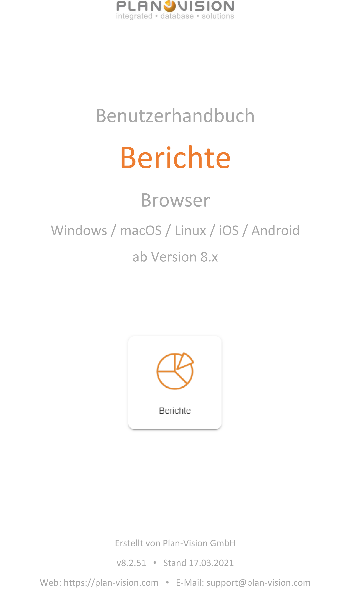
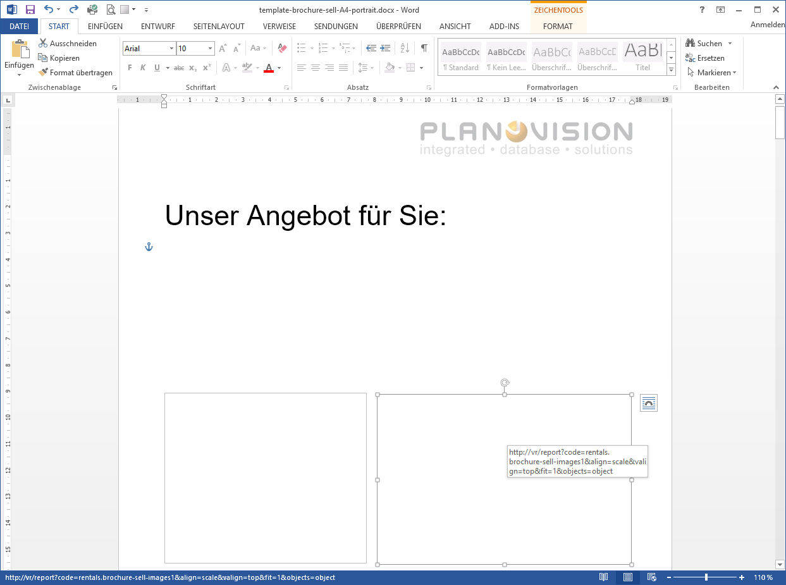
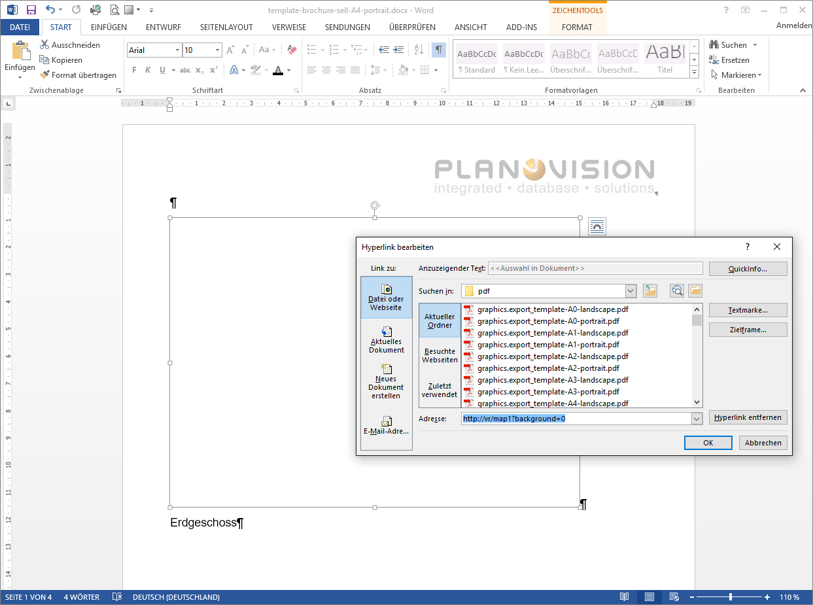

<!-- TITLE: Berichte-->
<!-- SUBTITLE: Überblick Administration Berichte -->

<!--  --> 

Deutsch | [English](../../../en/user-guide/system/reports) | *Sie sind hier: [Home](../../../home) > [Benutzerhandbuch](../user-guide) > Berichte*

# Modul "Berichte"

## Allgemeine Beschreibung

Das  Modul  "Berichte"  ist  Teil  jeder  VisionR  Installation  und  kann  als  leistungsfähiges Werkzeug zur Analyse und Evaluierung der gespeicherten Daten eingesetzt werden. Ein Set  von  Standard-Berichten ist  verfügbar.  Benutzerdefinierte  Berichte  können  leicht  als Summenübersichten, Diagramme, Tabellenansichten usw. erstellt  werden. Automatisch generierte  Berichte  können  als  E-Mail-Anhänge  bei  geplanten  Tasks  mit  verschickt werden. Berichte über die Inhalte externer Datenbanken können erstellt werden, wenn die Datenbanken  im  VisionR  Modul  "Kern"  beschrieben  sind.  Datenexporte  können  in verschiedenen Formaten durchgeführt werden mit Hilfe der VisionR Stylesheet Sprache (VSL).

## Berichtstypen
* Excel-Vorlagen
* HTML-Berichte
* VSP-Berichte

# Vorlagen für Excel-Berichte

## Schleifen

### Schleifen (Loops) mit jt:forEach

|                                                |                     |
| ---------------------------------------------- | ------------------- |
| &lt;jt:forEach items="${object}" var="pos"&gt; |                     |
| Beispielobjekt: ${pos}                         |                     |
|                                                | &lt;/jt:forEach&gt; |

### Neue Seite für jeden Datensatz

|                                                              |                     |
| ------------------------------------------------------------ | ------------------- |
| &lt;jt:forEach items="${object}" var="pos" onLoopProcessed="${PAGEBREAK}"&gt; |                     |
| Beispielobjekt: ${pos}                                       |                     |
|                                                              | &lt;/jt:forEach&gt; |

## Index – fortlaufende Nummern in Schleifen

|                                                         |                     |
| ------------------------------------------------------- | ------------------- |
| <jt:forEach items="${object}" var="pos" indexVar="idx"> |                     |
| ${idx+1}. Beispielobjekt: ${pos}                        |                     |
|                                                         | &lt;/jt:forEach&gt; |

# Datenauswahl

## Mehrere Datensätze abfragen - db.DATA()

|                                                              |                     |
| ------------------------------------------------------------ | ------------------- |
| <jt:forEach items="${db.DATA(db.rentals.contract,<br />\"this, SUM(COALESCE(operating_costs_costs_shares.costs_share,0))\", <br />"operating_costs_costs_shares.accounting_year_object.id=\" <br />+accy.id+\" AND (is_tax_liable=0 OR is_tax_liable IS NULL) <br />GROUP BY id,code ORDER BY id,code DESC\")}" var="con"> |                     |
| Vertrag: ${con[0]}                                           |                     |
| Kostenanteile: ${db.FORMAT_DOUBLE_2(con[1])}                 |                     |
|                                                              | &lt;/jt:forEach&gt; |

> **Bemerkung:** Die Anführungsstriche bei den Angaben innerhalb des db.DATA()-Befehls müssen mit Escape-Zeichen ( \ ) versehen werden,
>  also \“ statt nur “.

## Ein Datensatz als Ergebnis - db.SDATA()

|                                                              |      |
| ------------------------------------------------------------ | ---- |
| ${db.FORMAT_DOUBLE_2(db.SDATA(db.operating_costs.costs_share,<br />"SUM(costs_share)", "contract.id="+con[0].id+" AND <br />accounting_year_object.id="+accy.id+"GROUP BY contract.id "))} € |      |
|                                                              |      |

## Filtern nach ausgewählten Datensätzen mit „id_condition“

|                                                              |                     |
| ------------------------------------------------------------ | ------------------- |
| <jt:forEach items="${db.DATA(db.spaces.floor_covering,\"covering_type,<br />SUM(area),COUNT(space)\",\"space IN (\"+id_condition+\") <br />GROUP BY covering_type ORDER BY covering_type DESC\")}" <br />var="fc" indexVar="idx"> |                     |
| ${idx+1}. Bodenbelag: ${fc[0]}                               |                     |
|                                                              | &lt;/jt:forEach&gt; |

# Formatierung

## Zahlenformate

|                                    |      |
| ---------------------------------- | ---- |
| ${db.FORMAT_DOUBLE_2(con.costs)} € |      |

## Datumformate

|                        |      |
| ---------------------- | ---- |
| ${db.FORMAT_DATE(now)} |      |

## Systemvariablen

|                   |                            |
| ----------------- | -------------------------- |
| Zeitstempel       | ${db.FORMAT_DATETIME(now)} |
| VisionR-Benutzer  | ${user}                    |
| Person            | ${user.person}             |
| Papierformat      | ${paper_format.code}       |
| Papierausrichtung | ${paper_orientation}       |
| Maßstab           | ${scale_str}               |

## Benutzerdefinierte Variablen

### Variable setzen

|                                                              |            |
| ------------------------------------------------------------ | ---------- |
| ${db.SET("GSUM",0.0)}                                        | Beispiel 1 |
| ${db.SET("GSUM",db.SDATA(db.spaces.space,"SUM(area)","id IN ("+id_condition+")"))} | Beispiel 2 |

### Variable ausgeben

|                    |      |
| ------------------ | ---- |
| ${db.GET ("GSUM")} |      |

### Variable setzen und gleichzeitig ausgeben

|                                                              |      |
| ------------------------------------------------------------ | ---- |
| ${db.ESET("GSUM",db.SDATA(db.spaces.space,"SUM(area)","id IN ("+id_condition+")"))} |      |

# Bedingungen

## Mehrere Zellen

|                                                              |               |               |                |
| ------------------------------------------------------------ | ------------- | ------------- | -------------- |
| <jt:if test="${db.SDATA_SUM(db.operating_costs.costs_share,<br />\"SUM(costs_share)\", \"contract.id=\"+con[0].id+<br />\" AND is_tax_relevant=1 AND <br />accounting_year_object.id=\"+accy.id+<br />\"GROUP BY contract.id \") > 0}"> | Überschrift 1 | Überschrift 2 | &lt;/jt:if&gt; |

## Werte in einer Zelle

|                                                              |      |
| ------------------------------------------------------------ | ---- |
| <jt:if test="${(con[3]-db.GET(\"SUMT\")) > 0.0}" <br />then="${db.FORMAT_DOUBLE_2(con[3]-db.GET(\"SUMN\")-(con[3]-db.GET(\"SUMN\"))\*con[0].vat.amount)} €" <br />else="${db.FORMAT_DOUBLE_2(-(con[3]-db.GET(\"SUMN\")-(con[3]-db.GET(\"SUMN\"))\*con[0].vat.amount))} €"/> |      |

## Zellenformatierung

### Einfärbung

|                                                              |      |
| ------------------------------------------------------------ | ---- |
| <jt:style style="fill-pattern: solid; fill-foreground-color: ${sta.object_status.color}"> &lt;/jt:style&gt;Status: ${sta.object_status} |      |

### Breite und Höhe

|                                                              |      |
| ------------------------------------------------------------ | ---- |
| <jt:style style="wrap-text: true;column-width-in-chars: 40.00;<br />row-height-in-points: ${15.00+((((sta.code.length()+sta.name.length()+3.00)-(sta.code.length()+sta.name.length()+3.00)%41)/41)*9.00)}"<br />>${sta}&lt;/jt:style&gt; |      |

## Übersetzte Textbausteine – Messages

|                                                              |      |
| ------------------------------------------------------------ | ---- |
| ${msg["INFO_COUNT"]}: ${db.FORMAT_DOUBLE_0(db.SDATA(db.spaces.space,"COUNT(id)","id IN ("+id_condition+")"))} |      |

# Skriptaufrufe

## Skripte aus Objekteigenschaften

|               |                                                              |
| ------------- | ------------------------------------------------------------ |
| Tage im Jahr: | ${con[0].get_days_in_year.CALL(con[0],accy.accounting_year.accounting_year_int,"days / year:str")} |
| Zeitraum:     | ${con[0].get_days_in_year.CALL(con[0],accy.accounting_year.accounting_year_int,"begin - end:str")} |

## Skripte aus “Bericht”.”Skripte”

|                                                              |                                                              |
| ------------------------------------------------------------ | ------------------------------------------------------------ |
| Im Bericht verknüfter Skript mit Code= “building.customer:get_report_rows”: | <jt:forEach items="${vsc.get_report_rows.CALL(db.GET(\"bui\"),null)}" <br />var="asd">…&lt;/jt:forEach&gt;<br/>(der letzte Teil des Berichts-Codes, nach Punkt oder Doppelpunkt wird als vsc aufgerufen) |

## Bilder

|                                |                                                              |
| ------------------------------ | ------------------------------------------------------------ |
| Bild aus verlinkten Dokumenten | <vr:img code="${(object[0].documents[0] != null) ? object[0].documents[0].uuid : \"\"}" width="40" height="180"/> |

## Barcode

|                  |                                                              |
| ---------------- | ------------------------------------------------------------ |
| Barcode als Bild | <vr:img code="QR_CODE://${itm.code}" width="128" height="128"/> |

Unterstützte Formate:

* QR_CODE
* AZTEC
* PDF_417
* EAN_8
* EAN_13
* CODABAR
* ITF
* RSS_EXPANDED
* CODE_128
* CODE_39
* UPC_A
* DATA_MATRIX

# Vorlagen für PDF-Berichte

PDF-Vorlagen können in MS Word, MS Publisher oder andere Programme erstellt werden und als PDF gespeichert werden. Alle dynamischen Inhalte innerhalb der PDF-Vorlage werden als Flächen (z. B. rechteckige Form) erstellt und mit einem http-Link versehen. Dieser Link führ zu einem VisionR-Bericht (z. B.: Excel-Berichtsvorlage), eine Zeichnungsansicht oder zu einem Bild aus dem VisionR Dokumentenmanagement. Beim Speichern der Vorlage als PDF ist die Erhaltung der http-Links in der resultierenden PDF-Datei zu achten. Diese können z. B. bei Öffnen der PDF-Vorlage in Acrobat Reader, wenn die Maus über der verlinkten „Druckfläche“ liegt, angezeigt werden.

## Verlinken von Excel-Berichten



Rechteckige Form mit http-Link:

```
http://vr/report?code=BERICHTSCODE&align=scale&valign=top&fit=1&objects=object
```

## Verlinken von CAD-Zeichnungen



Rechteckige Form mit http-Link:

```
http://vr/map1?background=0
```

Standarddefinition des Links:

```
map1 – nimmt den ersten Wert von der Eigenschaft „saved_drawing_exports“
(report.saved_drawing_exports [0])

map2 – nimmt den zweiten Wert von der Eigenschaft „saved_drawing_exports“
(report.saved_drawing_exports [1])
```

## Benutzerdefinierte Bilder im Skript

Die Eigenschaft report.setup_images() gibt die Werte für den Bilder-Speicherort zurück.
Benutzerdefinierte Bilder können eingestellt werden:

```xml
<object code="reports.report_pdf.setup_images:default_value" module="core" objectdef="vscript">
	<params mode="replace">
		<value>
			<object code="obj" module="core" objectdef="script_param"/>
			<object code="pdf" module="core" objectdef="script_param"/>
		</value>
	</params>
	<script_code>
		<value><![CDATA[//Search in property documents
            if (obj["documents"] != null)
            {
            	var pos=0;
                for (var e : obj.documents)
                {
                pos++;
                var file = e.get_file();
                if (file == null)
                file = db.documents.image.INSTANCES["no_image_light_PNG"].getFile();
                pdf.setImage("img"+pos,file);
                }
            }
            if (obj["saved_drawing_exports"] != null)
                {
                var pos=0;
                var oldParams = new M();
                for (var e : session.request.parameters)
                oldParams[e.KEY.castToString()]=e.VALUE.castToString();
                for (var svd : obj.saved_drawing_exports)
                {
                    pos++;
                    var params = new M();
                    params["ise"]="true";
                    params["direct"]="true";
                    if (svd["scale_str"] != null)
                    	params["scalestr"]=svd.scale_str;
                    if (svd["template"] != null && svd.template["paper_orientation"] != null)
                    	params["paperor"]=svd.template.paper_orientation.OBJECTDEF.id+"_"+svd.template.paper_orientation.id;
                    params["angle"]=""+svd.rotation;
                    params["pfrmt"]=svd.paper_format.OBJECTDEF.id+"_"+svd.paper_format.id;
                    params["scale"]=(svd.is_do_scale ? (svd.scale != null ? svd.scale : ""):"");
                    params["horiz"]=(svd.paper_orientation.code=="landscape" ? "1" : "0");
                    params["format"]="PDF";
                    params["dpi"]=""+svd.dpi;
                    params["mode"]=svd.mode.code;
                    if(svd["clip_polygon"] != null)
                    	params["clp"]=svd.clip_polygon.id;
                    params["laygrp"]=svd.layer_group.OBJECTDEF.id+"_"+svd.layer_group.id;
                    params["extent"]=svd.min_x+","+svd.min_y+","+svd.max_x+","+svd.max_y;
                    params["imgtag"]="map"+pos;
                    params["skpexl"]="true";
                    core.misc.removeSessionParams(["wdg"/*,"tpl"*/]);
                    core.misc.addSessionParams(params);
                    var vcode = "<%vsp:include page=\"modules/graphics/print_drawing.vsp\" />";
                    var file = system.vsp(vcode);
                    pdf.setImage("map"+pos,file);
                    core.misc.replaceSessionParams(oldParams);
            	}
            }
		]]></value>
	</script_code>
</object>
```

