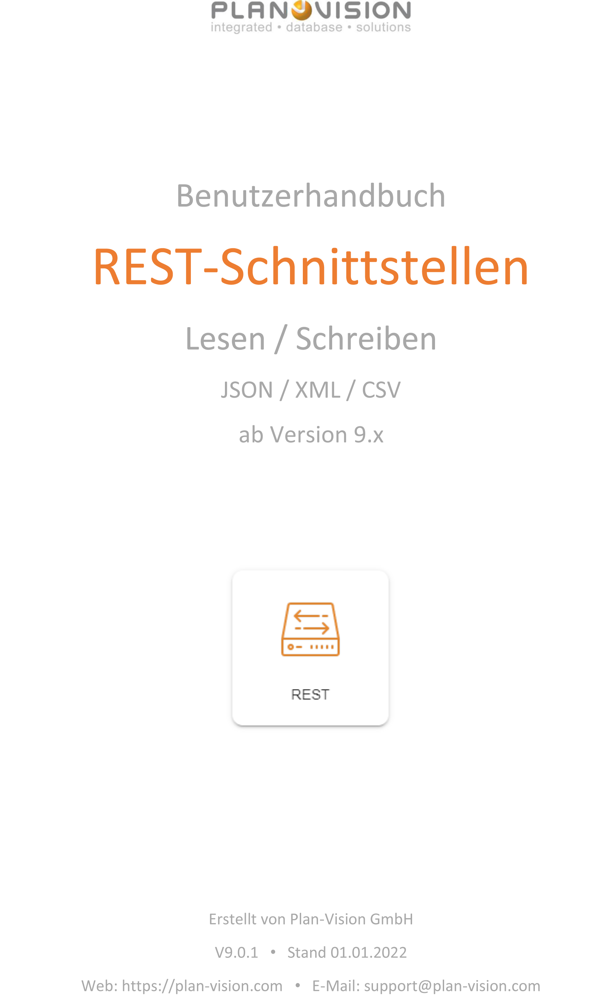

<!-- TITLE: REST-Schnittstelle-->
<!-- SUBTITLE: Überblick REST-Schnittstelle -->

<!--  -->

Deutsch | [English](../../../en/user-guide/system/reports) | *Sie sind hier: [Home](../../../home) > [Benutzerhandbuch](../user-guide) > REST-Schnittstelle*

# REST-Schnittstelle

## Allgemeine Beschreibung

VisionR bietet neben anderen Schnittstellentechnologien (JDBC, WebService, LDAP, CSV, XLSX etc.) auch REST-Schnittstellen an. Die REST-Schnittstellen werden im jeweiligen Modul definiert und einzeln freigegeben. Die definierten Schnittstellen können im Lese- und Schreibmodus verwendet werden. Bei der Schnittstellendefinition die drei möglichen Authentifizierungsmethoden beachtet werden (URL, Header, JSON in der Request-Body). Es stehen viele Formate als Antwort auf einen Schnittstellenaufruf zur Verfügung, z.B. JSON, XML, CSV. Bei komplexeren Schnittstellen können weitere Formate eingesetzt werden, wie z.B. PDF, XLSX oder DWG.

# Authentifizierung

## Auth-Methoden

Bei Aufrufen der definierten und freigegebenen REST-Schnittstellen können folgende Authentifizierungsmethoden verwendet werden:

* URL-Auth
* Auth in Request-Header
* Auth in der Request-Body als JSON

Der Token wird im VisionR Server Manager in der XCONF-Konfiguration als Session-ID mit entsprechendem Account angegeben und dem Kunden mitgeteilt. Normalerweise. Die Definition der freigegebenen Tokens befindet sich in der Datei `[VisionR Server]/etc/core/conf/rest.xconf`.

Im VisionR Server Manager können in der projektspezifischen CONFIG in JSON-Format Tokens hinzugefügt und entfernt werden:

``` json
{
    ... ,
    "additional" : {
    	"rest.sessions" : "01234567890123456 guest | abc1234567890 admin"
	}
}
```

### URL-Authentifizierung

Diese Auth-Methode wird nur für Testzwecke verwendet und kann in Produktivsystemen ausgeschaltet werden. Beispiel:

`https://visionr-server/rest/abc1234567890/contacts/contact`

Die `xconf-`Einstellung zum Ein- und Ausschalten der URL-Auth-Option ist:

`<param name="rest.url.auth" type="boolean">true</param>`

### Authentifizierung im Request-Header

Beispiel: `Authorization: Token abc1234567890`

### Authentifizierung in der Body mit JSON:

Beispiel: `{ authToken : "abc1234567890" , ... }`

## Auth-Test

### URL

Als Test-Client kann ein Browser wie Chrome oder MS Edge genutzt werden:

* Öffnen Sie den Browser Chrome

* Tippen Sie den REST-Schnittstellen-Link ein mit der gewünschten und serverseitig definierten Abfrage ein:

  `https://visionr-server/rest/contacts/contact/block/1/3`

### Header

Als Test-Client kann ein Browser wie Chrome oder MS Edge genutzt werden:

* Öffnen Sie den Browser Chrome

* mit `F12` öffnen Sie die Entwickler-Konsole

* Klicken Sie auf den Tab  `Console`

* Tippen Sie oder fügen Sie folgenden Skriptcode per `Strg+V` ein für ein **POST-Request** (empfohlen):

  ```javascript
  var xhr = new XMLHttpRequest();			
  var url = "https://visionr-server/rest/contacts/contact/block/1/3";
  xhr.open( 'POST', url, true )
  xhr.setRequestHeader("Authorization","Token 9019209120210921012");
  xhr.send();
  ```
* Tippen Sie oder fügen Sie folgenden Skriptcode per `Strg+V` ein für ein **GET-Request** (nicht empfohlen):
  ```javascript
  var xhr = new XMLHttpRequest();			
  var url = "https://visionr-server/rest/contacts/contact/block/1/3";
  xhr.open( 'GET', url, true )
  xhr.setRequestHeader("Authorization","Token 9019209120210921012");
  xhr.send();

### JSON

* Öffnen Sie den Browser Chrome

* mit `F12` öffnen Sie die Entwickler-Konsole

* Klicken Sie auf den Tab  `Console`

* Tippen Sie oder fügen Sie folgenden Skriptcode per `Strg+V` ein für ein **JSON-Request** (empfohlen):

```javascript
var query = {
   	authToken : "VcDkEmFRS3eG9Q74S",
		test : "best",
		num : 7
	};
var xhr = new XMLHttpRequest();			
var url = "https://visionr-server/rest/contracts/contract";
xhr.open( 'POST', url, true )
xhr.setRequestHeader('Content-type', 'application/json');
xhr.send(JSON.stringify(query));
```

# Formate

Das Format der Antwort-Datei *oder eng. **Response*** kann in der Schnittstellendefinition im VSP-Skript definiert werden. Eine Schnittstelle kann mehrere Formate als Response unterstützen. Dabei soll die Anfrage *oder eng. **Request*** eine Angabe der gewünschten Antwort enthalten. Bei Schnittstellen in einem Format kann diese Angabe übersprungen werden. Die Antwort kann einen oder mehrere Datensätze enthalten. Standardformate, die in der Schnittstellendefinition hinterlegt werden können sind:

* JSON
* XML
* CSV

# Schnittstellen-Modus

## Lesen

Bei REST-Schnittstellen, die nur im Lesemodus verwendet werden kann eines der vordefinierten Formate als Antwort (Response) hinterlegt werden. Es werden nur Daten ausgegeben, für die der vordefinierte REST-User Lesezugriff besitzt.

## Schreiben

Bei schreibende Schnittstellen müssen die Datenfelder abgestimmt und im VSP-Skript hinterlegt werden. Der vordefinierte REST-User muss Schreibrechte auf das Datenobjekt besitzen.

# Schnittstellenaufruf

## Link

`https://visionr-server/rest/contacts/contact`

## Abfrage

Die Abfrage wird im VSP-Format als Skript hinterlegt und nach Absprache einer Objektdefinition angehängt. Beispiel:

`<object code="rest:contacts.contact" module="reports" objectdef="report_vsp"/>`

Bei der Programmierung der Schnittstelle muss die Parameterübergabe seitens des Clients vereinbart werden. Folgende Möglichkeiten stehen zur Verfügung:

* **URL-Paramater: **Die Request-Parameter in der URL können mittels **params[n]** aufgerufen werden.

* **Body-Parameter**: Die Abfrageparameter können in der vereinbarten Struktur aus JSON folgendermaßen ausgelesen werden:

> ```javascript
>var jsonstr = session.request.requestString;
> if (jsonstr == null) jsonstr="{}";
> var json = PARSEJSON(jsonstr);
> ```
> 

Das Schnittstellenskript wird im Textfeld `"content"` angegeben:

```javascript
//Data query + generate response
<% session.response.setContentType("text/xml"); %>
<%vsp
public function CDATA(val){
    return "<![CDATA"+"["+val+"]"+"]>";
}
var c = 1;
var sz = 1000;
var lang = db.core.lang.INSTANCES["en-US"];
%>
<?xml version="1.0" encoding="UTF-8"?>
<export>
<%
if(!params.is_empty) {
    if(params.size > 0 && params[0] != null && db.core.lang.INSTANCES[params[0]] != null) {
        lang = db.core.lang.INSTANCES[params[0]];
    }
    if(params.size > 1 && params[1] != null) {
        try {
            c = params[1].castToExactNumber();
        } catch(err) {
        }
    }
    if(params.size > 2 && params[2] != null) {
        try {
            sz = params[2].castToExactNumber();
        } catch(err) {
        }
    }
%>
<params><%= CDATA(params) %></params>
<%
}

db.currentSession().is_show_archived = true;
db.currentSession().current_lang = lang;
session.lang = lang.id;
    
var s = db.contacts.person.SELECT("ORDER BY id");
s.is_cached = false;
if(s.size < sz)
    sz = s.size;
%>
<size><%= (sz-c+1) %></size>
<lang><%= db.currentSession().current_lang %></lang>
<data>
    <%vsp    
    for(var e : s)
    {
    %>
    <person>
        <seq><%= c %></seq>
        <id><%= e.id %></id>
        <type><%= CDATA(OBJSTR(e.objectdef)) %></type>
        <objstr><%= CDATA(OBJSTR(e)) %></objstr>
        <code><%= CDATA(e.code) %></code>
        <name><%= CDATA(e.name)%></name>
        <first_name><%= CDATA(e.first_name) %></first_name>
        <%vsp
        if(e.email != null)
        {
        %>
        <email><%= CDATA(e.email) %></email>
        <%vsp
        }
        %>
        <insert_time><%= CDATA(e.insert_time) %></insert_time>
        <update_time><%= CDATA(e.update_time) %></update_time>
        <uuid><%= CDATA(e.uuid) %></uuid>
        <is_archived><%= e.is_archived %></is_archived>
    </person>
    <%vsp
        c++;
        if(c > sz)
            break;
    }
    %>
</data>
</export>
```

## Response

Die Antwort auf die REST-Schnittstellenabfrage kann als JSON, XML oder CSV zusammengesetzt sein. Beispiel einer Antwort (Response):

# Schnittstellendefinition

Um eine REST-Schnittstelle in VisionR nutzen zu können, muss diese in VisionR Server mit entsprechender Abfrage definiert und freigegeben werden. Schnittstellen werden immer an einen Datenobjekt aus einem VisionR-Modul angehängt. So muss der Aufruf der Schnittstelle immer als Parameter das Modul und die Objektdefinition enthalten, z.B.

`https://[Server Adresse]/rest/contacts/contact/[weitere Parameter]`
