

	

    

	
Benutzerhandbuch

	
Benutzerverwaltung

    
Browser / App

    

    
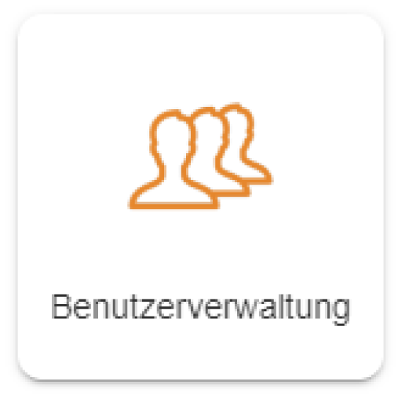

    

    
Windows / macOS / Linux / iOS / Android

    
ab Version 8.0

    

    

        
Erstellt von Plan-Vision GmbH

    	
Version 1.2 &bull; Stand 23.02.2022

    	
Plan-Vision GmbH &bull; E-Mail: support@plan-vision.com &bull; Web: https://plan-vision.com

    

Deutsch | [English](../../../en/user-guide/system/user-management) | *Sie sind hier: [Home](../../../home) > [Benutzerhandbuch](../user-guide) > Benutzerverwaltung*

# Inhaltsverzeichnis

[toc]

# Version

**Aktuelle  Version:** 1.2

**Stand:** 23.02.2022

**Verfasser:** Plan-Vision GmbH

# Modul "Benutzerverwaltung"

## Übersicht

Die Benutzerverwaltung rufen Sie aus der *Startseite -> Administration -> System -> Benutzerverwaltung* auf.

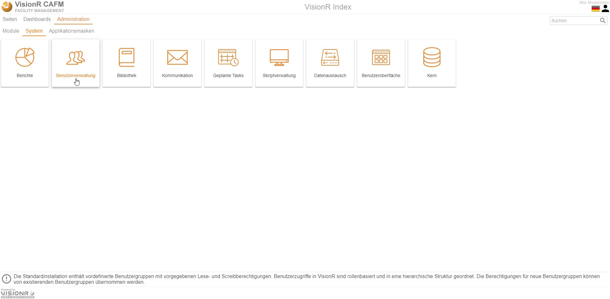

# Neuen Benutzer anlegen

In der Tabelle mit den Benutzer klicken Sie auf das Menübutton  (oder rechte Maustaste) und dann auf `+ Neu`. Ein Formular für neues Objekt wird angezeigt. Füllen Sie die oben genannten Pflichtfelder aus und speichern Sie den Datensatz. 

Hier ist es wichtig, dass die Benutzerrolle bereits vorhanden ist und die Person dem Benutzer zugeordnet ist. Es ist wichtig eine Person zuzuordnen, da wichtige Einstellungen, wie z. B. versenden von E-Mail mit den Angaben im Personendatensatz zusammenhängen. 

# Benutzer bearbeiten

Öffnen Sie die Applikationsmaske und dann klicken Sie auf `Benutzer`. 

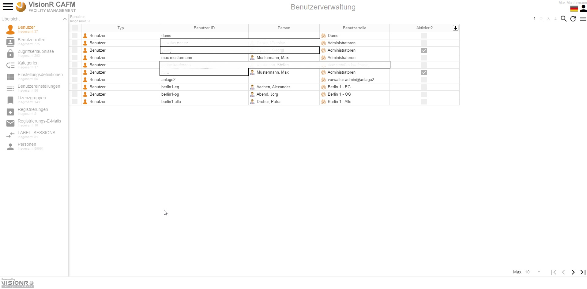

Aus der Liste den gewünschten Benutzer auswählen und mit Doppelklick wird der Datensatz aufgemacht. Dann klicken Sie auf den Button `Bearbeiten`. 

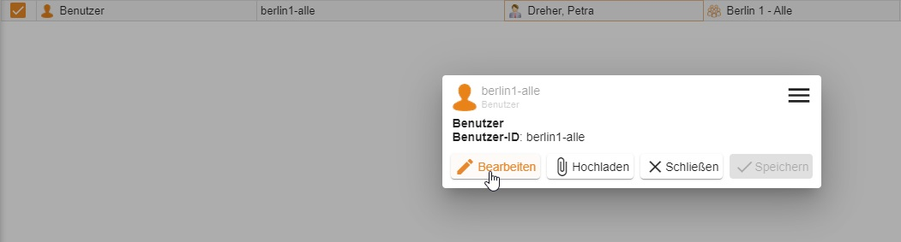

Alternativ können Sie den Datensatz selektieren, rechter Mausklick und dann `Bearbeiten` auswählen.

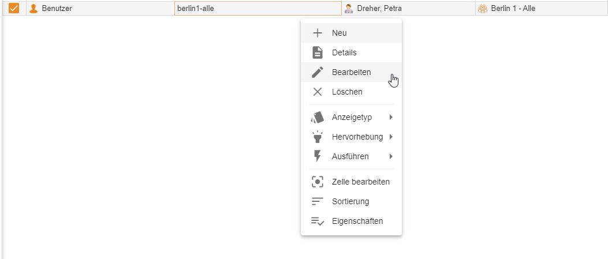

Hier können Sie schnell die Person und die Benutzergruppe ändern. Falls Sie alle Eigenschaften der Person oder des Benutzers bearbeiten möchten, gehen Sie über den Menübutton  auf `Administration`.

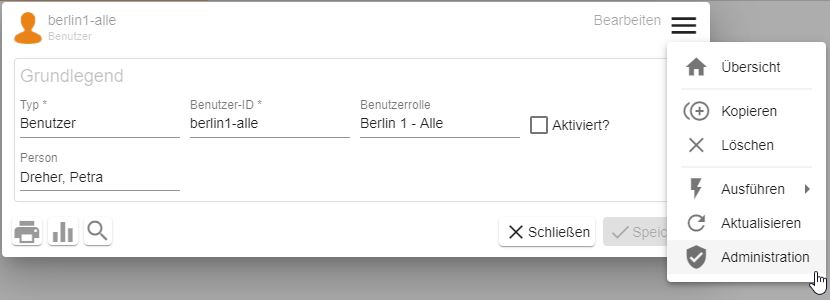

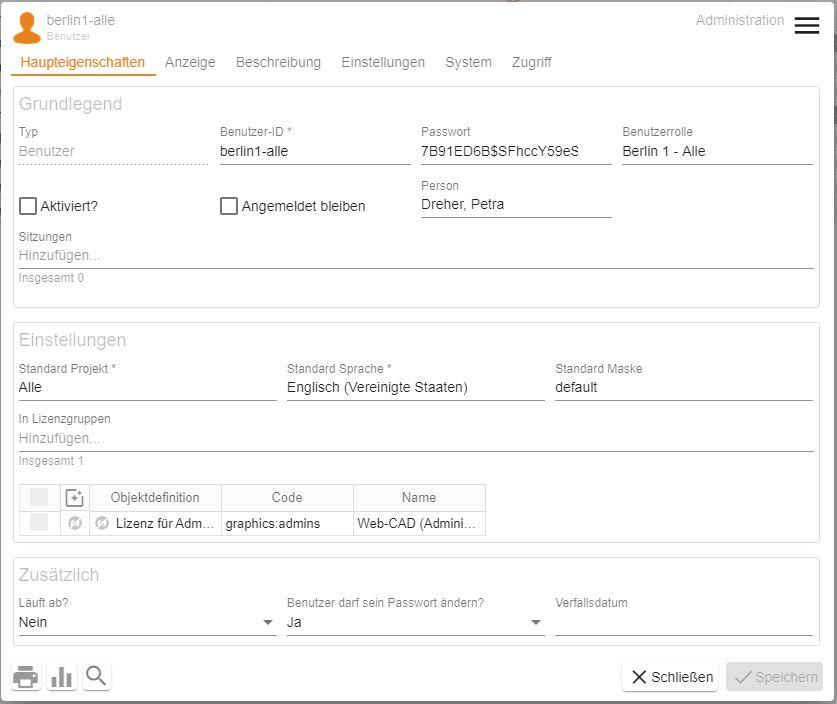

Hier können Sie alle Einstellungen des Benutzers bearbeiten. Die wichtigsten sind:

* **Benutzer-ID** - alphanumerische Eingabe für den Benutzernamen, die bei der Anmeldung angefordert wird
* **Passwort** - verdecktes Eingabefeld für das Passwort, welches bei der Anmeldung angefordert wird
* **Benutzerrolle** - hier werden die Benutzerberechtigungen definiert
* **Person** - welche Person zu diesem Benutzerkonto  zugeordnet ist, wichtig für E-Mail-Kommunikation
* **Aktiviert?** - Angabe ob das Benutzerkonto aktiviert ist. Wenn der Wert auf "Nein" eingestellt wird, kann sich der Benutzer mit diesem Benutzernamen mit sofortiger Wirkung nicht mehr anmelden

Bei Bedarf können die restlichen Einstellungen genutzt werden.

Mit Klick auf den Menübutton   und dann auf `Auswählen` in dem Feld Benutzerrolle wird die Rollenhierarchie angezeigt und Sie können aus den Benutzerrollen wählen. Alternativ können Sie mit Doppelklick die Auswahlliste aufmachen und eine Benutzerrolle zuweisen ggf. ersetzen. Der Benutzer muss sich danach nur aus- und wieder einloggen. 

Die Eigenschaften der Rolle selbst sehen Sie, wenn Sie die Gruppe öffnen – dafür klicken Sie auf den Menübutton `Bearbeiten`. Sie können in der Gruppe die Berechtigungen einstellen, ggf. welche Berechtigungen diese Gruppe an anderen weiter leitet oder welche sie von anderen übernimmt. Die Erstellung und die Anpassung der Benutzerrolle sind demnächst beschrieben.

# Benutzerrolle erstellen
Die Benutzerrolle können Sie direkt in dem Benutzerformular erstellen oder in der Ansicht mit den Benutzerrollen. 
Die Ansicht öffnen Sie mit Klick auf den Button `Benutzerrollen`. In der Baumstruktur sind diese nach Struktur / Vererbung angezeigt. Sie sind in 2 Typen unterteilt: **Vordefiniert** und **Benutzerdefiniert**. Die neuen Rollen erstellen Sie bitte in der Kategorie **benutzerdefiniert**. 
Um eine neue Benutzerrolle zu erstellen: rechter Mausklick und dann auf `Neu`. 

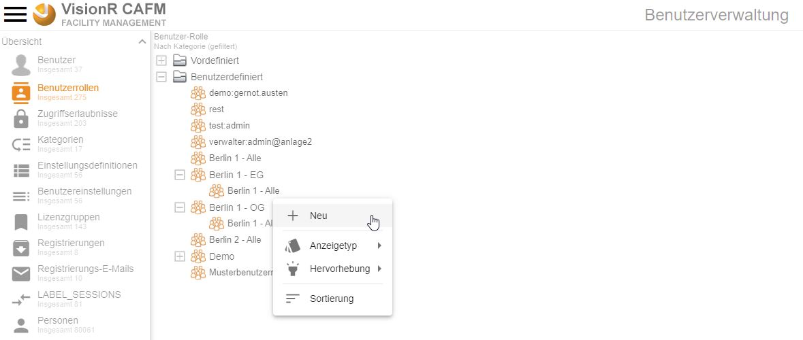

Öffnen Sie die neu zu erstellenden Rolle in Admin- Ansicht, damit Sie alle Felder bearbeiten können.

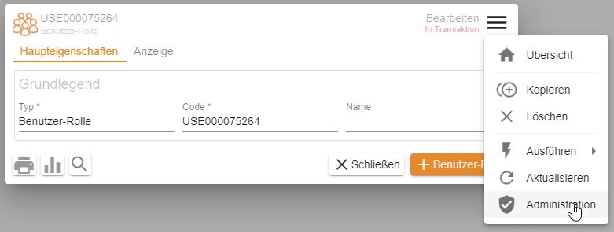

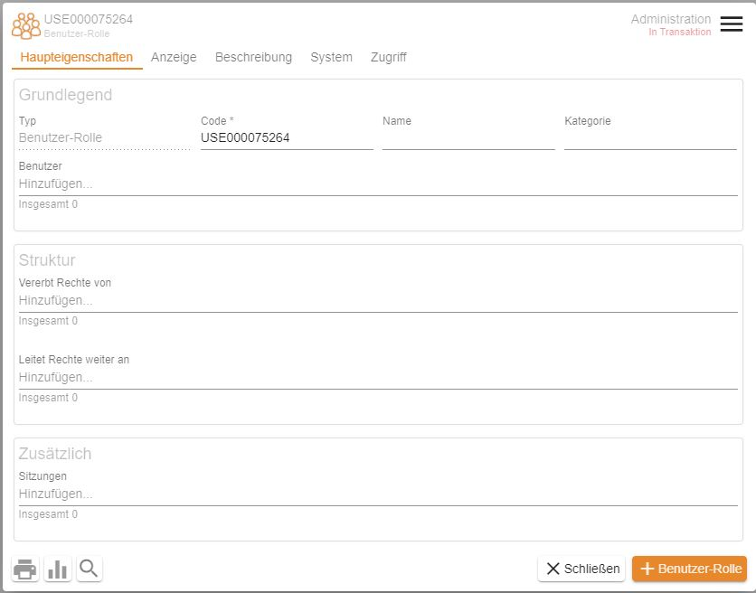

Machen Sie die folgenden Angaben:

* **Name** - wie die Rolle heißt
* **Kategorie** - Bitte wählen Sie hier die Kategorie *Benutzerdefiniert* 
* **Vererbt Rechte von** - Hier durch Kombination von den vordefinierten Benutzerrollen können Sie die neue anpassen. 
* **Leitet Rechte weiter an** - An welcher Benutzerrolle diese ihre Rechte weiter leitet.

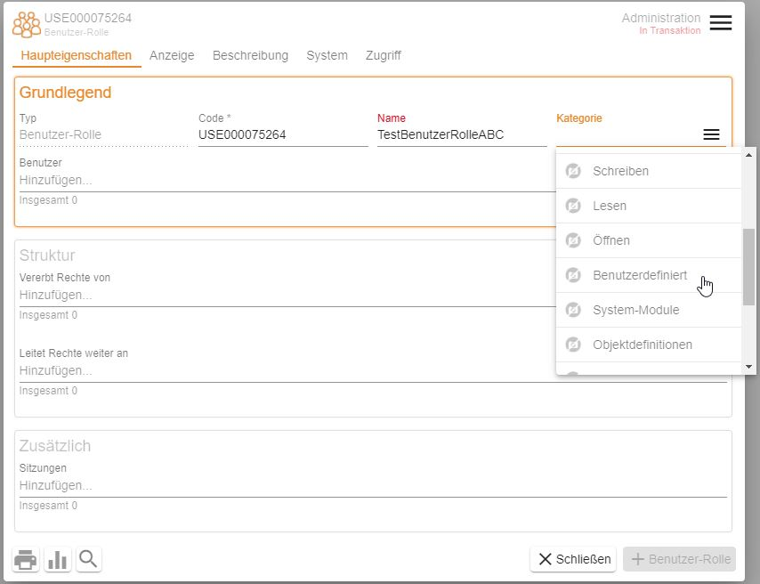

## Vererbung der Rechte

Damit Sie die Benutzerrolle richtig einstellen, müssen Sie aus den vordefinierten Rechte/Rollen kombinieren, damit Sie die Rechte an Ihren Bedürfnisse anpassen. 

> **Beispiel:** *Berlin 1 - OG* - Spezielle Gruppe für die Personengruppe, die das 1 OG in Berlin (aus unserem Demoprojekt) bearbeitet. Diese Gruppe kann nur diesen Plan sehen und bearbeiten. Deshalb wird nur die Rolle **Grafik (schreiben)** zugeordnet. 

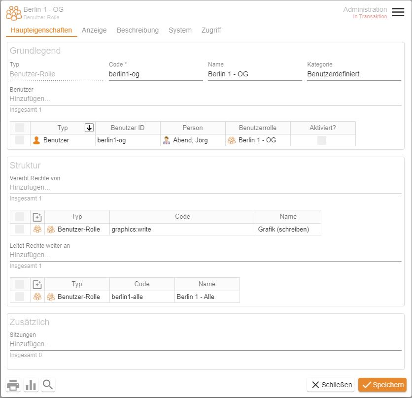

Die vordefinierten Benutzerrollen nach Modul sind in 4 Kategorien unterteilt: 
* Admin
* Lesen
* Öffnen
* Schreiben

Sie können aus der Liste die richtigen auswählen und so die Rechte dieser Gruppe an den jeweiligen Modulen und Modi anpassen. 
Sie müssen auch daran denken, dass jede Gruppe ihre Rechte weitergeben kann. Die Vererbung soll auch stimmen, falls diese Gruppe unter einer anderen Gruppe stehen soll. 
Überlegen Sie gut die Benutzerrechte, bevor Sie diese einspielen. Falls Sie Unterstützung brauchen, wenden Sie sich an unseren Support. 

## Weiterleitung der Rechte

Jede Benutzerrolle kann auch ihre Rechte weitergeben (die umgekehrte Relation der Vererbung). Sie können alle vordefinierten und benutzerdefinierten nutzen, um die gewünschte Benutzerrolle zu erstellen. 
Die Weiterleitung ist ähnlich wie die Vererbung einzustellen. Hier müssen Sie nur daran denken, dass wenn eine Rolle ihre Rechte an einer anderen Rolle weiterleitet, die zweite Rolle fügt direkt sie als Vererbung von den ersten Rolle hinzu. 

# Benutzerrolle anpassen
Wenn Sie die Benutzergruppe bearbeiten möchten, müssen Sie diese Benutzergruppe aufmachen und die Rechte anpassen. 
Dieser Vorgang ist nur von dem Administrator zu machen! Falls Sie nicht sicher sind, bitte keine Änderungen vornehmen. 
Navigieren Sie zu den Benutzerrollen und öffnen Sie die gewünschte Benutzerrolle, die Sie anpassen möchten oder öffnen Sie die Person, deren Benutzerrolle Sie bearbeiten möchten und in dem Feld **Benutzerrolle** `Bearbeiten`. Somit wird die Benutzerrolle in Bearbeitungsmodus in einem Popup-Dialog aufgemacht. 

> **Hinweis**: Die Änderungen, die Sie in einer Benutzerrolle vornehmen, werden auf alle zugeordneten Benutzerkonten übertragen.

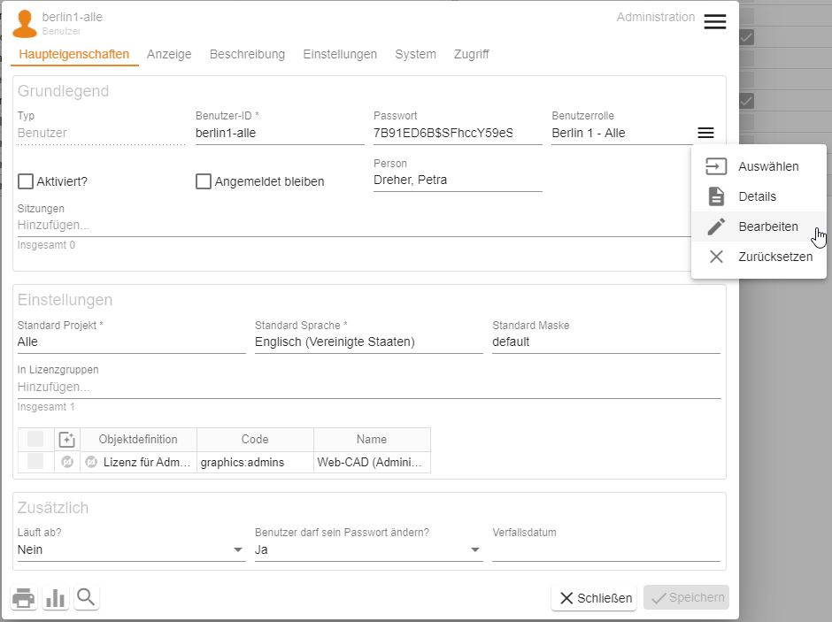

> **Hinweis** Die Benutzerrollen sind im oberen Teil des Dokuments beschrieben.

Durch Veränderung der vererbten Rechte, passen Sie die Zugriffsberechtigungen der Benutzerrolle an.
