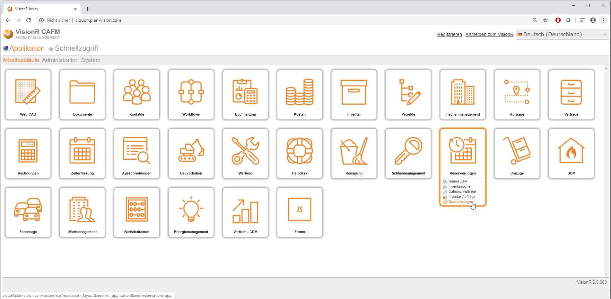
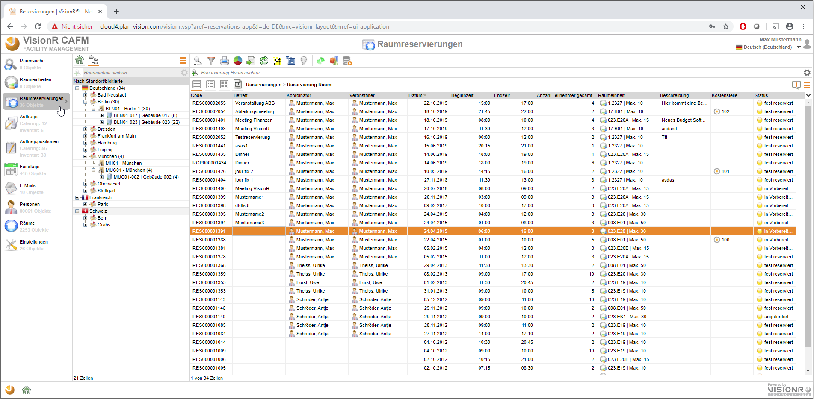
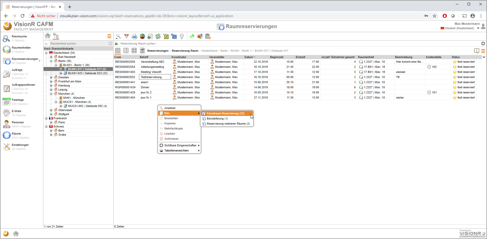
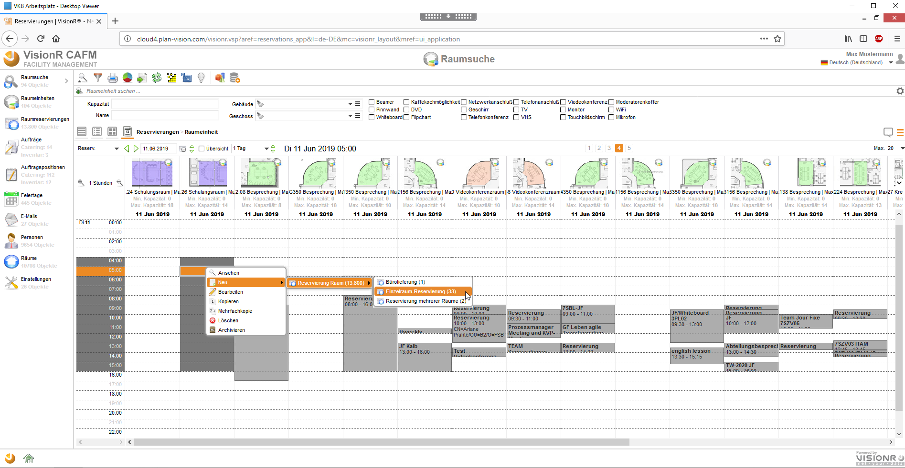
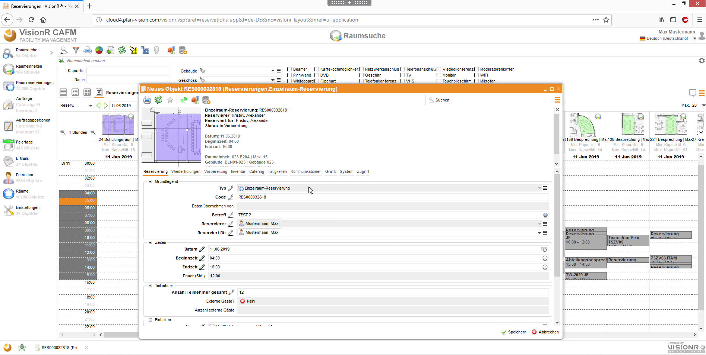
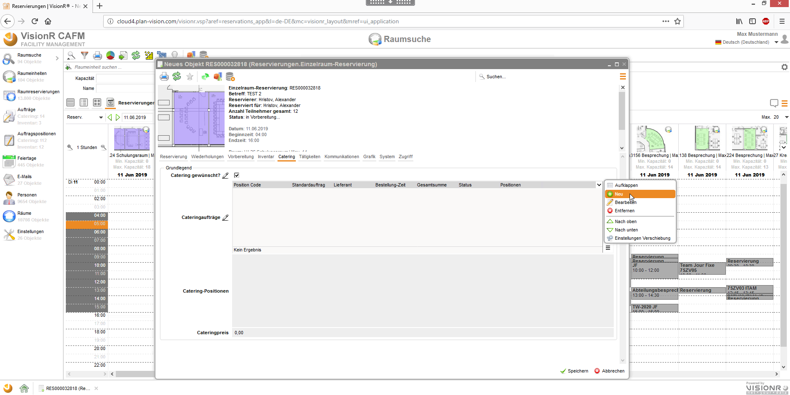
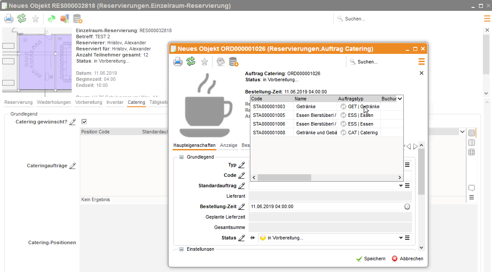
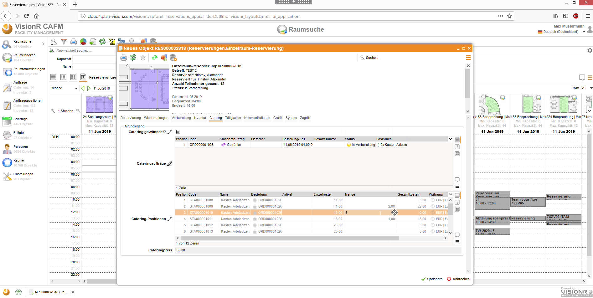

<!-- TITLE: Raumbuchung Version 7 -->
<!-- SUBTITLE: Alte GUI für Raumbuchungen inkl. Catering / Inventar / Support -->

Deutsch | [English](../../../en/modules/reservations/user) | *Sie sind hier: [Home](../../../home) > [Benutzerhandbuch](../user-guide) > Raumbuchung (Version 7)*

# Reservierungen Qooxdoo Oberfläche
Die alte Benutzeroberfläche (bis Version 7) rufen Sie unter folgende Adresse auf: `https://[VisionR-Adresse]`.

*Bild 1: Modul Reservierungen über die Index-Seite aufrufen*

Die folgende Abbildung zeigt die Qooxdoo Maske mit den Reservierungen als Datensätze in Tabellenansicht. Die Reservierungen rufen Sie mit Klick auf dem Button `Raumreservierungen` links. 

*Bild 1: Tabelle mit den Reservierungen*

# Neue Reservierung Einzelraum / mehrerer Räume / Bürolieferung

Sie können direkt in der Tabelle der Raumreservierungen eine neue Reservierung erstellen - mit der rechten Maustaste innerhalb der Tabelle und dann auf `Neu` -> `Raumreservierung` -> `Einzelraum-Reservierung / Reservierung mehrerer Räume / Bürolieferung`. 

> **Info**: Nutzen Sie die Baumstruktur links der Tabelle, damit Sie die Reservierungen nach Standorten / Gebäuden filtern können. Falls ein Gebäude / Raum da ausgewählt ist, wird die neu erstellte Reservierung mit diesem Raum / Gebäude / Liegenschaft direkt verknüpft.

*Bild 3: Neue Reservierung direkt in der Tabelle*

Oder Sie klicken auf dem Button `Raumsuche` links oben und unter dem gewünschten Raum in der Kalenderansicht wählen Sie die Startzeit und dann mit einfachem Klick können Sie eine neue Reservierung erstellen mit der ausgewählten Beginzeit. Oder Sie können mit Halterung der Umschalte-Taste die Start- und Endzeit in der Kalenderansicht direkt auswählen und dann können Sie mit rechter Mausklick auf `Neu` -> `Raumreservierung` -> `Einzelraum-Reservierung / Reservierung mehrerer Räume / Bürolieferung` eine neue erstellen - siehe Bild 4.

*Bild 4: Neue Reservierung über Kalenderansicht*

Stellen Sie sicher, dass der Raum Ihre Bedürfnisse abdeckt – z.B. Anzahl Teilnehmer. 
In dem angezeigtem Fenster geben Sie die wichtigsten Daten ein, wie in der Dokumentation für die normalen Benutzer beschrieben ist - *Zeiten (falls nicht ausgewählt), Betreff, Beschreibung, Anzahl Teilnehmer,  Bewirtung / Inventar, Abteilung, Kostenstelle etc.*

*Bild 5: Eingaben für die neue Reservierung*

Anschließend speichern Sie die Reservierung und Sie werden danach gefragt, ob Sie E-Mail Nachrichten verschicken möchten. 

>**Bemerkung** : Die Kostenstelle und die Abteilung werden automatisch aus dem Veranstalter gezogen. Sie können aber diese gegebenenfalls ändern. Diese Angaben sind in der Kategorie *Kosten*. 

Die Bewirtung / Catering / Inventarbestellungen machen Sie in den Registerkarten *Catering* und *Inventar*.

> **Beispiel:**  einer Cateringbestellung - Registerkarte *Catering* auswählen. Häkchen aktivieren. Die Tabellen werden angezeigt. In der Tabelle *Cateringaufträg*“ fügen Sie den gewünschten Auftrag hinzu.

*Bild 6: Bewirtung / Catering / Zusatzinventar bestellen*

Wählen Sie den Standardtyp aus und unten in den Positionen geben Sie die gewünschte Anzahl Artikel.

*Bild 7: Bewirtung / Catering / Zusatzinventar Positionen*

Setzen Sie die Bestellung-Zeit und speichern Sie den Auftrag. 
Danach in der Tabelle darunter werden  die Positionen für diese Bestellungen aus dem Auftrag übernommen und Sie müssen die gewünschten Mengen drin in dieser zweiten Tabelle eingeben. 

*Bild 8: Mengen für den Bewirtung / Catering / Zusatzinventar Auftrag eingeben*

Genauso geben Sie auch Inventarbestellungen ein. Wenn Sie fertig sind, müssen Sie die Reservierung speichern und sie erscheint in dem Kalender / in der Tabelle. 
