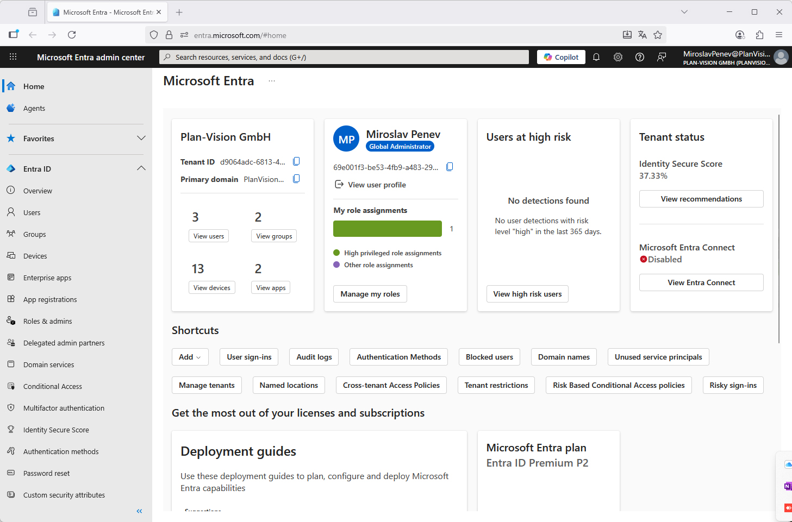

<div style="margin:auto;text-align:center;width:100%;height:900px;color:#AAAAAA">
	<div style="height:100px"></div>
    <div style="height:150px"></div>
	<div style="font-size:35px"></div>
	<div style="font-size:45px;color:#777777">Data sync: Entra ID to VisionR</div>
    <div style="font-size:35px">setting up a VisionR SCIM endpoint</div>
    <div style="height:20px"></div>
    <div style="height:160px"></div>
    <div style="height:20px"></div>
    <div style="font-size:25px">Entra ID / SCIM / Person and Account data</div>
    <div style="font-size:25px">from version 9.17</div>
    <div style="height:200px"></div>
    <div style="color:#BBBBBB">
        <div style="font-size:14px">Created by Plan-Vision GmbH</div>
    	<div style="font-size:14px">Version 1.1 &bull; from 25.09.2025</div>
    	<div style="font-size:14px">Plan-Vision GmbH &bull; email: support@plan-vision.com &bull; web: https://plan-vision.com</div>
    </div>
</div>


<div style="page-break-after: always; break-after: page;"></div>

English| [Deutsch](../../../de/interfaces/entra-id/scim/scim) | *You are here: [Home](../../../home) > [SCIM](../scim) > Interface Entra ID to Visionr with SCIM* 

# Contents

[toc]

# Version

**Current version:** 1.2

**From:** 23.02.2022

**Author:** Plan-Vision GmbH

# Data transfer Entra ID to VisionR

## Overview

This document describes the standard interface in VisionR for receiving data from Entra ID over the SCIM standard definition. You can find a detailed description of the SCIM standard protocol (short for System for Cross-domain Identity Management) on:

`https://datatracker.ietf.org/doc/html/rfc7644` : ***System for Cross-domain Identity Management: Protocol***


# Set up Entra ID

## Go to Entra ID admin

Use the following web link to go to the Entra ID portal an sign in:

`https://entra.microsoft.com`



*Picture 01: Entra ID index*


# Set up VisionR

## Data files

Following files must be included in the VisionR installation:

* .../rest/scim/Users.vsp
* .../rest/scim/Groups.vsp

Following files, which are not yet implemented, can be optionally included in the VisionR installation:

* *.../rest/scim/Bulk.vsp*
* *.../rest/scim/ResourceTypes.vsp*
* *.../rest/scim/Schemas.vsp*
* *.../rest/scim/ServiceProviderConfig.vsp*

## Repoprts

Following reports or alternative customized reports must be present:

* db.reports.report_rest: **default:rest:scim:Users**
* db.reports.report_rest: **default:rest:scim:Groups**

## Settings in XCONF

In order to enable SCIM in VisionR you must define a rest session for authentication withthe method **bearer**. Here an example definition from the XCONF-file:

````xml
<task name="setCoreProperties" description="Rest">
	<!--	FORMAT for "rest.sessions" : "session user methods" (next on a new row)
			session : generated string with length > 24 characters
			user : must be an active user in VisionR
			methods : basic and/or token, default is only token
	-->
	<param name="rest.sessions" type="string"><![CDATA[
		XUtwIDIDXUtwIDIDXUtwIDIDXUtwIDIDXUtwIDID scim-demo basic+token+bearer
	]]></param>
	<param name="rest.auth.coookie" type="boolean">false</param>
	<param name="rest.auth.strict" type="boolean">true</param>
	<param name="rest.auth.url" type="boolean">false</param>
</task>
````

The user **scim-demo** in this example should have read and write privileges for the object definition **db.contacts.person**.


