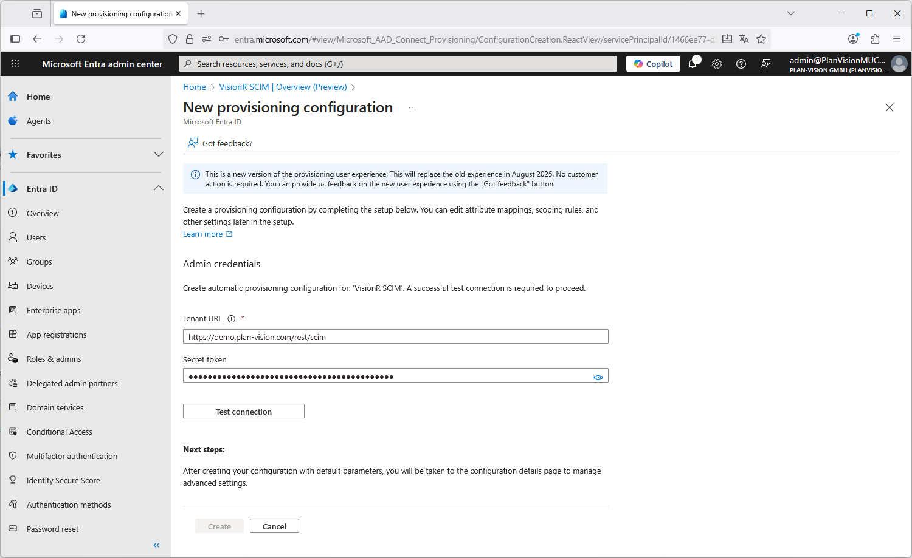
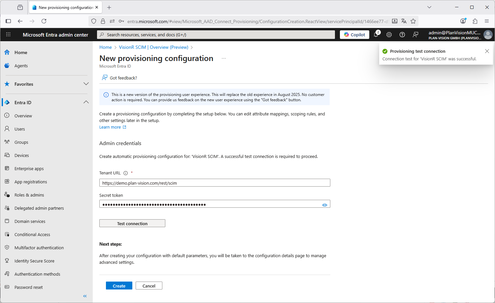

<div style="margin:auto;text-align:center;width:100%;height:900px;color:#AAAAAA">
	<div style="height:100px"></div>
    <div style="height:150px"></div>
	<div style="font-size:35px"></div>
	<div style="font-size:45px;color:#777777">Data sync: Entra ID to VisionR</div>
    <div style="font-size:35px">setting up a VisionR SCIM endpoint</div>
    <div style="height:20px"></div>
    <div style="height:120px"></div>
    <div style="height:20px"></div>
    <div style="font-size:25px">Entra ID / SCIM / Person and Account data</div>
    <div style="font-size:25px">from version 9.17</div>
    <div style="height:280px"></div>
    <div style="color:#BBBBBB">
        <div style="font-size:14px">Created by Plan-Vision GmbH</div>
    	<div style="font-size:14px">Version 1.1 &bull; from 25.09.2025</div>
    	<div style="font-size:14px">Plan-Vision GmbH &bull; email: support@plan-vision.com &bull; web: https://plan-vision.com</div>
    </div>
</div>


<div style="page-break-after: always; break-after: page;"></div>

English| [Deutsch](../../../de/interfaces/entra-id/scim/scim) | *You are here: [Home](../../../home) > [SCIM](../scim) > Interface Entra ID to Visionr with SCIM* 

# Contents

[toc]

# Version

**Current version:** 1.2

**From:** 25.09.2025

**Author:** Plan-Vision GmbH

# Data transfer Entra ID to VisionR

## Overview

This document describes the standard interface in VisionR for receiving data from Entra ID over the SCIM standard definition. You can find a detailed description of the SCIM standard protocol (short for System for Cross-domain Identity Management) on:

`https://datatracker.ietf.org/doc/html/rfc7644` : ***System for Cross-domain Identity Management: Protocol***


# Set up Entra ID

## Go to Entra ID admin

Use the following web link to go to the Entra ID portal an sign in:

`https://entra.microsoft.com`

Please perform these steps to set up the connection in Entra ID:

### Entra ID index page

Go to the Entra ID index page. You will have to log in with an administrative account to be able to perform the steps for registering an enterprise app

*Picture 1: Entra ID index*

### Enterpsise apps

Click on the `Enterprise apps`-Button in the side navigation menu on the left hand side:

*Picture 2: "Enterprise app" button*

### New enterprise application

Click on the `New application`-Button to initiate the creation of a new enterprise app

*Picture 3: "New application" button*

### Create own app

Skip the list of recommended apps and create your own application

*Picture 4: Create own app*

### Integrate other app

*Picture 5: Integrate any other app*

### Own app created

*Picture 6: Own app created*

### Own application overview

In the overview of the newly created enterprise app, e.g. "VisionR SCIM" you should click on the `Provisioning`-button to create a new configuration for data synchronization with the predefined VisionR end-point.

*Picture 7: Application overview - click on "Provisioning"*

### New provisioning configuration

*Picture 8: Provisioning configuration*

### Tenant URL with token

To be able to proceed at this point you will need a valid tenant URL and a valid token, which will be provided to you by the Plan-Vision vendor network.

*Picture 9: Define end-point connection with tenant URL and token*

### Test connection

*Picture 10: Test your connection*

### Create after test success

*Picture 11: Create the own app after a successful connection test*

### Provisioning overview

*Picture 12: Overview of the newly created app*

### Provisioning settings

#### Add users and groups

*Picture 13: Provisioning settings - add users and groups*

#### Attribute mappings

*Picture 14: Provisioning settings - add/remove mappings*

#### Switch provisioning sync on/off

*Picture 15: Switch a provisioning on/off*

### Provisioning on demand

After you have successfully created a connection to a predefined VisionR SCIM end point, you can begin testing the contents of the interface using single users or groups. Thus you will be able to match the mappings on both sides: in Entra ID and in VisionR also. At this pint the implementing partner should be contacted in order to perform simultaneous tests on both sides.

*Picture 15: Provisioning on demand*

# Set up VisionR

## Data files

Following files must be included in the VisionR installation:

* .../rest/scim/Users.vsp
* .../rest/scim/Groups.vsp

Following files, which are not yet implemented, can be optionally included in the VisionR installation:

* *.../rest/scim/Bulk.vsp*
* *.../rest/scim/ResourceTypes.vsp*
* *.../rest/scim/Schemas.vsp*
* *.../rest/scim/ServiceProviderConfig.vsp*

## Repoprts

Following reports or alternative customized reports must be present:

* db.reports.report_rest: **default:rest:scim:Users**
* db.reports.report_rest: **default:rest:scim:Groups**

## Settings in XCONF

In order to enable SCIM in VisionR you must define a rest session for authentication featuring the method **bearer** (other methods are not needed by default). Here an example definition from the XCONF-file:

````xml
<task name="setCoreProperties" description="Rest">
	<!--	FORMAT for "rest.sessions" : "session user methods" (next on a new row)
			session : generated string with length > 24 characters
			user : must be an active user in VisionR
			methods : basic and/or token, default is only token
	-->
	<param name="rest.sessions" type="string"><![CDATA[
		XUt12345XUt12345XUt12345XUt12345XUt12345XUt12345XUt1234 scim-demo basic+token+bearer
	]]></param>
	<param name="rest.auth.coookie" type="boolean">false</param>
	<param name="rest.auth.strict" type="boolean">true</param>
	<param name="rest.auth.url" type="boolean">false</param>
</task>
````

The user **scim-demo** in this example should have read and write privileges for the object definition **db.contacts.person**.


