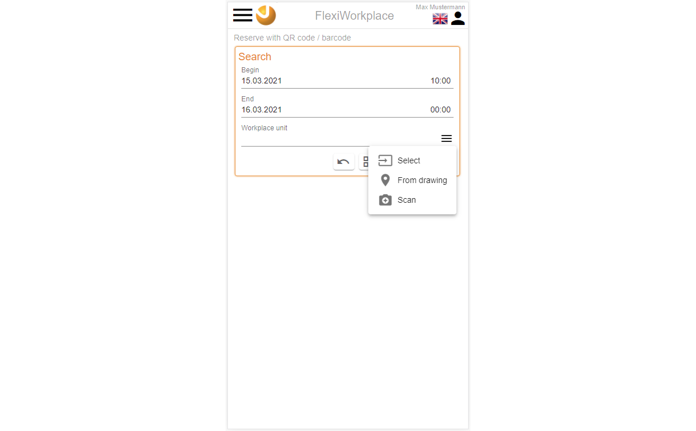
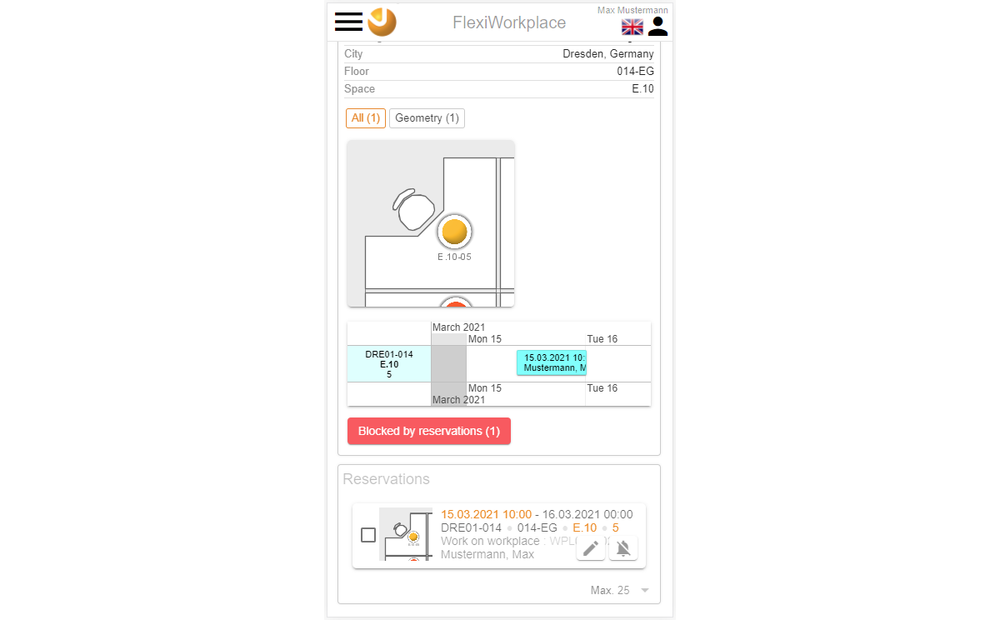
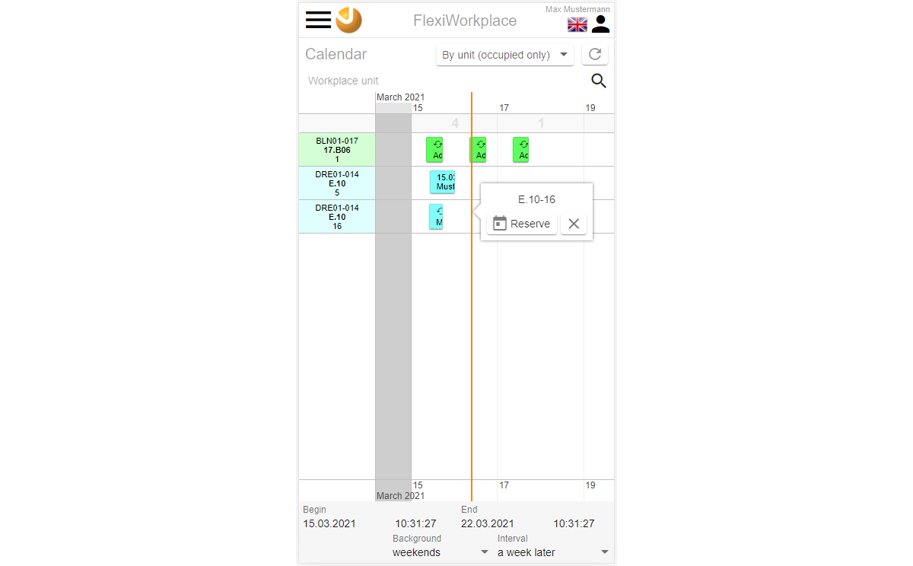

<!-- TITLE: FlexiWorkplace-->
<!-- SUBTITLE: FlexiWorkplace is a module for flexible workplace reservations -->

<!--  -->

# FlexiWorkplace - mobile

## General

This document describes the usage of the module FlexiWorkplace for normal users on a mobile device. The usage in a browser on a desktop computer (PC, laptop, or mac) is described in the section  [FlexiWorkplace - desktop](flexi-workplace-desktop).

## Description

The VisionR module FlexiWorkplace can be used for mobile workplace reservations. A graphical interface and a calendar overview help you when searching for a suitable workplace in one or many different locations. The possibility to additionally order assets or support are included in the process of reservation. FlexiWorkplace can be used in the browser or in a mobile app on your tablet pc or smartphone.

Main features:

* **Search for free workplaces:** You can look for a free workplace visually in floor plans. After you have filled out the search criteria in the search fields (begin, end, building, floor) you can see the free workplaces in the plan and reserve them.
* **Reservation with a QR or barcode:**  If you are standing in front of a desk, you can reserve it using a QR or barcode scan from your mobile device. You can also cancel your ongoing reservation for this workplace.
* **Reserve a single workplace:** You can start creating a new reservation, using graphical workplace search in a floor plan or in a list with with attached pictures.
* **Reserve multiple workplaces for teamwork:**  Here you can look up multiple workplace and reserve them simultaneously for a team of persons. You can later assign the single reservations to the persons from the team, who will become a separate email event for the Outlook calendar.
* **Table view of all reservations:**  You can lookup reservations filtered by date, reserved by, reserved for, status and so on. You can display the reservations as a table or in a list view. Data can be exported as a MS Excel sheet.
* **Calendar with reservations:**  You can see all available workplaces an a timeline an make a reservations starting with your preferred date and time. You can also display reservations in a timeline grouped by the persons who created them.

## Entrance

If you are using the FlexiWorkplace from your VisionR mobile app the index page of the application will be automatically displayed. If you are using the browser on your mobile device you can either use the `Apps` tab on the index page or call the direct link  `https://[VisionR address]/forms#/main/reservations_workplace`.

*Image 1: App entrance using the index page on you mobile device*

## Administration

Administrative tasks, like creating a new workplace unit, changing reservability or definitions of allow and deny rules for certain workplaces are described in the section [Admin FlexiWorkplace](/en/user-guide/admin/flexi-workplace).

# Overview

## Begin

A begin page is automatically displayed when you enter the module FlexiWorkplace  (see Image 2).

*Image 2: Initial page "Begin"*

There is a list of the next personal reservations in the top area of the begin page. This area is empty if you don't have any pending reservations.

> **Note:** A click on the title "My reservations"  or on the button "Show more..." will open a complete list of all your personal reservations. 

If you click on an event in the list you can see detailed information about the reservation, location in the plan included. The buttons under the event list represent the main FlexiWorkplace module functionalities. 

## General tips

The button with the three lines in the top left corner opens the module main menu. By default this menu is minimized on mobile device in order to save place.  In the desktop version of the software the main menu is on by default. The main menu button is a toggle button. Alternate clicks on it will either show or hide the main menu. The `Menü`-Button is available on all pages of the module. The module pages with different functionalities described in this document are called by clicking on an entry in the main menu. The active page is colored orange in the main menu.

*Image 3: The main menu can be switched on/off by clicking on the three lines* 

A single click on the icon  beside the three lines on the top left side opens the VisionR index page. If you want to leave the module FlexiWorkplace and open the index page you must confirm your action, because unsaved information, is any will be lost (see Image 3). If you cancel this operation you will stay on current page.

*Image 4: Go to the index page* 

# Search for free workplaces

## Search

The first button on the begin page  `Search for free workplaces` opens the mask for workplace search (see Image 5).

*Image 5: Open the workplace search*

You can fill in the search fields with your preferences on the workplace search mask and click on the button `Search`. The search results with free workplaces will be displayed either in the floor plan or in a list view.

To switch between floor plan and list view, you must use the second left button beside the `Search` button. This is a toggle button.  The button  will switch to list view. The button  will switch to floor plan view.

> **Note:** Switching between list view and floor plan can be done before or after clicking on the `Search` button.

The arrow-button  beside the `Search` button can be used to reset the values in the search fields.

Following search input fields are available In the standard version of FlexiWorkplace:

* **Location** you can select a property from a drop down
* **Building** you can select a building
* **Floor** you can select your preferred floor
* **Begin** Date and time for the beginning of your reservation
* **End** date and time for the end of your reservation
* **Check availability?** here you can define if the found workplace should be filtered by the search time period. If this option is deactivated all workplaces will be displayed, regardless of their reservation status. Multiple reservations for the same time are not allowed. A system check will be executed on attempting to create a double reservation and an error message will be displayed. 

> **Notice: ** While you make the inputs in the search fields in the search area the number of free workplaces found is calculated dynamically and displayed in brackets inside the `Search` button before you click on the button. After clicking on it the full result set will be displayed in the floor plan or in the list view.

> **Note:** Additional specific search fields, e.g. "Building section", can be added to the search area on demand as part of a customization process. 

After you fill in you search criteria and click on the `Search` button the search area will be automatically minimized on mobile devices in order to have more place for the floor plan or the list view.  The filter with the search conditions can always be minimized or maximized through a click on the line `Filter : active`.

Search results with free workplaces will be displayed in the floor plan by default:

*Image 6: Search results in the floor plan*

You can display a legend with an overview of the free and occupied workplaces in the floor plan view by clicking on the legend  button:

*Image 7: Display legend in the floor plan view*

> **Note:** You can zoom and pan in the floor plan using the mouse scroll button or your fingers on a mobile device like in a map service (Google Maps, Bing and so on).

You can click on the workplaces you are interested in and show details for the selected resource in a popup. 

*Image 8: Workplace detail information in the floor plan*

You can click on the icon or picture on the top of the popup with workplace details to display a separate popup mask with full details for the workplace you have chosen. The workplace details are displayed in full screen mode on mobile devices. You can close the details mask by clicking on the button with the cross in the bottom right area.

*Image 9: Display workplace details in separate popup*

If you have chosen list view in your search, all found free workplaces for your search time will be displayed in a paged list.

*Image 10: Display search results in a list view*

## Reserve a single workplace

If you choose a particular workplace (like on the images above) the `Reserve` button in the bottom right corner will be activated. A dialog with a form will be popped up if you click on this button:

*Image 11: Popup dialog for new reservation*

You can make input in different fields with details about your reservation. Orders for inventory, catering and support are part of the standard version of FlexiWorkplace. If you make an order inside your reservation a separate workflow is being triggered and redirected to the service team responsible for the task. 

>  **Note:** Available an additional input fields for the reservations are customizable.

Error and warning messages are displayed in the bottom area of the reservation. Errors have red background and prevent saving your reservation. Warnings are displayed with orange background and can be closed in order to be able to click on the `Save` button.

*Image 12: Errors and warnings in the reservation dialog*

You must click on the `Save` button in the bottom right corner to be able to complete the reservation process. In the standard version of the software a popup question is automatically displayed, asking you if you want an email confirmation of the event. If you confirm the email a message with attached Outlook event will be sent to your email address. 

*Image 13: Confirmation for email with Outlook invitation*

> **Note:** Sending an email with attached event can be set up to suppress the question popup and send the message silently in the background. 

After you save and close the new reservation the search mask with the floor plan will be displayed again. You can see a grey background on the reserved workplace, which means it is already booked and can not be reserved by others for the same time.

*Image 14: The workplace is immediately occupied after your new reservation (grey background)*

**Note:** If you want to make the reserved workplace available to another employee you can use the input "Reserved for" when editing your reservation or cancel you reservation completely to make the resource free again.

## Reserve multiple workplaces for simultaneously

You can use long click in the floor plan to display a small context menu as popup, where you will have access to a multiple selection option.

*Image 15: Long click calls popup context menu*

Click on `Select box`and draw two points diagonally in the plan to select simultaneously all the workplaces inside the resulting rectangular area. 

*Image 16: Multiple selection with select box (two clicks diagonally)*

If you want to select multiple workplaces one after another, you must use the more   button in center of the bottom area, which is displayed after you select the first workplace in the plan. If the button `More` is active, all consequently selected workplaces will be added to the selections. Clicking multiple times on the same workplace alternately adds the workplace to or removes it from the selection.

You can select multiple workplace as an alternative in the list view. In order to to so go to the list view and use the check box in front of the picture of the workplace in the list.

*Image 17: Multiple selection in the list view*

After you select multiple workplaces you will be able to make a group reservation by clicking on the `Reserve` button in the bottom right corner.  A dialog for the group reservation pops up. You can fill in the information for the multiple reservation and click on `Save`. All selected workplaces will be occupied separately inside the group reservation. At the beginning all the workplaces are reserved by you. You can later assign the workplaces to different members of the team. You can do this when you open the workplaces one by one and edit the  input for "Reserved for".

*Image 18: Multiple reservations (group reservation for teams)*

# Reserve with OR code / barcode
Click on the button `Reserve with QR code / barcode` on the begin page in FlexiWorkplace. As an alternative you can use the main menu, which can be displayed clicking on the three lines beside the logo, if hidden. In the main menu use the button `QR code / barcode`. The mask for ad-hoc reservations will be displayed.

*Image 19: Scan QR code / barcode to identify a workplace*

To be able to use the scan feature, the workplace you are standing in front of must have a QR code or barcode sticker on it. In the desktop version or if a sticker is missing you can select the workplace in the dropdown or using the floor plan.

*Image 20: Scan a QR code / barcode*

You can select a workplace in the floor plan using the menu button with the three lines at the right end of the input for "Workplace unit". This button pops up a menu, where an option `From drawing` is available. Click on this option and the floor plan pops up in select mode. Here you can select the preferred workplace and confirm by clicking on the tick button in the bottom right corner of the popup.

*Image 21: Menu in the input field*

*Image 22: Select a workplace in the floor plan*

On selecting a workplace in the dropdown field the available details are displayed following your input. Besides workplace information there is an icon with the workplace location in the drawing. All attached workplace pictures are also displayed. Following the workplace gallery a small calendar view with a timeline is displayed, showing all the reservations for the selected workplace for a week. This calendar view can be zoomed and panned using your finger on a mobile device of the scroll button of the mouse on a desktop computer. There is a list of the overlapping reservations at the end of the workplace information, where you can edit or cancel your own reservations. If there are no overlapping reservations and no error messages, you can click on the button `Reserve` in the top area after the input fields. The reservation process will be started as already described in the previous sections.

*Image 23: Workplace details after input of workplace number (1)*

*Image 24: Workplace details after input of workplace number (2)*

# My reservations

You can click on the button `My reservations` on the *"begin"* page or use the main menu to open a list with your own reservations.

*Image 25: List view of your own reservations*

The list with the own reservations can be filtered by using the input fields in the main menu on the left side. You can display the main menu by clicking on the three lines in the top left corner if it is hidden. Making an input in the filter input fields on the right side applies immediately a search condition to the list view of your reservations.

*Image 26: Filter the list with your reservations*

The entries in the list with your own reservations can be either edited by clicking the edit button  or cancelled by clicking the cancel button  on the right side of the items. If you want to cancel a reservation of yours the status of the reservation is set to *"cancelled"* and the reservation disappers from the list. The workplace is made available to other employees.

# Show all reservations

If you click the button `All reservations` on the *"begin"* page or use the main menu a list of all reservations will be displayed.

*Image 27: List of all reservations*

You can additionally filter the results in the list of all reservations by using the filter section in the main menu. If the main menu is hidden, you can make it appear by clicking on the three lines in the top left corner beside the logo. Making an input in the filter fields applies immediately a search condition to the list of all reservations.

*Image 28: Filter the results in the list of all reservations*

# Calendar view

You can use two different calendar views. Both are displayed as zoomable timeline. You can zoom and pan those calendar views by using your fingers on a mobile device or the scroll button of your mouse on a desktop computer. Reservations are displayed in blocks one after another. The timeline shows the days from left to the right. The first calendar view shows reservations grouped by workplace, the second by person. You can use both views to make a new reservations for the selected workplace or person. In order to do so you must click inside the timeline area and go to the button `Reserve` in the small popup which shows up.

## Timeline by workplace

*Image 29: Timeline by workplace*

You can additionally filter reservations in the timeline by using the filter section in the main menu. If the main menu is hidden you can display it by clicking on the three lines in the top left corner beside the logo. Inputs in the filter section are used immediately as search condition for the displayed reservations in the timeline.

*Image 30: Filter in the timeline by workplace*

If you want to make a reservation for a preferred workplace, you can click in the timeline and use the button `Reserve` in the small popup. A reservation dialog with inputs about your new reservation appears.

*Image 31: Start a new reservation in the timeline by workplace*

## Timeline by person

*Image 32: Timeline by person*

You can additionally filter reservations in the timeline by using the filter section in the main menu. If the main menu is hidden you can display it by clicking on the three lines in the top left corner beside the logo. Inputs in the filter section are used immediately as search condition for the displayed reservations in the timeline.

If you want to make a reservation for a person in the calendar view, you can click in the timeline and use the button `Reserve` in the small popup. A reservation dialog with inputs about your new reservation appears.

*Image 33: Start a new reservation in the timeline by person*

# Outlook event with ICS

An email will be sent on creating a new reservation or changing an existing one. This email contains an *".ics"*-attachment, which van be used to insert the event in your Outlook calendar by opening the attachment and confirming your participation. The email also contains a web link to the reservation with all available details (floor plan, details, attached pictures), which can be used to display, edit or cancel the reservation. You can only open the link after being authorized with your VisionR account. Access rights for viewing and editing are applied for the link.

*Image 34: Confirmation email with ICS attachment and web link*

Double click on the ICS attachment opens a new event in Outlook, where you can confirm the event. By doing so the event will be inserted in your Outlook calendar.

*Image 35: Double click on ICS attachment creates an Outlook event*