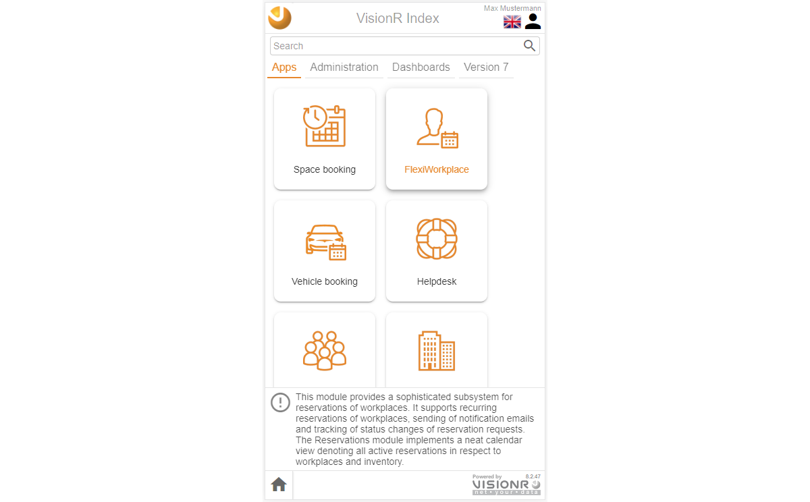
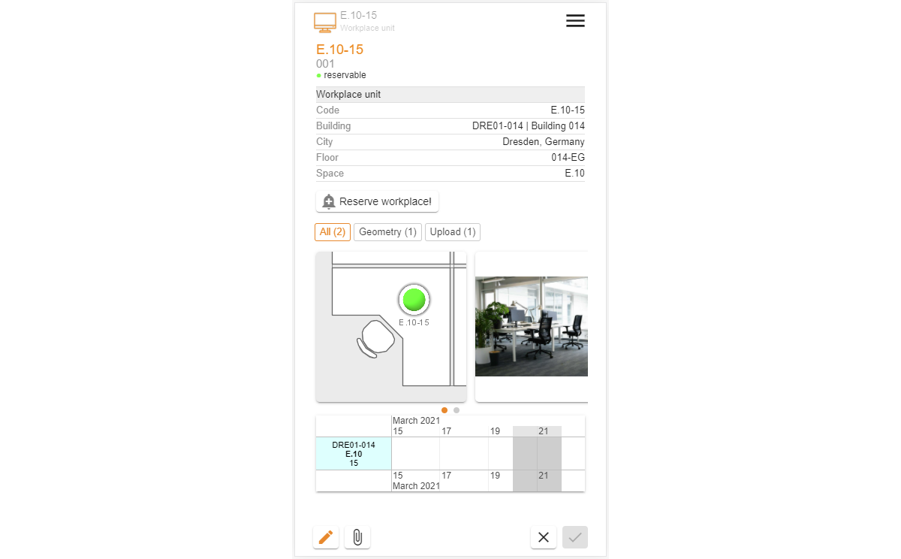
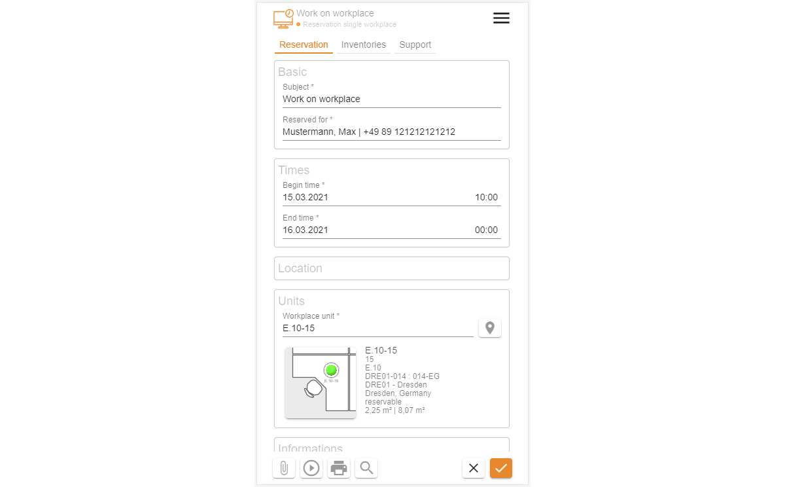
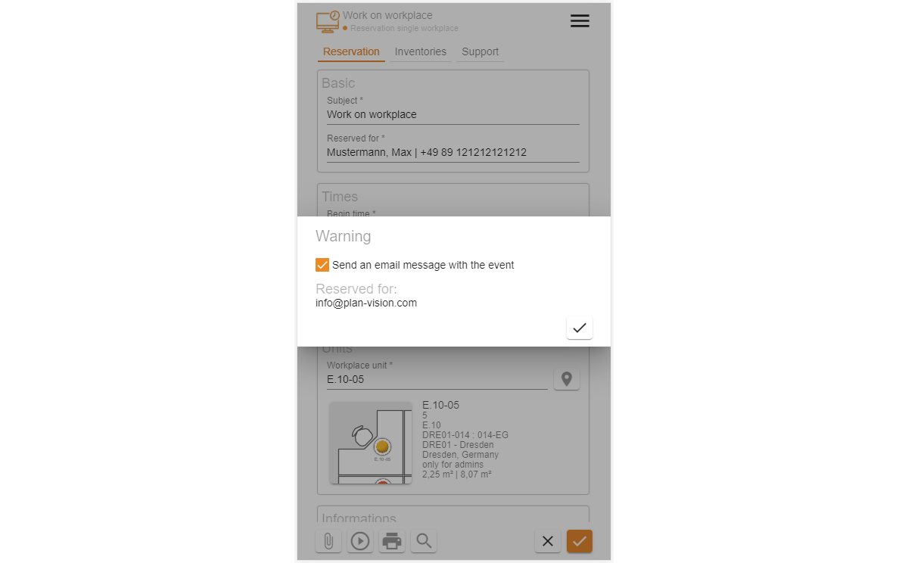
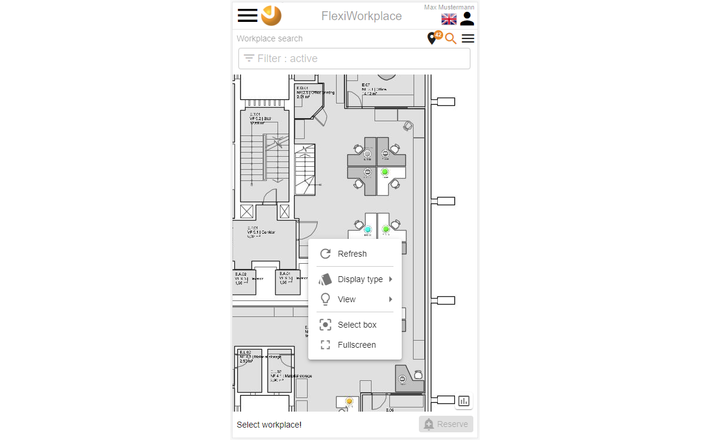
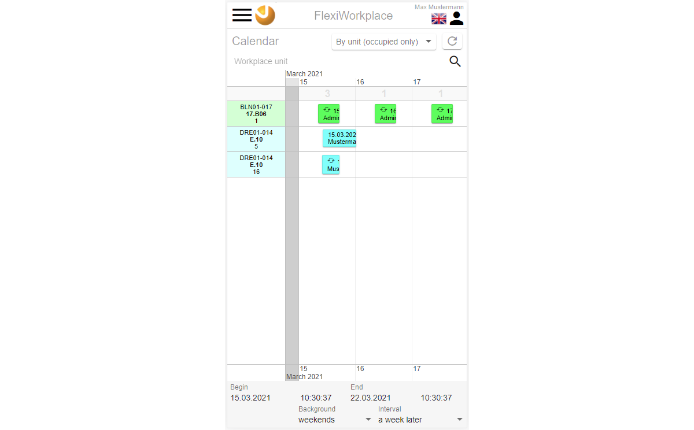

<!-- TITLE: FlexiWorkplace-->
<!-- SUBTITLE: FlexiWorkplace is a module for flexible workplace reservations -->

<!--  -->

# FlexiWorkplace - mobile

## General

This document describes the usage of the module FlexiWorkplace for normal users on a mobile device. The usage in a browser on a desktop computer (PC, laptop, or mac) is described in the section  [FlexiWorkplace - desktop](flexi-workplace-desktop).

## Description

The VisionR module FlexiWorkplace can be used for mobile workplace reservations. A graphical interface and a calendar overview help you when searching for a suitable workplace in one or many different locations. The possibility to additionally order assets or support are included in the process of reservation. FlexiWorkplace can be used in the browser or in a mobile app on your tablet pc or smartphone.

Main features:

* **Search for a free workplace:** You can look for a free workplace visually in floor plans. After you have filled out the search criteria in the search fields (begin, end, building, floor) you can see the free workplaces in the plan and reserve them.
* **Reservation with a QR or barcode:**  If you are standing in front of a desk, you can reserve it using a QR or barcode scan from your mobile device. You can also cancel your ongoing reservation for this workplace.
* **Reserve a single workplace:** You can start creating a new reservation, using graphical workplace search in a floor plan or in a list with with attached pictures.
* **Reserve multiple workplaces for teamwork:**  Here you can look up multiple workplace and reserve them simultaneously for a team of persons. You can later assign the single reservations to the persons from the team, who will become a separate email event for the Outlook calendar.
* **Table view of all reservations:**  You can lookup reservations filtered by date, reserved by, reserved for, status and so on. You can display the reservations as a table or in a list view. Data can be exported as a MS Excel sheet.
* **Calendar with reservations:**  You can see all available workplaces an a timeline an make a reservations starting with your preferred date and time. You can also display reservations in a timeline grouped by the persons who created them.

## Entrance

If you are using the FlexiWorkplace from your VisionR mobile app the index page of the application will be automatically displayed. If you are using the browser on your mobile device you can either use the `Apps` tab on the index page or call the direct link  `https://[VisionR-Adresse]/forms#/main/reservations_workplace`.

*Image 1: App entrance using the index page on you mobile device*

## Administration

Administrative tasks, like creating a new workplace unit, changing reservability or definitions of allow and deny rules for certain workplaces are described in the section [Admin FlexiWorkplace](/en/user-guide/admin/flexi-workplace).

# Overview

## Begin

A begin page is automatically displayed iy you enter the module FlexiWorkplace  (see Image 2).

*Image 2: Initial page "Begin"*

Im oberen Bereich der Anfangsmaske wird eine Liste mit den nächsten persönlichen Arbeitsplatzbuchungen angezeigt. Falls Sie keine anstehenden Termine haben, bleibt die Liste leer.

> **Hinweis:** Mit Klick auf die Überschrift "Meine Reservierungen" oder auf den Button "Mehr zeigen..." wird eine vollständige Liste der eigenen Reservierungen in einer Listenansicht angezeigt. 

Mit Klick auf die Termine können Sie Detailinformationen inklusive Standort im Plan anzeigen lassen. Die Buttons unter der Terminübersicht führen zu den Modulfunktionen, die in FlexiWorkplace für die normalen User zur Verfügung stehen.

## Bedienung allgemein

Der Button mit den drei Strichen oben links öffnet das Modul-Menü. Das Menü ist auf mobilen Geräten ist aus Platzgründen automatisch versteckt. In der Desktopversion ist das Menü automatisch aufgeklappt. Abwechselndes Klicken auf den`Menü`-Button zeigt oder verbirgt das Menü, je nachdem welcher der aktuelle Status ist. Der `Menü`-Button ist auf allen Masken verfügbar. Dur Klick auf einen Menüeintrag in der Liste öffnen Sie die entsprechende Maske mit den in diesem Dokument beschriebenen Funktionalitäten. Der Name der aktiven Maske wird in orangener Farbe hervorgehoben.

*Bild 3: Hauptmenü über die drei Striche neben dem Logo ein/aus* 

Ein Klick auf die Ikone  neben den drei Strichen oben Links führt zur VisionR-Indexseite. Wenn Sie das Modul FlexiWorkplace verlassen und zur Indexseite springen möchten, müssen Sie auf den Button mit dem Häkchen zur Bestätigen klicken (siehe Bild 3). Bei Abbrechen bleiben Sie auf der aktuellen Maske.

*Bild 4: Zur Indexseite zurückkehren* 

# Suchen nach freien Arbeitsplätzen

## Suchen

Der Erste Button auf der Anfangsseite `Suchen nach freien Arbeitsplätzen` öffnet die Maske für die Arbeitsplatzsuche (siehe Bild 5).

*Bild 5: Arbeitsplatzsuche öffnen*

Auf der Maske für die Arbeitsplatzsuche können Sie die Suchfelder mit den gewünschten Suchkriterien ausfüllen und anschließend auf den Button `Suchen` klicken, um freie Arbeitsplätze entweder in der Plan- oder in einer Listen-Ansicht anzeigen zu lassen.

Der Wechsel zwischen Plan- und Listen-Ansicht geschieht, wenn Sie abwechselnd den zweite Button links vom `Suchen`-Button anklicken. Der Button  stellt die Suche auf Listenansicht ein. Der Button  stellt die Suche auf Planansicht ein.

> **Hinweis:** der Wechsel zwischen Plan- und Listen-Ansicht kann vor oder auch nach Klick auf den `Suchen`-Button erfolgen.

Ein Klick auf den Button mit dem Pfeil  neben dem `Suchen`-Button setzt die eingegebenen Werte für die Suchkriterien zurück.

In der Standartversion von FlexiWorkplace sind folgende Suchfelder vorhanden:

* **Liegenschaft** hier können Sie im Dropdown eine Liegenschaft auswählen
* **Gebäude** hier können Sie ein Gebäude auswählen
* **Geschoss** hier können Sie das gewünschte Geschoss auswählen
* **Anfang** Datum und Uhrzeit als Anfangszeit für die Suche nach freien Arbeitsplätzen
* **Ende** Datum und Uhrzeit als Endzeit für die Suche nach freien Arbeitsplätzen
* **Verfügbarkeit prüfen?** hier stellen Sie ein, ob die angegebenen Zeiten für die Arbeitsplatzsuche verwendet werden. Fass das Häkchen auf `Nein` gesetzt ist werden alle gefundenen Arbeitsplätze angezeigt. Bei bereits belegten Arbeitsplätzen sind keine Doppelbuchungen erlaubt. Eine entsprechende Fehlermeldung wird im Reservierungsvorgang angezeigt.

> **Bemerkung: ** Während der Eingabe Ihrer Suchkriterien wird die Anzahl gefundener Arbeitsplätze im `Suchen`-Button in Klammern angezeigt, noch bevor Sie die Anzeige der Ergebnisse in Plan- oder Listen-Ansicht sehen.

> **Hinweis:** Zusätzliche spezifische Suchfelder wie z. B. "Gebäudeteil" o. ä. können nach Kundenwunsch jederzeit mit integriert werden. 

Nachdem Sie Ihre Suchkriterien eingegeben haben und auf den Button `Suchen` geklickt haben, wird der Filter-Bereich mit den Suchkriterien automatisch minimiert, um mehr Platz für die Suchergebnisse zu verschaffen. Den Filter mit den Suchkriterien können Sie jederzeit wieder aufklappen oder zuklappen, indem Sie mit dem Finder oder Maus auf die Leiste klicken: 

Als Vorgabe werden die Suchergebnisse im Plan angezeigt:

*Bild 6: Suchergebnisse im Plan anzeigen*

In der Plan-Ansicht können Sie eine Legende mit Übersicht der Arbeitsplätze nach Status und Bedeutung der Farben im Plan durch Klick auf den Button anzeigen lassen:

*Bild 7: Legende bei der Suche im Plan anzeigen*

> **Hinweis:** In der Plan-Ansicht können Sie mit den Fingern ähnlich wie bei einem Kartendienst (Google Maps, Bing o.ä.) hinein- und heraus-zoomen.

Die Details von Arbeitsplätzen, die für Sie interessant sind, können Sie mit Klick auf die Arbeitsplatzfläche aufrufen.

*Bild 8: Arbeitsplatz-Details im Plan anzeigen*

Bei dem kleinen Pop-up mit den Detailinformationen können Sie auf das Bildzeichen im oberen Bereich klicken. Dadurch öffnet sich eine separate Maske mit Arbeitsplatz-Detailinformationen, die Sie mit Klick auf das Kreuzchen unten rechts wieder schließen können.

*Bild 9: Arbeitsplatz-Details separat anzeigen*

Wenn Sie die Listen-Ansicht ausgewählt haben, werden die gefundenen Arbeitsplätze untereinander angezeigt.

*Bild 10: Suchergebnisse als Liste anzeigen*

## Einzelplatz reservieren

Wenn Sie einen Arbeitsplatz ausgewählt haben (wie auf den Bildern oben), wird der Button `Reservieren` unten rechts aktiviert. Durch Klick auf diesen Button rufen Sie ein Dialog zum Reservieren auf:

*Bild 11: Dialog für die Reservierung*

Bei der Reservierung können Sie verschiedene Eingabefelder mit Details zu Ihrer Reservierung ausfüllen. Standardmäßig ist sind Möglichkeiten für Inventar-,  Catering und Support-Bestellungen im Züge der Reservierung möglich. Die Bestellungen lösen separate Aufträge aus, die an die zuständige Servicemitarbeiter weitergeleitet werden.

>  **Hinweis:** Die Reservierungsmaske und Eingaben sind nach Kundenwusch anpassbar.

Fehler oder Warnungen werden im unteren Bereich angezeigt. Fehler, die in rot angezeigt werden, verhindern den Abschluss der Reservierung. Warnungen werden mit orangenem Hintergrund angezeigt und können geschlossen werden, um das Speichern zu ermöglichen.

*Bild 12: Fehler oder Warnungen im Dialog für die Reservierung*

Um die Reservierung abzuschließen müssen Sie zur Bestätigung auf den Button mit dem Häkchen unten rechts klicken. In der Standardversion wird ein Pop-up zur Bestätigung des Versands einer E-Mail mit angehängtem Outlook-Termin angezeigt. 

*Bild 13: Bestätigung der Outlook-Termin-E-Mail*

> **Hinweis:** Die E-Mail-Termin-Funktion kann bei Wunsch automatisiert werden, um den zusätzlichen Schritt der E-Mail-Bestätigung zu überspringen.

Nach Bestätigung der E-Mail und Speichern/Schließen der Reservierungsmaske wird die Plansuche angezeigt, diesmal ist der ausgewählte und reservierte Arbeitsplatz ausgegraut und kann zur gesuchten Zeit nicht mehr reserviert werden.

>  **Hinweis:** Um den belegten Arbeitsplatz für einen anderen Mitarbeiter freizugeben, können Sie das Feld "Reserviert für" bei Bearbeiten der Reservierung ändern, oder die Reservierung stornieren.

Nachdem Sie Ihre neue Reservierung gespeichert und geschlossen haben, wird der Plan mit der Arbeitsplatzsuche erneut angezeigt. Es ist an der grauen Farbe zu erkennen, das der reservierte Arbeitsplatz für die gesuchte Zeit nicht mehr verfügbar ist.

*Bild 14: Nach Ihrer Reservierung ist der Arbeitsplatz sofort belegt (grau hinterlegt)*

## Mehrere Arbeitsplätze gleichzeitig reservieren

In der Plan-Ansicht können Sie mit Long-Klick (auf den Desktop rechte Maustaste) ein Kontextmenü öffnen um grafische Mehrfachauswahl tätigen zu können.

*Bild 15: Long-Klick ruft Kontextmenü auf*

Wählen Sie `Auswahlrechteck` und zeichnen Sie einen zwei Punkte diagonal im Plan und die darin enthaltenen Arbeitsplätze gleichzeitig auszuwählen.

*Bild 16: Mehrfachauswahl mit Auswahlrechteck (zwei diagonale Klicks)*

Um mehrere Arbeitsplätze gleichzeitig auszuwählen, können Sie auch den Button  unten in der Mitte aktivieren, nachdem Sie den ersten Arbeitsplatz in der Zeichnung angeklickt haben. Bei Aktivierten `Mehr`-Button werden die weiteren angeklickten Arbeitsplätze zur Auswahl addiert. Abwechselndes Klicken auf dem gleichen Arbeitsplatz wählt diesen aus oder ab.

Sie können mehrere Arbeitsplätze für eine gleichzeitige Reservierung auch in der Listen-Ansicht auswählen, indem Sie die Häkchen vor den Bildern in der Liste aktivieren.

*Bild 17: Mehrfachauswahl in der Listen-Ansicht*

Nachdem Sie mehrere Arbeitsplätze ausgewählt haben, können Sie eine Gruppenreservierung tätigen, indem Sie auf den Button `Reservieren` unten links klicken. Dabei wird ein Dialog für die Mehrfachreservierung aufgemacht. In diesem Dialog können Sie die Eingabefelder ausfüllen und anschließen auf `Speichern` klicken. Alle ausgewählten Arbeitsplätze werden separat innerhalb der Gruppenreservierung belegt. Im ersten Schritt sind alle Arbeitsplätze für Sie als Bearbeiter reserviert. Sie können an dieser Stelle die Plätze an verschiedenen Personen vergeben. oder später durch Bearbeitung des Eingabefeldes "Reserviert für" die Platzvergabe für die Teilnehmer regeln.

*Bild 18: Mehrfachreservierung (Gruppenreservierung)*

# Vor-Ort-Reservierung mit QR-Code / Barcode

Gehen Sie in der Maske *"Anfang"* auf den Button `Reservieren mit QR-Code / Barcode` oder alternativ im App-Menü links (auf die drei Striche neben dem Logo) auf den Button `QR-Code / Barcode`. Dadurch öffnen Sie die Maske für ad-hoc Reservierung, wenn Sie vor dem Arbeitsplatz stehen. 

*Bild 19: QR-/Barcode vor Ort einscannen*

Der Arbeitsplatz muss mit einem QR- oder Barcode ausgestattet sein, um diese Funktion nutzen zu können. Falls keine Sticker mit Code vorhanden sein sollten, können Sie den Arbeitsplatz im Dropdown über die Arbeitsplatznummer oder im Plan aussuchen.

*Bild 20: QR-/Barcode vor Ort einscannen*

Die Suche im Plan können Sie im Feld "Arbeitsplatzeinheit" durch Anklicken des Menübuttons mit den drei Strichen am Ende des Eingabefeldes Aufrufen. Dort klicken Sie auf den Menüeintrag `Aus Zeichnung`. Dadurch öffnen Sie den Plan im Auswahlmodus.

*Bild 21: Menüeintrag im Eingabefeld*

*Bild 22: Arbeitsplatz in der Zeichnung auswählen*

Nachdem die Arbeitsplatznummer ausgewählt wurde erscheinen die Arbeitsplatz-Details im unteren Bereich. Neben den allgemeinen Arbeitsplatzinformationen inklusive Zeichnungsausschnitt und Bilder ist eine kleine Kalenderansicht vorhanden, die Sie durch Zoomen verkleinern und vergrößern können. Dort sind bereits vorhandene Reservierungen sichtbar. Noch weiter unten sehen Sie eine Liste mit den Reservierungen, die für die gesuchte Zeit gefunden worden sind. Dies geschieht nur bei Überschneidungen mit Ihrer gewünschten Zeit. Fall die Liste leer ist und keine Fehlermeldungen ersichtlich sind, ist der Button `Reservieren` im oberen Bereich aktiv und Sie können den Dialog für neue Reservierung durch einen Klick darauf aufrufen.

*Bild 23: Arbeitsplatz-Details nach Eintragung der AR-Nummer (1)*

*Bild 24: Arbeitsplatz-Details nach Eintragung der AR-Nummer (2)*

# Meine Reservierungen

Eine Liste der eigenen Reservierungen können Sie auf der Maske *"Anfang"* oder durch Klick auf den Button  `Meine Reservierungen` im App-Menü aufrufen.

*Bild 25: Liste eigener Reservierungen*

Die Liste mit den eigenen Reservierungen können Sie zusätzlich filtern, indem Sie das Hauptmenü (Klick auf die drei Striche neben dem Logo oben links) aufrufen und nach unten scrollen. Ihre Eingaben in den vorhandenen Feldern werden als Filter für die Liste angewendet.

*Bild 26: Filter der Liste eigener Reservierungen*

Die Einträge in der Liste eigener Reservierungen können Sie durch Doppelklick auf den Eintrag oder durch anklicken des Buttons  bearbeiten. Durch anklicken des Buttons wird die Reservierung auf den Status *"storniert"* gesetzt und aus der Liste entfernt. Dadurch wird der Arbeitsplatz für andere für die angegebene Zeit wieder reservierbar.

# Liste aller Reservierungen

Eine Liste aller Reservierungen, die Sie mit Ihren Berechtigungen sehen dürfen, können Sie auf der Maske *"Anfang"* oder durch Klick auf den Button  `Alle Reservierungen` im App-Menü aufrufen.

*Bild 27: Liste aller Reservierungen*

Die Liste aller Reservierungen können Sie zusätzlich filtern, indem Sie das Hauptmenü (Klick auf die drei Striche neben dem Logo oben links) aufrufen und nach unten scrollen. Ihre Eingaben in den vorhandenen Feldern werden als Filter für die Liste angewendet.

*Bild 28: Filter der Liste aller Reservierungen*

# Kalender-Ansicht

Sie können zwei zur Verfügung stehenden Kalender Ansichten nutzen. Beide werden in Form einer zoombaren Zeitachse dargestellt. Zoomen können Sie mit den Fingern oder mit der Maus-Scroll-Taste. Die Reservierungen werden in Blöcken untereinander dargestellt. Die Zeitachse verläuft von links nach rechts. Die erste Kalender-Übersicht gruppiert die Termine nach Arbeitsplatz, die zweite nach Person. In beiden Ansichten können Sie für einen Arbeitsplatz oder für eine Person neue Reservierung erstellen, indem Sie mit der Maus die gewünschte Uhrzeit am gewünschten Tag anklicken und anschließend auf den Button `Reservieren` im kleinen Pop-up gehen.

## Zeitachse nach Arbeitsplatz

*Bild 29: Zeitachse nach Arbeitsplatz*

In der Zeitachse können Sie die Termine filtern, indem Sie auf den Menübutton mit den drei Strichen neben dem Logo oben links gehen und nach unten scrollen. Ihre Eingaben in den Feldern werden als Filter für die angezeigten Termine verwendet.

*Bild 30: Filter in der Zeitachse nach Arbeitsplatz*

Durch Klick auf die  gewünschte Uhrzeit am gewünschten und anschließendem Klick auf den Button `Reservieren` können Sie den Dialog für nee Reservierung für den ausgewählten Arbeitsplatz aufrufen.

*Bild 31: Reservieren direkt in der Zeitachse nach Arbeitsplatz*

## Zeitachse nach Person

*Bild 32: Zeitachse nach Person*

In der Zeitachse können Sie die Termine filtern, indem Sie auf den Menübutton mit den drei Strichen neben dem Logo oben links gehen und nach unten scrollen. Ihre Eingaben in den Feldern werden als Filter für die angezeigten Termine verwendet.

Durch Klick auf die  gewünschte Uhrzeit am gewünschten und anschließendem Klick auf den Button `Reservieren` können Sie den Dialog für nee Reservierung für die ausgewählte Person  aufrufen.

*Bild 33: Reservieren direkt in der Zeitachse nach Person*

# Outlook-Termin mit ICS

Bei der Erstellung neuer Reservierungen oder bei Änderungen vorhandener Reservierungen werden E-Mails an den Reservierer verschickt. Die Bestätigung-E-Mail hat immer ICS-Anlage, die den Termin für die Reservierung im Outlook-Kalender eintragen lässt. Die E-Mail enthält auch einen Link zur Reservierung. Bei Verwendung des Links wird die Reservierung im Browser mit allen Details (Arbeitsplatzanzeige im Plan, Bilder, Zeiten usw.) angezeigt und kann bearbeitet oder storniert werden. Beim Öffnen des Links muss eine Anmeldung mit gültigem Account erfolgen. Zugriffsberechtigungen werden berücksichtigt.

*Bild 34: Bestätigung-E-Mail mit ICS-Anlage und Link*

Bei Anklicken der ICS-Anlage in der E-Mail können Sie den Termin Bestätigen. dadurch wird der Termin in Ihrem Kalender eingetragen.

*Bild 35: Klick auf ICS-Datei im Anhang erstellt Outlook-Termin*