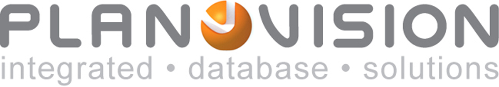
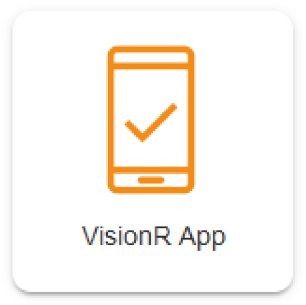

	

    

	
Manual

	
Mobile App

    
browser / app

    

    

    

    
Windows / macOS / Linux / iOS / Android

    
from version 8.0

    

    

        
Created by Plan-Vision GmbH

    	
version 1.2 &bull; from 23.02.2022

    	
Plan-Vision GmbH &bull; email: support@plan-vision.com &bull; web: https://plan-vision.com

    

English | [German](VisionR9-mobile-app) | *You are here: [Home](../../../home) > [System](../system) > VisionR mobile app*

# Contents

[toc]

# Version

**Current version:** 1.2

**From:** 23.02.2022

**Author:** Plan-Vision GmbH

# Description

This document is guide how to install the mobile application on a mobile device such a smartphone / tablet. The steps for the both operation systems (iOs / android / other) are almost identical:

1. Open the browser on the mobile device.

2. Enter the VisionR web address and login into the system. 

3. Save the opened module / index site as application on your mobile device.

4. Open the app.

You can work with the system in any browser (Safari, Chrome, Edge etc.) you have on the mobile device as well. 

# App on iOS devices

## Open the browser on the mobile device.

We use safari in this example.

*figure 1: open the browser and login*

## Enter the VisionR web address and login

In the example is our demo server in the address bar. Type the **address of your own server**, e.g. `https://visionr.your-company.com`.

Don’t forget to login.

## Save the site as app on your mobile device

As soon the index site is loaded you can save it to your device as application or you can open a module and save this module as separate application. 

On the index site are all available modules listed. 

After the user is logged in, the site can be saved as application. 

To do so, please click on the button in the middle:

***example 1: Saving the index site as application\***

*figure 2: Index site as app*

***example 2: Saving the module FlexiWorkplace as app\***

*figure 3: Module FlexiWorkplace as app*

Find the option „Add to Home screen“ and click on it:

You can set your own name for the application. Default suggested name is VisionR.
Save the task.

## Start the application

After saving the application on the mobile device, you have to find it on your home screen. 

*figure 4: Open the application from your home screen*

Open the app and log in. The result should be like here

***example: FlexiWorkplace application\***

*figure 5: Overview - module FlexiWorkplace as app*

# App on android devices

Start the browser on your mobile device. In this example we use Google Chrome. You can use your preferred browser. Check the name of the option before saving the application. 

## Enter the VisionR web address and login 

In the example is our demo server in the address bar. Type the **address of your own server**, e.g. `https://visionr.your-company.com`.

Don’t forget to login.

## Save the site as app on your mobile device

As soon the index site is loaded you can save it to your device as application or you can open a module and save this module as separate application. 

On the index site are all available modules listed. 

After the user is logged in, the site can be saved as application. 

*figure 6: Open the browser on your mobile device*

***example 1: Saving the index site as application\***

*figure 7: Index site as app*

As soon the index site is loaded you can add it as application on your home screen. To do so click on the three points menu as shown in the example.

***example 2: Saving the module FlexiWorkplace as application\***

*figure 8: Module FlexiWorkplace as ap*p

Find the option „Add to Home screen“ and click on it:

*figure 9: Save the site as application to home screen*

You can set your own name for the application:

*figure 10: Set a name for the app*

Save the task.

## Start the application

After saving the application on the mobile device, you have to find it on your home screen. 

*figure 11: Open the application from your home screen*

Open the app and log in. The result should be like here

*figure 13: Overview - all modules (Index site) as app*

# Remarks

The methods described above are for saving a single module as application and for saving the whole system as an application.  You can also save any view and module as an app. After starting and logging into the app you will see the exact site you have saved. Every module can be saved as a separate app. You can have multiple apps on you Home screen linking to all available VisionR modules and views.

If you save the index as an app you will always see the tile view with all accessible modules on starting the app.

