<!-- TITLE: Rentals on old Interface - Qooxdoo -->
<!-- SUBTITLE: Qooxdoo Interface -->

[Deutsch](/de/modules/rentals/qooxdoo) | English
*You are here: [Home](/home) > [User guide](/en/user-guide) > [Rentals](/en/modules/rentals) > Old Interface*

# Description

The module **Rentals** is used for the management of rental units, rental contracts and their conditions, rental areas and rental costs, documents, payments and activities, creating exposes, reports etc. 
The module **Rentals** is accessible by clicking on the rentals icon from the index site. 

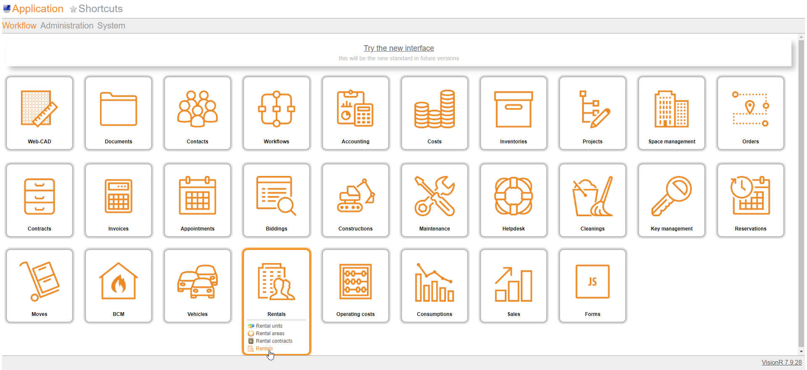

# Overview

The rental unit is the basis. On that basis the space will be linked with the rental contract and the corresponding contract positions. A singe rental unit can contain more than one space, can contain several other rental units and can be just a part of another rental unit. So the user can implement almost all constellations. 
A **rental unit** can contain **rental areas** or **occupancies** (resulting from the rental areas), if for example the rental area is only a part of the belonging space. 
The **rental unit** is linked with a contract and the user can enter the positions, costs, conditions, documents etc. 
If the costs are changing, the user can plan those changes with entering rental conditions to the rental unit. Then the user can set the date from which they are active, the end date, the scaling and price changes etc. 
The **rental contract** contain **rental conditions**. The costs are calculated from those positions. Since a single position is linked, the costs are calculated and the user can’t change the cost field. 
If the **contract** has no positions the user can enter the costs from the contract directly into the costs field. Since a position is added, the field will be overwritten from the costs coming from the position/s. 
**Example**: Cold rent and utility costs are such positions. 
When the **positions**, the contract and the rental unit are connected with each other, the user have enter the needed data, the system can generate the monthly values “Month / Space” (the rental space for the current month). This values can be delivered to other systems and are recorded and logged in the System. So the overview with the past months and years is retained. 

# Editing rental spaces 

The rental units can be created alphanumerically. The rental space can be created graphically. 
In the table with the rental units click on the button **new** in the functional menu. Alternative: right mouse button and then **new**. 

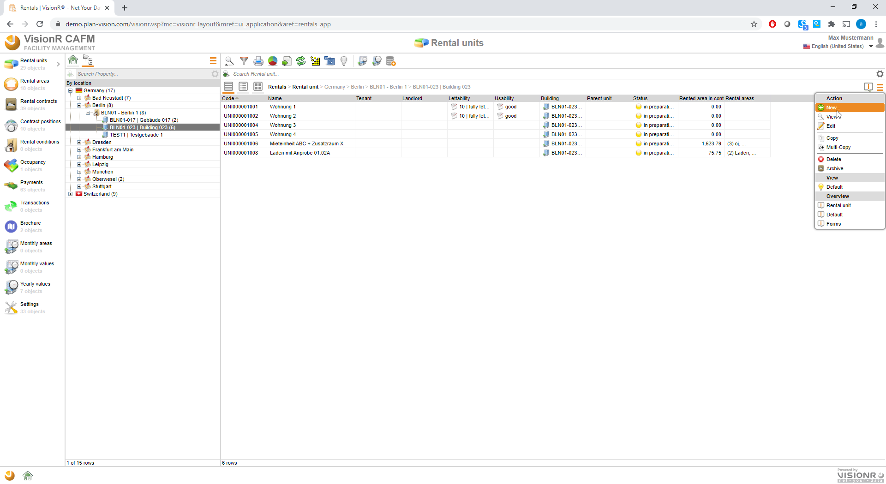

In the form type the following data: 
* **Code can be changed** – edit the code and suit it to the standards that are used in your company.
* Name (optional) – the name is optional, but it is recommended to set a proper name
* Tenant and landlord (optional) – those information are written in the contract. Enter those data into the system. 

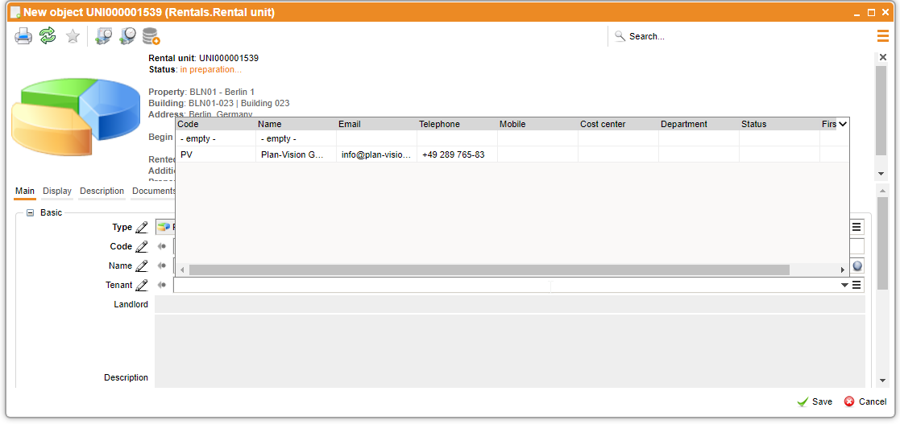

* Building (optional, but very important and recommended) – please enter the building, where the unit belongs, in order to receive a proper tree structure for the filtered data structure (the hierarchy on the left side). Without setting a building the data object can be found in the table with all rental units (the house icon). 
* If the rental unit contains other rental units or is a part of another rental unit, set the affiliation in the fields **contains rental units** and **parent unit**.

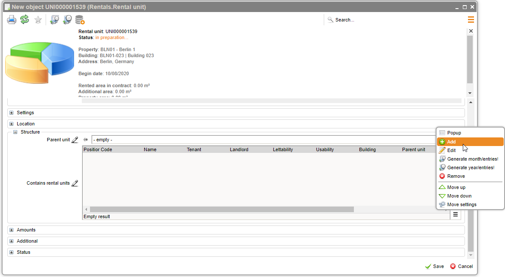

* **Rental area in contract** – in this field enter the area of the rental unit, but according to the area written in the contract. The area has to be entered manually!
The areas, which is calculated from the linked spaces or rental areas, are shown in the field **Area sum spaces** and **Rented area sum spaces**.  
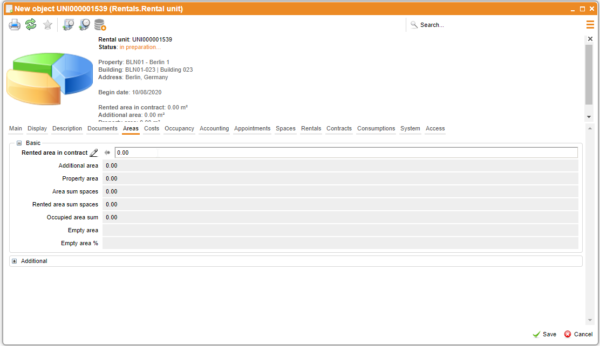

* Spaces (optional, but recommended) – please enter the spaces, which are belonging to this rental unit. Doing that is triggering the proper area calculation and the right linking of the spaces. *This is a good way to compare the area written in the contract and the actual rental area, calculated from the real spaces.* 

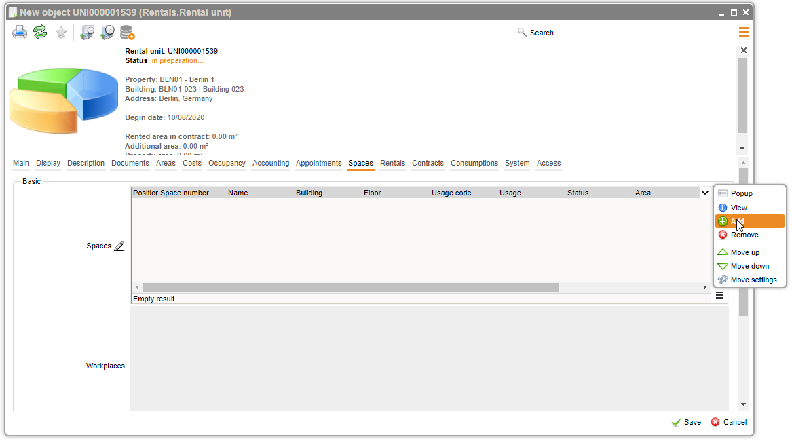

* Settings – you can find some additional settings in the **main** tab:

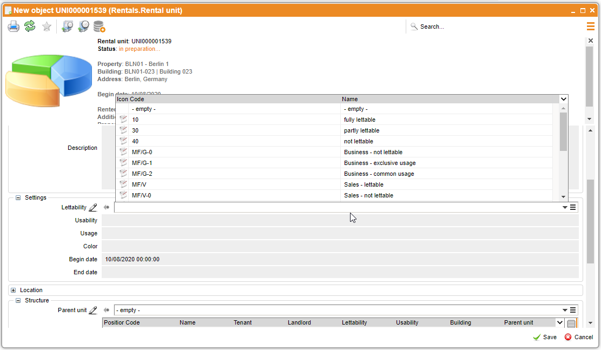

* * Lettability – see screenshot above!
* * Usability

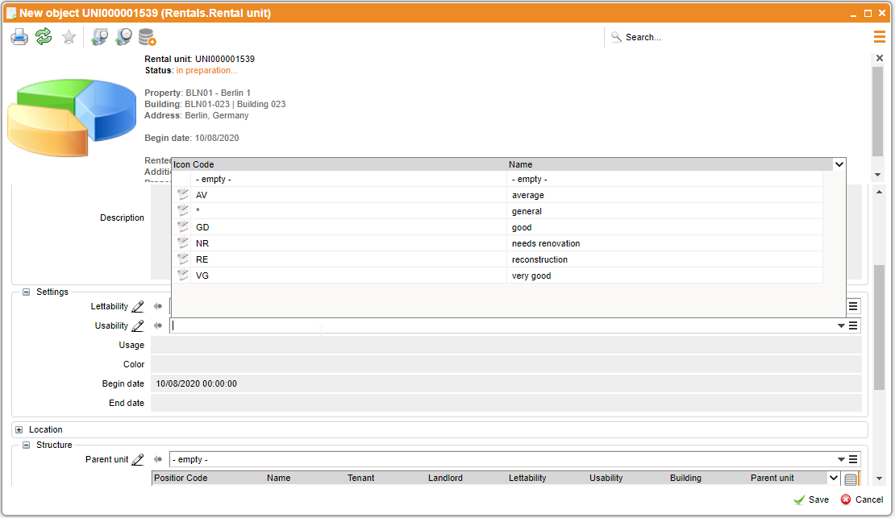
* * Usage – the user can add additional usages or choose from the list, if the usages are already entered
* * Color – choose a color for the graphically rendering
* * Begin and End date 
After entering the data, do not forget to **save** the rental unit!

# Editing rental contracts and positions
## Rental contracts

The **rental contracts** contain the agreements, the areas, the conditions, the parties etc. The rental contract is connected with the rental unit.
The **contract positions** can apply data from the contract, but can be used for another and different specifications. Therefore is the connection between contract and rental unit important. So, please enter in every contract the rental unit!
To create a new contract click on the button **new**. Enter the basic data like:
* **Contract-ID**
* **Tenant**
* **Landlord**
* **Name**
* Rental unit (optional, but recommended). 
* Contract number
* In buildings (optional, but very important and recommended) – if no building is set, the contract won’t be shown in the tree structure **by location**. The next screenshot is example (existing contract). You can link more than one building. For example if a rental contract is for several spaces in different buildings etc. 

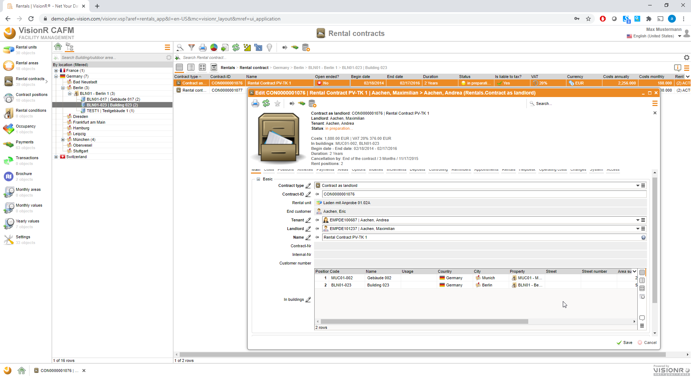

* Durations
Enter the durations (begin and end date, the duration will be calculated), if the contract not open ended is. If the contract is open ended, you can choose the option **open ended?  - yes**.
* Cancellation options – they are placed below. Enter the proper data.
* Status (optional, but recommended).

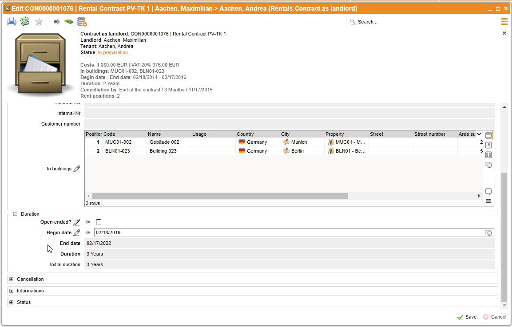

* Documents (optional) – you can add any type of document to the contract. If you have scanned the contract, we recommend to link the original scanned contract to the rental contract in VisionR. So you will always have a digital copy of the original, if needed.
* **Costs, payment interval, payment options, is subject to turnover taxes, currency**
In the second tab **costs** you can add / edit the costs and the payment options.
> **REMARK:** The costs can be enter manually, if no contract position is connected. If a position or more positions are connected, the costs will be calculated from those positions. If the field is grey and the user can’t edit that field, it means, that the costs are calculated from the positions.

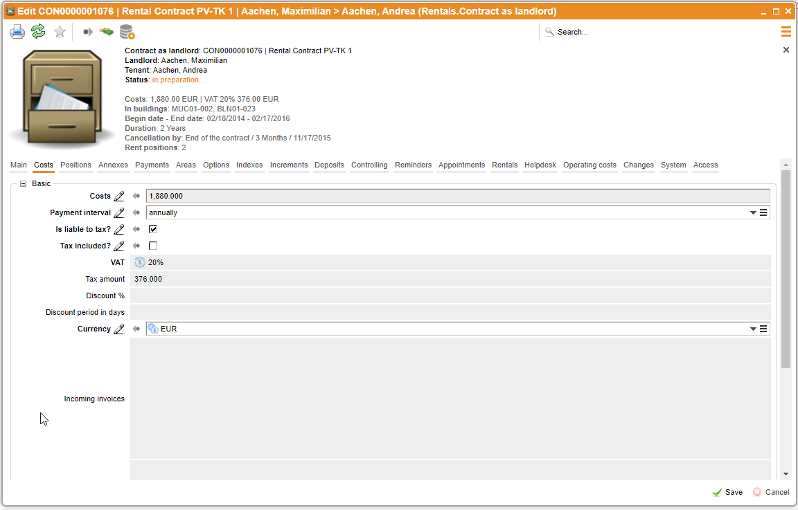

Edit the options, which are important to you. A change here is applied to all the positions in the contract. If you change a position manually, the changes are saved and changes in the contract will not affect those position. The position has to be changed manually. 
This gives the user the ability cover a lot of cases.
* **Payments (custom)**– the payments can be edited in the tab **payments**. 

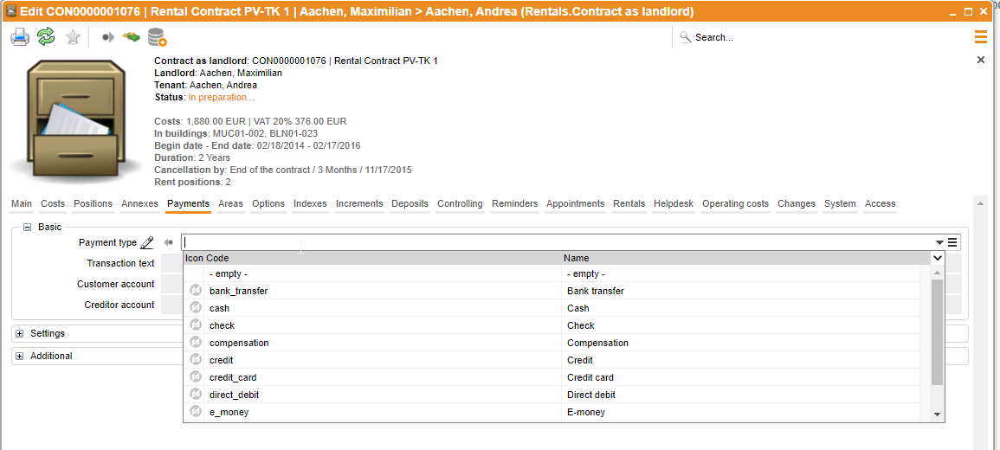

* Annexes (optional) – the user can add here Annexes and link them with the contract. Every Annex has own begin and end date 
* Indexes (optional) – the indexes can be added in the tab **indixes**. Example:

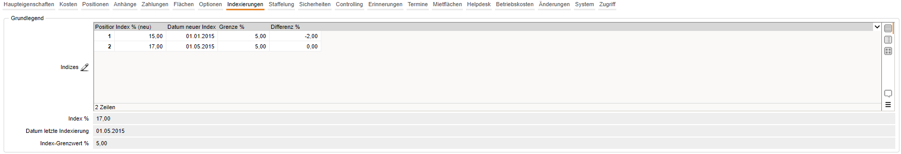

* Increments (optional) – The increment options are in the tab **Increments**.

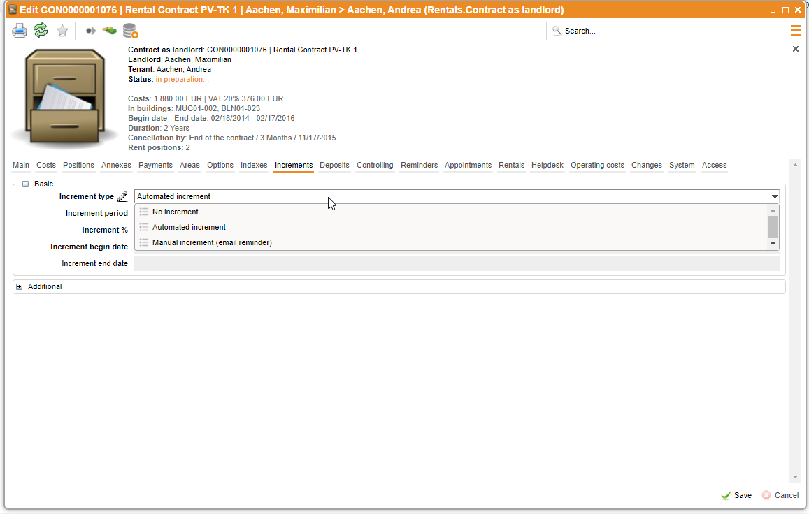

Please check the other fields and fill the relevant ones.
At the end **save** the contract! 

## Rental positions

Open the contract and navigate to the tab **positions**. Add positions according to the positions in the contract. 

>  **REMARK**: The positions in the contract are very important for the right calculation of the costs. Every position has own costs and the costs in the contract are calculated regarding the positions. Therefor it is recommended to use the positions to put the different costs, for example the cold rent, operating costs, utility costs. 
It is recommended every position from the contract, where there are costs, to be put in a separate position in the system. 

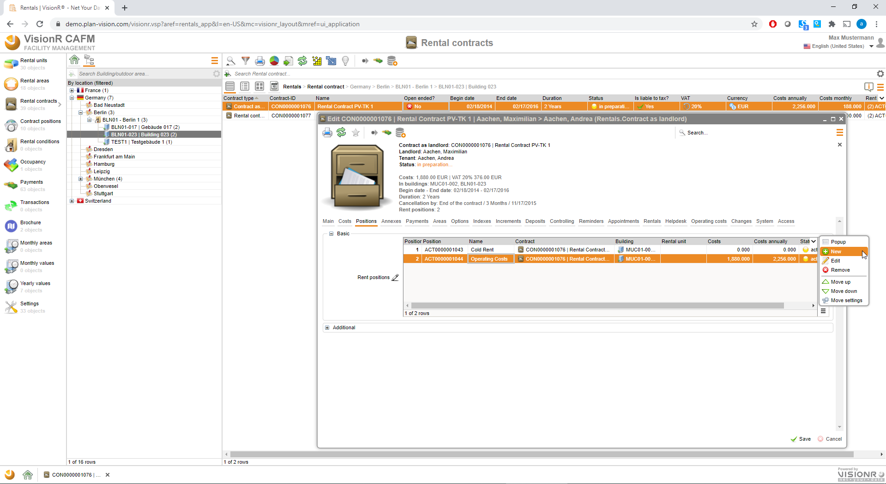

> **Remark**: The screenshots are from the running system and some examples.

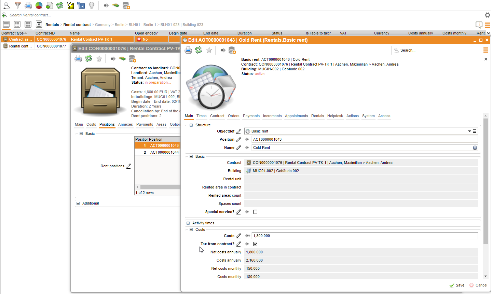

If you like to create a new position, use the button **new** as in the screenshot above. From the options choose the type you want to add:

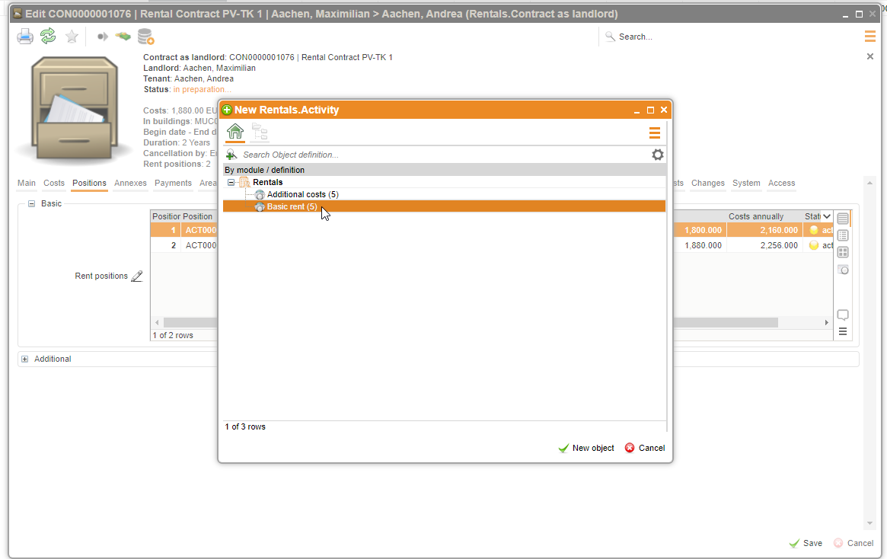

Then type in the data from the contract according to the cost type. For example the **base rent**:

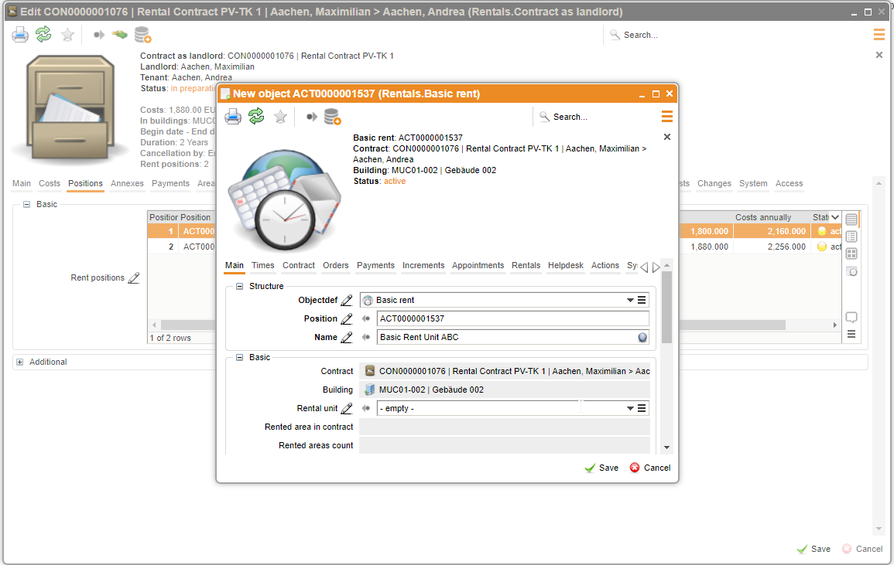

> **REMARK**: Do not forget to choose the right **rental unit!**

Important inputs:
* **Type** – Base rent, additional costs (Choose the type at the creation step)
* **Position** – You can change the position code
* **Name** – Type a proper name for that (example: base rent rental unit XY)
* Rental unit (recommended)
* **Special service?**
* **Costs** – the most important inputs are the costs. You can find them in the **main** tab in the area **costs**. Please enter the costs in the right field and choose deactivate the option **Tax from contract?** if the position has another tax value from the contract. With this option, you can set different tax values for the different positions.
Create analog the position/s for the utility costs. You can have more than 1 position. 
A created position for the additional costs (utility costs) looks like: 

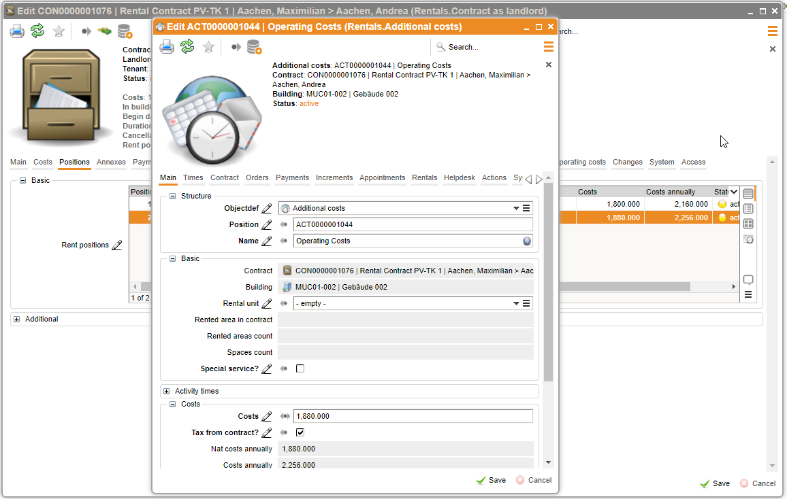

Once the positions contain costs, the cost field in the contract will be overwritten with the sum of all positions and can’t be manually edited. 
In the example we have, the costs did change, because of editing the costs in the “base rent” position. 

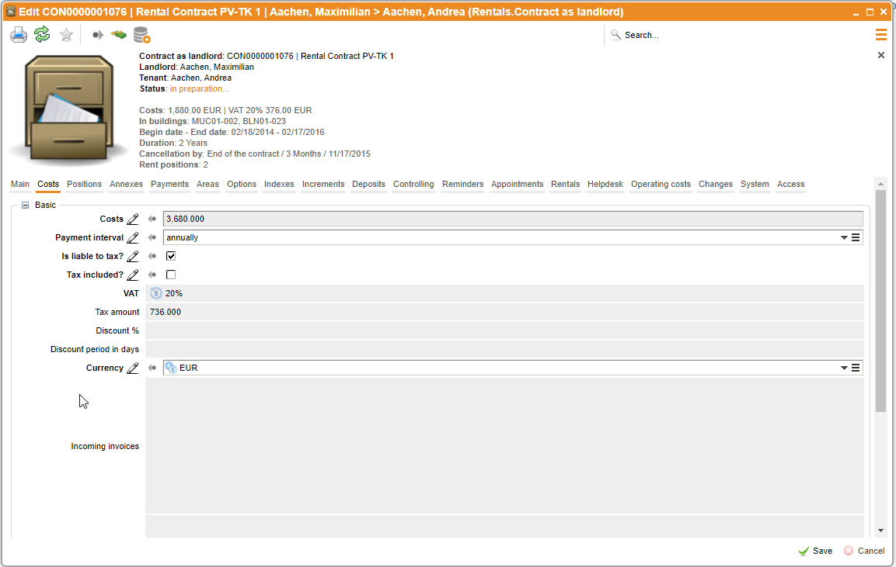

The field is already grey and that means that there are positions with costs and the contract cost field can’t be manually edited. Editing the positions will result in the cost field in the contract. If the contract has no positions, you can write manually the costs in the contract. 

# Editing of rental conditions	

The user can define rental conditions. This conditions contain the costs changes in the future. They are put in the tab **costs** in the **rental unit** object. 

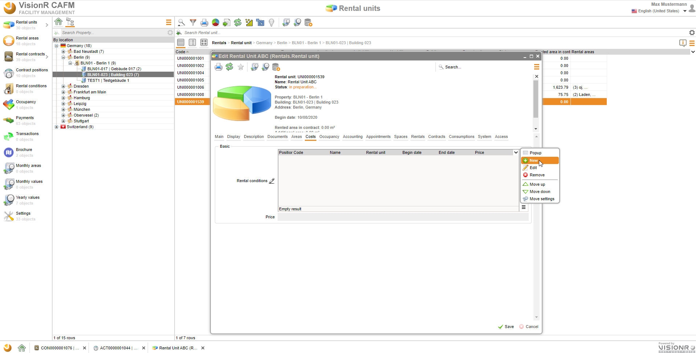

With the **add** option you can create and add new conditions. In the new window type the proper **name**, description, begin and end date (optional).

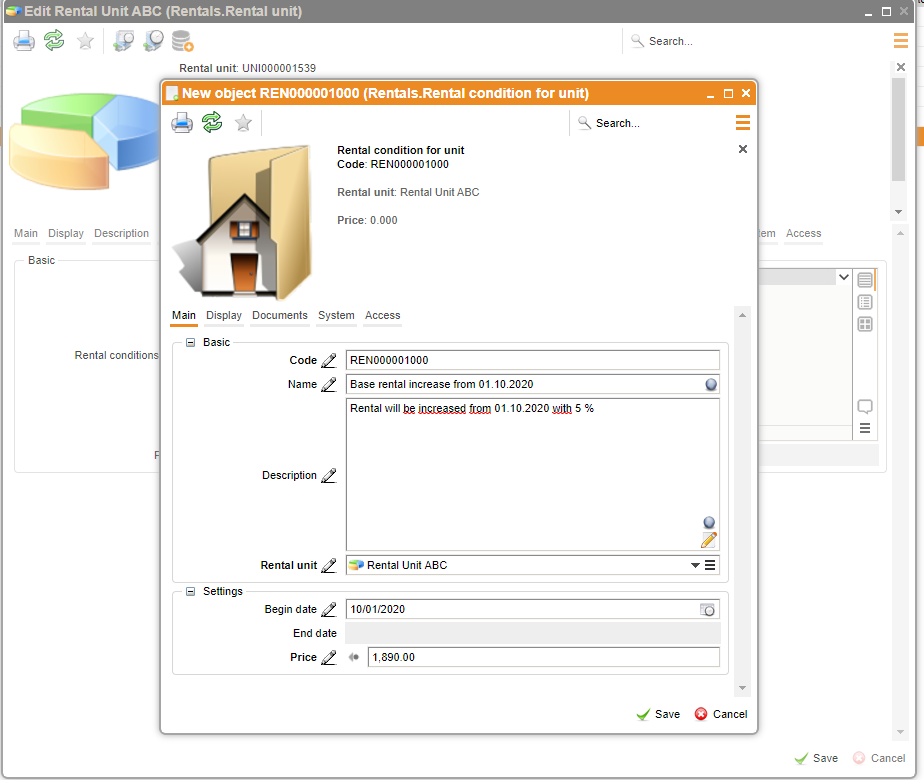

You can add documents here as well.
The new costs will be inherited at the begin date. 

# Planned changes

In this module there are fields, which can be changed on a planned scheduler.
Such fields have the on the left side and with click on it, the user can set date and time and value for the planned change. On that day and time the value will be inherited. If this icon is in front of a field, that means, that the field can be changed on a scheduler. 
If the icon seems like this , it means that the field is only logged. 

> **Example:** We want to change the tax value for several months. We can change the value manually and then again manually to change it back. This means that the user have to take care of that changes. Alternative is the approach with the planned changes. 
> Therefore it makes sense to create a planned change: 

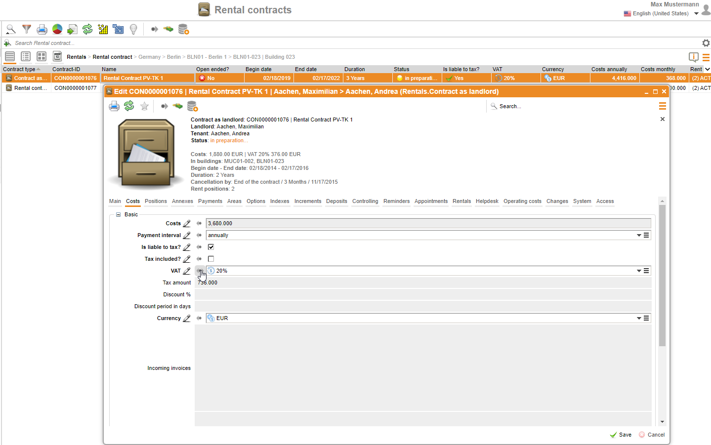

> In the shown window are the planned changes (the table on the left) and the logged changes (table on the right). To create a planned change – left mouse click in the left window, then click on **new**. In the form type the date and the new value. 

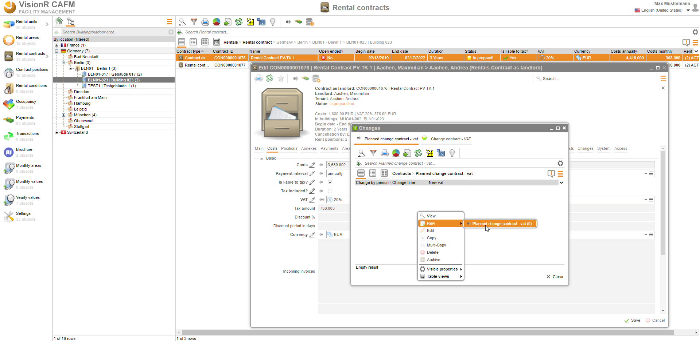

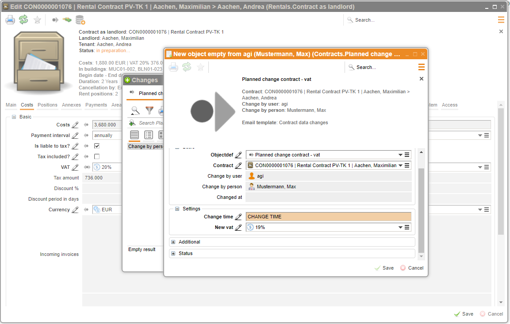

> Type the new value and save the process.
> When the date and time come, the value will be inherited.
> **Hint:** Planned changes are available for several objects. For example: the user can plan changes for every single position. Or for some fields in the position. 

> **Remark:** If a planned change is existing for a field, the user can’t change the value in this field. In order to change it, the user have to plan another change in order to overwrite the value. Such planned changes can be created for a past period as well. Then the change is already executed, but logged with the right change time. 

# Monthly values

A monthly assignment will be created from the system at every 15-th of the month, if this option is activated. Rental units with status **inactive** will be ignored. 
The user can create the assignment manually, if it is not already created from the system itself. This process is only available for the administrators. 
The monthly values are in separated table. Klick on the button **Monthly values** on the left side. From the structure on the left side of the table choose the month you want. The values will be shown in the table. If the month doesn’t exist, it means, that it isn’t created yet. 

> **Remark:** In the following screenshots some data are hidden because of the privacy of the data. 

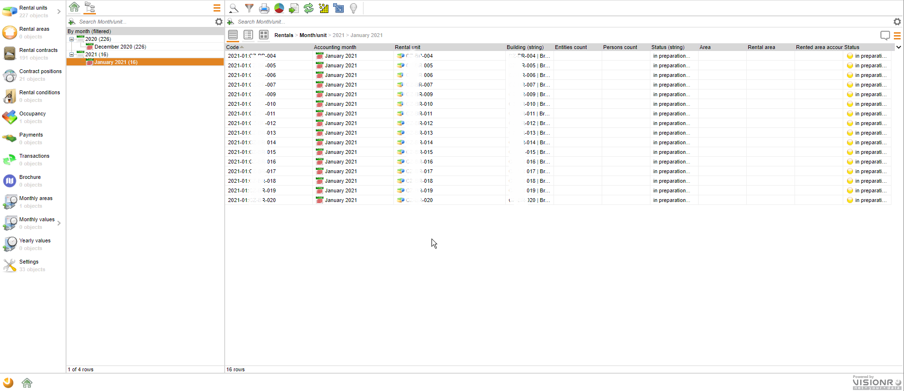

Complete / Edit the values and set the proper status. 

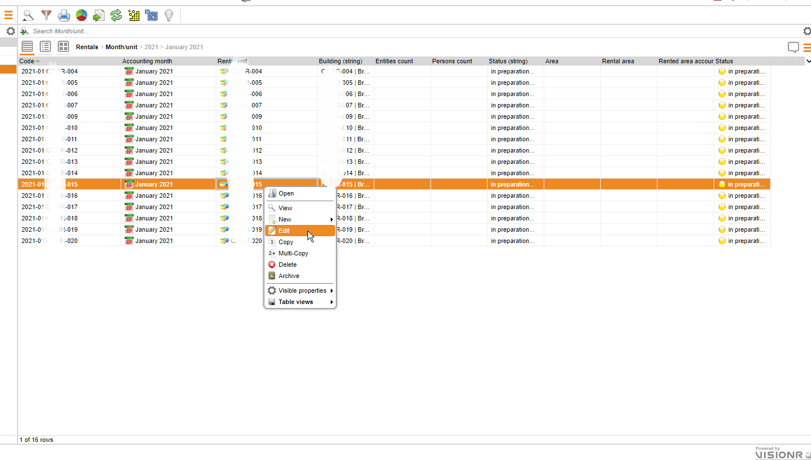

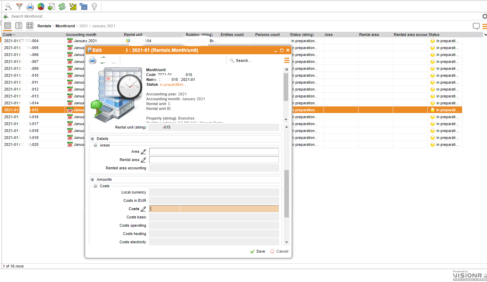

Alternative edit the field with double click on the table cell:

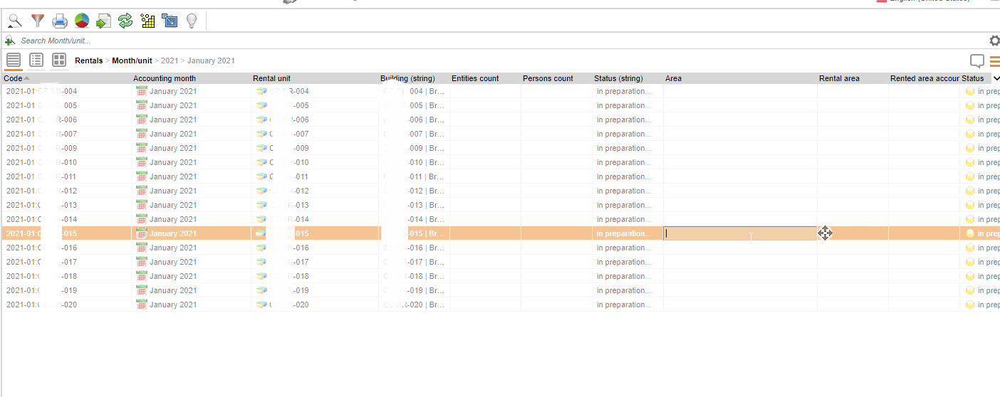

